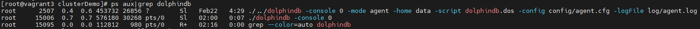
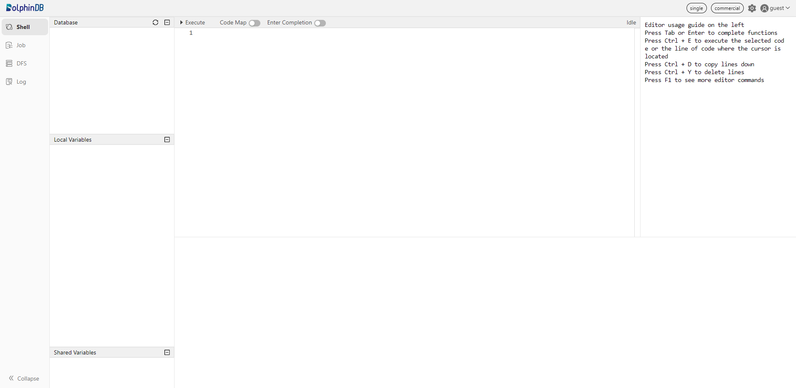
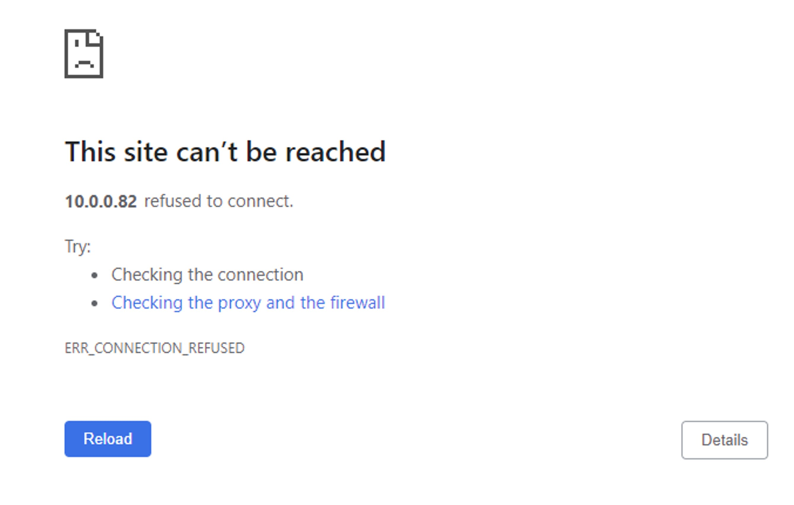

# DolphinDB ARM Standalone Deployment

This tutorial is a quick start guide describing how to deploy the DolphinDB ARM standalone, and update the server and license file. You can also find solutions to common issues in the FAQ section.

  - [1. System Requirements](#1-system-requirements)
  - [2. Deploy DolphinDB ARM Standalone](#2-deploy-dolphindb-arm-standalone)
    - [Step 1: Download](#step-1-download)
    - [Step 2: Update License File](#step-2-update-license-file)
    - [Step 3: Run DolphinDB Server](#step-3-run-dolphindb-server)
    - [Step 4: Check the Node Status on DolphinDB Web](#step-4-check-the-node-status-on-dolphindb-web)
  - [3. Update DolphinDB Server](#3-update-dolphindb-server)
    - [Step 1: Close the Server](#step-1-close-the-server)
    - [Step 2: Back up the Metadata](#step-2-back-up-the-metadata)
    - [Step 3: Upgrade](#step-3-upgrade)
    - [Step 4: Restart the Server](#step-4-restart-the-server)
  - [4. Update License File](#4-update-license-file)
    - [Step 1: Replace the License File](#step-1-replace-the-license-file)
    - [Step 2: Update License File](#step-2-update-license-file-1)
  - [5. FAQ](#5-faq)
  - [6. See Also](#6-see-also)


## 1. System Requirements

These are basic requirements for installing DolphinDB:

**Operating system**: Linux (kernel 3.10 or above)

**RAM**: 2 GB or above

**Flash memory**: 8 GB or above

**Supported ARM CPU**: 

- CORTEXA15
- CORTEXA9
- ARMV7  
- ARMV8
- CORTEXA53  
- CORTEXA57  
- CORTEXA72  
- CORTEXA73  
- FALKOR  
- THUNDERX  
- THUNDERX2T99  
- TSV110

**Cross compiler for 32-bit systems**: arm-linux-gnueabihf4.9

**Cross compiler for 64-bit systems**: aarch64-linux-gnu_4.9.3

If you encounter any problems, contact us (support@dolphindb.com) for technical support.

## 2. Deploy DolphinDB ARM Standalone

### Step 1: Download

- Official website: [DolphinDB](https://www.dolphindb.com/alone/alone.php?id=75)
- Download DolphinDB for ARM with a shell command. Take version 2.00.9.1 for example:

```sh
wget "https://www.dolphindb.cn/downloads/DolphinDB_ARM64_V2.00.9.1.zip"
```

Then extract the installation package to the specified directory (e.g., to */DolphinDB*):

```sh
unzip DolphinDB_ARM64_V2.00.9.1.zip -d /DolphinDB
```

**Note**: The directory name cannot contain any space characters, otherwise the startup of the data node will fail. 

### Step 2: Update License File

If you have obtained the Enterprise Edition license, use it to replace the following file:

```sh
/DolphinDB/server/dolphindb.lic
```

Otherwise, you can continue to use the community version of DolphinDB, which allows up to 8GB RAM use for 20 years.

### Step 3: Run DolphinDB Server

Navigate to the folder */DolphinDB/server* . The file permissions need to be modified for the first startup. Execute the following shell command:

```sh
chmod +x dolphindb
```

Due to the limited memory of the system, you need to modify the memory-related configuration parameters according to your device for the first startup. Execute the following shell command:

```sh
vim dolphindb.cfg
```

The default port number of the system is 8848. You can change it (e.g., to 8900) with the parameter *localSite*:

```sh
localSite=localhost:8900:local8900
```

Specify the maximum amount of memory (in GB) allocated to DolphinDB with parameter maxMemSize, e.g., to set it to 0.8 GB:

```sh
maxMemSize=0.8
```

Specify the maximum amount of memory (in MB) allocated to an array with parameter regularArrayMemoryLimit. It must be the exponential power of 2 with the default value of 512. To set it to 64 MB:

```sh
regularArrayMemoryLimit=64
```

Set the parameter *maxLogSize*. When the log file reaches the specified size it will be archived. The default value is 1024 MB and the minimum value is 100 MB. To set it to 100MB: 

```sh
maxLogSize=100
```

- Linux console mode:

```sh
./dolphindb
```

- Linux background mode:

```sh
sh startSingle.sh
```

To check whether the node was started, execute the following shell command:

```sh
ps aux|grep dolphindb
```

The following information indicates a successful startup:



### Step 4: Check the Node Status on DolphinDB Web

Enter the deployment server IP address and port number (8848 by default) in the browser to navigate to the DolphinDB Web. The server address (*ip*:*port*) used in this tutorial is 10.0.0.82:8848. Below is the web interface.



**Note**: If the browser and DolphinDB are not deployed on the same server, you should turn off the firewall or open the corresponding port beforehand.

## 3. Update DolphinDB Server

### Step 1: Close the Server

Navigate to the folder */DolphinDB/server/clusterDemo* to execute the following command:

```sh
./stopAllNode.sh
```

### Step 2: Back up the Metadata

The default directory to save the metadata for a standalone mode is:

```sh
/DolphinDB/server/local8848/dfsMeta/
```

```sh
/DolphinDB/server/local8848/storage/CHUNK_METADATA/
```

Back up the metadata with the following command:

```
mkdir backup
cp -r local8848/dfsMeta/ backup/dfsMeta
cp -r local8848/storage/CHUNK_METADATA/ backup/CHUNK_METADATA
```

**Note**:
If the backup files are not in the above default directories, check the directories specified by the configuration parameters *dfsMetaDir* and *chunkMetaDir*. If the configuration parameters are not modified but the configuration parameter *volumes* is specified, then you can find the *CHUNK_METADATA* under the *volumes* directory.

### Step 3: Upgrade  
**Note**: When the server is upgraded to a certain version, the plugin should also be upgraded to the corresponding version.

Download a new version of server package from [DolphinDB website](https://www.dolphindb.com/alone/alone.php?id=75).

Replace the existing server with all files (except *dolphindb.cfg* and *dolphindb.lic*) in the current *\DolphinDB\server* folder.

### Step 4: Restart the Server

Navigate to the folder */DolphinDB/server* to start the server with the following command:

```sh
sh startSingle.sh
```

Open the web interface and execute the following script to check the current version of DolphinDB.

```sh
version()
```

## 4. Update License File

### Step 1: Replace the License File

Replace an existing license file with a new one.

License file path:

```sh
/DolphinDB/server/dolphindb.lic
```

### Step 2: Update License File

- Online Update

Execute the following script in web interface:

```sh
updateLicense()
```

**Note**:
* The client name of the license cannot be changed.
* The number of nodes, memory size, and the number of CPU cores cannot be smaller than the original license.
* The update takes effect only on the node where the function is executed. Therefore, in a cluster mode, the function needs to be run on all controllers, agents, data nodes, and compute nodes.
* The license type must be either commercial (paid) of free.

- Offline Update

Restart DolphinDB server to complete the updates.

## 5. FAQ

**Q1: Failed to start the server for the port is occupied by other programs**

The default port number of the system is 8848. If you cannot start the server, you can first check the log file *dolphindb.log* under */DolphinDB/server*.

If the following error occurs, it indicates that the specified port is occupied by other programs.

```
<ERROR> :Failed to bind the socket on port 8848 with error code 98
```

In such case, you can change to another free port in the config file.

**Q2: Failed to access the web interface**

Despite the server running and the server address being correct, the web interface remains inaccessible.



The common reason for the above problem is that the browser and DolphinDB are not deployed on the same server, and the server where DolphinDB is deployed has a firewall on. You can solve this issue by turning off the firewall or by opening the corresponding port.

**Q3: Roll back a failed upgrade on Linux**

If you cannot start DolphinDB server after upgrade, you can follow steps below to roll back to the previous version.

- Step 1: Restore Metadata Files

Navigate to the folder */DolphinDB/server* to restore metadata files from backup with the following commands:

```sh
cp -r backup/dfsMeta/ local8848/dfsMeta
cp -r backup/CHUNK_METADATA/ local8848/storage/CHUNK_METADATA
```

- Step 2: Restore Program Files

Download the previous version of server package from the official website. Replace the server that failed to update with all files (except *dolphindb.cfg* and *dolphindb.lic*) just downloaded.

**Q4: Failed to update the license file**

Updating the license file online has to meet the requirements listed in [Step 2, Chapter 4](#step-2-update-license-file-1). 

If not, you can choose to update offline or apply for an [Enterprise Edition License](https://www.dolphindb.com/mx_form/mx_form.php?id=98).

**Q5: Change configuration**

For more details on configuration parameters, refer to [Configuration](https://www.dolphindb.com/help/DatabaseandDistributedComputing/Configuration/index.html).

If you encounter performance problems, you can contact our team on [Slack](https://dolphindb.slack.com/) for technical support.

## 6. See Also

For more information, refer to [DolphinDB User Manual](https://www.dolphindb.com/help/index.html).
