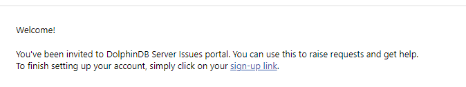
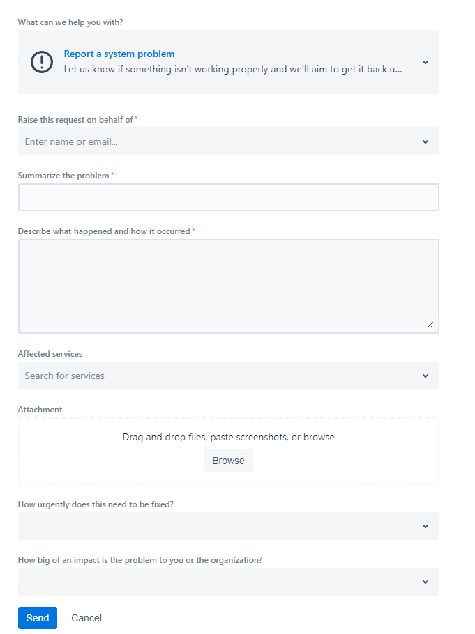
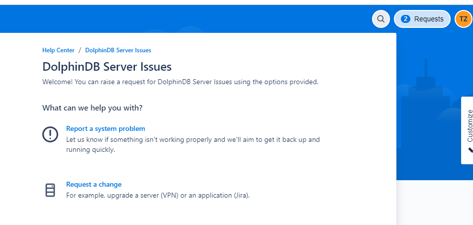
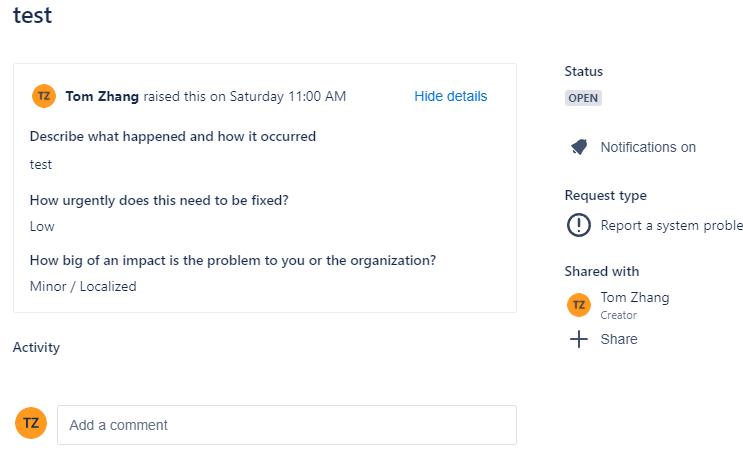

# Tutorial: How to use DolphinDB support portal

## Sign up to DolphinDB support portal

If this is your first time signing in, you'll need to create an account. 

Please provide DolphinDB support team with your email address. Then you will receive an invitation email sent from [jira@dolphindb1.atlassian.net](mailto:jira@dolphindb1.atlassian.net) with a sign-up link within minutes. 

Click the sign-up link and follow the instructions to complete signup.

DolphinDB will grant users from the same organization with access to all issue tickets raised by its members. 

## Submit a support ticket

After signing in, choose a request topic such as “reporting a DolphinDB server problem” and then fill out the form as shown in the screenshot to submit your request. 

## Access submitted tickets and track the progress

 

Your submitted requests can be found at the top-right corner of the screen. 

Choose one of the submitted requests and you will be redirected to the request page. You can track the progress and comment on the request. 

