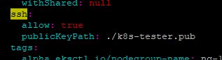
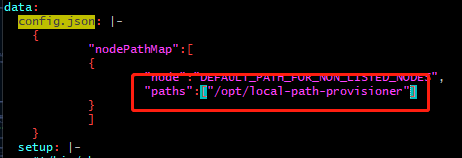
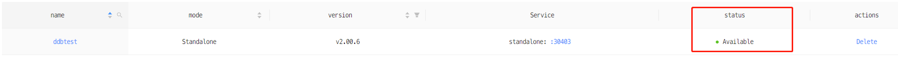

# Quick Start of DolphinDB MGR in AWS Marketplace

- [Quick Start of DolphinDB MGR in AWS Marketplace](#quick-start-of-dolphindb-mgr-in-aws-marketplace)
  - [1. Introduction of DolphinDB MGR in AWS Marketplace](#1-introduction-of-dolphindb-mgr-in-aws-marketplace)
  - [2. Prerequisites](#2-prerequisites)
  - [3. Create Amazon EKS Cluster Using eksctl](#3-create-amazon-eks-cluster-using-eksctl)
    - [3.1 Choose an Instance Type](#31-choose-an-instance-type)
    - [3.2 Create an Amazon EKS Cluster and a Nodegroup](#32-create-an-amazon-eks-cluster-and-a-nodegroup)
    - [3.3 Configure Security Group of EKS Cluster](#33-configure-security-group-of-eks-cluster)
    - [3.4 Configure StorageClass](#34-configure-storageclass)
  - [4. Download and Deploy DolphinDB MGR](#4-download-and-deploy-dolphindb-mgr)
    - [4.1 Create a Namespace](#41-create-a-namespace)
    - [4.2 Deploy DolphinDB MGR](#42-deploy-dolphindb-mgr)
  - [5. Deploy DolphinDB](#5-deploy-dolphindb)
    - [5.1 Web User Interface](#51-web-user-interface)
    - [5.2 Deploy DolphinDB](#52-deploy-dolphindb)
  - [6. Clean up the Environment](#6-clean-up-the-environment)
    - [6.1 Destroy DolphinDB](#61-destroy-dolphindb)
    - [6.2 Uninstall DolphinDB MGR](#62-uninstall-dolphindb-mgr)
    - [6.3 Delete EKS Cluster](#63-delete-eks-cluster)

## 1. Introduction of DolphinDB MGR in AWS Marketplace 
*Kubernetes*, also known as *K8s*, is an open-source system for automating deployment, scaling, and management of containerized applications. *DolphinDB-MGR* is an automated system deployed in K8s for DolphinDB cluster operation and maintenance. It provides full lifecycle management including deployment, upgrade, scaling, and configuration changes. With DolphinDB-MGR, you can run DolphinDB seamlessly on a Kubernetes cluster deployed on-premise or in public cloud. 

Now DolphinDB has launched *AWS Marketplace* ("AWSMP"): AWS users around the globe are able to subscribe to this product through AWSMP.

Currently, DolphinDB MGR in AWSMP can run on K8s clusters managed by *Amazon Elastic Kubernetes* ("Amazon EKS"):
Amazon EKS is a managed service that you can use to run Kubernetes on AWS without needing to install, operate, and maintain your own Kubernetes control plane or nodes. You can easily deploy any DolphinDB-MGR services to Amazon EKS. 

This tutorial describes how to deploy DolphinDB MGR and start a standalone community-edition DolphinDB (CPU limited to 2, and Memory limited to 8GB) using DolphinDB MGR in AWS. 

## 2. Prerequisites
Before you begin, go through all below steps:
- Install [helm3](https://helm.sh/docs/intro/install)
- Install K8s command line tool [kubectl](https://docs.aws.amazon.com/eks/latest/userguide/install-kubectl.html)
- Install AWS Command Line Interface [awscli](https://docs.aws.amazon.com/cli/latest/userguide/getting-started-install.html) 
- Follow this [AWS documentation](https://docs.aws.amazon.com/cli/latest/userguide/cli-configure-quickstart.html#cli-configure-quickstart-config) to configure AWS CLI.
	>`default output format` is not required, you can just hit enter to skip.
	>You can check the configuration using `aws configure list`. If the output shows correct values of the `access_key` and the `secret_key`, it means the configuration is correct

- Install [eksctl](https://docs.aws.amazon.com/eks/latest/userguide/eksctl.html), the command line tool used to build an EKS cluster
- Download DolphinDB community edition license from this [link](https://www.dolphindb.com/downloads/dolphindb_lic.zip). Unzip the file, and you will get **dolphindb.lic**

>Note:
> 
>1. To perform the operations mentioned in this tutorial, your AWS Access Key must have the [minimum IAM policies](https://eksctl.io/usage/minimum-iam-policies/) needed to run the main use cases of eksctl. 
>2. The Helm version used must be 3.7.0 or later. This tutorial uses the Helm 3.9.2 version.

## 3. Create Amazon EKS Cluster Using eksctl
### 3.1 Choose an Instance Type
The instance type determines the resources (number of CPU cores, memory capacity, etc.) available to you. This tutorial uses the DolphinDB community edition, which allows for 2 CPU cores and 8 GB of memory. To successfully deploy the DolphinDB MGR, the host in the K8s cluster must have slightly more resources than specified in the community license.  

### 3.2 Create an Amazon EKS Cluster and a Nodegroup
#### 3.2.1 Generate a Config File for eksctl
Run the following command:
```
eksctl create cluster --region $region_code --name $cluster_name --dry-run > eks-test.yaml
```
Main parameters:
- region-code: the region where EKS cluster is in
- cluster-name: EKS cluster name. 

#### 3.2.2 Modify the Config File
Modify the following configs to create an EKS cluster:
- `availabilityZones`: set to `us-east-1a` and `us-east-1b`
- `desiredCapacity`: set to 1
- `maxSize`: set to 1
- `instanceType`: set to `m5.xlarge`
- `volumeSize`: size of disk, set it as needed

Config SSH access using following steps (only applied to Linux system):
(1) Generate an EC2 key pair (k8s-tester.pem in this tutorial) in your AWS account, and save it to your local environment
(2) Change permission to 400
(3) Use `ssh-keygen -y -f` to generate public key based the `.pem` file and put it in a .pub file (k8s-tester.pub in this tutorial), and place it under the same directory as that of eks-test.yaml
	```
	ssh-keygen -y -f k8s-tester.pem > k8s-tester.pub
	```
(4) Configure SSH in the config. Set the "allow" to true, and publicKeyPath to the path of your .pub file.
	

#### 3.2.3 Create an EKS Cluster
Run below command to create an EKS cluster:
```
eksctl create cluster -f eks-test.yaml
```
Expected output:
```
...
[✓]  EKS cluster "ddbawstest" in "us-east-1" region is ready
```
It takes about 5 - 20 minutes for the system to complete the following tasks before printing the output:
(1) Create the AWS EKS cluster
(2) Create a nodegroup
(3) Add the nodegroup to Amazon EKS cluster

For more configuration options, see the [official eksctl documentation](https://eksctl.io/usage/creating-and-managing-clusters/#using-config-files).

After the cluster is created, log in to the AWS CloudFormation console and find the `eksctl-ddbawstest-cluster` AWS CloudFormation stack to check the resources created.

### 3.3 Configure Security Group of EKS Cluster
To make DolphinDB available, manually configure the security group used by this EKS cluster. Below are the steps:

(1) Enter AWS console

(2) Click `EC2` icon

  

(3) Click the instance brought up by EKS

(4) Click "Security"

(5) Choose the security group which does not mention remoteAccess

  

(6) Click "Edit inbound rules"

  

(7) Click "Add rule"

  

(8) Choose "All traffic" and "My IP" and save. All instances in this security group will accept traffic from your IP. Or you can choose "Custom" and assign a CIDR range to allow IPs from this range to access the instances.

  

### 3.4 Configure StorageClass

This section introduces how to configure StorageClass local volumes.

[Local path provisioner](https://github.com/rancher/local-path-provisioner) can be used as a Container Storage Interface (CSI) for local paths in a Kubernetes environment to dynamically allocate PV using the node's local path.

> *Note: Local path provisioner only provides the user with Storage Class to create Persistent Volume Claims (PVC). It is not required for users with other types of CSI.*

(1) Download local-path-provisioner from GitHub:

  ```
  wget https://raw.githubusercontent.com/rancher/local-path-provisioner/master/deploy/local-path-storage.yaml
  ```

  Expected output:

  ```
  --2022-08-07 10:36:07--  https://raw.githubusercontent.com/rancher/local-path-provisioner/master/deploy/local-path-storage.yaml
  Resolving raw.githubusercontent.com (raw.githubusercontent.com)... 185.199.109.133, 185.199.110.133, 185.199.111.133, ...
  Connecting to raw.githubusercontent.com (raw.githubusercontent.com)|185.199.109.133|:443... connected.
  HTTP request sent, awaiting response... 200 OK
  Length: 2939 (2.9K) [text/plain]
  Saving to: ‘local-path-storage.yaml’
  
  100%[======================================>] 2,939       --.-K/s   in 0s
  
  2022-08-07 10:36:07 (56.9 MB/s) - ‘local-path-storage.yaml’ saved [2939/2939]
  ```

(2) Modify configs:

  

  The selected paths are for data persistence in the container (see [local-path-provisioner-configuration](https://github.com/rancher/local-path-provisioner#configuration))

  > Note:
  >
  > To modify the local path for provisioning, find the config map "local-path-config" and specify a node path in the Kubernetes cluster for the selected "paths" under “data“. If more than one path was specified, the path would be chosen randomly when provisioning.

(3) Deploy in a Kubernetes environment:

  ```
  kubectl apply -f  local-path-storage.yaml
  ```

  Expected output:

  ```
  namespace/local-path-storage created
  serviceaccount/local-path-provisioner-service-account created
  clusterrole.rbac.authorization.k8s.io/local-path-provisioner-role created
  clusterrolebinding.rbac.authorization.k8s.io/local-path-provisioner-bind created
  deployment.apps/local-path-provisioner created
  storageclass.storage.k8s.io/local-path created
  configmap/local-path-config created
  ```

## 4. Download and Deploy DolphinDB MGR

### 4.1 Create a Namespace

Enter the following command to create a namespace for DolphinDB cluster deployment:

```
kubectl create namespace dolphindb
```

Expected output:

```
namespace/dolphindb created
```

### 4.2 Deploy DolphinDB MGR

(1) Set environment variables

  ```
  export HELM_EXPERIMENTAL_OCI=1
  aws ecr get-login-password \
      --region us-east-1 | helm registry login \
      --username AWS \
      --password-stdin 709825985650.dkr.ecr.us-east-1.amazonaws.com
  ```

  Expected output:

  ```
  Login succeeded
  ```

(2) Run following command to download the DolphinDB MGR helm chart from AWS. `$DolphinDB_MGR_version` is the version of DolphinDB MGR, in this example, v1.0.3:

  ```
  mkdir awsmp-chart && cd awsmp-chart
  helm pull oci://709825985650.dkr.ecr.us-east-1.amazonaws.com/dolphindb/dolphindb-mgr-byol --version $DolphinDB_MGR_version
  ```

  Expected output:

  ```
  Pulled: 709825985650.dkr.ecr.us-east-1.amazonaws.com/dolphindb/dolphindb-mgr-byol:v1.0.3
  Digest: sha256:b99a4df2c5f1b4c95e26d620616be4f88bdfd5061d6f3352c2c222a926e56fab
  ```

(3) Unzip helm chart and install

  ```
  tar xf $(pwd)/* && find $(pwd) -maxdepth 1 -type f -delete
  helm install dolphindb-mgr dolphindb-mgr-byol --set global.version=$version --set global.serviceType=NodePort --set global.storageClass=local-path --set-file license.content=../dolphindb.lic -ndolphindb --create-namespace
  ```

  > `global.version` should be set to the version of DolphinDB MGR, v1.0.3 in this example.
  >
  > DolphinDB will verify the license first. Please specify the directory of your license file for `license.content`.

  Expected output:

  ```
  NAME: dolphindb-mgr
  LAST DEPLOYED: Thu Aug  4 05:55:49 2022
  NAMESPACE: dolphindb
  STATUS: deployed
  REVISION: 1
  TEST SUITE: None
  ```

(4) Check whether the deployment is successful

  ```
  kubectl -n dolphindb get po
  ```

  Expected output:

  ```
  NAME                                              READY   STATUS    RESTARTS   AGE
  dolphindb-mgr-alertmanager-0                      1/1     Running   0          52s
  dolphindb-mgr-grafana-84bcc6c495-ql5v4            1/1     Running   0          52s
  dolphindb-mgr-loki-0                              1/1     Running   0          52s
  dolphindb-mgr-node-exporter-pgvg6                 1/1     Running   0          52s
  dolphindb-mgr-prometheus-server-c4cf8fdff-kpnxc   1/1     Running   0          52s
  dolphindb-operator-0                              1/1     Running   0          52s
  dolphindb-operator-1                              0/1     Pending   0          44s
  dolphindb-webserver-68d6bd6cc9-mkh55              1/1     Running   0          52s
  dolphindb-webserver-68d6bd6cc9-v8szd              1/1     Running   0          52s
  ```

  > Since only 1 host is used for the K8s cluster and at most 1 DolphinDB operator can be set, there is one operator in "pending" status as shown above, which will not affect the deployment of DolphinDB using DolphinDB MGR.

## 5. Deploy DolphinDB 

### 5.1 Web User Interface 

DolphinDB-MGR provides a web user interface, which exposes the service using `NodePort` by default. After successfully deploying DolphinDB MGR, look for "dolphindb-webserver" service in K8s.

```
kubectl -ndolphindb get svc | grep dolphindb-webserver
```

Expected output:

```
dolphindb-webserver               NodePort    10.100.47.141    <none>        8080:31268/TCP   24m
```

You can visit the following link to access the interface:

```
http://$nodeIP:$NodePort/dolphindb-cloud
```

> - **$nodeIP:** IP address of the node in K8s
> - **$NodePort:** Port corresponding to the DolphinDB-Webserver displayed in the terminal ("31268" in this example).

In this example, the address is http://3.227.20.112:31268/dolphindb-cloud/

### 5.2 Deploy DolphinDB 

(1) Click `Create Cluster`

  

(2) Modify the configs

  

  -  name: cluster name
  -  storage class: choose "local-path"
  -  mode: choose "Standalone"
  -  version: DolphinDB version
  -  log mode: we recommend "file"
  -  CPU: number of CPU for the pod. Since the community edition limits number of CPUs to 2, set it to 2 here.
  -  Memory: Memory for the pod. To prevent DolphinDB from being killed by operating system's OOM killer, we recommend you set it to be bigger than 8GB. In this tutorial, we set it to 12GB.

(3) Wait until DolphinDB is successfully deployed
  - The DolphinDB cluster is created successfully when the status becomes Available.

    
(4) Connect to DolphinDB

   As the above picture shows, the port of DolphinDB is 30403.

   You can connect to DolphinDB via web explorer:

   ```
   $IP:30403
   ```

   You can also connect to it using DolphinDB GUI. For the installation and usage instruction, please refer to [GUI tutorial]([Tutorials_EN/gui_tutorial.md at master · dolphindb/Tutorials_EN · GitHub](https://github.com/dolphindb/Tutorials_EN/blob/master/gui_tutorial.md)) and [GUI manual](https://dolphindb.com/gui_help/index.html ).

(5) Validate DolphinDB is functioning

   After connecting to DolphinDB successfully, you can test the node with function `version()`.

   ```
   version()
   ```

   Expected output as below:

   

Please refer to [Deploy DolphinDB on Kubernetes](https://github.com/dolphindb/Tutorials_EN/blob/master/k8s_deployment.md#23-deploy-and-connect-to-dolphindb-clusters) for detailed instructions on how to deploy DolphinDB on K8s.


## 6. Clean up the Environment

### 6.1 Destroy DolphinDB

There are 2 ways to destroy DolphinDB

- Destroy using `delete` tab in web user interface

   

- Destroy using `kubectl`

   ```
   kubectl delete ddb $ddbName -n dolphindb
   ```

   $ddbName is the name of DolphinDB that is previously configured.

### 6.2 Uninstall DolphinDB MGR

Use following command to uninstall DolphinDB MGR

```
helm uninstall dolphindb-mgr -n dolphindb
```

### 6.3 Delete EKS Cluster

Use following command to delete EKS cluster

```
eksctl delete cluster --name=$cluster_name
```

