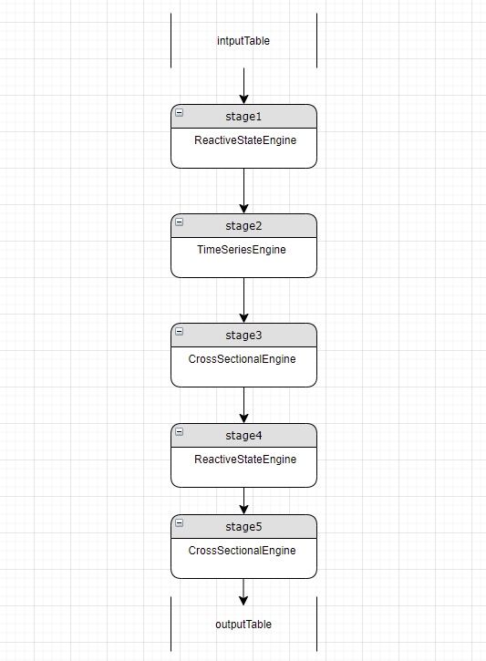

# Understanding the Stream Engine Parser

The stream engine parser automatically builds computing pipelines and converts batch computing factors into stream processing logic in unified batch and streaming computation scenarios. This tutorial explains the computation rules and underlying logic of the stream engine parser.

- [Understanding the Stream Engine Parser](#understanding-the-stream-engine-parser)
  - [1. Function Overview](#1-function-overview)
  - [2. Rules of Streaming Engines](#2-rules-of-streaming-engines)
    - [2.1 Supported Streaming Engine Types](#21-supported-streaming-engine-types)
    - [2.2 Data Passing Between Streaming Engines](#22-data-passing-between-streaming-engines)
    - [2.3 Types of Streaming Engine Metrics](#23-types-of-streaming-engine-metrics)
  - [3. Parsing Process of Stream Engine Parser](#3-parsing-process-of-stream-engine-parser)
    - [3.1 Pipeline Stage Definition](#31-pipeline-stage-definition)
    - [3.2 Recursive Parsing](#32-recursive-parsing)
    - [3.3 Process Optimization](#33-process-optimization)


## 1. Function Overview

DolphinDB offers streaming engines for various scenarios. For example, the [reactive state engine](https://dolphindb.com/help200/FunctionsandCommands/FunctionReferences/c/createReactiveStateEngine.html) accesses historical state data, and the cross-sectional engine calculates real-time cross-sectional metrics. For simple use cases, a single engine suffices. However, for more advanced stream computing applications, multiple engines need to be combined into a pipeline to handle the computing tasks.

Traditional engine cascades require manually defining and connecting multiple engines in a precise order. In contrast, the stream engine parser can parse the expressions of metrics provided by users and construct a computational pipeline by combining the appropriate engines, providing a more efficient way to handle complex computing workloads. 

The stream engine parser also enables unified batch and streaming computation. For example, quantitative factors are usually developed and tested through batch processing of historical data, then deployed in live trading via streaming. Traditionally, this requires rewriting factors from a scripting language such as Python (for batch computation) to a compiled language such as C++ (for streaming). This process creates redundant work and potentially causes inconsistent results.

The stream engine parser automatically generates streaming solutions from batch factors without requiring any rewriting. This ensures consistent results between batch and streaming. 

## 2. Rules of Streaming Engines

### 2.1 Supported Streaming Engine Types

Currently, the stream engine parser supports building pipelines that include reactive state engines ([createReactiveStateEngine](https://dolphindb.com/help200/FunctionsandCommands/FunctionReferences/c/createReactiveStateEngine.html)), cross-sectional engines ([createCrossSectionalEngine](https://dolphindb.com/help200/FunctionsandCommands/FunctionReferences/c/createCrossSectionalEngine.html)) and time-series engines ([createTimeSeriesEngine](https://dolphindb.com/help200/FunctionsandCommands/FunctionReferences/c/createTimeSeriesEngine.html)).

### 2.2 Data Passing Between Streaming Engines

Streaming engine classes inherit from the Table class, so each instance is a specialized table. Creating a streaming engine requires specifying:

1. The schema of the input table (*dummyTable*)

2. The calculation logics (*metrics*)

3. The output table (*outputTable*)

Streaming engines accept real time streams from stream table subscriptions essentially through the `append` method. When `append` is called, the streaming engine calculates the metrics, then internally appends the results to the output table. 

As streaming engines are essentially tables, one can be the input or output of another, allowing them to be connected into pipelines.

### 2.3 Types of Streaming Engine Metrics

The metrics calculated by a streaming engine can be divided into 4 categories: functions, expressions, column references and constants.

- **Functions**

When parsing functions, the stream engine parser identifies function names, parameters, parameter types, and return types. It also allows nested functions (i.e., using the return value of one function as the argument of another). For example:

```
mrank(rowRank(low, percent=true), true, 9)
```

- **Expressions**

When parsing expressions, the stream engine parser automatically identifies the expression types, left and right values, and operators. Expressions can be computed in any engine. For example:

```
sign((vol - mfirst(vol, 2))) * (-1 * (close - mfirst(close, 2)))
```

- **Column references**

With column references, the stream engine parser identifies input table columns by name and copies values directly to the output table. In stream engine pipelines, results are passed between engines through column references.

- **Constants**

Constant references do not involve metric calculation or cross-engine data passing. They can be used directly at any stage. 

## 3. Parsing Process of Stream Engine Parser

### 3.1 Pipeline Stage Definition

Each stage in a stream engine pipeline has an engine type, input table schema, and a list of the metrics for computation. The following example defines a Process class representing a stage in a stream engine pipeline:

```
class Process {
  private:
    EngineType engineType_;
    TableSP inputDummy_;
    vector<ObjectSP> metrics_;
    TableSP outputTableDummy_;
}

enum EngineType {
    REACTIVE_STATE_ENGINE,
    CROSS_SECTIONAL_ENGINE,
    TIME_SERIES_ENGINE，
    NONE_ENGINE
}
```

The parser maps functions to engine instances based on the following rules:

- Functions prefixed with `row` or using the higher-order function `byRow` map to cross-sectional engine (CROSS_SECTIONAL_ENGINE).
- Functions using the higher-order function `rolling` map to time-series engine (TIME_SERIES_ENGINE).
- Other functions map to reactive state engine (REACTIVE_STATE_ENGINE).

Each stage in a streaming engine pipeline contains only one engine instance handling its own type of tasks. When parsing metrics, if a metric requires a different engine type than the engine at the current stage, a new stage is added before the current stage. The new engine passes its results to the current stage using column references.


For example, we have a reactive state engine at stage 1 and a cross-sectional engine at stage 2. Further parsing finds a new stage 2 metric, `rolling(sum, qty, 6000, 6000, fill=0)`, which needs a time-series engine. A new time-series engine (now stage 2) is added before the cross-sectional stage (now stage 3). Stage 3 gets a column reference to accept the result from the added time-series engine stage.

 

**Note**

1. Theoretically, a new stage can be added at the pipeline start or before the current stage. However, adding the new stage at the beginning requires all subsequent stages leading up to the current stage to add column references, so they can pass the result along. To avoid this, the system inserts new stages right before the current stage, so only that stage must add a column reference. 
2. For example, inserting a new stage 2 means stage 3 can no longer access stage 1's output directly. Instead, stage 3 depends on column references from stage 2 which now receives stage 1's output as input.

### 3.2 Recursive Parsing

Different metrics can map to different engine types, and a metric can contain nested functions that require various engine types to calculate. The stream engine parser iterates through the metric list and parses each metric recursively until all metrics resolve into column references or constants.. 

The final pipeline stage outputs to the result table. Each table column corresponds to an initial metric.

In the following example, we use the alpha1 factor as a metric to demonstrate the complete metric parsing process of the stream engine parser.

Implementation of alpha1 in DolphinDB:

```
def alpha1(close){
    ts = mimax(pow(iif(ratios(close) - 1 < 0, mstd(ratios(close) - 1, 20), close), 2.0), 5)
    return rowRank(X=ts, percent=true) - 0.5
}

inputSchemaT = table(1:0, ["SecurityID","TradeTime","close"], [SYMBOL,TIMESTAMP,DOUBLE])
resultStream = table(10000:0, ["TradeTime","SecurityID", "factor"], [TIMESTAMP,SYMBOL,DOUBLE])
metrics = <[SecurityID, alpha1(close)]>
streamEngine = streamEngineParser(name="alpha1ParserT", metrics=metrics, dummyTable=inputSchemaT, outputTable=resultStream, keyColumn="SecurityID", timeColumn=`tradetime, triggeringPattern='perBatch', triggeringInterval=4000) 
```

The input schema is defined by `inputSchemaT`, with the "close" column as the input of `alpha1`. 

Two metrics are passed as the *metrics* parameter to the stream engine parser, one is a column reference “SecurityID“, and the other is a user-defined function, `alpha1(close)`. 

The output is `resultStream`, where its “factor“ column accepts the result of `alpha1(close)`.

`alpha1(close)` contains an assignment expression:

```
ts = mimax(pow(iif(ratios(close) - 1 < 0, mstd(ratios(close) - 1, 20), close), 2.0), 5)
```

 The variable *ts* is referenced in the return value, `rowRank(X=ts, percent=true) - 0.5`. 

The recursive parsing process of `alpha1` is as follows:

**Step1.** Write out the full *ts* reference:

```
rowRank(X=mimax(pow(iif(ratios(close) - 1 < 0, mstd(ratios(close) - 1, 20), close), 2.0), 5), percent=true) - 0.5
```

**Step2.** The result is an expression. The left value is `rowRank(X=mimax(pow(iif(ratios(close) - 1 < 0, mstd(ratios(close) - 1, 20), close), 2.0), 5), percent=true)`, the right value is `0.5`, and the operator is `-`.

Expressions can run on any type of engines. However, as no stage has yet been created, the parser creates an initial stage with a “NoneEngine“. The engine can be converted into the appropriate engine type upon encountering the first function metric.

 

**Step3.** Parse the left value of the expression, `rowRank(X=mimax(pow(iif(ratios(close) - 1 < 0, mstd(ratios(close) - 1, 20), close), 2.0), 5), percent=true)`. As it calls a function prefixed with `row`, the NoneEngine becomes a cross-sectional engine.


**Step4.** Parse the parameters of `rowRank`, which are `mimax(pow(iif(ratios(close) - 1 < 0, mstd(ratios(close) - 1, 20), close), 2.0), 5)` and `percent=true`.

The first parameter, `mimax`, neither has a `row` prefix nor uses higher-order functions `byrow` or `rolling`. Therefore, it maps to a reactive state engine rather than the current cross-sectional engine. A new stage (stage1) with a reactive state engine is created before the cross-sectional engine (stage2). Stage1 now becomes the "current" stage.


**Step5.** Parse the parameters of `mimax`. The functions `mimax`, `pow`, `iif`, `ratios` and `mstd` all map to the reactive state engine, which means they can be calculated at the current stage (stage1).

**Step6.** Back in step2, the right value of the extended expression is a constant, needing no new engine. The final parsing process of `alpha1` is shown as the image below:


The final pipeline has 2 stages: 

Stage 1: The reactive state engine calculates `mimax(pow(iif(ratios(close) - 1 < 0, mstd(ratios(close) - 1, 20), close), 2.0) ` and outputs to the “col_0“ column. 

Stage 2: The cross-sectional engine uses stage 1's output as input to calculate `rowRank`. The metric can now convert to: 

```
rowRank(X=col_0, percent=true) - 0.5  
```

where “col_0” is the result of stage 1 passed as input.

**Note**

Reactive state engines support nested computation. This means if a reactive state engine metric contains a parameter that also maps to reactive state engine, that parameter can be computed within the same reactive state engine stage.

In contrast, time-series engines and cross-sectional engines do not support nested computation. For example, `rowRank(rowRank(close, percent=true), percent=true)` must be calculated in two separate cross-sectional engines.

### 3.3 Process Optimization

Optimizing the pipeline can minimize the number of stages in the pipeline, and reduce redundant computation. There are two main optimization directions: 

\1) Calculating as many metrics of the same type in one engine; 

\2) Avoiding repeated calculation of a metric.

#### 3.3.1 Matching New Metrics with Existing Engines 

For a metric not matching the current stage's engine, the parser checks other engines for a match. If a match is found, use that engine to calculate the metric and pass through the result to the current stage. 


In this example, stage 3 is the current stage and uses a cross-sectional engine. But `ratios(close)` needs a reactive state engine. Since stage 1 already has a reactive state engine, the parser uses it to calculate `ratios(close)` and passes through the result to stage 3:


#### 3.3.2 Checking for Repeated Metric Computation

Continuing the example in section 3.3.1, when stage 3 has a new metric, the parser checks if it was already computed up or down the pipeline. If so, stage 3 can access the result through column reference instead of re-computing it. 

#### 3.3.3 Double-checking

After parsing all metrics, redundancy may remain between engines of the same type due to parsing order and metric dependencies. For example:



Stage 1 and stage 4 both have reactive state engines. The parser first checks if stage 4 metrics can all be calculated at stage 1. If some stage 4 metrics depend on stage 3's results, stage 4 cannot be removed. But if all of stage 4's metrics are column references, stage 4 is removed:

