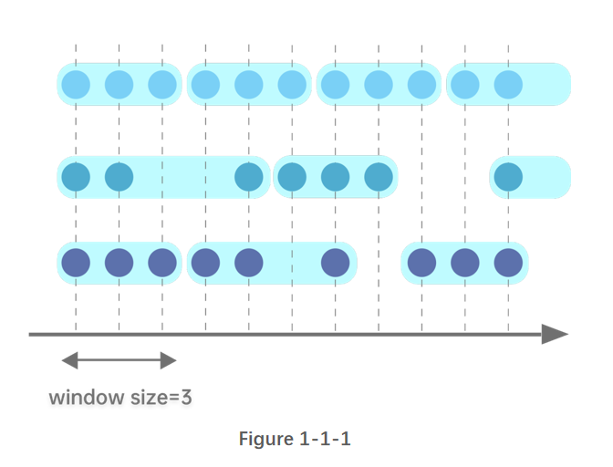
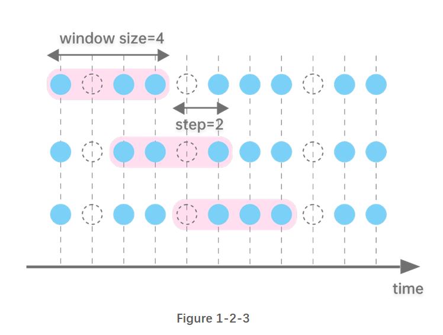
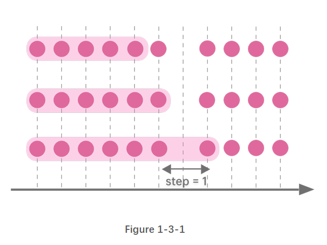
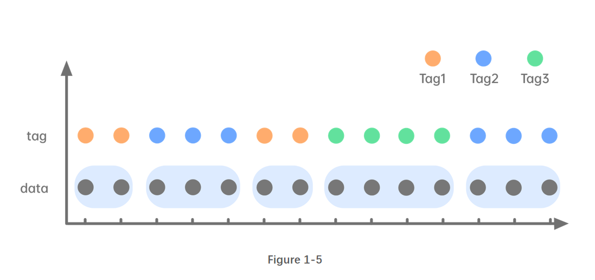

# Window Calculations in DolphinDB

Window calculations are frequently used in analyzing time series data. DolphinDB provides window functions that can process both tables and matrices. In addition, window functions in DolphinDB can also be used in stream processing.

DolphinDB's window functions are flexible, which can be nested with multiple built-in or user-defined functions. With optimized functions, DolphinDB has an outstanding performance for window calculations. 

This tutorial helps you quickly get started with the powerful window functions in DolphinDB. 

> Version 1.30.7/2.00.0 or higher supports most of the scripts in this tutorial (see details in the specific sections), and all scripts are supported in version 1.30.15/2.00.3 or higher. 

- [1. Windows](#1-windows)
  - [1.1 Tumbling Windows](#11-tumbling-windows)
  - [1.2 Sliding Windows](#12-sliding-windows)
  - [1.3 Cumulative Windows](#13-cumulative-windows)
  - [1.4 Session Windows](#14-session-windows)
  - [1.5 Segment Windows](#15-segment-windows)
- [2. Process Tables with Windows (using SQL)](#2-process-tables-with-windows-using-sql)
  - [2.1 Tumbling Windows](#21-tumbling-windows)
  - [2.2 Sliding Windows](#22-sliding-windows)
  - [2.3 Cumulative Windows](#23-cumulative-windows)
  - [2.4 Segment Windows](#24-segment-windows)
  - [2.5 Window Join in SQL](#25-window-join-in-sql)
- [3. Process Matrices with Windows](#3-process-matrices-with-windows)
  - [3.1 Process Matrices with Sliding Windows](#31-process-matrices-with-sliding-windows)
  - [3.2 Process Matrices with Cumulative Windows](#32-process-matrices-with-cumulative-windows)
- [4. Stream Processing with Windows](#4-stream-processing-with-windows)
  - [4.1 Tumbling Windows in Streaming](#41-tumbling-windows-in-streaming)
  - [4.2 Sliding Windows and Cumulative Windows in Streaming](#42-sliding-windows-and-cumulative-windows-in-streaming)
  - [4.3 Session Window Engine](#43-session-window-engine)
- [5. NULL Values Handling](#5-null-values-handling)
  - [5.1 moving, m-functions, tm-functions, and cum-functions](#51-moving-m-functions-tm-functions-and-cum-functions)
  - [5.2 `rolling` Function](#52-rolling-function)
- [6. Computational Complexity](#6-computational-complexity)
- [7. Functions Related to Windows](#7-functions-related-to-windows)
- [8. Conclusion](#8-conclusion)


## 1. Windows

DolphinDB supports five types of windows: tumbling window, sliding window (moving window), cumulative window, session window, and segment window.

Windows can be **count-based** or **time-based** regarding how window size is measured. **Window size** refers to the number of records in each window or how long each window lasts.  

For functions related to sliding windows and cumulative windows, another parameter **step** is provided. It indicates how much each window moves forward relative to the previous one. 

The next sections are going to explain each of them in detail.

### 1.1 Tumbling Windows

Tumbling windows have a fixed size and do not overlap. Each record belongs to exactly one window.

- **count-based tumbling window**:

The following figure illustrates a tumbling window of size 3. Each window has the same number of records, but the time interval of each window might be different.

   


- **time-based tumbling window**:

The following figure illustrates a tumbling window of size 3. Each window has the same time interval, but the number of records in each window might be different.


### 1.2 Sliding Windows

Sliding windows have fixed length and move with specified steps. Different from tumbling windows, sliding windows can be overlapping if the step is smaller than the window size. Note that a tumbling window is simply a sliding window whose ‘step’ is equal to its ‘window size’. 

- **count-based sliding window**:

Supposing step=1, the following figure illustrates a sliding window of size 6.


- **time-based sliding window**:

step=1, the following figure illustrates a sliding window of size 3.


If step is specified as time interval, it must be divisile by window size. The following figure illustrates a sliding window of size 4, and step 2.




### 1.3 Cumulative Windows

The left boundary of cumulative windows is fixed and the right boundary keeps moving right. The window size keeps increasing. 

You can get cumulative windows with specified step:

- **step=1**

As shown in Figure 1-3-1, the window size accumulates as the right boundary keeps moving right by 1 row each time.




- **step=t time units**

As shown in Figure 1-3-2, the window size accumulates as right boundary keeps moving right by 2 time units.


### 1.4 Session Windows

Session windows are a special type of windows with variable length. Two session windows are separated by a period of specified length with no data. If there is no data for a specified length of time after an observation, it is marked as the end of a session window and the next observation is the start of the next session window.

As shown in Figure 1-4, two session windows are separated by a session gap that is greater than 3 time units with no data.


### 1.5 Segment Windows

Consecutive identical elements are grouped into one segment window. Segment windows have a variable length. 




## 2. Process Tables with Windows (using SQL)

This chapter gives specific examples on how to conduct window calculations in DolphinDB with SQL statements: tumbling windows, sliding windows, cumulative windows, segment windows, and window join.

### 2.1 Tumbling Windows

#### 2.1.1 Time-based tumbling windows

You can use functions such as `interval`, `bar`, and `dailyAlignedBar`, together with `group by` clause for aggregations over time-based tumbling windows.

The following example is based on the records updated every second from 10:00:00 to 10:05:59. With function `bar`, the sum of the trading volume is calculated every 2 minutes:

````
```
t=table(2021.11.01T10:00:00..2021.11.01T10:05:59 as time, 1..360 as volume)
select sum(volume) from t group by bar(time, 2m)

# output

bar_time            sum_volume
------------------- ----------
2021.11.01T10:00:00 7260      
2021.11.01T10:02:00 21660     
2021.11.01T10:04:00 36060  
```
````

The windows grouped by the [bar](https://www.dolphindb.com/help/FunctionsandCommands/FunctionReferences/b/bar.html#bar) function takes the timestamp that is divisible by parameter *interval* as the start time. It can not be used for scenarios where the start time is specified (and cannot be divided by interval).

Some tradings also occur beyond regular trading hours. Some futures markets have overnight trading sessions. For these cases, use function [dailyAlignedBar](https://www.dolphindb.com/help/FunctionsandCommands/FunctionReferences/d/dailyAlignedBar.html) and specify the starting time and ending time of the trading sessions.

In the following example, there are two trading sessions: from 1:30 pm to 3:00 pm and 9:00 pm to 2:30 am the next day. Function `dailyAlignedBar` is used to calculate 7-minute average prices for each session.

```
sessions = 13:30:00 21:00:00
ts = 2021.11.01T13:30:00..2021.11.01T15:00:00 join 2021.11.01T21:00:00..2021.11.02T02:30:00
ts = ts join (ts+60*60*24)
t = table(ts, rand(10.0, size(ts)) as price)

select avg(price) as price, count(*) as count from t group by dailyAlignedBar(ts, sessions, 7m) as k7

 # output
 
k7                  price             count
------------------- ----------------- -----
2021.11.01T13:30:00 4.815287529108381 420  
2021.11.01T13:37:00 5.265409774828835 420  
2021.11.01T13:44:00 4.984934388122167 420  
...
2021.11.01T14:47:00 5.031795592230213 420  
2021.11.01T14:54:00 5.201864532018313 361  
2021.11.01T21:00:00 4.945093814017518 420 


//Using the bar function may not get the expected results.
select avg(price) as price, count(*) as count from t group by bar(ts, 7m) as k7

 # output

k7                  price             count
------------------- ----------------- -----
2021.11.01T13:26:00 5.220721067537347 180       //the starting time is 13:26:00, not the expected 13:30:00
2021.11.01T13:33:00 4.836406542137931 420  
2021.11.01T13:40:00 5.100716347573325 420  
2021.11.01T13:47:00 5.041169475132067 420  
2021.11.01T13:54:00 4.853431270784876 420  
2021.11.01T14:01:00 4.826169502311608 420  
```

There are some inactive futures without any offers for a period of time. The results, however, need to be output every 2 seconds for analysis. In this case, function [interval](https://www.dolphindb.com/help/SQLStatements/interval.html?highlight=interval) can be used for interpolation.

In the following example, we specify the parameter *fill* as prev, i.e., the missing values are filled with the previous result. If there are identical values in one window, the last one is returned.

```
t=table(2021.01.01T01:00:00+(1..5 join 9..11) as time, take(`CLF1,8) as contract, 50..57 as price)

select last(contract) as contract, last(price) as price from t group by interval(time, 2s,"prev") 

 # output

interval_time       contract price
------------------- -------- -----
2021.01.01T01:00:00 CLF1     50   
2021.01.01T01:00:02 CLF1     52   
2021.01.01T01:00:04 CLF1     54   
2021.01.01T01:00:06 CLF1     54   
2021.01.01T01:00:08 CLF1     55   
2021.01.01T01:00:10 CLF1     57   

//Using the bar function may not get the expected results.

select last(contract) as contract, last(price) as price from t group by bar(time, 2s)

bar_time            contract price
------------------- -------- -----
2021.01.01T01:00:00 CLF1     50   
2021.01.01T01:00:02 CLF1     52   
2021.01.01T01:00:04 CLF1     54   
2021.01.01T01:00:08 CLF1     55   
2021.01.01T01:00:10 CLF1     57    
```

#### 2.1.2 Count-based tumbling windows

As market participation is skewed toward the beginning and end of the trading day, a majority of the trades are concentrated in the first and last hours of the trading day. Time-based window metrics may be based on vastly different amounts of trades. For certain considerations we may want to use count-based windows.

The following example calculates the sum of volume per 100 trades in the last minute of the stock market on a given day.

```
t=table(2021.01.05T02:59:00.000+(1..2000)*30 as time, take(`CL,2000) as sym, 10* rand(50, 2000) as vol)

select rolling(last,time,100,100) as last_time,rolling(last,t.sym,100,100) as sym, rolling(sum,vol,100,100) as vol_100_sum from t

 # output (Results are different because of the rand function)

last_time               sym vol_100_sum
----------------------- --- -----------
2021.01.05T02:59:03.000	CL	24,900
2021.01.05T02:59:06.000	CL	24,390
2021.01.05T02:59:09.000	CL	24,340
2021.01.05T02:59:12.000	CL	24,110
2021.01.05T02:59:15.000	CL	23,550
2021.01.05T02:59:18.000	CL	25,530
2021.01.05T02:59:21.000	CL	26,700
2021.01.05T02:59:24.000	CL	26,790
2021.01.05T02:59:27.000	CL	27,090
2021.01.05T02:59:30.000	CL	25,610
2021.01.05T02:59:33.000	CL	23,710
2021.01.05T02:59:36.000	CL	23,920
2021.01.05T02:59:39.000	CL	23,000
2021.01.05T02:59:42.000	CL	24,490
2021.01.05T02:59:45.000	CL	23,810
2021.01.05T02:59:48.000	CL	22,230
2021.01.05T02:59:51.000	CL	25,380
2021.01.05T02:59:54.000	CL	25,830
2021.01.05T02:59:57.000	CL	24,020
2021.01.05T03:00:00.000	CL	25,150
```

### 2.2 Sliding Windows

Processing tables with sliding windows has the following four scenarios:

#### 2.2.1 step=1, window size=n

In this case, the [m-functions](https://www.dolphindb.com/help/FunctionsandCommands/Themes/mFunctions.html), [moving](https://www.dolphindb.com/help/Functionalprogramming/TemplateFunctions/moving.html) function, [rolling](https://www.dolphindb.com/help/Functionalprogramming/TemplateFunctions/rolling.html) function, and [window](https://www.dolphindb.com/help/Functionalprogramming/TemplateFunctions/window.html) function (supported in V1.30.16/2.00.4 or higher) can be used.

Compared with the `moving` function, the `window` function uses a more flexible window whose both right and left boundary can be specified. 

In the following example, the `msum` function is used to calculate the sum of volume with a sliding window of size 5.

```
t=table(2021.11.01T10:00:00 + 0 1 2 5 6 9 10 17 18 30 as time, 1..10 as vol)

select time, vol, msum(vol,5,1) from t

 # output

time                vol msum_vol
------------------- --- --------
2021.11.01T10:00:00 1   1       
2021.11.01T10:00:01 2   3       
2021.11.01T10:00:02 3   6       
2021.11.01T10:00:05 4   10      
2021.11.01T10:00:06 5   15    
...
```

As a unique feature in DolphinDB, [context by](https://www.dolphindb.com/help/Functionalprogramming/TemplateFunctions/contextby.html) is an extension to the standard SQL statements. The `context by` clause makes it convenient to perform calculations within groups.

```
t=table(2021.11.01T10:00:00 + 0 1 2 5 6 9 10 17 18 30 join 0 1 2 5 6 9 10 17 18 30 as time, 1..20 as vol, take(`A,10) join take(`B,10) as sym)

select time, sym, vol, msum(vol,5,1) from t context by sym

 # output

time                sym vol msum_vol
------------------- --- --- --------
2021.11.01T10:00:00 A   1   1       
2021.11.01T10:00:01 A   2   3       
2021.11.01T10:00:02 A   3   6       
...    
2021.11.01T10:00:30 A   10  40      
2021.11.01T10:00:00 B   11  11      
2021.11.01T10:00:01 B   12  23      
...    
2021.11.01T10:00:30 B   20  90 
```

The m-functions are optimized for their specialized use cases. You can call user-defined aggregate functions in the `moving` function, `window` function, and `rolling` function.

The following market data has four columns (code, date, close, and volume). It is grouped by code, and sorted by date within the group. The average close of the five largest volume is calculated with a sliding window of size 20. 

```
t = table(take(`IBM, 100) as code, 2020.01.01 + 1..100 as date, rand(100,100) + 20 as volume, rand(10,100) + 100.0 as close)

//The result can be obtained with a single line of code in version 1.30.15 or later.
//moving supports user-defined anonymous aggregate functions(https://www.dolphindb.com/help/Functionalprogramming/AnonymousFunction.html).
select code, date, moving(defg(vol, close){return close[isort(vol, false).subarray(0:min(5,close.size()))].avg()}, (volume, close), 20) from t context by code 

//Use user-defined named aggregate functions.
defg top_5_close(vol,close){
return close[isort(vol, false).subarray(0:min(5,close.size()))].avg()
}
select code, date, moving(top_5_close,(volume, close), 20) from t context by code 
```

When calculating Alpha 98 defined in [101 Formulaic Alphas](https://arxiv.org/ftp/arxiv/papers/1601/1601.00991.pdf), DolphinDB can use only a few lines of code to simplify the process with nested window functions. Compared with the C# script with hundreds of lines, DolphinDB is faster up to three orders of magnitude.

You can use the sample data [CNTRADE](data/Window_Calculations_in_DolphinDB/CNTRADE.zip).

```
// The schema of the input table trade is as follows. You can simulate the data yourself.

name       typeString typeInt 
---------- ---------- ------- 
ts_code    SYMBOL     17             
trade_date DATE       6              
open       DOUBLE     16             
vol        DOUBLE     16             
amount     DOUBLE     16    

// calculate alpha 98:

def normRank(x){
	return rank(x)\x.size()
}

def alpha98SQL(t){
	update t set adv5 = mavg(vol, 5), adv15 = mavg(vol, 15) context by ts_code
	update t set rank_open = normRank(open), rank_adv15 = normRank(adv15) context by trade_date
	update t set decay7 = mavg(mcorr(vwap, msum(adv5, 26), 5), 1..7), decay8 = mavg(mrank(9 - mimin(mcorr(rank_open, rank_adv15, 21), 9), true, 7), 1..8) context by ts_code
	return select ts_code, trade_date, normRank(decay7)-normRank(decay8) as a98 from t context by trade_date 
}

input = select trade_date,ts_code,amount*1000/(vol*100 + 1) as vwap,vol,open from trade
timer alpha98DDBSql = alpha98SQL(input)
```

#### 2.2.2 step=1, window size=t time units

You can use [tm-functions](https://www.dolphindb.com/help/FunctionsandCommands/Themes/tmFunctions.html) or `tmoving` function to conduct window calculations in this case.

The [twindow](https://www.dolphindb.com/help/Functionalprogramming/TemplateFunctions/twindow.html) function is available since version 1.30.16/2.00.4. Compared with the `tmoving` function, the `twindow` function uses a more flexible window whose both right and left boundary can be specified. 

The following example uses the `tmsum` function to calculate the sum of volume with a 5-second sliding window.

```
//Function ```tmsum``` is supported since version 1.30.14/2.00.2
t=table(2021.11.01T10:00:00 + 0 1 2 5 6 9 10 17 18 30 as time, 1..10 as vol)
select time, vol, tmsum(time,vol,5s) from t

 # output
time                vol tmsum_time
------------------- --- ----------
2021.11.01T10:00:00 1   1         
2021.11.01T10:00:01 2   3         
2021.11.01T10:00:02 3   6         
2021.11.01T10:00:05 4   9         
2021.11.01T10:00:06 5   12        
2021.11.01T10:00:09 6   15        
2021.11.01T10:00:10 7   18        
2021.11.01T10:00:17 8   8         
2021.11.01T10:00:18 9   17        
2021.11.01T10:00:30 10  10  
```

The above calculation is also widely used in the quantile-based historical stock analysis (refer to section [3.1.1](#311-step1-window-sizen) for details).

#### 2.2.3 step=n, window size=m

You can find function `rolling` helpful in this case. 

Unlike the `interval` function, `rolling` function does not fill missing values. Thus, the window with missing elements is not output.

The following example calculates the sum of the volume with sliding windows (step=3, and window size=6). The last window with only 4 records is not printed.

```
t=table(2021.11.01T10:00:00+0 3 5 6 7 8 15 18 20 29 as time, 1..10 as vol)
select rolling(last,time,6,3) as last_time, rolling(sum,vol,6,3) as sum_vol from t

 # output

last_time           sum_vol
------------------- -------
2021.11.01T10:00:08 21     
2021.11.01T10:00:20 39
```


#### 2.2.4 step=t time units, window size=n\*t time units

In such case, you can use the `interval` function (V1.30.14/2.00.2 or higher recommended) together with the `group by` clause. 

The following example calculates the sum of volume with sliding windows (step=5 seconds, and window size=10 seconds).

```
t=table(2021.11.01T10:00:00+0 3 5 6 7 8 15 18 20 29 as time, 1..10 as vol)
select sum(vol) from t group by interval(time, 10s, "null", 5s)

 # output

interval_time       sum_vol
------------------- -------
2021.11.01T10:00:00 21     
2021.11.01T10:00:05 18     
2021.11.01T10:00:10 15       
2021.11.01T10:00:15 24     
2021.11.01T10:00:20 19     
2021.11.01T10:00:25 10    
```

The example using the `interval` function for the tumbling window can be regarded as a special case of sliding window where step=window size. The instance here, however, shows a sliding window with a window size of n times the step.

### 2.3 Cumulative Windows

For cumulative windows, calculations are either based on the count-based window or time-based window.

#### 2.3.1 step=1

The[ cum-functions](https://www.dolphindb.com/help/FunctionsandCommands/Themes/cumFunctions.html) can be used for such case.

The following example uses the `cumsum` function to get cumulative sum of volume.

```
t=table(2021.11.01T10:00:00..2021.11.01T10:00:04 join 2021.11.01T10:00:06..2021.11.01T10:00:10 as time,1..10 as vol)
select *, cumsum(vol) from t 

# output

time                vol cum_vol
------------------- --- -------
2021.11.01T10:00:00 1   1      
2021.11.01T10:00:01 2   3      
2021.11.01T10:00:02 3   6      
2021.11.01T10:00:03 4   10     
2021.11.01T10:00:04 5   15     
2021.11.01T10:00:06 6   21     
2021.11.01T10:00:07 7   28     
2021.11.01T10:00:08 8   36     
2021.11.01T10:00:09 9   45     
2021.11.01T10:00:10 10  55     
```

`context by` can be used with cum-functions for cumulative calculations within groups.

The following example calculates the cumulative trading volume of each stock. 

```
t=table(2021.11.01T10:00:00 + 0 1 2 5 6 9 10 17 18 30 join 0 1 2 5 6 9 10 17 18 30 as time, 1..20 as vol, take(`A,10) join take(`B,10) as sym)
select*, cumsum(vol) as cumsum_vol from t context by sym

# output

time                vol sym cumsum_vol
------------------- --- --- ----------
2021.11.01T10:00:00 1   A   1         
2021.11.01T10:00:01 2   A   3         
...      
2021.11.01T10:00:18 9   A   45        
2021.11.01T10:00:30 10  A   55        
2021.11.01T10:00:00 11  B   11        
2021.11.01T10:00:01 12  B   23        
...      
2021.11.01T10:00:18 19  B   135       
2021.11.01T10:00:30 20  B   155       
```

#### 2.3.2 step=t time units

Function `bar`, together with `cgroup by`, can be used to calculate time-based cumulative windows.

```
t=table(2021.11.01T10:00:00..2021.11.01T10:00:04 join 2021.11.01T10:00:06..2021.11.01T10:00:10 as time,1..10 as vol)
select sum(vol) from t cgroup by bar(time, 5s) as time order by time

# output

time                sum_vol
------------------- -------
2021.11.01T10:00:00 15     
2021.11.01T10:00:05 45     
2021.11.01T10:00:10 55  
```

### 2.4 Segment Windows

The window sizes of the above windows are all fixed. Function `segment` supported in DolphinDB creates windows with consecutive identical elements, which is often used for processing tick data.

Windows in the following example are segmented by order_type. The cumulative turnover for consecutive identical order_type is calculated.

```
vol = 0.1 0.2 0.1 0.2 0.1 0.2 0.1 0.2 0.1 0.2 0.1 0.2
order_type = 0 0 1 1 1 2 2 1 1 3 3 2;
t = table(vol,order_type);
select *, cumsum(vol) as cumsum_vol from t context by segment(order_type);

# output

vol order_type cumsum_vol
--- ---------- ----------
0.1 0          0.1       
0.2 0          0.3       
0.1 1          0.1       
0.2 1          0.3       
0.1 1          0.4       
0.2 2          0.2       
0.1 2          0.3       
0.2 1          0.2       
0.1 1          0.3       
0.2 3          0.2       
0.1 3          0.3       
0.2 2          0.2  
```

### 2.5 Window Join in SQL

DolphinDB supports window join (the combination of table join and window calculations). It can be implemented with the `wj` and `pwj` functions.

The calculation is conducted on the right table with time-based windows that are determined by the timestamp of each record in the left table. Each record in the left table is joined with the corresponding result in the right table.

It can be seen as a flexible sliding window, because both the left and right boundary can be specified (negative numbers are supported).

Refer to [window join](https://www.dolphindb.com/help/SQLStatements/TableJoiners/windowjoin.html) for details.

```
//data
t1 = table(1 1 2 as sym, 09:56:06 09:56:07 09:56:06 as time, 10.6 10.7 20.6 as price)
t2 = table(take(1,10) join take(2,10) as sym, take(09:56:00+1..10,20) as time, (10+(1..10)\10-0.05) join (20+(1..10)\10-0.05) as bid, (10+(1..10)\10+0.05) join (20+(1..10)\10+0.05) as offer, take(100 300 800 200 600, 20) as volume);

//window join
wj(t1, t2, -5s:0s, <avg(bid)>, `sym`time);

# output

sym time     price  avg_bid           
--- -------- ----- -------
1   09:56:06 10.6 10.3
1   09:56:07 10.7 10.4
2   09:56:06 20.6 20.3        
```

Window join can be conducted on two different tables as well as one table.

The following example calculates the average bid with the window from (time-6s) to (time+1s) for each record in t2.

```
t2 = table(take(1,10) join take(2,10) as sym, take(09:56:00+1..10,20) as time, (10+(1..10)\10-0.05) join (20+(1..10)\10-0.05) as bid, (10+(1..10)\10+0.05) join (20+(1..10)\10+0.05) as offer, take(100 300 800 200 600, 20) as volume);

wj(t2, t2, -6s:1s, <avg(bid)>, `sym`time);

# output

sym time     bid   offer volume avg_bid           
--- -------- ---- ------ ------ --------
1   09:56:01 10.05 10.15 100    10.1
...  
1   09:56:08 10.75 10.85 800    10.5              
1   09:56:09 10.85 10.95 200    10.6
1   09:56:10 10.95 11.05 600    10.65             
2   09:56:01 20.05 20.15 100    20.1
2   09:56:02 20.15 20.25 300    20.15
...
2   09:56:08 20.75 20.85 800    20.5              
2   09:56:09 20.85 20.9  200    20.6
2   09:56:10 20.95 21.05 600    20.65
```

Starting from version 1.30.16/2.00.4, the `window` and `twindow` functions can also be used to conduct window calculations within a single table.

```
t2 = table(take(1,10) join take(2,10) as sym, take(09:56:00+1..10,20) as time, (10+(1..10)\10-0.05) join (20+(1..10)\10-0.05) as bid, (10+(1..10)\10+0.05) join (20+(1..10)\10+0.05) as offer, take(100 300 800 200 600, 20) as volume);

//twindow
select *, twindow(avg,t2.bid,t2.time,-6s:1s) from t2 context by sym

//window
select *, window(avg, t2.time.indexedSeries(t2.bid), -6s:1s) from t2 context by sym

# output

sym time     bid   offer volume avg_bid           
--- -------- ---- ------ ------ --------
1   09:56:01 10.05 10.15 100    10.1
...  
1   09:56:08 10.75 10.85 800    10.5              
1   09:56:09 10.85 10.95 200    10.6
1   09:56:10 10.95 11.05 600    10.65             
2   09:56:01 20.05 20.15 100    20.1
2   09:56:02 20.15 20.25 300    20.15
...
2   09:56:08 20.75 20.85 800    20.5              
2   09:56:09 20.85 20.9  200    20.6
2   09:56:10 20
```


## 3. Process Matrices with Windows

As calculations for tables have been discussed above, this chapter will focus on how to process matrices with windows.

### 3.1 Process Matrices with Sliding Windows

 You can use m-functions and `window` function to perform calculations within each column of the matrix, and return a matrix with the same shape as the input matrix.

If the window slides by time, use the `setIndexedMatrix!` function to set the row and column labels of the matrix as indices. It should be noted that labels must be monotonically increasing. 

Create a matrix and set it as an indexed matrix:

```
m=matrix(1..4 join 6, 11..13 join 8..9)
m.rename!(2020.01.01..2020.01.04 join 2020.01.06,`A`B)
m.setIndexedMatrix!();
```

#### 3.1.1 step=1, window size=n

Parameter *window* of m-functions can be a positive integer (count-based) or a DURATION type (time-based).

The following example use function `msum` to calculate the sum with sliding windows of size 3.

```
msum(m,3,1)

# output

           A  B 
           -- --
2020.01.01|1  11
2020.01.02|3  23
2020.01.03|6  36
2020.01.04|9  33
2020.01.06|13 30
```

Calculations on matrices can also be implemented with nested window functions. With a few lines of codes, you can use a matrix to calculate Alpha 98 mentioned in section 2.1.2.1.

You can use the sample data [CNTRADE](data/Window_Calculations_in_DolphinDB/CNTRADE.zip).

```
// The schema of the input table trade is as follows. You can simulate the data yourself.

name       typeString typeInt 
---------- ---------- ------- 
ts_code    SYMBOL     17             
trade_date DATE       6              
open       DOUBLE     16             
vol        DOUBLE     16             
amount     DOUBLE     16    

// calculate alpha 98:

def prepareDataForDDBPanel(){
	t = select trade_date,ts_code,amount*1000/(vol*100 + 1) as vwap,vol,open from trade 
	return dict(`vwap`open`vol, panel(t.trade_date, t.ts_code, [t.vwap, t.open, t.vol]))
}

def myrank(x) {
	return rowRank(x)\x.columns()
}

def alpha98Panel(vwap, open, vol){
	return myrank(mavg(mcorr(vwap, msum(mavg(vol, 5), 26), 5), 1..7)) - myrank(mavg(mrank(9 - mimin(mcorr(myrank(open), myrank(mavg(vol, 15)), 21), 9), true, 7), 1..8))
}

input = prepareDataForDDBPanel()
alpha98DDBPanel = alpha98Panel(input.vwap, input.open, input.vol)
```

#### 3.1.2 step=1, window size=t time units

Take function `msum` for example, calculate the sum with sliding windows of 3 days.

```
msum(m,3d)

# output

           A  B 
           -- --
2020.01.01|1  11
2020.01.02|3  23
2020.01.03|6  36
2020.01.04|9  33
2020.01.06|10 17
```

It’s common to calculate matrices with windows in practice. When analyzing quantile-based historical stock, you can get the result with a single line of code after converting the data to an indexed matrix.

In the following example, 10-year records in matrix m are ranked in quantiles: 

```
//It is recommended to use mrank function with version 1.30.4, 2.00.2 or later.
mrank(m, true, 10y, percent=true)

# output
           A B   
           - ----
2020.01.01|1 1   
2020.01.02|1 1   
2020.01.03|1 1   
2020.01.04|1 0.25
2020.01.06|1 0.4 
```

### 3.2 Process Matrices with Cumulative Windows

The cum-functions can also be used for processing matrices.

Take function `cumsum` for example, the cumulative sum of each column is calculated.

```
cumsum(m)

 # output 

            A  B 
           -- --
2020.01.01|1  11
2020.01.02|3  23
2020.01.03|6  36
2020.01.04|10 44
2020.01.06|16 53
```


## 4. Stream Processing with Windows

There are various built-in streaming engines for stream processing in DolphinDB. These engines can be used in different scenarios, which support calculations with aggregate functions, sliding or cumulative windows, and session windows.

### 4.1 Tumbling Windows in Streaming

Tumbling windows are widely used to process streaming data, such as 5-minute OHLC bars, and 1-minute cumulative volume, etc. The following time-series engines can be used:

- time-series engine ([createTimeSeriesEngine](https://www.dolphindb.com/help/FunctionsandCommands/FunctionReferences/c/createTimeSeriesEngine.html#createtimeseriesengine))
- daily time-series engine ([createDailyTimeSeriesEngine](https://www.dolphindb.com/help/FunctionsandCommands/FunctionReferences/c/createDailyTimeSeriesEngine.html#createdailytimeseriesengine))
- session window engine ([createSessionWindowEngine](https://www.dolphindb.com/help/FunctionsandCommands/FunctionReferences/c/createSessionWindowEngine.html#createsessionwindowengine))

Function `createDailyTimeSeriesEngine` is similar to `dailyAlignedBar`, which calculates with specified sessions instead of the time-based windows for incoming data.

Take function `createTimeSeriesEngine` for example, the time-series engine “timeSeries1” subscribes to the stream table “trades”. Calculate the sum of volume within one minute for each stock of table trades in real time.

```
share streamTable(1000:0, `time`sym`volume, [TIMESTAMP, SYMBOL, INT]) as trades
output1 = table(10000:0, `time`sym`sumVolume, [TIMESTAMP, SYMBOL, INT])
timeSeries1 = createTimeSeriesEngine(name="timeSeries1", windowSize=60000, step=60000, metrics=<[sum(volume)]>, dummyTable=trades, outputTable=output1, timeColumn=`time, useSystemTime=false, keyColumn=`sym, garbageSize=50, useWindowStartTime=false)
subscribeTable(tableName="trades", actionName="timeSeries1", offset=0, handler=append!{timeSeries1}, msgAsTable=true);

insert into trades values(2018.10.08T01:01:01.785,`A,10)
insert into trades values(2018.10.08T01:01:02.125,`B,26)
insert into trades values(2018.10.08T01:01:10.263,`B,14)
insert into trades values(2018.10.08T01:01:12.457,`A,28)
insert into trades values(2018.10.08T01:02:10.789,`A,15)
insert into trades values(2018.10.08T01:02:12.005,`B,9)
insert into trades values(2018.10.08T01:02:30.021,`A,10)
insert into trades values(2018.10.08T01:04:02.236,`A,29)
insert into trades values(2018.10.08T01:04:04.412,`B,32)
insert into trades values(2018.10.08T01:04:05.152,`B,23)

sleep(10)

select * from output1;

 # output

time                    sym sumVolume
----------------------- --- ---------
2018.10.08T01:02:00.000 A   38       
2018.10.08T01:02:00.000 B   40       
2018.10.08T01:03:00.000 A   25       
2018.10.08T01:03:00.000 B   9       


//to drop the time series engine
dropStreamEngine(`timeSeries1)
unsubscribeTable(tableName="trades", actionName="timeSeries1")
undef("trades",SHARED)
```

### 4.2 Sliding Windows and Cumulative Windows in Streaming

Another commonly used engine is the reactive state engine (created by [createReactiveStateEngine](https://www.dolphindb.com/help/FunctionsandCommands/FunctionReferences/c/createReactiveStateEngine.html)), which supports optimized state functions, including cum-functions, m-functions, and tm-functions.

It is a powerful function that can process stream data using SQL-like mechanisms, achieving unified stream and batch processing.

The following example shows how cum-functions, m-functions, and tm-functions work in the reactive state engine.

```
//Function tmsum is supported in version 1.30.4, 2.00.2 or later.
share streamTable(1000:0, `time`sym`volume, [TIMESTAMP, SYMBOL, INT]) as trades
output2 = table(10000:0, `sym`time`Volume`msumVolume`cumsumVolume`tmsumVolume, [ SYMBOL,TIMESTAMP,INT, INT,INT,INT])
reactiveState1= createReactiveStateEngine(name="reactiveState1", metrics=[<time>,<Volume>,<msum(volume,2,1)>,<cumsum(volume)>,<tmsum(time,volume,2m)>], dummyTable=trades, outputTable=output2, keyColumn="sym")
subscribeTable(tableName="trades", actionName="reactiveState1", offset=0, handler=append!{reactiveState1}, msgAsTable=true);

insert into trades values(2018.10.08T01:01:01.785,`A,10)
insert into trades values(2018.10.08T01:01:02.125,`B,26)
insert into trades values(2018.10.08T01:01:10.263,`B,14)
insert into trades values(2018.10.08T01:01:12.457,`A,28)
insert into trades values(2018.10.08T01:02:10.789,`A,15)
insert into trades values(2018.10.08T01:02:12.005,`B,9)
insert into trades values(2018.10.08T01:02:30.021,`A,10)
insert into trades values(2018.10.08T01:04:02.236,`A,29)
insert into trades values(2018.10.08T01:04:04.412,`B,32)
insert into trades values(2018.10.08T01:04:05.152,`B,23)

sleep(10)

select * from output2

 # output

sym time                    Volume msumVolume cumsumVolume tmsumVolume
--- ----------------------- ------ ---------- ------------ -----------
A   2018.10.08T01:01:01.785 10     10         10           10         
B   2018.10.08T01:01:02.125 26     26         26           26         
A   2018.10.08T01:01:12.457 28     38         38           38         
B   2018.10.08T01:01:10.263 14     40         40           40         
A   2018.10.08T01:02:10.789 15     43         53           53         
B   2018.10.08T01:02:12.005 9      23         49           49         
A   2018.10.08T01:02:30.021 10     25         63           63         
A   2018.10.08T01:04:02.236 29     39         92           54         
B   2018.10.08T01:04:04.412 32     41         81           41         
B   2018.10.08T01:04:05.152 23     55         104          64           

//to drop the reactive state engine

dropAggregator(`reactiveState1)
unsubscribeTable(tableName="trades", actionName="reactiveState1")
undef("trades",SHARED)
```

### 4.3 Session Window Engine

`createSessionWindowEngine` can group elements by sessions of activity, i.e., the window ends if there is no incoming data in a specified interval. Therefore, the windows of session window engine are generated at unfixed frequencies with a variable size.

For example:

```
share streamTable(1000:0, `time`volume, [TIMESTAMP, INT]) as trades
output1 = keyedTable(`time,10000:0, `time`sumVolume, [TIMESTAMP, INT])
engine_sw = createSessionWindowEngine(name = "engine_sw", sessionGap = 5, metrics = <sum(volume)>, dummyTable = trades, outputTable = output1, timeColumn = `time)
subscribeTable(tableName="trades", actionName="append_engine_sw", offset=0, handler=append!{engine_sw}, msgAsTable=true)

n = 5
timev = 2018.10.12T10:01:00.000 + (1..n)
volumev = (1..n)%1000
insert into trades values(timev, volumev)

n = 5
timev = 2018.10.12T10:01:00.010 + (1..n)
volumev = (1..n)%1000
insert into trades values(timev, volumev)

n = 3
timev = 2018.10.12T10:01:00.020 + (1..n)
volumev = (1..n)%1000
timev.append!(2018.10.12T10:01:00.027 + (1..n))
volumev.append!((1..n)%1000)
insert into trades values(timev, volumev)

select * from trades;

//the incoming data is as follows:

 time                    volume
----------------------- ------
2018.10.12T10:01:00.001 1     
2018.10.12T10:01:00.002 2     
2018.10.12T10:01:00.003 3     
2018.10.12T10:01:00.004 4     
2018.10.12T10:01:00.005 5     
2018.10.12T10:01:00.011 1     
2018.10.12T10:01:00.012 2     
2018.10.12T10:01:00.013 3     
2018.10.12T10:01:00.014 4     
2018.10.12T10:01:00.015 5     
2018.10.12T10:01:00.021 1     
2018.10.12T10:01:00.022 2     
2018.10.12T10:01:00.023 3     
2018.10.12T10:01:00.028 1     
2018.10.12T10:01:00.029 2     
2018.10.12T10:01:00.030 3    


//the result after calculating with session windows of size 5(ms)
select * from output1

time                    sumVolume
----------------------- ---------
2018.10.12T10:01:00.001 15       
2018.10.12T10:01:00.011 15       
2018.10.12T10:01:00.021 6    

// to drop SessionWindowEngine

unsubscribeTable(tableName="trades", actionName="append_engine_sw")
dropAggregator(`engine_sw)
undef("trades",SHARED)
```


## 5. NULL Values Handling 

In DolphinDB, there are differences in dealing with NULL values for window functions.

### 5.1 moving, m-functions, tm-functions, and cum-functions

Similar to aggregate functions, the m-functions, cum-functions, and tm-functions (excluding `mrank`, `cumrank`, and `tmrank`) ignore NULL values in calculations.

For `mrank`, `cumrank`, and `tmrank`, you can specify whether NULL values are included in the ranking.

The `moving` function and m-functions (excluding `mrank`) provide the *minPeriods* parameter for specifying the minimum number of observations in a window.

Specifically,

- If *minPeriods* is not specified, return NULL for the first (*window*-1) windows.
- If *minPeriods* is specified, return NULL for the first (*minPeriods*-1) windows.
- If all values in a window are NULL, return NULL for this window.

The default value of *minPeriods* is the value of *window*.

For example:

```
m=matrix(1..5, 6 7 8 NULL 10)

//If minPeriod is not specified, minPeriod=window. Thus, the first two rows of the result are NULL.

msum(m,3)

 #0 #1
-- --
     
     
6  21
9  15
12 18

//If minPeriods=1, the first two rows of the result are not NULL.

 msum(m,3,1)

 #0 #1
-- --
1  6 
3  13
6  21
9  15
12 18
```

### 5.2 `rolling` Function

Different from the `moving` function, the `rolling` function does not return NULL values of the first (*window* -1) elements.

For example, t is a table containing NULL values. Calculate sums with windows of size 3.

```
vol=1 2 3 4 NULL NULL NULL 6 7 8
t= table(vol)

//Use rolling function to calculate the sum with a window of size 3.
rolling(sum,t.vol,3)

 # output
[6,9,7,4,,6,13,21]

//Use moving function to calculate the sum with a window of size 3.
moving(sum,t.vol,3)

 # output
[,,6,9,7,4,,6,13,21]

//Use rolling function to calculate the sum with a window of size 3 and step 2.
rolling(sum,t.vol,3,2)

 # output
[6,7,,13]     //The last window without enough elements is not returned.
```


## 6. Computational Complexity

If there are n elements, and the window size is m, then the time complexity of the commonly used m-functions and tm-functions is O(n), i.e., each calculation simply removes the element at position 0, and add a new observation.

Different from other functions, the runtime of `mrank` function is slower. Its time complexity is O(mn), which is positively related to its window size. 

The complexity of these higher-order functions such as `moving`, `tmoving`, `rolling`, `window`, `twindow` is related to the *func* parameter. Therefore, the *func* function is applied to the entire window each time the window slides, which is different from the incremental calculation of the m-functions and tm-functions.

Therefore, compared with these higher-order functions, m-functions and tm-functions have better performance for the same calculation.

For example:

```
n=1000000
x=norm(0,1, n);

//moving
timer moving(avg, x, 10);
Time elapsed:  243.331 ms

//rolling
timer moving(avg, x, 10);
Time elapsed: 599.389ms

//mavg
timer mavg(x, 10);
Time elapsed: 3.501ms
```


## 7. Functions Related to Windows

| Aggregate Function | m-functions                    | whether it is supported by reactive state engine | tm-functions                    | whether it is supported by reactive state engine | cum-functions     | whether it is supported by reactive state engine |
| ------------------ | ------------------------------ | :----------------------------------------------: | ------------------------------- | :----------------------------------------------: | ----------------- | :----------------------------------------------: |
|                    | moving (higher-order function) |                        √                         | tmoving (higher-order function) |                        √                         |                   |                                                  |
|                    | window (higher-order function) |         supported by window join engine          | twindow (higher-order function) |         supported by window join engine          |                   |                                                  |
| avg                | mavg                           |                        √                         | tmavg                           |                        √                         | cumavg            |                        √                         |
| sum                | msum                           |                        √                         | tmsum                           |                        √                         | cumsum            |                        √                         |
| beta               | mbeta                          |                        √                         | tmbeta                          |                        √                         | cumbeta           |                        √                         |
| corr               | mcorr                          |                        √                         | tmcorr                          |                        √                         | cumcorr           |                        √                         |
| count              | mcount                         |                        √                         | tmcount                         |                        √                         | cumcount          |                        √                         |
| covar              | mcovar                         |                        √                         | tmcovar                         |                        √                         | cumcovar          |                        √                         |
| imax               | mimax                          |                        √                         |                                 |                                                  |                   |                                                  |
| imin               | mimin                          |                        √                         |                                 |                                                  |                   |                                                  |
| max                | mmax                           |                        √                         | tmmax                           |                        √                         | cummax            |                        √                         |
| min                | mmin                           |                        √                         | tmmin                           |                        √                         | cummin            |                        √                         |
| first              | mfirst                         |                        √                         | tmfirst                         |                        √                         |                   |                                                  |
| last               | mlast                          |                        √                         | tmlast                          |                        √                         |                   |                                                  |
| med                | mmed                           |                        √                         | tmmed                           |                        √                         | cummed            |                                                  |
| prod               | mprod                          |                        √                         | tmprod                          |                        √                         | cumprod           |                        √                         |
| var                | mvar                           |                        √                         | tmvar                           |                        √                         | cumvar            |                        √                         |
| varp               | mvarp                          |                        √                         | tmvarp                          |                        √                         | cumvarp           |                        √                         |
| std                | mstd                           |                        √                         | tmstd                           |                        √                         | cumstd            |                        √                         |
| stdp               | mstdp                          |                        √                         | tmstdp                          |                        √                         | cumstdp           |                        √                         |
| skew               | mskew                          |                        √                         | tmskew                          |                        √                         |                   |                                                  |
| kurtosis           | mkurtosis                      |                        √                         | tmkurtosis                      |                        √                         |                   |                                                  |
| percentile         | mpercentile                    |                        √                         | tmpercentile                    |                        √                         | cumpercentile     |                                                  |
| rank               | mrank                          |                        √                         | tmrank                          |                        √                         | cumrank           |                                                  |
| wsum               | mwsum                          |                        √                         | tmwsum                          |                        √                         | cumwsum           |                        √                         |
| wavg               | mwavg                          |                        √                         | tmwavg                          |                        √                         | cumwavg           |                        √                         |
| ifirstNot          | mifirstNot                     |                                                  |                                 |                                                  |                   |                                                  |
| ilastNot           | milastNot                      |                                                  |                                 |                                                  |                   |                                                  |
| firstNot           |                                |                                                  |                                 |                                                  | cumfirstNot       |                        √                         |
| lastNot            |                                |                                                  |                                 |                                                  | cumlastNot        |                        √                         |
| mad                | mmad                           |                        √                         |                                 |                                                  |                   |                                                  |
|                    | move                           |                        √                         | tmove                           |                        √                         |                   |                                                  |
|                    | mslr                           |                        √                         |                                 |                                                  |                   |                                                  |
|                    | ema                            |                        √                         |                                 |                                                  |                   |                                                  |
|                    | kama                           |                        √                         |                                 |                                                  |                   |                                                  |
|                    | sma                            |                        √                         |                                 |                                                  |                   |                                                  |
|                    | wma                            |                        √                         |                                 |                                                  |                   |                                                  |
|                    | dema                           |                        √                         |                                 |                                                  |                   |                                                  |
|                    | tema                           |                        √                         |                                 |                                                  |                   |                                                  |
|                    | trima                          |                        √                         |                                 |                                                  |                   |                                                  |
|                    | t3                             |                        √                         |                                 |                                                  |                   |                                                  |
|                    | ma                             |                        √                         |                                 |                                                  |                   |                                                  |
|                    | wilder                         |                        √                         |                                 |                                                  |                   |                                                  |
|                    | gema                           |                        √                         |                                 |                                                  |                   |                                                  |
|                    | linearTimeTrend                |                        √                         |                                 |                                                  |                   |                                                  |
| mse                | mmse                           |                                                  |                                 |                                                  |                   |                                                  |
|                    |                                |                                                  |                                 |                                                  | cumPositiveStreak |                                                  |


Other functions related to windows:

> deltas, ratios, interval, bar, dailyAlignedBar, coevent, createReactiveStateEngine, createDailyTimeSeriesEngine, createReactiveStateEngine, createSessionWindowEngine


## 8. Conclusion

The window functions can easily implement various complex logics, making data analysis more concise and efficient.
