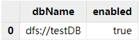
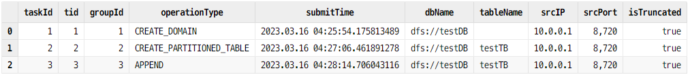

# DolphinDB Cluster Asynchronous Replication

Asynchronous replication is a backup technique which replicates data across multiple clusters asynchronously. Complex business logics have put forward high requirements for data consistency and reliability in application scenarios such as financial transactions, and the Internet of Things. Compared with synchronous replication, asynchronous replication has lower network latency, higher throughput, and smaller risk of failure.

As a remote disaster recovery solution, the asynchronous replication feature provided by DolphinDB replicates the master cluster to the slave clusters asynchronously, which ensures data consistency among the master and slave clusters. Compared with traditional asynchronous replication that may result in data inconsistency, loss, or conflict, DolphinDB exhibits the following advantages:

- Strong fault tolerance. Node failures will not cause data loss, and the master-slave cluster data will eventually remain consistent.
- Convenient operation and maintenance. DolphinDB provides built-in functions for status monitoring and error tracking.

**Contents**
- [Overview of Cluster Asynchrounous Replication](#overview-of-cluster-asynchrounous-replication)
  - [Concept](#concept)
  - [Replication States](#replication-states)
  - [Compatibility](#compatibility)
- [Configure Asynchronous Replication](#configure-asynchronous-replication)
  - [Master Cluster](#master-cluster)
  - [Slave Cluster](#slave-cluster)
- [Function Usage](#function-usage)
  - [Enable Asynchronous Replication](#enable-asynchronous-replication)
  - [Monitor Asynchronous Replication](#monitor-asynchronous-replication)
  - [Terminate or Disable Asynchronous Replication](#terminate-or-disable-asynchronous-replication)
- [FAQ](#faq)
- [Appendices](#appendices)

## Overview of Cluster Asynchrounous Replication

### Concept

The asynchronous replication often involves a primary storage (the master cluster) and one or multiple secondary replicas (the slave clusters). At least two clusters are required, which can be standalone, multi-machine, or high-availability clusters. See [DolphinDB Single-Server Cluster Deployment](./single_machine_cluster_deploy.md), [DolphinDB Multi-Machine Cluster Deployment](./multi_machine_cluster_deployment.md), and [DolphinDB High-availability Cluster Deployment](./ha_cluster_deployment.md).

When the controller of the master cluster is processing transactions, it collects relevant transaction information, generates replication tasks and sends them to the task queue of the master cluster. Then the controller of the slave cluster regularly pulls tasks from the task queue of the master cluster to the slave clusters. The enqueued tasks in the slave clusters are divided into groups, and are executed sequentially by group. Tasks in the same group are assigned to different data nodes for concurrent execution using a hash algorithm.

Asynchronous replication ensures data consistency through various mechanisms, but data loss may still occur if a data node in the master cluster is down. In this case, data consistency can be ensured by enabling synchronous persistence (see [Configuration of Master Cluster](###master_cluster)).

### Replication States

There are three states for cluster asynchronous replication in DolphinDB:

- ENABLED: The default state when replication is enabled.
- DISABLED: The state where the asynchronous replication task is stopped manually by the user or the asynchronous replication is not configured.
- STOPPED: The state where the cluster task fails to execute 30 times.

### Compatibility

Currently, cluster replication is only supported on DFS databases. See [User Manual - Cluster Asynchronous Replication](https://www.dolphindb.com/help/DatabaseandDistributedComputing/Database/ClusterAsyncReplication.html) for details.

## Configure Asynchronous Replication

Two high-availability clusters are deployed in this tutorial:


The configuration file for the master cluster is in the */dolphindb/server/cluster1/config* directory, and that for the slave cluster is in the */dolphindb/server/cluster2/config* directory. See [User Manual - Configuration](https://www.dolphindb.com/help/DatabaseandDistributedComputing/Configuration/index.html) for details.

### Master Cluster

(1) Log in the P1 server and navigate to the */dolphindb/server/cluster1/config* directory.

(2) Configure the controller:

- Execute the following shell command to modify the *controller.cfg* file:

```
vim ./controller.cfg
```

- Specify the number of slave cluster as 1.

```
clusterReplicationSlaveNum=1
```

(3) Configure the data node:

- Modify the *cluster.cfg* file:

```
vim ./cluster.cfg
```

- Add the following parameters to the *.cfg* file

```
clusterReplicationMode=master
clusterReplicationWorkDir=/dolphindb/server/cluster1/replication
clusterReplicationSyncPersistence=false
```

The parameter *clusterReplicationSyncPersistence* specifies a Boolean value indicating whether to persist data of write tasks synchronously or asynchronously. Note that the synchronous persistence ensures data consistency but may affect transaction efficiency, while asynchronous persistence improves performance but may cause data loss in node crashes.

(4) Repeat step 1 to 3 on the other servers of the master cluster to synchronize the configuration. In this example, the P2 and P3 servers are configured in the same way.

### Slave Cluster

(1) Log in the server P1 and direct to the */dolphindb/server/cluster2/confi*g directory.

(2) Configure the controller:

- Execute the following shell command to modify the *controller.cfg* file:

```
vim ./controller.cfg
```

- Specify IP:port of the controller of the master cluster.

```
clusterReplicationMasterCtl=10.0.0.1:8848
```

If the master cluster is a high-availability cluster, any controller in the raft group can be specified. This example uses the controller of server P1.

(3) Configure the data node:

- Modify the *cluster.cfg* file:

```
vim ./cluster.cfg
```

- Add the following parameters to the *.cfg* file

```
clusterReplicationMode=slave
clusterReplicationExecutionUsername=admin
clusterReplicationExecutionPassword=123456
```

The specified user must have been granted to process transactions, i.e., the operations on the master cluster can be executed on the slave clusters by the user. Otherwise the asynchronous tasks would fail. See details of [User Access Control](https://www.dolphindb.com/help/SystemManagement/UserAccessControl.html).

(4) Repeat step 1 to 3 on the other servers of the slave cluster to synchronize the configuration. 

## Function Usage

The following example uses a data node of the master cluster (hereinafter referred as dataNodeMaster) and a data node of the slave cluster (hereinafter referred as dataNodeSlave) to demonstrate the asynchronous replication feature in DolphinDB.

### Enable Asynchronous Replication

(1) Create a database on dataNodeMaster for later reference:

```
// create database testDB
login("admin", "123456")
dbName = "dfs://testDB"
if(existsDatabase(dbName)){
  dropDatabase(dbName)
}
db = database(dbName, VALUE, 2023.01.01..2023.12.31)
```

(2) Enable asynchronous replication

By default, asynchronous replication is enabled for a cluster, but it is disabled for a new database that is created within the cluster. You can use the function `setDatabaseForClusterReplication` on a data node of the master cluster (dataNodeMaster in this example) to enable asynchronous replication for a specific database.

```
setDatabaseForClusterReplication(db, true)
```

(3) Check whether asynchronous replication is enabled for the databases:

```
schema(db).clusterReplicationEnabled
```

Returning true means asynchronous replication is enabled. Alternatively, you can use function `getDatabaseClusterReplicationStatus` to check the replication status of all databases. Note that the function only takes effect when the databases already contain data.

```
getDatabaseClusterReplicationStatus()
```

The result is shown as follows:



### Monitor Asynchronous Replication

(1) Execute the following script on dataNodeMaster to create a DFS table:

```
// create a DFS table
tbName = "testTB"
colNames = `SecurityID`DateTime`PreClosePx`OpenPx`HighPx`LowPx`LastPx`Volume`Amount
colTypes = [SYMBOL, DATETIME, DOUBLE, DOUBLE, DOUBLE, DOUBLE, DOUBLE, INT, DOUBLE]
schemaTable = table(1:0, colNames, colTypes)
db.createPartitionedTable(table=schemaTable, tableName=tbName, partitionColumns=`DateTime)
```

(2) Check whether the slave cluster has replicated the databases and tables in the master cluster on dataNodeSlave:

```
loadTable("dfs://testDB", "testTB")
```

If the execution succeeded, the slave cluster has replicated the database dfs://testDB and table tableTB from the master cluster.

(3) Then simulate the 1-minute OHLC data of 5,000 stock for a day on dataNodeMaster:

```
// simulate the data and write to the table
n = 1210000
randPrice = round(10+rand(1.0, 100), 2)
randVolume = 100+rand(100, 100)
SecurityID = lpad(string(take(0..4999, 5000)), 6, `0)
DateTime = (2023.01.08T09:30:00 + take(0..120, 121)*60).join(2023.01.08T13:00:00 + take(0..120, 121)*60)
PreClosePx = rand(randPrice, n)
OpenPx = rand(randPrice, n)
HighPx = rand(randPrice, n)
LowPx = rand(randPrice, n)
LastPx = rand(randPrice, n)
Volume = int(rand(randVolume, n))
Amount = round(LastPx*Volume, 2)
tmp = cj(table(SecurityID), table(DateTime))
t = tmp.join!(table(PreClosePx, OpenPx, HighPx, LowPx, LastPx, Volume, Amount))
dbName = "dfs://testDB"
tbName = "testTB"
loadTable(dbName, tbName).append!(t)
```

(4) Check whether the data has been replicated to the slave clusters:

```
select count(*) from loadTable("dfs://testDB", "testTB")
```

The result shows: 


The table on the slave cluster contains 1,210,000 records, meaning the data has been replicated.

To get the detailed status information about asynchronous replication, you can use the following functions:

- `getMasterReplicationStatus`
- `getSlaveReplicationStatus`
- `getRecentSlaveReplicationInfo`
- `getClusterReplicationMetrics`

(5) Check the task queue status of the master cluster on dataNodeMaster:

```
rpc(getControllerAlias(), getMasterReplicationStatus)
```

The function `getMasterReplicationStatus` can only be executed on a controller (which can be accessed with function `rpc`). It returns:



As shown above, three replication tasks are generated on the master cluster: 1- creating databases, 2- creating tables, and  3- writing data.

(6) Accordingly, call the function getSlaveReplicationStatus[ ](https://www.dolphindb.cn/cn/help/FunctionsandCommands/FunctionReferences/g/getSlaveReplicationStatus.html?highlight=异步复制)on dataNodeSlave to check the task queue status of the slave clusters:

```
rpc(getControllerAlias(), getSlaveReplicationStatus)
```

It returns


The result indicates that the slave cluster receives the three replication tasks and the tasks have been finished.


To retrieve further replication information on dataNodeSlave, you can use:

-  `getRecentSlaveReplicationInfo` on dataNodeSlave to check the latest task status of each slave cluster:

```
rpc(getControllerAlias(), getRecentSlaveReplicationInfo)
```

It returns


As shown above, the latest task was received via the controller 10.0.0.3:8711, and the last finished task ID is 3.

- `getClusterReplicationMetrics` on dataNodeSlave to check the task progress in the slave cluster.

```
rpc(getControllerAlias(), getClusterReplicationMetrics, 30)
```

The last parameter *secs* specifies the time range of the returned replication metrics. The function returns: 


The result shows that three tasks have been finished in the last 30 seconds, and the average elapsed time is 00:00:00.537.

**Note**: If the parameter *secs* is set to -1, the function returns the replication metrics since asynchronous replication was enabled.

### Terminate or Disable Asynchronous Replication

Execute the following script to temporarily stop the asynchronous replication:

```
rpc(getControllerAlias(), stopClusterReplication)
```

If it is called on the master cluster, the replication status is marked as "DISABLED", and the subsequent tasks will not be put in the task queue. If it is called on the slave cluster, the slave cluster stops receiving new replication tasks, but the tasks that are already in progress will not be stopped.

To restart asynchronous replication, call function `startClusterReplication` on a controller. The cluster status will be marked as "ENABLED". 

To disable asynchronous replication after tasks are completed, use function `setDatabaseForClusterReplication`.

```
setDatabaseForClusterReplication(db, false)
```

## FAQ

**Q: Replication is not enabled**

The following error message is reported:


Asynchronous replication is not properly configured for the cluster. See Chap 02.

**Q: Abnormal termination of replication tasks**

The replication tasks may be terminated abnormally due to exception: 


Use function getSlaveReplicationStatus to check the task status and the result shows the task with ID 938 has "FAILED". The cluster status is "STOPPED".

The task failure could be due to insufficient disk capacity, no file write permission, and etc. The last column **details** displays the reason for the failure. To re-execute all failed tasks on the slave clusters, use getSlaveReplicationStatus to restart asynchronous replication.

If the issue cannot be solved, please contact our support engineers for help. You can temporarily skip the task and continue to execute subsequent tasks by executing the following script on a data node of the slave cluster:

```
rpc(getControllerAlias(), skipClusterReplicationTask, 938)
rpc(getControllerAlias(), startClusterReplication)
```

The script first skips the failed task 938 with skipClusterReplicationTask , and then restarts the replication with startClusterReplication. The skipped task will be marked as "finished".

## Appendices

Asynchronous replication demo (master cluster):

demo_asynMaster.dos: [Asynchronous_Replication](https://github.com/dolphindb/Tutorials_CN/blob/master/script/async_replication)

Asynchronous replication demo (slave cluster):

demo_asynSlave.dos: [Asynchronous_Replication](https://github.com/dolphindb/Tutorials_CN/blob/master/script/async_replication)


