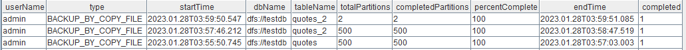
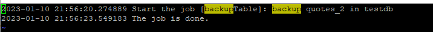

# Backup and Restore

In this tutorial, we will cover the basics of database backup and recovery, including the different types of backups, data backup and recovery methods, and the best practices for designing a backup strategy from DolphinDB version 1.30.20/2.00.8 onwards.

- [1. Backup](#1-backup)
  - [1.1 Back Up a Database](#11-back-up-a-database)
  - [1.2 Back Up a DFS Table](#12-back-up-a-dfs-table)
  - [1.3 Back Up Partitions](#13-back-up-partitions)
- [2. Check Backup](#2-check-backup)
  - [2.1 getBackupStatus](#21-getbackupstatus)
  - [2.2 getBackupList](#22-getbackuplist)
  - [2.3 getBackupMeta](#23-getbackupmeta)
  - [2.4 checkBackup](#24-checkbackup)
  - [2.5 Best Practices](#25-best-practices)
- [3. Restore From Backup](#3-restore-from-backup)
  - [3.1 Restore a Database](#31-restore-a-database)
  - [3.2 Restore a DFS Table](#32-restore-a-dfs-table)
  - [3.3 Restore Partitions](#33-restore-partitions)
  - [3.4 Restore a Cluster](#34-restore-a-cluster)
  - [3.5 Check Restore Jobs](#35-check-restore-jobs)
- [4. Performance Analysis](#4-performance-analysis)
- [5. FAQ](#5-faq)

**Feature enhancements since version 1.30.20/2.00.8:**

- Optimized performance of backup and restore through copying files.

- Multiple built-in functions that encapsulate function `backup` / `restore` are provided for different application scenarios;

- Enhanced verification mechanism for backup files, which enables users to examine data integrity and availability of the backup files in several different ways.

**Data Simulation**

We simulate data to generate an OLAP database (with tables "quotes" and "quotes_2") and a TSDB database (with table "quotes_tsdb"):


The data simulation script (see [appendix 1](./script/backup_restore/buildData.txt)) writes about 150G data to disk. You can adjust the variable *smallDates* to modify data volume.

There are 2 ways to start backup and restore jobs in DolphinDB:

- Run backup/restore jobs by invoking the functions on a DolphinDB client;
- Submit background jobs with `submitJob`.

Since a backup or restore job often involves large data volumes and takes a long time, it is recommended to submit the job for background execution. All backup and restore jobs in this tutorial will be executed in background. You can check the job status with function `getRecentJobs`.

## 1. Backup

You can use DolphinDB built-in functions to back up partitions, tables, or a database. For more detailed instructions, you can check [Backup and Restore](https://www.dolphindb.com/help/DatabaseandDistributedComputing/DatabaseOperations/BackupandRestore.html).

Backup in DolphinDB has the following features:

- Resumption from interrupted job

If a backup job is interrupted, you can resume the backup progress by invoking backupDB again. The partitions that have already been backed up will be skipped.

- Incremental backup by partition

For partitions that exist in both the original database and the backup file, DolphinDB checks the last update time of these partitions and only backs up new or modified files.

- Data consistency

For partitions that exist in the backup file but not in the original database, they will be deleted from the backup directory; For partitions that exist in the database but not in the backup file, they will be backed up to the backup directory.

> Note: As of version 2.00.8, the backup files are only stored on the machine where the backup job is running. To ensure that the data being backed up is retrieved from the same time point, DolphinDB acquires a lock for the involved partitions and the data becomes read-only during backup. To avoid write failures, it is recommended to run a backup job when there is no data being written.

### 1.1 Back Up a Database

To back up a database, you can use function `backupDB`.

Example. Back up database "testdb" to the directory */home/$USER/backupDB* (where $USER is the username):

```
dbPath="dfs://testdb"
backupDir="/home/$USER/backupDB"
submitJob("backupDB","backup testdb",backupDB,backupDir,dbPath)
```

### 1.2 Back Up a DFS Table

To back up a table, you can use function `backupTable`.

Example. Back up table "quotes_2" of database "testdb" to the target directory */home/$USER/backupTb*:

```
dbPath="dfs://testdb"
tbName=`quotes_2
backupDir="/home/$USER/backupTb"
submitJob("backupTable","backup quotes_2 in testdb",backupTable,backupDir,dbPath,tbName)
```

### 1.3 Back Up Partitions

To back up partitions of a table, you can specify the paths to the partitions in the form of a vector and pass it to the `backup` function. 

Example. Back up the partitions */Key3/tp/20120101* and */Key4/tp/20120101* of table "quotes_2" in database "testdb" to the directory */home/$USER/backupPar*:

```
dbPath="dfs://testdb"
tbName=`quotes_2
backupDir="/home/$USER/backupPar"
pars=["/Key3/tp/20120101","/Key4/tp/20120101"]
submitJob("backupPartitions","backup some partitions in quotes_2 in testdb",backup,backupDir,dbPath,false,true,true,tbName,pars)
```

## 2. Check Backup

After a backup job is executed, you can check whether it has been completed successfully. The following functions are provided in DolphinDB to monitor backup jobs and check data integrity.

- `getBackupStatus`: checks the backup/restore job status;

- `getBackupList`: lists all backup partitions;

- `getBackupMeta`: checks the metadata (including schema) of backup files;

- `checkBackup`: examines the data integrity of backup files.

> **Note**: The above functions must be executed on a data node where the backup job is executed. You can obtain the alias of a data node with `getNodeAlias`.

### 2.1 getBackupStatus

To check the status of backup/restore jobs, you can use function `getBackupStatus`. 

Example. Log in as an admin and check all backup/restore jobs:

```
login(`admin, `123456)
getBackupStatus()
```

- An administrator can check the jobs submitted by a specific user if the parameter *userName* is specified; Otherwise, all jobs are returned.

- A non-administrator can only obtain the status of jobs submitted by the current user.

The function returns:



The table displays information on the databases and tables involved in each job, including the number of partitions, completion percentage, end time (or estimated completion time), etc.

> **Note**:
>
> - Each row in the table represents a backup/restore job on a table. 
> - The function only checks backup jobs that are executed after the data node is started. When a data node is rebooted, the status of previous backup jobs will be lost.

### 2.2 getBackupList

You can obtain the backup information of a DFS table with `getBackupList`. The function returns a table where each row represents a backup partition.

Example. Use `getBackupList` to obtain backup information of table "quotes_2" from database testdb.

```
dbPath="dfs://testdb"
backupDir="/home/$USER/backupDB"
getBackupList(backupDir,dbPath,`quotes_2)
```

Part of the table is shown below:


### 2.3 getBackupMeta

You can obtain the backup information on a certain partition, including the table schema, chunk path, number of rows, ID, and version number. See details of function [getBackupMeta](https://www.dolphindb.com/help/FunctionsandCommands/FunctionReferences/g/getBackupMeta.html).

### 2.4 checkBackup

You can use function `checkBackup` to verify the checksum of each partition in the backup files. The function returns a table that displays only partitions with checksum mismatch.

Example. Check the data integrity of the backup file from Section 1.1.

```
dbPath="dfs://testdb"
backupDir="/home/$USER/backupDB"
checkBackup(backupDir,dbPath)
```

Note that the time it takes to verify the checksum is close to the backup time.

In case of checksum mismatch, you can execute `backup` by specifying the parameter force to true to forcibly back up the specified partitions. If force is set to false, DolphinDB performs an incremental backup which only checks the metadata of partitions, so it may skip partitions with inconsistent data.

To demonstrate the function usage, we will manually generate a backup file with inconsistent checksum:

1. Call the function checkBackup.

2. Remove the backup file and create an empty file with the same name. Then execute checkBackup again.

3. Back up the partitions again, and then execute checkBackup.

We first verify the backup file of "quotes_2" from an OLAP database.

```
checkBackup(backupDir,dbPath,`quotes_2)
```

Nothing is returned, meaning the checksum has passed the check.

Then we remove the volume.col file of the partition with chunk ID *086b0c1e-0386-95a4-4b4a-5038f4fd5d51*, and add an empty file with the same name. Execute `checkBackup` again and the result shows the checksum mismatch in the partition:


Next, we can back up the partition again:

```
backup(backupDir=backupDir,dbPath=dbPath,force=true,parallel=true,snapshot=true,tableName=`quotes_2,partition="/Key4/tp/20120103")
```

Then `checkBackup` returns empty, meaning that the checksum now matches. You can use the function to examine whether a backup file is corrupted.

### 2.5 Best Practices

You can check the backup files in two phases:

- After a backup job is finished, check whether the job has been completed properly;

- Before restoring data, check whether a backup file is corrupted.

All these functions should be executed on the node where the backup job is running.

#### 2.5.1 Check Backup Jobs

/1. Use `getBackupStatus` to return the status of backup jobs. Each row represents a backup task (which was broken down from a backup job) on a table. If all tasks involved in a backup job are marked as completed, then the job has been finished properly.

/2. If the function `getBackupStatus` returns nothing for a backup job, it may be due to a data node restart. You can then use `getBackupList` to obtain the number of rows in each backup partition, and compare it with the original database.

/3. Since version 2.00.9, status of backup jobs can be retrieved from logs. For background jobs, you can check the status from the logs stored in the directory *homeDir/\<nodeAlias>/batchJobs*. For example, you can search for *backupTable.msg* for the job submitted in Section 1.2 :



#### 2.5.2 Check Backup Files

To examine whether the backup files are corrupted, you can also use function `checkBackup`. See [Section 2.4](#24-checkbackup).

## 3. Restore From Backup

The following functions are provided in DolphinDB to restore data:

- [migrate](https://www.dolphindb.com/help/FunctionsandCommands/FunctionReferences/m/migrate.html)
- [restore](https://www.dolphindb.com/help/FunctionsandCommands/FunctionReferences/r/restore.html)
- [restoreDB](https://www.dolphindb.com/help/FunctionsandCommands/FunctionReferences/r/restoreDB.html)
- [restoreTable](https://www.dolphindb.com/help/FunctionsandCommands/FunctionReferences/r/restoreTable.html)

Data recovery has the following features:

- Resumption from interrupted job

Interrupted data recovery can be resumed by calling the restore function again.

- Incremental recovery by partition

For partitions that exist in both the backup file and target database, the restore function only restores new or modified files.

- Data consistency

The data to be restored is retrieved when the backup starts. For partitions that exist in the backup files but not in the target database, they will be restored to the database; For partitions that exist in the target database but not in the backup files, they will be deleted from the target database.

> **Note**: Different from backup job, a recovery job does not acquire locks for the involved partitions. For example, when you restore a table from backup, data can still be written to the target table. However, it is not recommended because the newly-written data may be overwritten by the restored data.

### 3.1 Restore a Database

To restore a database, you can use `restoreDB`.

Example 1. Restore the database backed up in Section 1.1 to a new cluster.

```
dbPath="dfs://testdb"
backupDir="/home/$USER/backupDB"
submitJob("restoreDB","restore testdb in new cluster",restoreDB,backupDir,dbPath)
```

The above script only specifies the backup directory storing the backup files and the target directory where the restored databases should be placed. Before restoring data to the new cluster, the `restoreDB` function first creates a database testdb in the target directory.

You can also restore a database from another database within one cluster. 

Example 2. Restore the database backed up in Section 1.1 to the target database restoredb within one cluster.

```
dbPath="dfs://testdb"
backupDir="/home/$USER/backupDB"
restoreDBPath="dfs://restoredb"
submitJob("restoreDB2","restore testdb to restoredb in the original cluster",restoreDB,backupDir,dbPath,restoreDBPath)
```

### 3.2 Restore a DFS Table

To restore the data of a table, you can use `restoreTable`.

Example 1. Restore table quotes_2 backed up in Section 1.2 to a new cluster:

```
dbPath="dfs://testdb"
tbName=`quotes_2
backupDir="/home/$USER/backupTb"
submitJob("restoreTable","restore quotes_2 in testdb to new cluster",restoreTable,backupDir,dbPath,tbName)
```

The above script only specifies the backup directory storing the backup files and the target directory where the restored tables should be placed. The `restoreTable` function first creates table quotes and database testdb in the new cluster, and restores data to quotes.

You can restore a table to another database within one cluster by specifying the path of the target database. 

Example 2. Restore the data backed up in Section 1.1 to table "quotes_2" of database "restoredb2" within one cluster:

```
dbPath="dfs://testdb"
tbName=`quotes_2
backupDir="/home/$USER/backupTb"
restoreDBPath="dfs://restoredb2"
submitJob("restoreTable2","restore quotes_2 in testdb to quotes_2 in restoredb",restoreTable,backupDir,dbPath,tbName,restoreDBPath)
```

You can restore a table to another table within one database by specifying the table name.

Example 3. Restore the data backed up in Section 1.1 to the table "quotes_restore" of database "testdb".

```
dbPath="dfs://testdb"
tbName=`quotes_2
backupDir="/home/$USER/backupTb"
restoreTb="quotes_restore"
submitJob("restoreTable3","restore quotes_2 to quotes_restore in testdb",restoreTable,backupDir,dbPath,tbName,,restoreTb)
```

### 3.3 Restore Partitions

To restore partitions of a table, you can use function `restore`. Different from backup, the parameter *partition* of function restore can only take a scalar with which multiple partitions can be specified using wildcards. For example, you can use `%/Key4/tp/%` to specify partitions */Key4/tp/20120101*, */Key4/tp/20120103*, */Key4/tp/20120104*, etc.

Example. Restore the partitions backed up in Section 1.3 to a new database.

```
dbPath="dfs://testdb"
backupDir="/home/$USER/backupPar"
tbName=`quotes_2
pars=["/testdb/Key3/tp/20120101","/testdb/Key4/tp/20120101"]
for (par in pars){
	restore(backupDir,dbPath,tbName,par,false,,true,true)
}
```

### 3.4 Restore a Cluster

To migrate a cluster, you can back up all databases to a directory, and then restore the cluster with function `migrate`.

Example. Back up databases "testdb" and "testdb_tsdb" to the target directory, and migrate these databases to a new cluster:

```
//Back up testdb and tesdb_tsdb
dbPath="dfs://testdb"
dbPath2="dfs://testdb_tsdb"
backupDir="/home/$USER/migrate"
submitJob("backupForMigrate","backup testdb for migrate",backupDB,backupDir,dbPath)
submitJob("backupForMigrate2","backup testdb_tsdb for migrate",backupDB,backupDir,dbPath2)

//Restore these databases to a new cluster
backupDir="/home/$USER/migrate"
submitJob("migrate","migrate testdb and testdb_tsdb to new cluster",migrate,backupDir)
```

`migrate` is similar to `restoreDB`, and the differences lie in:

- You can use `migrate` to restore multiple databases in batches, whereas `restoreDB` can only restore a database at a time.
- When the target databases/tables share the same names as the originals, `migrate` can be used only when the originals are deleted, while `restoreDB` does not have such limitation. Therefore, `migrate` does not support incremental recovery or interrupted recovery resumption, and it is usually used to migrate a newly-deployed cluster.

### 3.5 Check Restore Jobs

You can also use function `getBackupStatus` to check whether a restore job has been completed. See [Section 2.5.1](#251-check-backup-jobs).

## 4. Performance Analysis

To analyze the backup and recovery performance, we use a machine with Intel(R) Xeon(R) Silver 4314 CPU @ 2.40GHz CPU. A regular DolphinDB cluster with one controller and three data nodes is used. Each data node uses an SSD disk with the read/write speed at about 500 MB/s. The backup files are also stored on an SSD disk with the read/write speed at 500 MB/s.

The cluster is configured as follows (in the file *cluster.cfg*)

```
maxMemSize=256
maxConnections=512
workerNum=8
localExecutors=7
chunkCacheEngineMemSize=16
newValuePartitionPolicy=add
maxPubConnections=64
subExecutors=4
subPort=8893
lanCluster=0
enableChunkGranularityConfig=true
diskIOConcurrencyLevel=0
```

When we back up the data of about 50 GB, the disk IO shows that the write speed is about 490 MB/s, which basically makes full use of the disk resources.

When we restore the data to multiple disks, data volume divided by time is calculated to estimate the recovery speed. It takes 2 minutes and 20 seconds to restore the 50 GB backup file. The speed is around 365 MB/s, lower than backup speed.

## 5. FAQ

Q1: Can I restore a database to a certain time point?

No. The incremental backup in DolphinDB does not add a new binlog to the original backup file, but it skips partitions that don’t require backup and directly overwrites the original files. Therefore, a database cannot be restored to a certain time point. If you need to restore a database to any day of the previous week, then you need to back up the data each day of the week, and place the backup files in different directories.

Q2: Are all partitions backed up at the same time?

Yes.

Q3: Can I resume from an interrupted backup/restore?

Yes. See [1.1 Back Up a Database](#11-back-up-a-database).

Q4: Is incremental backup/restore supported?

Yes. See [1.1 Back Up a Database](#11-back-up-a-database).

Q5: How do I check the backup progress?

Use function getBackupStatus. See Section [2.1 getBackupStatus](#21-getbackupstatus).

Q6: How do I check if a backup/restore job is completed?

See [3.5 Check Restore Jobs](#35-check-restore-jobs).