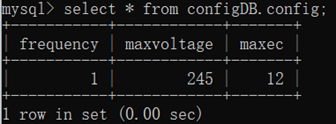
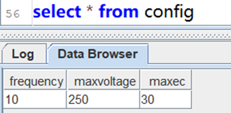

# Synchronizing Basic Product Data from MySQL with DolphinDB Cached Tables

DolphinDB is a high-throughput distributed time-series database, specially designed for big data analysis scenarios in industrial IoT (IIOT) and finance.   

Data analysis in DolphinDB is often conducted based on the basic product information (such as the SKU, size, and storage of a device) from an external business platform, which conventionally runs on a relational database. To associate external product information with the time series data in DolphinDB, you can use the **cached tables** to save the external data fetched through plugins ([MySQL](https://github.com/dolphindb/DolphinDBPlugin/blob/release200/mysql/README.md), [MongoDB](https://github.com/dolphindb/DolphinDBPlugin/tree/release200/mongodb), CSV file, etc.) in memory with regular synchronizations.   

This tutorial describes how to synchronize data using a DolphinDB cached table in an IIoT scenario.

## 1. Scenario

In this scenario, a MySQL table must be synchronized every minute with a DolphinDB cached table to update device configuration.

The data to be synchronized is as follows:

<table>
<tr><td>Database</td><td>Data</td><td>Sample</td></tr>
<tr><td>MySQL</td><td>Database: configDB<br>
Table: config<br>
Table Columns:
frequency int,
maxvoltage float,
maxec float </td><td> </td></tr>
<tr><td>DolphinDB</td><td>Table: config<br>
Table Columns: Same as the MySQL table</td><td> 
</td></tr>
</table>

## 2. Solution

Create a cached table in DolphinDB with the following function:

[cachedTable(updateFunc, retentionSeconds)](https://dolphindb.com/help/FunctionsandCommands/FunctionReferences/c/cachedTable.html)

where

- *updateFunc* is a function that implements the data synchronization.
- *retentionSeconds* is an integer indicating the frequency (in seconds) to update the table in DolphinDB.

### 2.1 Procedure

1. Create a table in MySQL (see [script](https://github.com/dolphindb/Tutorials_CN/blob/master/script/cachedTable/mysql_data.txt)).
2. Install the [DolphinDB MySQL plugin](https://github.com/dolphindb/DolphinDBPlugin/tree/release200/mysql).
3. Synchronize the data from MySQL to DolphinDB (see script below).

```
 login("admin","123456")
//load the MySQL plugin
loadPlugin("yourPluginsPath/mysql/PluginMySQL.txt")
use mysql
//define the function for data synchronization
def syncFunc(){
	//retrieve table data from MySQL
	conn = mysql::connect("127.0.0.1",3306,"root","123456","configDB")
	t = load(conn,"config")
	//return the table
	return t
}

config=cachedTable(syncFunc,60)

select * from config
```

### 2.2 Validation

1. Update the source table by executing the following script in MySQL:

```
update configDB.config set frequency=10,maxvoltage=250,maxec=30;
```

2. After the update, print the “config“ tables in MySQL and DolphinDB:


<table>
<tr><td>Database</td><td>Result</td></tr>
<tr><td>MySQL</td><td> </td></tr>
<tr><td>DolphinDB</td><td> 
</td></tr>
</table>


The tables are identical, indicating that changes have been successfully synchronized.

## 3. Tips

Data synchronization between databases is a common requirement in Industrial IoT (IIOT) and finance. Its design should not increase inter-system dependency or maintenance cost. The DolphinDB cached tables are a special kind of in-memory table. By synchronizing basic product information to a cached table, you can associate it with the time series data in a distributed database and run business queries smoothly. Note that cached tables are not suitable for real-time data synchronization.

Check out the following tips before deploying your code to production: 

(1) Initialize the cached table with non-null values when DolphinDB is started by configuring the startup script *startup.dos* to improve fault tolerance.

(2) Enable data access through APIs by [sharing](https://dolphindb.com/help/ProgrammingStatements/share.html) the cached table across sessions. 

(3) Add validation for incoming data.

(4) Add exception handling and logging.

