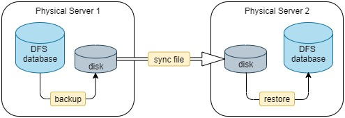
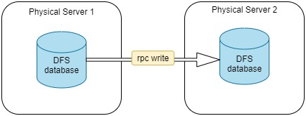

# Cluster-to-Cluster Synchronization in DolphinDB

- [1. Offline Synchronization](#1-offline-synchronization)
	- [1.1 Backup](#11-backup)
	- [1.2 Transfer Backup Data](#12-transfer-backup-data)
	- [1.3 Restore](#13-restore)
	- [1.4 Example](#14-example)
- [2. Online Synchronization](#2-online-synchronization)
- [3. Comparison](#3-comparison)

In DolphinDB, there are 2 ways to synchronize DFS databases between 2 clusters:

- Offline: through backup and restore
- Online: by reading from one database and writing to the other over the network

## 1. Offline Synchronization

The steps of offline data synchronization are as shown below:

(1) Back up the data in the DFS database with function `backup` to the disk on physical server 1;

(2) Synchronize the backup data to the remote physical server over the network;

(3) Restore the synchronized data to the database on server 2 with function `restore`.



### 1.1 Backup

You can back up a DFS database to the disk with function `backup` and specify the data to be backed up with metacode of SQL statements. 

**Example 1**: Back up table mt in database db1.

```
backupDir = "/hdd/hdd1/backDir"
backup(backupDir,<select * from loadTable("dfs://db1","mt")>)
```

**Example 2**: Supposing table mt is partitioned by column "TradingDay" (DATE), back up data for the last 7 days of table mt in database db1.

```
backupDir = "/hdd/hdd1/backDir"	
backup(backupDir,<select * from loadTable("dfs://db1","mt") where TradingDay > date(now()) - 7 and  TradingDay <= date(now())>)
```

**Example 3**: Back up columns ("col1", "col2", "col3") of table mt in database db1.

```
backupDir = "/hdd/hdd1/backDir"
backup(backupDir,<select col1,col2,col3 from loadTable("dfs://db1","mt")>)
```

You can refer to [Metaprogramming](https://github.com/dolphindb/Tutorials_EN/blob/master/meta_programming.md) for more information on DolphinDB metaprogramming.

### 1.2 Transfer Backup Data

After backing up the data to the local disk, you can transfer the backup files to a remote server offline (with removable storage devices) or online (such as using operating system commands or other sync tools). The way using OS command is introduced in this section. 

You can execute Linux commands such as `rsync` and `scp` with DolphinDB function `shell` to synchronize the files. The `rsync` command is a commonly-used command for copying and synchronizing files and directories remotely and locally.

**Example 4**: 

The following script sets up `rsync` without password with SSH. All changed files under the directory *backupDir* are synchronized from one server to the target directory *restoreDir* on the other server.

```
cmd = "rsync -av  " + backupDir + "/*  " + userName + "@" + restoreIP + ":" + restoreDir 
shell(cmd)
```

"username" is the username logged in with SSH; "restoreIP" is the remote IP connected via SSH.

### 1.3 Restore

After the data is synchronized to directory *restoreDir*, you can restore the data with function `restore`. The restoring script is executed on the server where the data is to be restored.

Note: Please create the database with the same name as the backup database before using function `restore`.

**Example 5**: Restore table mt from database db1 on the server 1 to the server 2.

```
restore(backupDir=restoreDir,dbPath="dfs://db1",tableName="mt",partition="%",force=true,outputTable=loadTable("dfs://db1","mt"))
```

You can also specify the partitions to be restored by setting the parameter *partition* for function `restore`. See tutorial [Backup and Recovery](https://github.com/dolphindb/Tutorials_EN/blob/master/backup_and_recovery.md) for more information.

### 1.4 Example

In the following example, DolphinDB cluster A and B are deployed on different physical servers. To synchronize data of the current day from table mt of database db1, a daily job is scheduled at 22:30 (based on the system time of cluster B). The database db1 adopts a VALUE partition with the partitioning column of Timestamp. Each day is a partition.

**Example 6**: 

The script is executed on Cluster B (where the data are to be restored).

```
def syncDataBases(backupNodeIP,backupNodePort,backupDir,restoreServerIP, userName,restoreDir){
	conn = xdb(backupNodeIP,backupNodePort)
	conn(login{`admin,`123456})
	conn(backup{backupDir,<select * from loadTable("dfs://db1","mt") where Timestamp > timestamp(date(now())) and Timestamp < now()>})
	cmd = "rsync -av  " + backupDir + "/*  " + userName + "@" + restoreServerIP + ":" + restoreDir 
	conn(shell{cmd})
	restore(backupDir=restoreDir,dbPath="dfs://db1",tableName="mt",partition="%",force=true,outputTable=loadTable("dfs://db1","mt"))
}

login(`admin,`123456)

//Specify the IP, port and backup directory (empty) of the backup node
backupNodeIP = '115.239.209.234' 
backupNodePort = 18846
backupDir = "/home/backupDir"

//Specify the IP, SSH username and restoring directory (empty) of the restoring node
restoreServerIP = '115.239.209.234'
restoreServerIP = '115.239.209.234'
userName = 'user1'
restoreDir = "/home/backupDir"
```

You can synchronize data with the following script:

```
syncDataBases(backupNodeIP,backupNodePort,backupDir,restoreServerIP,userName,restoreDir)
```

Or schedule a daily job at 22:30:

```
scheduleJob("syncDB","syncDB",syncDataBases{backupNodeIP,backupNodePort,backupDir,restoreServerIP, userName,restoreDir},22:30m,2019.01.01,2030.12.31,'D')
```

## 2. Online Synchronization

For online data synchronization, the 2 clusters must both be online with a socket connection established. The data are read from one database and written to the other.



The following examples are based on the synchronization conditions set in [Section 1.4](#14-example). This section discusses how to synchronize data online when the available memory of the physical server 2 is enough to store the backup data and when not.

**Example 7**: 

When the available memory is enough, execute the following script on Cluster B (where the data are to be restored). Data are read from the database on Cluster A and written to the database on Cluster B remotely.

```
def writeData(dbName,tableName,t) : loadTable(dbName,tableName).append!(t)
def synDataBaseOnline(restoreServerIP,restoreServerPort,writeData=writeData){
	t = select * from loadTable("dfs://db1","mt") where Timestamp > timestamp(date(now())) and Timestamp < now()
	conn = xdb(restoreServerIP,restoreServerPort)
	conn(login{`admin,`123456})
	conn(writeData{"dfs://db1","mt",t})
}
login(`admin,`123456)
restoreServerIP = '115.239.209.234'
restoreServerPort = 18848
synDataBaseOnline(restoreServerIP,restoreServerPort)
```

**Example 8**: 

When the available memory is not enough, executing the above script may cause OOM. You can use `sqlDS` to generate multiple data sources of the backup data, then use function `mr` to write the data by partition to a remote database.

```
def writeData(dbName,tableName,t) : loadTable(dbName,tableName).append!(t)
def writeRemoteDB(t, ip, port, dbName,tableName,writeData){
	conn = xdb(ip, port)
	conn(login{`admin,`123456})
	remoteRun(conn,writeData,dbName,tableName,t)
}
def synDataBaseOnline(ip, port){
	ds = sqlDS(<select * from loadTable("dfs://db1","mt") where Timestamp > timestamp(date(now())) and Timestamp < now()>)
	mr(ds, writeRemoteDB{,ip,port,"dfs://db1","mt",writeData},,, false)
}
login(`admin,`123456)
restoreServerIP = '115.239.209.234'
restoreServerPort = 18848
```

You can manually synchronize the data with the following script:

```
synDataBaseOnline(restoreServerIP,restoreServerPort)
```

Or schedule a daily job at 22:30:

```
scheduleJob("syncDB","syncDB",synDataBaseOnline{restoreServerIP,restoreServerPort},22:30m,2019.01.01,2030.12.31,'D')
```

In the above example, the parameter *parallel* of function `mr` is set to false to avoid high memory usage for parallel execution. It’s recommended to set it to true for better performance if there is enough memory.

## 3. Comparison

|                    | **Online**                                                                                                                                  | **Offline**                                                                                                                   |
|--------------------|---------------------------------------------------------------------------|-----------------------------------------------------------------------------------|
| Performance        | Better performance. Data are transferred and written to the remote database over the network.                                                | Data are backed up to local disk first, then transferred to the remote disk, and finally written to the database.             |
| Memory Requirement | Lower memory requirement. If the available memory of the server cannot hold the backup data, use function mr to write the data by partition. | The backup is performed on a partition basis. The available memory should be larger than each partition.                      |
| Disk Usage         | No additional disk space is required as there is no data backup.                                                                             | Disk space is required on both clusters to store the backup data.                                                             |
| Other              | Both clusters must be online.                                                                                                                | The clusters don’t need to be online at the same time. For example, when there is no network connectivity between 2 clusters. |
