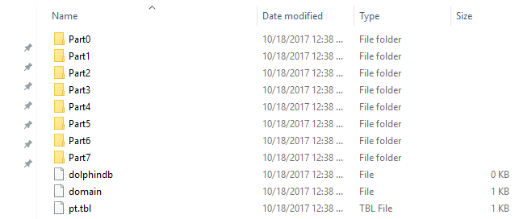

### DolphinDB Partitioned Database Tutorial


#### 1. Benefits of partitioned databases

Partitioned databases can significantly reduce latency and improve throughput. 
* Partitioning makes large tables more manageable by enabling users to access subsets of data quickly and efficiently, while maintaining the integrity of a data collection. 
* Partitioning helps the system utilize all resources. Data can be partitioned to multiple nodes and a task can be divided into multiple subtasks on these nodes. With distributed computing, these subtasks can be executed simultaneously to improve performance. 
* Partitioning increases the availability of a system. As partition replicas usually reside on different physical nodes, if a partition copy becomes unavailable, the system can use other replicas. 


#### 2. The differences between DolphinDB and MPP databases in terms of partitions

MPP (Massive Parallel Processing) databases are widely adopted in popular systems such as Greenplum, Amazon Reshift, etc. 

In MPP a leader node connects to all client applications. DolphinDB adolpts a peer-to-peer structure in database and doesn't have a leader node. Each client application can connect to any compute node. Therefore DolphinDB doesn't have performance bottleneck problem at the leader node. 

MPP databases usually split data across nodes with hashed sharding first (horizontal partitioning), then within each node conduct further partitioning (vertical partitioning). In DolphinDB, the partitioning logic and partition storage are independent of each other. The distributed file system (DFS) determines the storage locations of the partitions. Partitioning storage is optimized across the entire cluster. Compared with MPP databases, DolphinDB provides more fine-grained partitions and therefore data are more evenly distributed across partitions to better utilize the cluster resources. 

As DFS is excellent at partition management, fault tolerance, replica management, and transaction management, a single table in DolphinDB can support millions of partitions. With each partition of 1GB, DolphinDB can support data storage and fast queries on datasets up to PBs. With DFS, database storage is independent of data nodes, making it very easy to scale out (add more nodes) the clusters. 


#### 3. Partition Domains

DolphinDB supports sequential, range, hash, value, list, and composite partitions. 
  *  Sequential domain can load large text files into memory faster than importing directly from text files. It can only be used in the local file system, not in the distributed file system. 
  *  Range partitions are determined by ranges. Each range is defined by 2 adjacent elements of the partition scheme vector. It is the most commonly used partition type.
  *  Hash partitions are determined by a hash function on the specified partitioning column. Hash partition is a convenient way to generate a given number of partitions. 
  *  In a value domain, each element of the partition scheme vector corresponds to a partition. 
  *  A list domain partitions data according to a list given by the user. It is more flexible than a range domain.
  *  The composite domain is suitable for situations where 2 or 3 columns are frequently used in WHERE or GROUP BY clauses of queries on extremely large tables.  In a composite domain, we can have 2 or 3 partitioning columns. Each column can be of range, value, or list domain. For example, we can use a value domain on trading days, and a range domain on stock symbols. The order of the partitioning columns is irrelevant. 

When we create a new distributed database, we need to specify "partitionType" and "partitionScheme". When we reopen an existing distributed database, we only need to specify "folderDirectory". We cannot overwrite an existing distributed database with a different "partitionType" and "partitionScheme". 

When we use aggregate functions on a partitioned table, we can achieve optimal performance if GROUP BY columns are also partitioning columns. 

The following examples are executed on local drives in Windows. To run in Linux servers or DFS clusters, just change the directory of the databases accordingly. 


#### 3.1 SEQ Domain

In a sequential domain (SEQ), the partitions are based on the order of rows in the input data file. The sequential domain can only be used in the local file system, not in the distributed file system. 

In the following example, 8 sub folders are created under the folder "C:/DolphinDB/data/seqdb". Each of them corresponds to a partition of the input data file. 

```
n=1000000
ID=rand(100, n)
dates=2017.08.07..2017.08.11
date=rand(dates, n)
x=rand(10.0, n)
t=table(ID, date, x)
saveText(t, "C:/DolphinDB/Data/t.txt");

db = database("C:/DolphinDB/Data/seqdb", SEQ, 8)   
pt = loadTextEx(db, `pt, , "C:/DolphinDB/Data/t.txt")
```


#### 3.2 RANGE Domain

In a range domain (RANGE), partitions are determined by ranges, whose boundaries are two adjacent elements of the partition scheme vector. The starting value is inclusive and the ending value is exclusive. A row with the value of the partitioning column falling within a range belongs to the partition defined by this range. 

In the example below, database db has 2 partitions: [0,5) and [5,10). Table t is saved as a partitioned table pt with the partitioning column of ID in database db. 

```
n=1000000
ID=rand(10, n)
x=rand(1.0, n)
t=table(ID, x)
db=database("C:/DolphinDB/Data/rangedb", RANGE,  0 5 10)

pt = db.createPartitionedTable(t, `pt, `ID)
pt.append!(t);

pt=loadTable(db,`pt)
select count(x) from pt
```


To create DFS databases, just change the local folder path to DFS path.

```
n=1000000
ID=rand(10, n)
x=rand(1.0, n)
t=table(ID, x)
db=database("dfs://rangedb", RANGE,  0 5 10)
pt = db.createPartitionedTable(t, `pt, `ID)
pt.append!(t);

pt=loadTable(db,`pt)
select count(x) from pt
```
#### 3.3 HASH Domain

In a hash domain (HASH), partitions are determined by a hash function on the specified partitioning column. Hash partition is a convenient way to generate a given number of partitions. However, there might be significant differences between the partition sizes if the distribution of the partitioning column values is skewed. To locate observations on a continuous range in the partitioning column, it is more efficient to use range partitions or value partitions than hash partitions.     

In the example below, database db has 2 partitions. Table t is saved as a partitioned table pt with the partitioning column of ID in database db. 

```
n=1000000
ID=rand(10, n)
x=rand(1.0, n)
t=table(ID, x)
db=database("C:/DolphinDB/Data/hashdb", HASH,  [INT, 2])

pt = db.createPartitionedTable(t, `pt, `ID)
pt.append!(t);

pt=loadTable(db,`pt)
select count(x) from pt
```

#### 3.4  VALUE Domain

In a value domain (VALUE), each element of the partition scheme vector corresponds to a partition. 
```
n=1000000
month=take(2000.01M..2016.12M, n)
x=rand(1.0, n)
t=table(month, x)

db=database("C:/DolphinDB/Data/valuedb", VALUE, 2000.01M..2016.12M)
pt = db.createPartitionedTable(t, `pt, `month)
pt.append!(t)

pt=loadTable(db,`pt)
select count(x) from pt
```

The example above defines a database db with 204 partitions. Each of these partitions is a month between January 2000 and December 2016. In database db, table t is saved as a partitioned table pt with the partitioning column of month.


The partition scheme of a value domain can be appended with new values after it is created. Please check function `addValuePartitions` in user manual for details. 

#### 3.5 LIST Domain

In a list domain, each element of a vector represents a partition. The different between a list domain and a value domain is that all the elements in a value domain partition scheme are scalars, whereas each element in a list domain partition scheme may be a vector.

```
n=1000000
ticker = rand(`MSFT`GOOG`FB`ORCL`IBM,n);
x=rand(1.0, n)
t=table(ticker, x)

db=database("C:/DolphinDB/Data/listdb", LIST, [`IBM`ORCL`MSFT, `GOOG`FB])
pt = db.createPartitionedTable(t, `pt, `ticker)
pt.append!(t)

pt=loadTable(db,`pt)
select count(x) from pt
```

The database above has 2 partitions. The first partition contains 3 tickers and the second contains 2 tickers.


#### 3.6 COMPO Domain

A composite domain (COMPO) can have 2 or 3 partitioning columns. Each partitioning column can be of range, value, or list domain. The order of the partitioning columns is irrelevant.


```
n=1000000
ID=rand(100, n)
dates=2017.08.07..2017.08.11
date=rand(dates, n)
x=rand(10.0, n)
t=table(ID, date, x)

dbDate = database(, VALUE, 2017.08.07..2017.08.11)
dbID=database(, RANGE, 0 50 100)
db = database("C:/DolphinDB/Data/compoDB", COMPO, [dbDate, dbID])
pt = db.createPartitionedTable(t, `pt, `date`ID)
pt.append!(t)

pt=loadTable(db,`pt)
select count(x) from pt
```

The value domain has 5 partitions:


Click on a date partition, we can see the range domain has 2 partitions:


If one of the partitioning columns of a composite domain is of value domain, it can be appended with new values after it is created. Please check function `addValuePartitions` in user manual for details. 

#### 4. Partition guidelines

A reasonable partition scheme can reduce latency and improve query performance and throughput.

#### 4.1 Select appropriate partitioning columns

The data types that can be used for partitioning columns in DolphinDB must be represented by 32-bit integers, including integers (CHAR, SHORT, INT), temporal (DATE, MONTH, TIME, SECOND, MINUTE, DATETIME), and SYMBOL. STRING, FLOAT and DOUBLE cannot be used as partitioning column.

```
db=database("dfs://rangedb1", RANGE,  0.0 5.0 10.0);
The data type DOUBLE can't be used for a partition column.

```

Although DolphinDB supports TIME, SECOND, and DATETIME for partitioning columns technically, please avoid using them for value partitions. Otherwise each partition may be too small. It is very time consuming to create and query millions of small partitions.

The partitioning columns should be relevant in most database transactions, especially database updating. For example, many tasks in financial databases involve stock symbols and dates. Therefore stock symbols and dates are reasonable candidates as partitioning columns. As will be discussed in section 5.2, DolphinDB doesn't allow multiple threads or processes to write to the same partition simultaneously when updating the database. Considering we may need to update data of a date or of a stock, if we use other partitioning columns such as trading hour, multiple writers may write to the same partition simultaneously and cause problems. 

A partitioning column is equivalent to a physical index on a table. If a query uses a partition column in the WHERE conditions, 
the target data can be quickly loaded instead of scanning the entire table, resulting in optimal performance. Therefore, partitioning columns should be the columns that are frequently used in WHERE conditions.

#### 4.2 Partition size should not be too large

The columns in a partition are stored as separate files on disk after compression. When a query reads the partition, the system selects the necessary columns and loads into memory after decompression. Too large partitions may slow down the system, as it may cause insufficient memory with multiple threads running in parallel, or it may make the system swap data between disk and memory too frequently. As a rule of thumb, assume the available memory of a data node is S and the number of workers is W, then it is recommended that a partition is less than S/8W in memory after decompression，For example, with available memory of 32GB and 8 workers, a single partition should be smaller than 32GB/8/8=512MB.

Given a query, the number of subtasks is the same as the number of partitions involved. Therefore if partitions are too large, the system cannot fully take advantage of distributed computing on multiple partitions.

DolphinDB is designed as an OLAP database system. It supports appending data to tables, but does not support deleting or modifying individual rows. To modify certain rows, we need to overwrite entire partitions containing these rows. If the partitions are too large, it would be slow to modify data. When we copy or move selected data between nodes, entire partitions with the selected data are copied or moved. If partitions are too large, it wold be slow to copy or move data.

Considering all the factors mentioned above, we recommend the size of a partition between 100MB and 1GB before compression. This range can be adjusted depending on the specific situations. For example, when we work with a table with hundreds of columns and only a small subset of columns are actually used, we can relax the upper limit of the partition size range.

If we believe partitions are too large, we can (1) use composite partitions (COMPO); (2) increase the number of partitions; (3) use value partitions instead of range partitions.


#### 4.3 Partition size should not be too small

If partition size is too small, a query or computing job may generate a large number of subtasks. This increases the time and resources in communicating between the controller node and data nodes, and between different controller nodes. Too small partitions also result in innefficient reading/writing of small files on disk and therefore。 Lastly, the metadata of all partitions are stored in the memory of the controller node. Too many small partitions may make the controller node run out of memory. We recommend that the partition size is larger than 100 MB on average before compression.

For example, the distribution of trading activities of stocks is highly skewed. Some stocks have extremely active tradings but many more have only a very small amount of trading. For a composite partition on high frequency stock trading data with partitioning columns of trading days and stock tickers, if we use value partitions on both partitioning columns, we will have many extremely small partitions for illiquid stocks. In this case we recommend range partitions on stock tickers where many illiquid stocks can be grouped into one partition, resulting a more evenly partitioned dataset for better performance.


#### 4.4 How to partition data evenly

Significant differences between partition sizes may cause load imbalance. Some nodes may have heavy workload while other nodes idle. If a task is has multiple subtasks, it returns the final result only after the last subtask is finished. As each subtask works on a different partition, if data are not distributed evenly among partitions, it may increase the execution time.

A useful tool for partition data evenly is function `cutPoints(X, N, [freq])`, where X is a vector; N means the number of buckets the elements of X will be grouped into; and the optional argument freq is a vector of the same length as X indicating the frequency of each element in X. It returns a vector with (N+1) elements such that the elements of X are evenly distributed within each of the N buckets indicated by the vector. It can be used to get the partition scheme of a range domain in a distributed database. 


```
// Use data of 2007.08.01 to calculate partitioning scheme of symbol. 
t = ploadText(WORK_DIR+"/TAQ20070801.csv")
t = select count(*) as ct from t where date=2007.08.01 group by symbol

// produce 128 ranges with equal number of rows on 2007.08.01
buckets = cutPoints(t.symbol, 128, t.ct)

dateDomain = database("", VALUE, 2017.07.01..2018.06.30)
symDomain = database("", RANGE, buckets)
stockDB = database("dfs://stockDBTest", COMPO, [dateDomain, symDomain])
```

#### 4.5 Partitions on temporal variables

DolphinDB provides a number of temporal data types. When we use a temporal variable as the partitioning column, we need to include future periods for updates. 

In the following example, we create a distributed database with a value partition on date. The partitioning scheme extends to the year 2030 to accommodate future time periods.  

```
dateDB = database("dfs://testDate", VALUE, 2000.01.01 .. 2030.01.01)
```

When using temporal variables as a partition column, the data type of the partition scheme does not need to be the same as the data type of a partitioning column. For example, if we use month as the partition scheme in a value partition, the data type of the partitioning column can be month, date, datetime, timestamp, or nanotimestamp. 


#### 4.6 Partition colocation

In a distributed database, it may be time consuming to join multiple tables, as the partitions that need to be joined with may be located on different nodes and therefore data need to be copied and moved across nodes. To solve this problem, DolphinDB ensures that the same partitions of all the tables in the same distributed database are stored at the same node. This makes it highly efficient to join these tables. DolphinDB does not support joining tables from different partitioned databases. 

```
dateDomain = database("", VALUE, 2018.05.01..2018.07.01)
symDomain = database("", RANGE, string('A'..'Z') join `ZZZZZ)
stockDB = database("dfs://stockDB", COMPO, [dateDomain, symDomain])

quoteSchema = table(10:0, `sym`date`time`bid`bidSize`ask`askSize, [SYMBOL,DATE,TIME,DOUBLE,INT,DOUBLE,INT])
stockDB.createPartitionedTable(quoteSchema, "quotes", `date`sym)

tradeSchema = table(10:0, `sym`date`time`price`vol, [SYMBOL,DATE,TIME,DOUBLE,INT])
stockDB.createPartitionedTable(tradeSchema, "trades", `date`sym)
```
In the examples above, the distributed tables quotes and trades are located in the same distributed database. 

#### 5. Import data into distributed databases

DolphinDB is an OLAP database system. It is designed for fast storage and query/computing of massive structured data and for high performance data processing with the in-memory database and streaming functionalities. It is not an OLTP system with frequently updated data. When appending new data to a database on disk in DolphinDB, data are inserted at the end of partitions or files in batches, similar to Hadoop HDFS. We cannot, however, update or delete rows with specific conditions. To modify existing rows, we have to replace the entire partitions that contain these rows. 

#### 5.1 Replicas

DolphinDB can make multiple replicas for each partition. The number of replicas is 2 by default, and can be changed by setting the configuration parameter "dfsReplicationFactor". 

There are 2 purposes of replicas: 
(1) Fault tolerance: if a node is down, the system can use a replica for ongoing projects
(2) Load balance: with a large number of concurrent users, replicas can improve system throughput and decrease latency. 

DolphinDB adopts two-phase commit protocol to ensure strong consistency of all replicas of the same partition on different nodes when writing data into the database. 

There is an important configuration parameter "dfsReplicaReliabilityLevel" in the configuration file of the controller (controller.cfg). It determines if multiple replicas are allowed to reside on nodes of the same physical server. In development stage, we can set it to 0 allowing multiple replicas on the same machine. In production stage, however, we should set it to 1 to ensure load balance.

#### 5.2 Transactions

The DFS table engine in DolphinDB supports transactions, i.e., it gaurantees ACID (atomicity, consistency, isolation, and durability). The DFS table engine uses MVCC for transactions and supports snapshot isolation. With snapshot isolation, reading and writing do not block each other, and hence read operations in a data warehouse is optimized. 

To optimize the performance of queries and computing tasks in the data warehouse, DolphinDB has the following restrictions on transactions:
+ A transaction cannot involve both read operations and write operations. 
+ A write transaction can write to multiple partitions, but a partition cannot be written to by multiple transactions simultaneously. If transaction A attempts to lock a partition while the partition is locked by another transaction, the system will immediately throw an exception and transaction A will be rolled back. 

#### 5.3 Parallel data writing

DolphinDB provides a powerful partitioning mechanism. A single table can support up to millions of partitions. This facilitates fast parallel data loading. Parallel data loading is especially important when huge amount of data are imported into DolphinDB, or when real time data are persisted to the data warehouse with low latency.

The following example loads stock quotes data into database stockDB in parallel. The data are stored in multiple csv files, with each file for data of a different day. The database stockDB uses a composite partition of date and stock symbol. 


```
// create database
dateDomain = database("", VALUE, 2018.05.01..2018.07.01)
symDomain = database("", RANGE, string('A'..'Z') join `ZZZZZ)
stockDB = database("dfs://stockDB", COMPO, [dateDomain, symDomain])
quoteSchema = table(10:0, `sym`date`time`bid`bidSize`ask`askSize, [SYMBOL,DATE,TIME,DOUBLE,INT,DOUBLE,INT])
stockDB.createPartitionedTable(quoteSchema, "quotes", `date`sym)

def loadJob(){
	fileDir='/stockData'

    // get text file names
	filenames = exec filename from files(fileDir)

	// load the database 
	db = database("dfs://stockDB")

	// create jobID prefix with the name of each file
	// use function submitJob to run function loadTextEx to load data into database stockDB
	for(fname in filenames){
		jobId = fname.strReplace(".txt", "")
		submitJob(jobId,, loadTextEx{db, "quotes", `date`sym, fileDir+'/'+fname})
	}
}

// use command pnodeRun to execute loadJob at each data node of the cluster. 
pnodeRun(loadJob)
```
When multiple writers load data in parallel, one must make sure those writers wouldn't write data to the same partition simutenously. Otherwise, at leat one trasnaction will fail. In the aforementioned example, one file contains data for one day; the table of quotes partitions on date column. Therefore, no data load job will create overlapped transactions with others. 

#### 5.4 Import data

To import data into DolphinDB databases, use the function append!. 

```
// Simulate 1 million rows of data to construct table quotes. 
n = 1000000
syms = `IBM`MSFT`GM`C`FB`GOOG`V`F`XOM`AMZN`TSLA`PG`S
time = 09:30:00 + rand(21600000, n)
bid = rand(10.0, n)
bidSize = 1 + rand(100, n)
ask = rand(10.0, n)
askSize = 1 + rand(100, n)
quotes = table(rand(syms, n) as sym, 2018.05.04 as date, time, bid, bidSize, ask, askSize)

// Write the table quotes in memory to database stockDB on disk
loadTable("dfs://stockDB", "quotes").append!(quotes)
```

##### 5.4.1 Import data from text files

DolphinDB provides 3 function to load text files: `loadText`, `ploadText`, and `loadTextEx`. `loadText` and `ploadText` load text files smaller than the server memory into memory. `ploadText` loads data in parallel as a partitioned table in memory and is faster than `loadText`. `loadTextEx` can load files much larger than the server memory and can load data directly to databases.

```
t=loadText(workDir + "/trades.txt")
ploadTable("dfs://stockDB", "quotes").append!(t)
```

```
db = database("dfs://stockDB")
loadTextEx(db, "quotes", `date`sym, workDir + "/quotes.txt")
```

##### 5.4.2 Subscibe to a streaming table and import data in batches

In the following example we subscribe to a streaming table quotes_stream. The streaming data from quotes_stream will be inserted to table quotes if the incoming data reaches 10,000 rows or if 6 seconds have elapsed since the last time streaming data were inserted into table quotes, whichever occurs first.

```
dfsQuotes = loadTable("dfs://stockDB", "quotes")
saveQuotesToDFS=def(mutable t, msg): t.append!(select today() as date,* from msg)
subscribeTable(, "quotes_stream", "quotes", -1, saveQuotesToDFS{dfsQuotes}, true, 10000, 6)
```

##### 5.4.3 Import from databases of other vendors via ODBC

The following example imports table TAQquotes from MySQL. 

```
loadPlugin("/DOLPHINDB_DIR/server/plugins/odbc/odbc.cfg")
conn=odbc::connect("Driver=MySQL;Data Source = mysql-stock;server=127.0.0.1;uid=[xxx];pwd=[xxx];database=stockDB")
t=odbc::query(conn,"select * from quotes")
loadTable("dfs://stockDB", "quotes").append!(t)
```

##### 5.4.4 Import data with programming APIs

DolphinDB provides APIs for Python, Java, C++, C#, R and JavaScript. After getting data with these languages, we can call function `append!` to import data into distributed databases in DolphinDB. The following script is an example for Java API.

```
DBConnection conn = new DBConnection();

// connect to a DolphinDB server
conn.connect("localhost", 8848, "admin", "123456");

// define function saveQuotes
conn.run("def saveQuotes(t){ loadTable('dfs://stockDB','quotes').append!(t)}");

// prepare a table
BasicTable quotes = ...

// call function saveQuotes
List<Entity> args = new ArrayList<Entity>(1);
args.add(quotes);
conn.run("saveQuotes", args)
```

#### 6. Queries on partitioned tables

The execution of most distributed queries does not need all partitions of a distributed table. It could save a significant amount of time if the system can narrow down relevant partitions before loading and processing data. 

DolphinDB conducts partition pruning based on relational operators (<, <=, =, ==, >, >=, in, between) and logical operators (or, and) with the partitioning column(s).

```
n=10000000
id=take(1..1000, n).sort()
date=1989.12.31+take(1..365, n)
announcementDate=date+rand(1..10, n)
x=rand(1.0, n)
y=rand(10, n)
t=table(id, date, announcementDate, x, y)
db=database("dfs://rangedb1", RANGE, [1990.01.01, 1990.03.01, 1990.05.01, 1990.07.01, 1990.09.01, 1990.11.01, 1991.01.01])
pt = db.createPartitionedTable(t, `pt, `date)
pt.append!(t);

pt=db.loadTable(`pt);
```

The following queries can narrow down relevant partitions:

```
select * from pt where date>1990.04.01 and date<1990.06.01;
```
The system determines that only 2 partitions ([1990.03.01, 1990.05.01) and [1990.05.01, 1990.07.01)) are relevant to this query.

```
select * from pt where date>1990.12.01-10;
```
The system determines that only 1 partition [1990.11.01, 1991.01.01) is relevant to this query.

```
select count(*) from pt where date between 1990.08.01:1990.12.01 group by date;
```
The system determines that only 3 partitions ([1990.07.01, 1990.09.01), [1990.09.01, 1990.11.01) and [1990.11.01, 1991.01.01)) are relevant to this query.

```
select * from pt where y<5 and date between 1990.08.01:1990.08.31;
```
The system narrows down the relevant partitions to [1990.07.01, 1990.09.01). Please note that in this step, the system ignores the condition of y<5. After loading the relevant partition, the system will use the condition of y<5 to further filter the data.

The following queries cannot narrow down the relevant partitions. If used on a huge partitioned table, they will take a long time to finish. For this reason these queries should be avoided. 

```
select * from pt where date+10>1990.08.01;

select * from pt where 1990.08.01<date<1990.09.01;

select * from pt where month(date)<=1990.03M;

select * from pt where y<5;

announcementDate=1990.08.08
select * from pt where date<announcementDate-3;

select * from pt where y<5 or date between 1990.08.01:1990.08.31;
```

