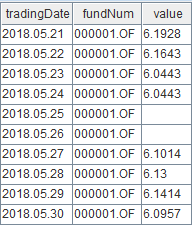
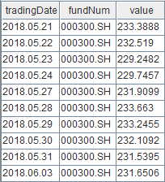

# DolphinDB vs. Python: Calculate Daily Metrics of Mutual Fund

Daily metrics, defined by daily net asset value of the fund, are commonly used to analyze the fund performance, such as returns, volatility, and risks, etc.

This tutorial chooses ten daily metrics, and demonstrates how to implement them in DolphinDB. We test the performance of DolphinDB and Python in calculating daily metrics based on data of 3000 funds. 

The results show that DolphinDB outperforms Python.

- [1. Environment Setup](#1-environment-setup)
- [2. Understanding Daily Metrics](#2-understanding-daily-metrics)
- [3. Implementation in DolphinDB](#3-implementation-in-dolphindb)
    - [3.1 Test Data](#31-test-data)
    - [3.2 Data Preparation](#32-data-preparation)
    - [3.3 Performance Test](#33-performance-test)
- [4. Implementation in Python](#4-implementation-in-python)
- [5. Performance Comparison](#5-performance-comparison)
- [6. Conclusion](#6-conclusion)
- [Appendices](#appendices)

## 1. Environment Setup

Install DolphinDB server first (deployed in [standalone mode](https://github.com/dolphindb/Tutorials_EN/blob/master/standalone_deployment.md)). The default port number is 8848.

**Hardware**

- OS: 64-bit CentOS Linux 7 (core)
- Memory: 500 GB
- CPU: x86_64（64 cores）

**Software**

- [DolphinDB](https://dolphindb.com/product#downloads): V2.00.7
- [DolphinDB GUI](https://dolphindb.com/product#client): V1.30.19.2
- [Python](https://www.python.org/) (including NumPy, pandas, SciPy libraries, and DolphinDB Python API): version 3.7.9

## 2. Understanding Daily Metrics

This chapter expounds the implementation of 10 daily metrics in DolphinDB and Python.

> **Note**:   
DailyValue: daily net asset value (NAV);  
DailyReturn: daily return;  
BeginningValue: the NAV at the start of the trading day;  
EndingValue: the NAV at the ending of the trading day.

**Annualized Rate of Return**

  - Meaning: It converts the current return to a rate of return on annual basis (based on 252 trading days).
  - Formula:

    
    
  - Implementation:

    - DolphinDB：

      ```sql
      defg getAnnualReturn(value){
            return pow(1 + ((last(value) - first(value))\first(value)), 252\730) - 1
      }
      ```

    - Python：

      ```python
      def getAnnualReturn(value):
          return pow(1 + ((value[-1] - value[0])/value[0]), 252/730)-1
      ```

**Annualized Volatility**
  
  - Meaning: It measures the price swings of a given fund for risk management.
  
  - Formula: 
  
    
    
  - Implementation:
  
    - DolphinDB：
  
      ```sql
      defg getAnnualVolatility(value){
      	return std(deltas(value)\prev(value)) * sqrt(252)
      }
      ```
  
    - Python：
  
      ```python
      def getAnnualVolatility(value):
          diff_value = np.diff(value)
          rolling_value = np.roll(value, 1)
          rolling_value = np.delete(rolling_value, [0])
          return np.std(np.true_divide(diff_value, rolling_value), ddof=1) * np.sqrt(252)
      ```
  
**Skewness**

  - Meaning: It measures the degree of asymmetry observed in a return distribution, and tells us if returns have been extreme or not.

  - Formula: 

    
    
  - Implementation:

    - DolphinDB：

      ```sql
      defg getAnnualSkew(value){
      	return skew(deltas(value)\prev(value))
      }
      ```

    - Python：

      ```python
      def getAnnualSkew(value):
          diff_value = np.diff(value)
          rolling_value = np.roll(value, 1)
          rolling_value = np.delete(rolling_value, [0])
          return st.skew(np.true_divide(diff_value, rolling_value))
      ```

**Kurtosis**
  
  - Meaning: It describes the "fatness" of the tails found in return distributions.
  
  - Formula: 
  
    
    
  - Implementation:
  
    - DolphinDB：
  
      ```sql
      defg getAnnualKur(value){
      	return kurtosis(deltas(value)\prev(value)) 
      }
      ```
  
    - Python：
  
      ```python
      def getAnnualKur(value):
          diff_value = np.diff(value)
          rolling_value = np.roll(value, 1)
          rolling_value = np.delete(rolling_value, [0])
          return st.kurtosis(np.true_divide(diff_value, rolling_value), fisher=False)
      ```
  
**Sharpe Ratio**
  
  - Meaning: It compares the return of a fund with its risk, indicating the additional amount of return that an investor receives per unit of increase in risk.
  
  - Formula:
  
    
    
  - Implementation:
  
    - DolphinDB：
  
      ```sql
      defg getSharp(value){
      	return (getAnnualReturn(value) - 0.03)\getAnnualVolatility(value) as sharpeRat
      }
      ```
  
    - Python：
  
      ```python
      def getSharp(value):
          return (getAnnualReturn(value) - 0.03)/getAnnualVolatility(value) if getAnnualVolatility(value) != 0 else 0
      ```
  
**Maximum Drawdown**
  
  - Meaning: It describes the maximum observed loss from a peak to a trough of a fund, before a new peak is attained.
  
  - Formula: For a given period, supposing that:
  
    *i* is a specific trading day, and *DailyValuei* is the NAV of day *i*;
    *j* is a specific day before *i*, and *DailyValuej* is the NAV of day *j*;
    For each *i*, the maximum drawdown of *j* can be calculated as:

    
    
  - Implementation:
  
    - DolphinDB：
  
      ```sql
      def getMaxDrawdown(value){
      	i = imax((cummax(value) - value) \ cummax(value))
      	if (i==0){
      		return 0
      	}
      	j = imax(value[:i])
      	return (value[j] - value[i]) \ (value[j])
      }
      ```
    
    - Python：
    
      ```python
      def getMaxDrawdown(value):
          i = np.argmax((np.maximum.accumulate(value) - value) / np.maximum.accumulate(value))
          if i == 0:
              return 0
          j = np.argmax(value[:i])
          return (value[j] - value[i]) / value[j]
      ```
  
**Drawdown**
  
  - Meaning: It refers to a peak-to-trough decline during a specific period for a fund.
  
  - Formula: 
  
    
    
  - Implementation:
  
    - DolphinDB：
  
      ```sql
      def getDrawdownRatio(value){
      	return getAnnualReturn(value) \ getMaxDrawdown(value)
      }
      ```
      
    - Python：
    
      ```python
      def getDrawdownRatio(value):
          return getAnnualReturn(value) / getMaxDrawdown(value) if getMaxDrawdown(value) != 0 else 0
      ```
  
**Beta(β)**
  
  - Meaning: A risk metric that meatures the volatility of a fund or security compared to the market as a whole.
  
  - Formula: 

    

    where:
    - numerator is the covariance of daily return and benchmark return;
    - denominator is the variance of daily benchmark return.
    
  - Implementation:
  
    - DolphinDB：
  
      ```sql
      def getBeta(value, price){
      	return covar(deltas(value)\prev(value), deltas(price)\prev(price)) \ std(deltas(price)\prev(price))
      }
      ```
  
    - Python：
  
      ```python
      def getBeta(value, price):
          diff_price = np.diff(price)
          rolling_price = np.roll(price, 1)
          rolling_price = np.delete(rolling_price, [0])
          diff_value = np.diff(value)
          rolling_value = np.roll(value, 1)
          rolling_value = np.delete(rolling_value, [0])
          return np.cov(np.true_divide(diff_value, rolling_value), np.true_divide(diff_price, rolling_price))[0][1] / np.std(np.true_divide(diff_price, rolling_price), ddof=1)
      ```
  
**Alpha (α)**
  
  - Meaning: A risk metric that indicates excess returns earned on an investment above the benchmark return.
  
  - Formula:
  
    
  
  - Implementation:
  
    - DolphinDB：
  
      ```sql
      def getAlpha(value, price){
      	return getAnnualReturn(value) - 0.03 - getBeta(value, price) * (getAnnualReturn(price) - 0.03)
      }
      ```
  
    - Python：
  
      ```python
      def getAlpha(value, price):
          return getAnnualReturn(value) - 0.03 - getBeta(value, price) * (getAnnualReturn(price) - 0.03)
      ```
  
**Hurst Exponent**
  
  - Meaning: It relates to the autocorrelations of the time series, which looks for cycles, patterns, and trends in fund prices that might repeat or reverse in the future.
  
  - Calculation logic: 
  
    1. Divide the data series (yield) into multiple shorter series based on different particle sizes (*k* =2,3,4,…,365);
  
    2. Calculate the average of each series (2+3+4+…+365 series in total);
  
    
  
    3. Create a mean-adjusted series, i.e., calculate the difference between each value (of yield) within the series and the mean;
  
    

    4. Calculate the range R<sub>k</sub> of each deviation X<sub>i</sub>, i.e., the difference of the maximum and minimum of X<sub>i</sub>;
  
    
  
    5. Calculate the standard deviation S<sub>k</sub> of each series;
  
    
  
    6. Calculate the rescaled range R/S and average over all the partial series;
  
    
  
    7. Find a regression equation, where k is the independent variable and *AVS* is the dependent variable. The estimated intercept *b* is the Hurst exponent;
  
    ​    ``AVS=a*k+b``
    
  - Implementation:
  
    - DolphinDB：
  
      ```sql
      def calAllRs2(mret, symList, k){
              rowCount = mret.rows()/k * k
              demeanCum = rolling(cumsum, mret[0:rowCount,] - each(stretch{, rowCount}, rolling(avg, mret, k, k)), k, k)
              a = rolling(max, demeanCum, k, k) - rolling(min, demeanCum, k, k)
              RS = nullFill!(a/rolling(stdp, mret, k, k), 1.0).mean().log()
              return table(symList as fundNum, take(log(k), symList.size()) as knum, RS as factor1)
      }
      ```
  
    - Python：
  
      ```python
      def calHurst(value_list, min_k):
          n = len(value_list)
          max_k = int(np.floor(n / 2))
          r_s_dict = []
          for k in range(min_k, max_k +1):
              subset_list = [value_list[i: i+k] for i in range(0, n, k)]
              if np.mod(n, k) > 0:
                  subset_list.pop()
              df_subset = np.array(subset_list)
              df_mean = df_subset.mean(axis=1).reshape(-1,1)
              df_cusum = (df_subset - df_mean).cumsum(axis=1)
              r = df_cusum.max(axis=1) - df_cusum.min(axis=1) + np.spacing(1)
              s = df_subset.std(axis=1, ddof=0) + np.spacing(1)
              r_s_dict.append({'R_S': (r / s).mean(), 'N': k})
          log_r_s=[]
          log_n=[]
          for i in range(len(r_s_dict)):
              log_r_s.append(np.log(r_s_dict[i]['R_S']))
              log_n.append(np.log(r_s_dict[i]['N']))
          try:
              res = np.polyfit(log_n, log_r_s, 1)[0]
          except:
              res = None
          return res
      ```

## 3. Implementation in DolphinDB

### 3.1 Test Data

We choose the daily NAV of 3,000 funds (from May 24th, 2018 to May 27th, 2021) with more than 3.3 million entries for the test. 

The CSI 300 Index (from 2018.05.24 to 2021.05.27), with a total of 734 records, is also used in the test to align with the daily NAV. 

Before implementing, we need to import test data (in the csv file) into DolphinDB dimension tables ("fund_OLAP" and "fund_hs_OLAP").

Table schema of "fund_OLAP":

  | Field Name      | Meaning     | Data Type |
  | ----------- | ------------ | --------------------- |
  | tradingDate | trading date     | DATE                  |
  | fundNum     | fund code | SYMBOL                |
  | value       | daily NAV   | DOUBLE                |

  Table schema of "fund_hs_OLAP":

  | Field Name      | Meaning                   | Data Type |
  | ----------- | --------------------------- | --------------------- |
  | tradingDate | trading date                    | DATE                  |
  | fundNum     | stock market index (CSI 300) | SYMBOL                |
  | value       | closing price             | DOUBLE                |

**Import Data**

To import data to DolphinDB dimension tables, we need to define functions to load the csv file first.

```
//get column names of csv files
def readColumnsFromWideCSV(absoluteFilename){
        schema1 = extractTextSchema(absoluteFilename)
        update schema1 set type = `STRING 
        allSymbol = loadText(absoluteFilename,,schema1)[0, 1:]
        titleSchema = extractTextSchema(absoluteFilename, skipRows = 0);
        for(x in allSymbol){
                testValue = exec x[name] from titleSchema
                testValue = testValue[1:]
        }
        return testValue
}
//read cotents of csv files
def readIndexedMatrixFromWideCSV(absoluteFilename){
        contracts = readColumnsFromWideCSV(absoluteFilename)
        dataZoneSchema = extractTextSchema(absoluteFilename, skipRows = 1)
        update dataZoneSchema set type = "DOUBLE" where name != "col0"
        update dataZoneSchema set type = "DATE" where name = "col0"
        dataZoneWithIndexColumn = loadText(absoluteFilename, skipRows = 1, schema = dataZoneSchema)
        indexVector = exec col0 from dataZoneWithIndexColumn
        dataZoneWithoutIndex = dataZoneWithIndexColumn[:, 1:]
        dataMatrix = matrix(dataZoneWithoutIndex)
        dataMatrix.rename!(indexVector, contracts)
        return dataMatrix
}
```
  
Rename the columns loaded from the csv file, and store them in DolphinDB in-memory tables.
  
```
//daily NAV
allSymbols = readColumnsFromWideCSV(csvPath)$STRING
dataMatrix = readIndexedMatrixFromWideCSV(csvPath)
fundTable = table(dataMatrix.rowNames() as tradingDate, dataMatrix)
result = fundTable.unpivot(`tradingDate, allSymbols).rename!(`tradingDate`fundNum`value)
  
//CSI 300
allSymbols1 = readColumnsFromWideCSV(csvPath1)$STRING
dataMatrix1 = readIndexedMatrixFromWideCSV(csvPath1)
fundTable1 = table(dataMatrix1.rowNames() as tradingDate, dataMatrix1)
result1 = fundTable1.unpivot(`tradingDate, allSymbols1).rename!(`tradingDate`fundNum`value)
```
  
Define a DFS database ("dfs://fund_OLAP") and two dimension tables ("fund_OLAP" and "fund_hs_OLAP"), and import the data.
  
```
//create a database
dbName = "dfs://fund_OLAP"
dataDate = database(, VALUE, 2021.01.01..2021.12.31)
symbol = database(, HASH, [SYMBOL, 20])
if(existsDatabase(dbName)){
	dropDatabase(dbName)
}
db = database(dbName, COMPO, [dataDate, symbol])
//define the table schema
name = `tradingDate`fundNum`value
type = `DATE`SYMBOL`DOUBLE
tbTemp = table(1:0, name, type)
//create dimension table "fund_OLAP"
tbName1 = "fund_OLAP"
db.createTable(tbTemp, tbName1)
loadTable(dbName, tbName1).append!(result)
//create dimension table "fund_hs_OLAP"
tbName2 = "fund_hs_OLAP"
db.createTable(tbTemp, tbName2)
loadTable(dbName, tbName2).append!(result1)
 ```
  
Check the first ten records of table "fund_OLAP".

```
select top 10 * from loadTable("dfs://fund_OLAP", "fund_OLAP")
```



Check the first ten records of table "fund_hs_OLAP".

```
select top 10 * from loadTable("dfs://fund_OLAP", "fund_hs_OLAP")
```



### 3.2 Data Preparation

After importing data, we perform an asof join on two tables and forward fill the null values in column "value". Only the data with the same trading date is kept in the joined table. 

```
fund_OLAP=select * from loadTable("dfs://fund_OLAP", "fund_OLAP")
fund_hs_OLAP=select * from loadTable("dfs://fund_OLAP", "fund_hs_OLAP")
ajResult=select tradingDate, fundNum, value, fund_hs_OLAP.tradingDate as hstradingDate, fund_hs_OLAP.value as price from aj(fund_OLAP, fund_hs_OLAP, `tradingDate)
result2=select tradingDate, fundNum, iif(isNull(value), ffill!(value), value) as value, price from ajResult where tradingDate == hstradingDate
```

Then, we calculate the daily return and Hurst exponent of all funds.

```
symList = exec distinct(fundNum) as fundNum from result2 order by fundNum
portfolio = select fundNum as fundNum, (deltas(value)\prev(value)) as log, tradingDate as tradingDate from result2 where tradingDate in 2018.05.24..2021.05.27 and fundNum in symList
m_log = exec log from portfolio pivot by tradingDate, fundNum
mlog =  m_log[1:,]
```

The result (with 2.2 million records) has the following schema:

| Field Name      | Meaning        | Data Type |
| ----------- | --------------- | --------------------- |
| tradingDate | trading date        | DATE                  |
| fundNum     | fund code    | SYMBOL                |
| value       | daily NAV      | DOUBLE                |
| price       | closing price (CSI 300) | DOUBLE                |
| log         | daily return    | DOUBLE                |

### 3.3 Performance Test

This section tests the performance of DolphinDB in relation to the number of jobs and CPU cores.

- the number of jobs: submit one or multiple jobs at one time;
- CPU cores: configured by the configuration parameter *workerNum* that indicates the size of the worker pool. Note that it takes effect only after a server reboot. 

The start time and end time of ``submitJob`` are taken to get the elapsed time of calculating daily metrics in DolphinDB. See full script in [Performance Test in DolphinDB]().

In the following test, we first define the function to calculate 9 metrics:

```
def getFactor(result2, symList){
  Return = select fundNum, 
  	          getAnnualReturn(value) as annualReturn,
  	          getAnnualVolatility(value) as annualVolRat,
  	          getAnnualSkew(value) as skewValue,
  	          getAnnualKur(value) as kurValue,
  	          getSharp(value) as sharpValue,
  	          getMaxDrawdown(value) as MaxDrawdown,
  	          getDrawdownRatio(value) as DrawdownRatio,
  	          getBeta(value, price) as Beta,
  	          getAlpha(value, price) as Alpha	
              from result2
              where TradeDate in 2018.05.24..2021.05.27 and fundNum in symList group by fundNum
}
```
  
- Calculating metrics

Define the function to get the elapsed time of calculating 10 metrics, and submit the job(s).

```
def parJob(){
    timer{fund_OLAP=select * from loadTable("dfs://fund_OLAP", "fund_OLAP")
    		fund_hs_OLAP=select * from loadTable("dfs://fund_OLAP", "fund_hs_OLAP")
    		ajResult = select tradingDate, fundNum, value, fund_hs_OLAP.tradingDate as hstradingDate, fund_hs_OLAP.value as price from aj(fund_OLAP, fund_hs_OLAP, `tradingDate)
    		result2 = select tradingDate, fundNum, iif(isNull(value), ffill!(value), value) as value,price from ajResult where tradingDate == hstradingDate
    		symList = exec distinct(fundNum) as fundNum from result2 order by fundNum
          symList2 = symList.cut(250)
    		portfolio = select fundNum as fundNum, (deltas(value)\prev(value)) as log, tradingDate as tradingDate from result2 where tradingDate in 2018.05.24..2021.05.27 and fundNum in symList
          m_log = exec log from portfolio pivot by tradingDate, fundNum
          mlog =  m_log[1:,]
          knum = 2..365
            }//The job is broken down into multiple tasks (250 funds for each).
     timer{ploop(getFactor{result2}, symList2)
          a = ploop(calAllRs2{mlog,symList}, knum).unionAll(false)
          res2 = select fundNum, ols(factor1, kNum)[0] as hist, ols(factor1, kNum)[1] as hist2, ols(factor1, kNum)[2] as hist3 from a group by fundNum}
  }//define the function to get the elapsed time of calculating 10 metrics
  /**
    * submit a single job
    */
  submitJob("parallJob1", "parallJob_single_ten", parJob)
    
  /**
    * submit 5 jobs
    */
  for(i in 0..4){
    submitJob("parallJob5", "parallJob_multi_ten", parJob)
  }
  ```
  
Obtain the elapsed time.
  
```
  //for a single job
  select max(endTime) - min(startTime) from getRecentJobs() where jobDesc = "parallJob_single_ten"
  //for five jobs
  select max(endTime) - min(startTime) from getRecentJobs() where jobDesc = "parallJob_multi_ten"
```

**Single job (in seconds)**

| CPU(s) | Elapsed time |
| ----- | ------------------------ |
| 1    | 26.03             |
| 6     | 7.23                      |
| 12    | 4.23                      |
  
**Five jobs (in seconds)**

| CPU(s) | Elapsed time |
| ----- | --------------|
| 1     | 140.50        |
| 6     | 27.53         |
| 12    | 15.66         |


> Upon further analysis, we can find that most of the elapsed time is spent on the calculation of the Hurst exponent. The calculation of the remaining nine factors takes only about 10% (even lower) of the total elapsed time. When calculating Hurst exponent, a time series of full length N (=730 in this test) is divided into a number of shorter time series of length n (=N/2, N/3, ...N/365). The average rescaled range is then calculated for each value of n. Compared with other 9 metrics, it takes longer to calculate Hurst exponent due to its complex calculation logic.

## 4. Implementation in Python

In this section, we implement the metric calculation using Python and conduct a performance test.
For Python, we import the ``Parallel`` method of ``joblib``, and modify its parameter *n_jobs* to configure CPU cores.

In the test, we first define the ``getLog()`` function to calculate daily return of funds and the ``main()`` function to calculate 10 daily metrics (which is implemented by functions in NumPy, pandas, and SciPy libraries).

```python
def getLog(value):
    diff_value = np.diff(value)
    rolling_value = np.roll(value, 1)
    rolling_value = np.delete(rolling_value, [0])
    return np.insert(np.true_divide(diff_value, rolling_value), 0, np.nan)

def main(li):
    value = np.array(li["value"])
    price = np.array(li["price"])
    log = np.array(li["log"])
    getAnnualReturn(value)
    getAnnualVolatility(value)
    getAnnualSkew(value)
    getAnnualKur(value)
    getSharp(value)
    getMaxDrawdown(value)
    getDrawdownRatio(value)
    getBeta(value, price)
    getAlpha(value, price)
    calHurst(log, 2)
```

We use Python API to connect to and load tables from DolphinDB, and use Python to prepare data. Print the elapsed time from loading data to calculating metrics.

```python
s = ddb.session()
s.connect("127.0.0.1", 8848, "admin", "123456")
start = time.time()
fund_OLAP = s.loadTable(dbPath="dfs://fund_OLAP", tableName="fund_OLAP").select("*").toDF().sort_values(['tradingDate'])
fund_hs_OLAP = s.loadTable(dbPath="dfs://fund_OLAP", tableName="fund_hs_OLAP").select("*").toDF()
fund_hs_OLAP.rename(columns={'tradingDate': 'hstradingDate'}, inplace=True)
fund_hs_OLAP = fund_hs_OLAP.sort_values(['hstradingDate'])
fund_dui_OLAP = pd.merge_asof(fund_OLAP, fund_hs_OLAP, left_on="tradingDate", right_on="hstradingDate").sort_values(['fundNum_x', 'tradingDate'])
fund_dui_OLAP = fund_dui_OLAP[fund_dui_OLAP['tradingDate'] == fund_dui_OLAP['hstradingDate']]
fund_dui_OLAP.reset_index(drop=True, inplace=True)
fund_dui_OLAP.drop(columns=['fundNum_y', 'hstradingDate'], inplace=True)
fund_dui_OLAP.columns = ['tradingDate', 'fundNum', 'value', 'price']
fund_dui_OLAP["log"] = pd.Series(getLog(fund_dui_OLAP["value"]))
list = fund_dui_OLAP[(fund_dui_OLAP['tradingDate'] >= datetime(2018, 5, 24)) & (fund_dui_OLAP['tradingDate'] <= datetime(2021, 5, 27))].groupby('fundNum')
Parallel(n_jobs=1)(delayed(main)(i) for _,i in list)
end = time.time()
print(end-start)
```

## 5. Performance Comparison

**Single job (in seconds)**

| CPU(s) | DolphinDB | Python    | Python/DolphinDB |
| ----- | -----------| ----------| -----------------|
| 1    | 26.03       | 112.34    | 4.32             |
| 6     | 7.23       | 55.35     | 7.66             |
| 12    | 4.23       | 36.19     | 8.56             |
  
**Five jobs (in seconds)**

| CPU(s) | DolphinDB | Python    | Python/DolphinDB |
| ----- | --------------------- | ------------------ | --------------------------- |
| 1   | 140.49        | 511.89                      | 3.64 |
| 6     | 27.52         | 226.45       | 8.22                   |
| 12    | 15.66                          | 224.80       | 14.35                      |

> The above charts only display part of the results.

We can see from the results that DolphinDB is on average over 10 times faster than Python, with a maximum of 14 times. The reasons why DolphinDB outperforms Python lie in: 

- Powerful array programming: DolphinDB optimizes its vectorized operations for streaming engines, which shows an outstanding performance. In contrast, Python, as an interpreted language, has to run through a program line by line and execute each command, which is relatively slower.
- Rich built-in functions: DolphinDB provides over 1,000 built-in functions. Compared with Python, functions defined for daily metrics in DolphinDB feature simpler code and fewer nested levels.
- Built-in engines for distributed storage: The OLAP/TSDB storage engine in DolphinDB can store data in DFS databases with different partitioning schemes. The design of such storage engine makes it easier to load data from databases when calculating metrics; Python, which needs to load data from external data warehouses, delivers relatively slower performance in loading data.

## 6. Conclusion

In this tutorial, we perform a detailed comparison of DolphinDB and Python in calculating daily metrics, and analyze the differences between them. 

Through the detailed discussion in chapter 5, we can draw a conclusion that DolphinDB gives a superior performance over Python, due to its powerful array programming, rich built-in functions, and storage engines.

### Appendices

[Test Data](https://www.dolphindb.com/downloads/docs/fund_factor_contrasted_by_py.zip)

[Data Preparation for DolphinDB](script/ddb_vs_py_daily_metrics/fund_data_load.txt)

[Performance Test for DolphinDB](script/ddb_vs_py_daily_metrics/fund_factor_ddb.txt)

[Performance Test for Python](script/ddb_vs_py_daily_metrics/fund_factor.py)
