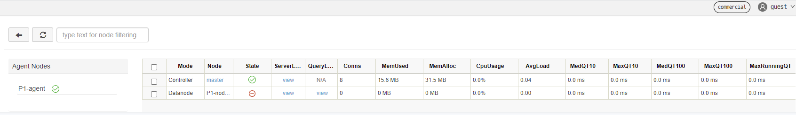
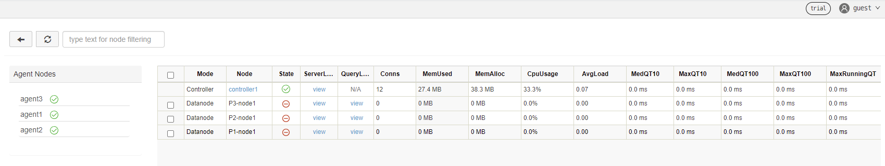
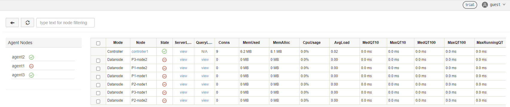

# DolphinDB Multi-Container Deployment With Docker Compose

Docker Compose is a tool for defining and running multi-container Docker applications. This tutorial introduces how to use Docker Compose to deploy DolphinDB clusters on multiple containers.

- [Prerequisites and Environment Setup](#prerequisites-and-environment-setup)
- [Cluster Architecture](#cluster-architecture)
- [Quick Starts (Single-Server Deployment)](#quick-starts-single-server-deployment)
- [Production Environment (Single-Server High-Availability Deployment)](#production-environment-single-server-high-availability-deployment)
  - [Prerequisites](#prerequisites)
  - [Procedures](#procedures)
- [Production Environment (Multi-Server High-Availability Deployment)](#production-environment-multi-server-high-availability-deployment)
  - [Prerequisites](#prerequisites-1)
  - [Procedures](#procedures-1)
- [FAQ](#faq)
  - [How to upgrade DolphinDB version?](#how-to-upgrade-dolphindb-version)
  - [Errors and Solutions](#errors-and-solutions)

## Prerequisites and Environment Setup

- Install Docker

Install [Docker](https://www.docker.com/products/docker-desktop/) on Linux/Mac OS/Windows.

- Install Docker Compose

We recommend you to download the compiled binary of Docker Compose from [the official release](https://github.com/docker/compose/releases). See Install [Docker Compose CLI](https://docs.docker.com/compose/reference/) for installation instructions.

- Host Information
  - single server:

| **Host**  | **IP**       | **Docker Service** | **Mount Point** |
| :-------- | :----------- | :----------------- | :-------------- |
| cnserver9 | xx.xx.xx.122 | dolphindb          | /ddbdocker      |

  - multiple servers:

| **Host** | **IP**      | **Docker Service**                     | **Mount Point** |
| :------- | :---------- | :------------------------------------- | :-------------- |
| host1    | xx.xx.xx.81 | dolphindb controller1&dolphindb agent1 | /host1          |
| host2    | xx.xx.xx.82 | dolphindb controller2&dolphindb agent2 | /host2          |
| host3    | xx.xx.xx.83 | dolphindb controller3&dolphindb agent3 | /host3          |

## Cluster Architecture

A DolphinDB cluster consists of 4 types of nodes: controller, agent，data node, and compute node.

- **Controller**: The controller(s) are the core of a DolphinDB cluster. They collect heartbeats of agents and data nodes, monitor the status of each node, and manage metadata and transactions of the distributed file system. There is only one controller in a DolphinDB cluster (except a high-availability one).
- **Agent**: An agent executes the commands issued by a controller to start/stop local data nodes. Each physical server has only one agent within a cluster to enable/disable the data node(s).
- **Data node**: Data is stored and queries (or more complex computations) are executed on data nodes. A physical server can be configured with multiple data nodes.
- **Compute node**: The compute node is used for queries and computation, including historical data queries, distributed joins, batch processing, streaming, and machine learning model training. A physical server can be configured with multiple compute nodes. Since data is not stored on a compute node, you can use `loadTable` to load data from a data node to a compute node for computational work. On a compute node, you can create the database and partitioned tables, and write data to the partitioned tables by calling a write interface. However, writing data on a compute node will lead to more network overhead than a data node as the compute node need to send data to data nodes for storage.

**Note**:

- Any data node or compute node can be used as a client for data access, while a controller is only used for cluster management and coordination.
- The IP address of a node must be an intranet IP. If an external network address is used, the network communication performance among nodes may be unstable. Inter-container communication is usually enabled by connecting the containers to a bridge network and assigning an IP address to each container.

## Quick Starts (Single-Server Deployment)

The following example shows how to deploy a DolphinDB cluster using image `dolphindb/dolphindb:v2.00.5` with Docker Compose. The DolphinDB image is the community edition of v2.00.5. As the community license limits the number of data nodes in a cluster, the following example deploys a cluster with 2 containers (one is a controller and the other contains an agent and a data node).

- Log in the server and execute the following commands:

```
git clone https://github.com/dolphindb/dolphindb-k8s
cd dolphindb_k8s/docker-compose/ddb_cluster_quick && docker-compose up -d
```

Expected output:

```
[+] Running 2/2
 ⠿ ddb_controller Pulled                                                                                                 4.5s
 ⠿ ddb_agent1 Pulled                                                                                                     4.4s
[+] Running 3/3
 ⠿ Network dev_ddb           Created                                                                                     0.1s
 ⠿ Container ddb_controller  Started                                                                                     0.5s
 ⠿ Container ddb_agent1      Started                                                                                     0.8s
```

- Enter "IP:port" (where port is 8900) in your browser and the page shows:



## Production Environment (Single-Server High-Availability Deployment)

### Prerequisites

This chapter will deploy a high-availability cluster with multiple controllers and data nodes on multiple containers of a single server using image `dolphindb/dolphindb:v2.00.5`. You can download a high-availability cluster with three controllers and three data nodes using Docker Compose. Note that an enterprise license is required to deploy a high-availability cluster.

### Procedures

Log in the server and execute the following commands:

```
git clone https://github.com/dolphindb/dolphindb-k8s
```

Then check the tree-structured directory:

```
cd dolphindb-k8s/docker-compose/ddb_high_cluster && tree ./
```

Expected output:

```
./
├── cfg
│   ├── agent1.cfg
│   ├── agent2.cfg
│   ├── agent3.cfg
│   ├── cluster.cfg
│   ├── cluster.nodes
│   ├── controller1.cfg
│   ├── controller2.cfg
│   └── controller3.cfg
├── cluster
│   ├── agent
│   │   ├── data
│   │   └── log
│   └── controller
│       ├── data
│       └── log
├── docker-compose.yml
└── dolphindb.lic

8 directories, 10 files
```

The files/folders are explained below:

| **File/Folder**    | **Description**                                              | **Directory of Host**                                        | **Directory of Container**                                   |
| :----------------- | :----------------------------------------------------------- | :----------------------------------------------------------- | :----------------------------------------------------------- |
| docker-compose.yml | defining services, networks, and volumes for a Docker application | None                                                         | None                                                         |
| dolphindb.lic      | license file of DolphinDB                                    | ./dolphindb.lic                                              | /data/ddb/server/dolphindb.lic                               |
| cfg                | storing the configuration files of nodes                     | ./cfg/agent1.cfg; ./cfg/agent2.cfg; ./cfg/agent3.cfg; ./cfg/cluster.cfg; ./cfg/cluster.nodes; ./cfg/controller1.cfg; ./cfg/controller2.cfg; ./cfg/controller3.cfg | /data/ddb/server/clusterDemo/config/agent1.cfg; /data/ddb/server/clusterDemo/config/agent2.cfg; /data/ddb/server/clusterDemo/config/agent3.cfg; /data/ddb/server/clusterDemo/config/cluster.cfg; /data/ddb/server/clusterDemo/config/cluster.nodes; /data/ddb/server/clusterDemo/config/controller1.cfg; /data/ddb/server/clusterDemo/config/controller2.cfg; /data/ddb/server/clusterDemo/config/controller3.cfg; |
| cluster            | storing DolphinDB data and logs                              | ./cluster/controller/data; ./cluster/controller/log; ./cluster/agent/data; ./cluster/agent/log | /data/ddb/server/clusterDemo/data; /data/ddb/server/clusterDemo/log |

Start Docker Compose service:

```
docker-compose up -d
```

Expected output:

```
[+] Running 7/7
 ⠿ Network dev_ddb            Created                                                                                    0.2s
 ⠿ Container ddb_controller3  Started                                                                                    1.0s
 ⠿ Container ddb_controller1  Started                                                                                    1.0s
 ⠿ Container ddb_controller2  Started                                                                                    0.9s
 ⠿ Container ddb_agent3       Started                                                                                    1.9s
 ⠿ Container ddb_agent1       Started                                                                                    1.9s
 ⠿ Container ddb_agent2       Started                                                                                    1.8s
```

Enter "IP:port" (where port is 8901) in your browser and the page shows:



Click the "guest" → "Log in" button in the upper right corner, and enter username "admin" and password "123456" to start the container services. See [DolphinDB High-availability Cluster Deployment](./ha_cluster_deployment.md) and [Docker Documentation ](https://docs.docker.com/compose/compose-file/)for detailed instructions.

**Note**: For the single-node high-availability cluster deployed in this chapter, IP addresses within the virtual network domain are assigned to nodes. The cluster cannot be scaled out to a multi-node high-availability cluster. 

## Production Environment (Multi-Server High-Availability Deployment)

### Prerequisites

This chapter will deploy a high-availability cluster with multiple controllers and data nodes on multiple containers of multiple servers using image dolphindb/dolphindb:v2.00.5. You can download a high-availability cluster with three controllers and three data nodes with Docker Compose. Note that an enterprise license is required to deploy a high-availability cluster.

### Procedures

Copy DolphinDB image by executing the following commands on each node:

- host1:

```
git clone https://github.com/dolphindb/dolphindb-k8s  \
&& cd dolphindb_k8s/docker-compose/ddb_high_cluster_multi_machine/host1
```

- host2:

```
git clone https://github.com/dolphindb/dolphindb-k8s  \
&& cd dolphindb_k8s/docker-compose/ddb_high_cluster_multi_machine/host2
```

- host3:

```
git clone https://github.com/dolphindb/dolphindb-k8s  \
&& cd dolphindb_k8s/docker-compose/ddb_high_cluster_multi_machine/host3
```

Then check the tree-structured directory:

```
tree ./
```

Expected output:

- host1:

```
./
├── cfg
│   ├── agent1.cfg
│   ├── cluster.cfg
│   ├── cluster.nodes
│   └── controller1.cfg
├── cluster
│   ├── agent
│   │   ├── data
│   │   └── log
│   └── controller
│       ├── data
│       └── log
├── docker-compose.yml
└── dolphindb.lic

8 directories, 6 files
```

- host2:

```
./
├── cfg
│   ├── agent2.cfg
│   ├── cluster.cfg
│   ├── cluster.nodes
│   └── controller2.cfg
├── cluster
│   ├── agent
│   │   ├── data
│   │   └── log
│   └── controller
│       ├── data
│       └── log
├── docker-compose.yml
└── dolphindb.lic

8 directories, 6 files
```

- host3:

```
./
├── cfg
│   ├── agent3.cfg
│   ├── cluster.cfg
│   ├── cluster.nodes
│   └── controller3.cfg
├── cluster
│   ├── agent
│   │   ├── data
│   │   └── log
│   └── controller
│       ├── data
│       └── log
├── docker-compose.yml
└── dolphindb.lic

8 directories, 6 files
```

The files/folders are explained below:

| **File/Folder**    | **Description**                                              | **Directory of Host**                                        | **Directory of Container**                                   |
| :----------------- | :----------------------------------------------------------- | :----------------------------------------------------------- | :----------------------------------------------------------- |
| docker-compose.yml | defining services, networks, and volumes for a Docker application | none                                                         | none                                                         |
| dolphindb.lic      | license file of DolphinDB                                    | ./dolphindb.lic                                              | /data/ddb/server/dolphindb.lic                               |
| cfg                | storing the configuration files of nodes                     | ./cfg/agent1.cfg; ./cfg/agent2.cfg; ./cfg/agent3.cfg; ./cfg/cluster.cfg; ./cfg/cluster.nodes; ./cfg/controller1.cfg; ./cfg/controller2.cfg; ./cfg/controller3.cfg | /data/ddb/server/clusterDemo/config/agent1.cfg; /data/ddb/server/clusterDemo/config/agent2.cfg; /data/ddb/server/clusterDemo/config/agent3.cfg; /data/ddb/server/clusterDemo/config/cluster.cfg; /data/ddb/server/clusterDemo/config/cluster.nodes; /data/ddb/server/clusterDemo/config/controller1.cfg; /data/ddb/server/clusterDemo/config/controller2.cfg; /data/ddb/server/clusterDemo/config/controller3.cfg; |
| cluster            | storing DolphinDB data and logs                              | ./cluster/controller/data; ./cluster/controller/log; ./cluster/agent/data; ./cluster/agent/log | /data/ddb/server/clusterDemo/data; /data/ddb/server/clusterDemo/log |

The node and container information is shown below:

| **Container Name (Unique)** | **Node Type**     | **Host IP** | **Node Name, Type, Port**                |
| :-------------------------- | :---------------- | :---------- | :--------------------------------------- |
| ddb_controller1             | controller        | xx.xx.xx.81 | controller1,controller,8901              |
| ddb_controller2             | controller        | xx.xx.xx.82 | controller2,controller,8902              |
| ddb_controller3             | controller        | xx.xx.xx.83 | controller3,controller,8903              |
| ddb_agent1                  | agent & data node | xx.xx.xx.81 | agent1,agent,8904 P1-node1,datanode,8905 |
| ddb_agent2                  | agent & data node | xx.xx.xx.82 | agent2,agent,8906 P2-node1,datanode,8907 |
| ddb_agent3                  | agent & data node | xx.xx.xx.83 | agent3,agent,8908 P3-node1,datanode,8909 |

**Note**:

- The file mapping process overwrites the containers with the files on the host machine. It’s necessary to confirm whether to keep the data, logs and configuration files when creating a container.
- To ensure the communication among host machines and containers, you can modify the host IP. For the configuration of IP addresses for each server, see [DolphinDB Multi-Machine Cluster Deployment](./multi_machine_cluster_deploy.md)

Start Docker Compose service by executing the following command on each server (where the *docker-compose.yml* resides):

```
docker-compose up -d
```

Expected output:

- host1:

```
[+] Running 3/3
 ⠿ Network dev_ddb            Created                                                                                0.1s
 ⠿ Container ddb_controller1  Started                                                                                1.7s
 ⠿ Container ddb_agent1       Started                                                                                3.3s
```

- host2:

```
[+] Running 3/3
 ⠿ Network dev_ddb            Created                                                                                0.1s
 ⠿ Container ddb_controller2  Started                                                                                1.4s
 ⠿ Container ddb_agent2       Started                                                                                3.2s
```

- host3:

```
[+] Running 3/3
 ⠿ Network dev_ddb            Created                                                                                0.1s
 ⠿ Container ddb_controller3  Started                                                                                1.7s
 ⠿ Container ddb_agent3       Started                                                                                3.4s
```

Enter "IP:port" (where port is 8901) in your browser and the page shows:



Click the "guest" → "Log in" button in the upper right corner, and enter username "admin" and password "123456" to start the container services. See [DolphinDB High-availability Cluster Deployment](./ha_cluster_deployment.md)  and [Docker Documentation ](https://docs.docker.com/compose/compose-file/)for detailed instructions.

## FAQ

### How to upgrade DolphinDB version?

For example, to upgrade the DolphinDB image to version `dolphindb/dolphindb:v2.00.6`:

To upgrade all containers, go to the *.env* file under the same directory as *docker-compose.yml* and modify the environment variables:

```
IMAGE=dolphindb/dolphindb:v2.00.6
```

Execute the following command and restart the services:

```
docker-compose down && docker-compose up -d
```

Expected output:

```
[+] Running 7/7
 ⠿ Container ddb_agent3       Removed                                                                                    1.6s
 ⠿ Container ddb_agent1       Removed                                                                                    1.6s
 ⠿ Container ddb_agent2       Removed                                                                                    1.3s
 ⠿ Container ddb_controller1  Removed                                                                                    2.7s
 ⠿ Container ddb_controller2  Removed                                                                                    2.6s
 ⠿ Container ddb_controller3  Removed                                                                                    2.6s
 ⠿ Network dev_ddb            Removed                                                                                    0.1s
```

### Errors and Solutions

If the following error message is reported:

```
but no declaration was found in the volumes section.
```

It indicates that the data volume is not declared or that a relative path is not used to map the data volume.

**Solution**: Configure the data volume in the yaml file and use a relative path for file mapping.