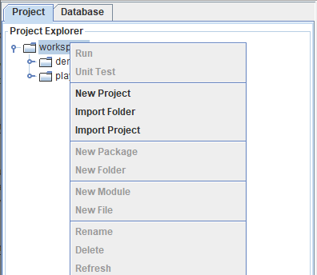
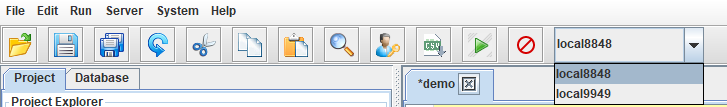
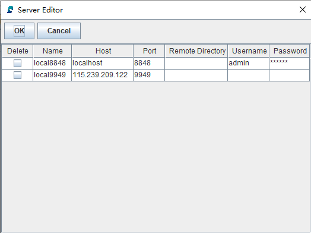
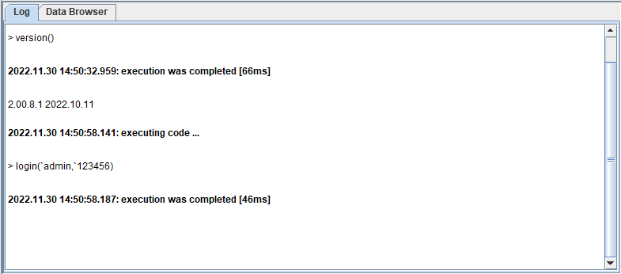

# DolphinDB GUI 

DolphinDB GUI is a full-fledged graphical interface based on Java for programming and data-browsing. It can be used on any operating system that supports Java, such as Windows, Linux, and Mac. The GUI is fast and user-friendly. You can use it to manage and develop DolphinDB scripts and modules, interact with databases, and check the execution results of these scripts.

- [DolphinDB GUI](#dolphindb-gui)
  - [Features](#features)
  - [1. Getting Started](#1-getting-started)
    - [1.1 Prerequisites](#11-prerequisites)
    - [1.2 Download and Launch the GUI](#12-download-and-launch-the-gui)
  - [2. Work With GUI](#2-work-with-gui)
    - [2.1 Create Workspace and Project](#21-create-workspace-and-project)
    - [2.2 Connect to Servers](#22-connect-to-servers)
    - [2.3 Execute Scripts](#23-execute-scripts)
    - [2.4 View Variables and Databases](#24-view-variables-and-databases)
  - [See Also](#see-also)


## Features
- Text search and replacement
- Line number display 
- Code highlighting
- Code completion for built-in functions
- Documentation hints, parameter hints for built-in functions
- Server connection management
- Variables browser
- Database browser 


## 1. Getting Started

### 1.1 Prerequisites

- Install 64-bit Java version

Java Runtime Environment (JRE) 8 or above is required to run the GUI. Download JRE 8 at https://www.oracle.com/java/technologies/downloads/ and install 64-bit Java version.

Use command `java -version` to check the version. Below is an example of a compatible version:

```
java -version
​
java version "1.8.0_121"
Java(TM) SE Runtime Environment (build 1.8.0_121-b13)
Java HotSpot(TM) 64-Bit Server VM (build 25.121-b13, mixed mode)
```

The GUI cannot start properly if the following information is shown:

```
Java HotSpot(TM) Client VM
```

- Add Java to your system path

### 1.2 Download and Launch the GUI

(1) Download the DolphinDB GUI from http://www.dolphindb.com/downloads/.

(2) Unzip to a local folder.

(3) Start a DolphinDB server first, then launch the GUI under the local folder.

- Windows: Double click *gui.bat*;

- Linux: Execute the following command:


```
  $ chmod +x gui.sh
  $ ./gui.sh
```

- Mac: Execute the following command:

```
  $ chmod +x gui.sh
  $ ./gui.sh
```

## 2. Work With GUI

### 2.1 Create Workspace and Project

When initializing the GUI, you will be asked to specify the workspace directory for project management. 

There can be multiple projects under a single workspace. Note that a user can only use one workspace at a time. After specifying the workspace directory, right-click your new workspace in the **Project Explorer** panel. You can either create a new project by clicking **New Project**, or import an existing project by clicking **Import Folder**.

 

After creating a project, click the node before your new project in the **Project Explorer** panel, and you will see 2 folders: modules and scripts. Right-click the **scripts** folder, and add sub-folders and scripts by clicking **New Folder** and **New File**. After a script is created, you can write, modify, or execute DolphinDB scripts in GUI's editor.

 

### 2.2 Connect to Servers

The **Server** in GUI menu refers to DolphinDB server.

- Click **Server** and then select **Add Server** to add a server in the pop-up dialog. A default server already exists at port 8848 on localhost.

 
</br>


Once a server is added, it appears in the drop-down menu in the toolbar.

 

- To manage (edit or delete) servers, click **Server** and then select **Edit Server**. Double-click the field to modify, or click the checkbox to delete certain server. To connect to a specific server, select it in the drop-down menu.

 

The GUI provides 3 ways to login:

- Specify the username and password when adding server connection, and you will be automatically logged in every time you use this connection.
- Click on  in tool bar to specify username and password after you choose a connection.
- Run `login()` function in **Editor** after you choose a connection. 

### 2.3 Execute Scripts

In the GUI's editor, you can select part of the code, then use keyboard shortcut `Ctrl + E` to send the code to the DolphinDB server for execution. If no code is selected, the GUI offers 2 execution modes:

- The line where the current cursor is on will be sent to DolphinDB server for execution
- The whole script will be sent to DolphinDB server for execution 

Click **File** and then select **Preferences** to switch the execution mode in the pop-up dialog. 

After code is executed, the output or error message is displayed in the **Log** tab, along with execution start time, end time, and running time.



If the final statement executed returns a vector, matrix or table, the result will be displayed in the form of a table in the **Data Browser** tab. 


### 2.4 View Variables and Databases

You can view all variables in tree view of **Variable Explorer**.

 

If a variable is a vector, matrix or table, double-click it to check the complete data in the data browser.

 

View schemata of all DFS databases and their partition tables under **Database Explorer**. 

## See Also

For detailed instructions on DolphinDB's client tools, see [Client User Guide](https://dolphindb.com/gui_help/index.html).
