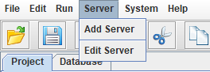

# DolphinDB GUI 

DolphinDB GUI is a full-fledged graphical interface based on Java for programming and data-browsing. It can be used on any operating system that supports Java, such as Windows, Linux, and Mac. The GUI is fast, functional, and user-friendly. It is suitable for managing and developing DolphinDB scripts and modules, interacting with database, and checking execution results.

- [DolphinDB GUI](#dolphindb-gui)
  - [Features](#features)
  - [Getting Started](#getting-started)
    - [1. Download GUI and Java](#1-download-gui-and-java)
    - [2. Launch GUI](#2-launch-gui)
    - [3. Setup Workspace and project, develop DolphinDB scripts](#3-setup-workspace-and-project-develop-dolphindb-scripts)
    - [4. Connect to servers](#4-connect-to-servers)
    - [5. Execute code](#5-execute-code)
    - [6. View variables and databases](#6-view-variables-and-databases)
  - [User Manual](#user-manual)


## Features
- Text search and replacement
- Line number display 
- Code highlighting
- Code completion for built-in functions
- Documentation hints, parameter hints for built-in functions
- Server connection management
- Variables browser
- Database browser 


## Getting Started

### 1. Download GUI and Java
You can download GUI from [here](https://www.dolphindb.com/downloads/DolphinDB_GUI_V1.30.15.zip).  
Java Runtime Environment (JRE) 8 or above is required to run the GUI. You can download JRE 8 at https://www.java.com/en/download. For the specific requirements of Java version, please see Common reasons why GUI fails to start in Chap 2.


### 2. Launch GUI

Unzip the downloaded file to a local folder, and go to gui.2021.12.30.15 sub-directory. On Windows, double click gui.bat to launch the DolphinDB GUI. On Linux/Mac, run the following command in the terminal: 

``` 
cd /your/gui/folder
./gui.sh 
```

**Common reasons why GUI fails to start**

If the GUI fails to start, it may be due to one of the following:
- Java not installed. 
- Java not added to system path. Check *Path* environment variable
- Unsupported Java version. Note that only 64-bit version is supported. Use the command `java -version` to check the version.

Below is an example of a compatible version:

```
java -version

java version "1.8.0_121"
Java(TM) SE Runtime Environment (build 1.8.0_121-b13)
Java HotSpot(TM) 64-Bit Server VM (build 25.121-b13, mixed mode)
```

The GUI cannot start properly if the following information is shown:

```
Java HotSpot(TM) Client VM
```

### 3. Setup Workspace and project, develop DolphinDB scripts

After starting the GUI, please first specify the workspace directory for project management. Note that a user can only use one workspace at the same time, and there can be multiple projects under a single workspace.

After specifying the workspace directory, right-click your new workspace in the *Project Explorer* panel. You can either create a new project by clicking *New Project* or import an existing project by clicking *Import Folder*.

 

Click the icon before a project to expand in the *Project Explorer* panel, and you will see 2 folders: *modules* and *scripts*. Right-click the *scripts* folder, and you can add sub-folders and scripts by clicking *New Folder* and *New File*. After a script is created, you can write, modify, or execute DolphinDB code in GUI’s editor. 

 

### 4. Connect to servers

The *Server* in GUI menu refers to the DolphinDB server. You can add or manage server connections. Click *Server* and *Add Server* to open a new dialog to add a new server. There is a default server called 'local8848', which points to port 8848 of localhost.   

 


Once added, the server will appear in drop-down menu in the toolbar. To connect to a specific server, choose that server in the menu.

 

To edit or delete servers, click *Edit Server*. Double-click the field to make modifications, or click the checkbox to delete a server.

 


### 5. Execute code

You can select part of the code, then press `Ctrl + E` to send the code to the DolphinDB Server for execution. If no code is selected,  you can click File and Preferences to choose the execution mode you prefer:

- The line where the current cursor is on will be sent to DolphinDB server for execution
- The whole script will be sent to DolphinDB server for execution 

You can find the output or error message in the Log Browser Panel, along with execution start time, end time, and elapsed time.


If the final statement executed returns a vector, matrix or table, the result will be displayed in the form of a table in the *Data Browser* panel. 


### 6. View variables and databases

You can view all variables in the *Variable Explorer* panel.

 

If the variable is a vector, matrix, or table, double-click it and a data browser window will pop up.

 

You can also view the column names and data types of all DFS  tables  on the server under *Database Explorer*. 

## User Manual

For details on the GUI features, please refer to [DolphinDB GUI Manual](https://dolphindb.com/gui_help/index.html).
