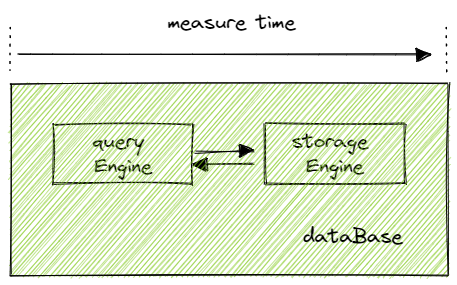

# Cases for IoT: Query the Time-series Data

- [Cases for IoT: Query the Time-series Data](#cases-for-iot-query-the-time-series-data)
  - [Introduction](#introduction)
  - [Data Preparation](#data-preparation)
    - [Dataset](#dataset)
    - [Creating the Database and Table](#creating-the-database-and-table)
  - [SQL Query](#sql-query)
  - [Comparison](#comparison)
    - [Environment](#environment)
    - [Results](#results)
  - [Conclusion](#conclusion)
  - [Appendices](#appendices)


## Introduction

The Internet of things (IoT) describes the network of physical objects (or groups of such objects) with sensors, processing ability, software and other technologies that connect and exchange data with other devices and systems over the Internet or other communications networks. 

The query performance is measured by two main indicators, throughput and latency.
This tutorial demonstrates DolphinDB's query performance in IIoT (Industrial Internet of Things) applications and compares the latency of its TSDB engine, OLAP engine, and ClickHouse MergeTree engine in querying the IIoT data. Specifically,
- the latest record of a device;
- the latest record for all devices of a tenant;
- the statistics of a device for the last 5 minutes;
- data (in seconds) of a device for the last day.

The results show that the DolphinDB TSDB engine outperforms the DolphinDB OLAP engine and the ClickHouse MergeTree engine.

## Data Preparation

### Dataset

This tutorial uses simulated data based on an IIoT SaaS platform provider whose main business is noise monitoring. Each record (occupying 36 bytes) contains six columns: tenant ID, device ID, sound pressure, sound power, timestamp, and date. 

The table schema is as follows:

| **Name**           | **Type**  | **Meaning**  |
| ------------------ | --------- | ------- |
| tenantId           | INT       | tenant ID    |
| deviceId           | INT       | device ID   |
| soundPressureLevel | DOUBLE    | sound pressure    |
| soundPowerLevel    | DOUBLE    | sound power   |
| ts                 | TIMESTAMP | timestamp of data collection|
| date               | DATE      | date      |

The dataset consists of 100 tenants, each managing 100 noise monitoring devices. 1.2 billion records are collected from 2022-01-01 to 2022-01-12, for a total of 40G.

### Creating the Database and Table

We first create a TSDB database named NoiseDB. TSDB engine is a storage engine specially designed for IoT scenarios since DolphinDB version 2.00, which features excellent write and query performance.

In a SaaS service for noise monitoring, for each tenant, data collected from a device on a given day is frequently queried. Therefore, we create a table partitioned by date and tenant ID, which can make effective use of [partition pruning](https://www.dolphindb.com/help200/DatabaseandDistributedComputing/DatabaseOperations/Queries.html). With device ID and timestamps as sort keys, the required data can be quickly located, thus improving the query performance.

```python
db1 = database(,VALUE,1000..2000) 
db2  = database(, VALUE, 2022.01.01..2022.12.30) 

// TSDB for iot 
dbNoise = database("dfs://NoiseDB",COMPO,[db1,db2], engine="TSDB") 

create table "dfs://NoiseDB"."noise"(
    tenantId INT,
    deviceId INT,
    soundPressureLevel INT,
    soundPowerLevel DOUBLE,
    ts TIMESTAMP,
    date DATE
)
partitioned by tenantId, date
sortColumns=[`deviceId,`ts]
```

After the database and table are created, we simulate the data from 2022-01-01 to 2022-01-12, see [DolphinDB script](script/iot_query_case/Noise_V3.dos) for the detailed code.

Check the number of records with the following SQL statement:

```sql
select count(*) from  loadTable(database("dfs://NoiseDB"),"noise") where date between 2022.01.01:2022.01.102> 1260010000
```

Only three level files (< 10 ) are generated at level 0 under each partition, we need to trigger the compaction manually.

```sql
chunkIds = exec chunkId from getChunksMeta() where type=1
for (x in chunkIds) {
  triggerTSDBCompaction(x)
}
```

Then export the data to a csv file for subsequent operations in the OLAP engine, and ClickHouse. For ClickHouse, use OPTIMIZE TABLE for table “noise” of mergeTree engine. See [ClickHouse script](script/iot_query_case/ck.sql) for details.

## SQL Query

- Case 1: Query last 100 records of a device.

```python
noise = loadTable(database("dfs://NoiseDB"),"noise")
select * from noise 
where date=2022.01.01 and tenantId=1055 and deviceId=10067
order by ts desc
limit 100

# timer(10) select ...
Time elapsed: 24.33 ms
```

We specify the partitioning columns “date” and “tenantId” as the filtering conditions in the `where` clause, with which the corresponding partition can be located quickly. The sort key (deviceId) is also specified as the filtering condition, with which the data block can be located based on the index and the latest 100 records can be retrieved in chronological order. On average, a query takes **2 ms**, and the first query takes **14ms**.

**Note**: The first query refers to the query that do not cause cache hits on database and operating system.

- Case 2: Query latest records for all devices of a tenant.

```python
noise = loadTable(database("dfs://NoiseDB"),"noise")
select * from noise 
where date=2022.01.01 and tenantId=1055
context by deviceId
csort ts desc
limit 1

# timer(10) select ...
Time elapsed: 246.619 ms
```

Similar to the case 1, the partitioning columns “date” and “tenantId” are also specified as the filtering conditions in the `where` clause to quickly locate the partitions. The data is grouped by device ID using `context by`, and each group is sorted in reverse chronological order with `csort` (considering that the IoT data can be out-of-order). Use `limit 1` to get the latest record in each group to track the latest status of all devices for that tenant on that day. On average, a query takes **25 ms**, and the first query takes **121 ms**.

- Case 3: Query the sound pressure of a device for the last 5 minutes.

```python
noise = loadTable(database("dfs://NoiseDB"),"noise")
select
     min(ts) as startTs,
     max(ts) as endTs,
     max(soundPressureLevel),
     avg(soundPressureLevel),
     max(soundPowerLevel), 
     avg(soundPowerLevel) 
from noise
where date=2022.01.01 and tenantId=1055 and deviceId=10067 and ts between 2022.01.01T00:50:15.518:2022.01.01T00:55:15.518
group by tenantId, deviceId

# timer(10) select ...
Time elapsed: 22.168 ms
```

The data from device 10067 of tenant 1055 on date 2022.01.01 (from 00:50:15.518 to 00:55:15.518) is filtered by the `where` clause. Then, group records by “tenentId” and “deviceId” and perform aggregations over each group to obtain the sound pressure metrics. The average query time is **2 ms**, and the first query time is **13 ms**.

- Case 4: Query the data of a device for the last day.

```python
noise = loadTable(database("dfs://NoiseDB"),"noise")
select *
from noise
where date=2022.01.01 and tenantId=1055 and deviceId=10067
order by ts

# timer(10) select ...
Time elapsed: 23.261 ms
```

The filltered data by the `where` clause is sorted by “ts” with `order by`. The average query time is 2 ms, and the first query time is 16 ms.

## Comparison

This chapter compares the query performance of DolphinDB TSDB engine, the OLAP engine, and the ClickHouse MergeTree engine on the above dataset. As much as possible, the environment variables were kept the same during testing to ensure validity. See [Appendix](#6-附录) for detailed test scripts.

### Environment

- Hardware: 
  - operating system: CentOS 7
  - CPU: 2 cores
  - Memory: 10 G
  - Disk: SSD

- Major parameters that affect performance:

对测试中影响性能的关键参数，保持对等一致。

| Version                  | Parameters                                  | Database                                     |
| --------------------- | ------------------------------------- | ---------------------------------------- |
| DolphinDB: version 2.00.6 (standalone)  | memSize=8G (TSDB engine/OLAP engine)            | partitioned by tenantId, datesortColumns = [deviceId,ts] |
| ClickHouse: version 22.6.1 (standalone) | max_server_memory_usage=8G (MergeTree engine) | partition by tenantId, dateorder by deviceId, ts |

For testing, DolphinDB and ClickHouse both use a single node and allocate 8G (maximum) for memory. 
DolphinDB TSDB engine and ClickHouse MergeTree engine both are developed based on LSM-tree. The partition schema of database is the same for all three engines.

- Determining the elapsed time:

Due to the end-to-end delay caused by network jitter and the performance of the client, the elapsed time used in this comparison is set from the time the query engine receives the request to the result is returned.



### Results

The results are shown in the following table, where the values are the **average** elapsed time/elapsed time of **the first query** (in ms). 

**Note**:
Average elapsed time = (elapsed time of the first query + elapsed time of 9 queries with cache hits) / 10

| Case  | Scenario                | DolphinDB TSDB | DolphinDB OLAP | ClickHouse |
| ----- | ----------------- | -------------- | -------------- | ---------- |
| case1 | Query the last 100 records of a device   | 2 / 14         | 34 / 51        | 14 / 150   |
| case2 | Query the latest record for all devices of a tenant   | 25 /121        | 62 / 170       | 73 / 400   |
| case3 | Query the sound pressure of a device for the last 5 minutes | 2 / 13         | 15 / 136       | 12 / 82    |
| case4 | Query the data of a device for the last day   | 2 / 16         | 24 / 220       | 22 / 200   |

We can see from the results that:

- The OLAP engine and ClickHouse are neck and neck in terms of performance in different query scenarios.

- The TSDB engine outperforms ClickHouse in all 4 cases, with a more significant performance in complex time-series data queries. In case 4, the TSDB engine is 12.5 times faster than ClickHouse, with the first query 13 times faster. In this case, the TSDB engine reads 10,000 records (stored in 6 contiguous blocks) from the corresponding device, and the compressed storage size is about 90K, which makes reads efficient. ClickHouse, on the other hand, scans a data block of 1,000,000 records under the partition, therefore the performance of the first query between two engines is huge. The performance after caching depends mainly on the difference in computational performance.

## Conclusion

DolphinDB TSDB engine has excellent performance on time-series data queries in IoT scenarios, which can track device status with millisecond latency. From the comparison, we can see that the DolphinDB TSDB engine outperforms the DolphinDB OLAP engine and the ClickHouse MergeTree engine.

## Appendices

- [DolphinDB script](script/iot_query_case/Noise_V3.dos)
- [ClickHouse script](script/iot_query_case/ck.sql)