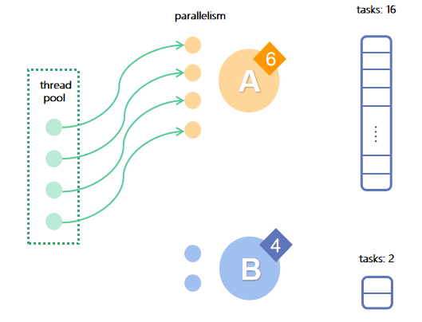
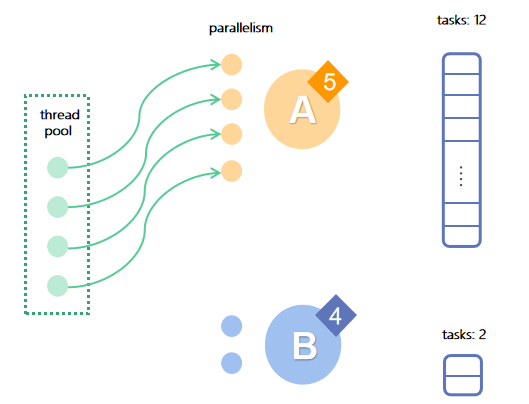
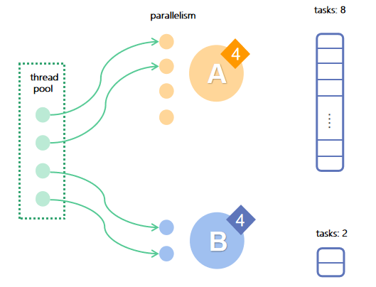
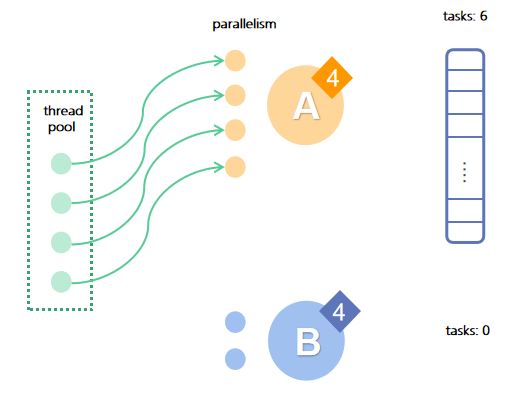

# Job Management

A job is an execution of a code block in a DolphinDB script. There are two types of jobs, interactive jobs and asynchronous jobs.

- [Job Management](#job-management)
	- [1. Interactive Jobs](#1-interactive-jobs)
		- [1.1 Submit an Interactive Job](#11-submit-an-interactive-job)
		- [1.2 View Interactive Jobs](#12-view-interactive-jobs)
		- [1.3 Cancel Interactive Jobs](#13-cancel-interactive-jobs)
	- [2. Asynchronous Jobs](#2-asynchronous-jobs)
		- [2.1 Submit a Batch Job](#21-submit-a-batch-job)
		- [2.2 View Batch Jobs](#22-view-batch-jobs)
		- [2.3 Cancel Batch Jobs](#23-cancel-batch-jobs)
	- [3. Tasks of a Job](#3-tasks-of-a-job)
	- [4. Threading](#4-threading)
		- [4.1 Types of Workers and Executors](#41-types-of-workers-and-executors)
	- [5. Job Scheduling](#5-job-scheduling)
		- [5.1 Job Prioritization](#51-job-prioritization)
		- [5.2 Job Parallelism](#52-job-parallelism)
		- [5.3 Scheduling Strategy](#53-scheduling-strategy)
	- [6. Fault Tolerance](#6-fault-tolerance)
	- [7. Load Balancing](#7-load-balancing)


## 1. Interactive Jobs

### 1.1 Submit an Interactive Job

Interactive jobs, also known as synchronous jobs, can be submitted through:

- DolphinDB GUI
- DolphinDB Console (CLI) 
- DolphinDB Terminal (CLI for remote server connection)
- DolphinDB Extension for Visual Studio Code
- APIs for various programming languages
- Web-based interface

Each server connection can only run one interactive job at a time, which means new jobs cannot be submitted using this connection until the last job is finished Therefore, the maximum number of concurrent interactive jobs that can be submitted to a node is determined by the number of connections the node is allowed to have (set by the configuration parameter *maxConnections*). 

Meanwhile, the maximum number of concurrent interactive jobs that can be executed on a node is determined by the number of worker threads (“workers“, set by *workerNum*) and web worker threads (“web workers“, set by *webWorkerNum*) on the node. The submitted interactive jobs are added to a queue, from which the workers consume the jobs submitted via non-web clients and the web workers consume the ones submitted via the Web interface.

Interactive jobs are submitted to the node connected to the client. To submit an interactive job to another node in the cluster, call the `rpc` function. For example, the following script retrieves the descriptive information on the most recently finished three SQL queries on DFS databases from the remote node “node2“.

```
rpc("node2",getCompletedQueries{3})
```

### 1.2 View Interactive Jobs

Call `getConsoleJobs` to view the running interactive jobs on the local node. For example:

```
>getConsoleJobs();
node	userID	rootJobId       jobType	desc	priority    parallelism receiveTime                 sessionId
------  -----   --------------  ------  ------- -------     ----------- ----------------------      -------------
NODE_1	admin	b4ff7490-9a...	unknown	unknown	0	    1           2020.03.07T20:42:04.903     323,818,682
NODE_1	guest	12c0be95-e1...	unknown	unknown	4	    2           2020.03.07T20:42:06.319     1,076,727,822
```

The returned table contains the following columns:

- “node“, the alias of the node to which a job is submitted
- “userID“, the job creator
- “priority“, the job priority
- “parallelism”, the job parallelism
- “receiveTime“, the time when the node receives the job.

Note:

- As each connection can only have one running interactive job at the same time, we must start a new session (e.g., a new GUI window) to run `getConsoleJobs` on the same node.
- To check the running interactive jobs on another node, use `rpc`. To check the running interactive jobs on all data and compute nodes, use `pnodeRun`: 

```
  pnodeRun(getConsoleJobs)
```

Alternatively, you can check the jobs on the DolphinDB Web interface. Starting from the 1.30.6 version, the Web interface provides the “Job“ tab for browsing and canceling jobs. This tab is also available in cluster deployment. In the screenshot below, the “Job“ tab has 3 tables that display the running interactive jobs, submitted batch jobs, and scheduled jobs in the cluster. Click the `+`/`-` icon to expand/collapse the details of an interactive job and click "Stop" to cancel the job. 


### 1.3 Cancel Interactive Jobs

Call `cancelConsoleJob` to cancel submitted but unfinished interactive job(s) by job ID. 

In DolphinDB, each interactive job has a unique ID, *rootJobId*. If an interactive job is broken down into several tasks, the tasks take the same *rootJobId* as the job. To get the *rootJobId* of a job, call `getConsoleJobs` or check the “Job“ tab in the Web interface as described in the previous section.

Similar to `getConsoleJobs`, we must create a new session to execute `cancelConsoleJob`. To cancel interactive jobs on other nodes in the cluster, use `rpc` or `pnodeRun`. For example, the following script defines a function that cancels all interactive jobs on the current node and calls `pnodeRun` to submit it to all data nodes and compute nodes.

```
def cancelAllConsoleJob(){
    cancelConsoleJob(getConsoleJobs()[`rootJobid])
}
pnodeRun(cancelAllConsoleJob)
```

Alternatively, you can use the following options to cancel an interactive job:

1. The DolphinDB GUI provides a button for canceling the job currently running in GUI. If the GUI is forced to quit when a job is still running, a command is automatically sent to cancel the running job. 
2. In the DolphinDB Web interface, select a node to view its running jobs. Click "Stop" to cancel a job.

Note:

- It may take a while to cancel an interactive job after you send the cancel command. In DolphinDB, jobs are executed based on threads. As threads cannot be directly killed (as opposed to processes), DolphinDB sets a Cancel flag on a job after receiving the cancel command, and then checks for the Cancel flag at some stage during job execution (e.g., before starting a task or before each loop iteration). If a Cancel flag is detected, the job is cancelled.
- If an interactive job cannot be cancelled, it’s usually because jobs are queuing up on the node and `cancelConsoleJob` cannot get executed immediately. One solution is to use the “Cancel“ button in the DolphinDB GUI menu bar. Another solution is to use the “Stop“ button in the Web interface. Cancel commands submitted using these two buttons are marked as urgent and handled with top priority. You can also cancel the job using DolphinDB console (CLI) - jobs submitted via the console will be executed immediately without entering a queue to wait.

## 2. Asynchronous Jobs

Asynchronous jobs run in the DolphinDB background. They are usually time-consuming and do not require an immediate response, including:

- [**Batch jobs**](https://dolphindb.com/help/SystemManagement/BatchJobManagement.html) - submitted with `submitJob` or `submitJobEx`
- [**Scheduled jobs**](https://dolphindb.com/help/SystemManagement/ScheduleJobs.html) - submitted with `scheduleJob`
- **Streaming jobs**

This section describes how to create, browse and cancel batch jobs. For information about scheduled jobs and streaming, see the tutorials [Scheduled Jobs](https://github.com/dolphindb/Tutorials_EN/blob/master/scheduledJob.md) and [Stream for DolphinDB](https://github.com/dolphindb/Tutorials_EN/blob/master/streaming_tutorial.md).

### 2.1 Submit a Batch Job

A batch job is submitted with `submitJob` or `submitJobEx`. The difference is that `submitJobEx` enables you to specify job priority and parallelism. The concepts of priority and parallelism are explained in detail later in this tutorial.

For time-consuming tasks, such as writing historical data to a DFS database and ad hoc queries, we can encapsulate them into a function and submit the function as a batch job. Separated from the interactive jobs, batch jobs are executed in an independent pool of workers (known as batch job workers). The maximum number of batch job workers is set by the configuration parameter *maxBatchJobWorker*. If the number of batch jobs exceeds the upper limit, the incoming batch jobs will enter a queue. Batch job workers are automatically destroyed after being idle for more than 60 seconds.

Batch jobs are submitted to the node currently connected to the client. To submit a batch job to another node in the cluster, call the `rpc` function. For example, the following script defines the function `demoJob` and submits it to the remote node “node2“ for execution.

```
def demoJob(n){
	s = 0
	for (x in 1 : n) {
		s += sum(sin rand(1.0, 100000000)-0.5)
	}
	return s
};
rpc("node2", submitJob, "demoJob", "a demo job", demoJob, 1000);
```

### 2.2 View Batch Jobs

Call `getRecentJobs` to view the details about the batch jobs on the local node. This example retrieves the most recent 4 batch jobs:

```
>getRecentJobs(4);
node	userID	jobId   jobDesc	priority    parallelism	receivedTime	        startTime               endTime                 errorMsg
----    ------  -----   ------- --------    ----------- ------------            ---------               -------                 --------
NODE_0	admin	write   write	4	    2	        2020.03.08T16:09:16.795			
NODE_0	admin	write   check	4	    2	        2020.01.08T16:09:16.795	2020.01.08T16:09:16.797		
NODE_0	guest	query   query	0	    1	        2020.01.10T21:44:16.122	2020.01.10T21:44:16.123	2020.01.10T21:44:16.123	Not granted to read table dfs://FuturesContract/
NODE_0	admin	test    foo     8	    64	        2020.02.25T01:30:23.458	2020.02.25T01:30:23.460	2020.02.25T01:30:23.460	
```

In the above table:

- If *startTime* is empty (e.g., the first record), it means the job is still pending execution.
- If *endTime* is empty (e.g., the second record), it means the job is in execution.
- If *errorMsg* is NOT empty (e.g., the third record), it means an error occurred during the execution.

`getRecentJobs` returns information on the recently submitted batch jobs. To view the information on a specific job, use `getJobStatus` by specifying the job ID. To view the batch jobs on other nodes, use `rpc` or `pnodeRun`. The following script retrieves the batch jobs on all data nodes and compute nodes in a cluster:

```
  pnodeRun(getRecentJobs)
```
**Note**: `getRecentJobs` only returns jobs submitted after the current node was started. It does not return jobs submitted before the server was rebooted. To view jobs submitted prior to the last reboot, check the job files persisted on disk storage.

DolphinDB saves the output of batch jobs to disk files whose directory is specified by the configuration parameter *batchJobDir*. If the parameter is not specified, the default path is *<HomeDir>/batchJobs*. Each batch job generates 2 files: *<job_id>.msg* and *<job_id>.obj* that store intermediate messages and return objects, respectively. In addition, each batch job adds 3 entries to the batch job log *<BatchJobDir>/batchJob.log* when the system receives, starts, and completes the batch jobs. Use the following functions to check the execution of a batch job:

- `getJobMessage`: Retrieve the intermediate messages from the batch job.
- `getJobReturn`: Retrieve the batch job result.

Note: You can also use the DolphinDB Web interface to view the batch jobs. See section 1.2 “View Interactive Jobs“.

### 2.3 Cancel Batch Jobs

Use `cancelJob` to cancel submitted but unfinished batch jobs. As with the interactive jobs, the cancel command doesn’t take effect immediately (see section 1.3 Cancel Interactive Jobs). 

To cancel batch jobs on other nodes, use `rpc` or `pnodeRun`. The following script cancels the batch jobs on all data nodes and compute nodes in a cluster:

```
def cancelAllBatchJob(){
	jobids=exec jobid from getRecentJobs() where endTime=NULL
	cancelJob(jobids)	
}
pnodeRun(cancelAllBatchJob)
```

## 3. Tasks of a Job

For [DFS databases](https://dolphindb.com/help/DatabaseandDistributedComputing/Database/DistributedDatabase.html), if a job processes data from multiple partitions (e.g., a SQL query), DolphinDB breaks it down into several tasks and assigns the tasks to the corresponding nodes for parallel execution. When the tasks are completed, the system merges the intermediate results from the nodes to return a final result. Similarly, [distributed computing](https://dolphindb.com/help/DatabaseandDistributedComputing/DistributedComputing.html) jobs are also broken down into tasks for execution. Therefore, a job can be considered as a series of tasks.

DolphinDB is mainly designed to process highly concurrent, interactive computing tasks. Therefore, the resource allocation in DolphinDB is different from that of the low concurrency, batch computing engines such as Apache Spark. While Apache Spark allocates independent computing resources (CPU cores, memory, etc.) to each application in advance, DolphinDB breaks down a job into tasks and allocates resources based on each task. Each task does not exclusively occupy the CPU cores and memory. Instead, computing resources are put into a shared resource pool and allocated to tasks based on their priority and parallelism. 

A job can be broken down in the following ways:

- Most jobs, such as SQL queries, are broken down based on the involved database partitions with each task mapped to a partition. The tasks are executed on the node holding the partition data. Since the computational load of each task is determined by the amount of data in a partition, a reasonably-designed partitioning scheme is crucial to the query performance.
- For jobs that involve ETL (Extract, Transform, Load), such as generating data sources with `repartitionDS` and apply `mr`(map reduce) or `imr`(iterative map reduce, usually used in machine learning scenarios) to the data sources, each generated data source is a task and the computation of each task is separated from storage.

## 4. Threading

Unlike the traditional massively parallel processing (MPP) architecture with a master node to interact with all clients, DolphinDB does not have a master node at the database level. It is a peer-to-peer structure where a client can connect to any data node or compute node. That is, users can submit jobs to any data node or compute node for execution. Because a job may be broken down into tasks, there must be a thread (i.e., a worker) to coordinate all the tasks of a job on a data/compute node. A worker processes the submitted job, breaks down the job into tasks and assigns them to the nodes storing the required data for execution, performs computation, and merges the intermediate results to generate the final result. 

To reduce data transfer overhead over network, DolphinDB sends the tasks to the data nodes where the required data is stored for execution. Specifically:

- For a partitioned DFS table, the worker breaks down a job and assigns tasks to data nodes for execution according to the database partitioning scheme.
- For distributed computing, the worker assigns tasks to data nodes for execution according to the location of the data sources.

Executors are another type of threads in job execution. Here are the possible scenarios of how a job is processed by the workers and executors:

- A job querying a non-partitioned table is executed by a worker.
- A job querying a partitioned table on a single machine is often broken down into multiple tasks by a worker. The tasks are executed by the worker and multiple executors on that node in parallel.
- A job querying a partitioned DFS table is often broken down into multiple tasks by a worker. The local tasks are executed by the worker and multiple executors on that node in parallel. The remote tasks are distributed to the corresponding remote nodes and executed by the workers on these nodes.

### 4.1 Types of Workers and Executors

The workers and executors are further divided into the following categories:

- **worker**: A thread that handles regular interactive tasks. A worker receives requests from the client and breaks down each request into tasks. Based on the locations of the involved partitions in the tasks, the worker assigns the tasks to local and/or remote executors. The worker also executes local tasks itself. The number of workers is specified by the configuration parameter *workerNum* and the default value is the number of CPU cores. Since version 1.30.19/2.00.7, DolphinDB has introduced a multilevel task algorithm which divides the workers into different levels to handle the jobs/tasks at the same level. This helps to prevent deadlock during the execution of a particularly complex job that will be eventually broken down into several levels of subtasks.
- **local executor**: A thread that executes tasks on local machines assigned by workers. A worker breaks down a job into a number of tasks and adds them to the task queues. Each local executor can only process one task from the local task queue at a time. Computational tasks generated by the parallel-processing functions such as `ploop` and `peach` are also handled by the local executors. The number of local executor is specified by the configuration parameter *localExecutors* and the default value is the number of CPU cores - 1.

Note: The concurrent processing capability of DolphinDB is determined by the maximum number of workers and local executors.

- **remote executor**: An independent thread that sends tasks in the remote task queue to the remote nodes.
- **batch job worker**: A thread that handles batch jobs. The number of batch job workers is specified by the configuration parameter *maxBatchJobWorker* and the default value is equivalent to the value of *workerNum*. A batch job worker will be destroyed after being idle for over 60 seconds.
- **dynamic worker**: When all workers are busy, the system will create dynamic workers to process incoming jobs. Depending on how busy the system is with concurrent tasks, a total of three groups of dynamic workers can be created with *maxDynamicWorker* dynamic threads in each group. A dynamic worker will be destroyed after being idle for 60 seconds.
- **web worker**: A thread that handles HTTP requests. DolphinDB provides the Web-based Cluster Manager to interact with cluster nodes. Requests submitted through the web interface are processed by the web workers. The number of web workers is specified by the configuration parameter *webWorkerNum* and the default value is 1.
- **urgent worker**: A thread that only handles the time-sensitive system-level tasks such as logins (`login`) and job cancellations (`cancelJob`/`cancelConsoleJob`).
- **infra worker**: When high availability is enabled for controllers or streaming, the system will create infra workers for data communication between nodes in the raft group.
- **recovery worker**: Workers that are used to recover chunks synchronously in node recovery. When the chunk data on a node is corrupted, it can be recovered from the replica on another node. The number of recovery workers is specified by the configuration parameter recoveryWorkers and the default value is 1.
- **diskIO worker**: Set by the configuration parameter *diskIOConcurrencyLevel*. *diskIOConcurrencyLevel* = 0 means the threads handling the current tasks will read and write to the disk directly. When *diskIOConcurrencyLevel* > 0, the system will create the specified number of threads to read and write to the disk concurrently. For more information about *diskIOConcurrencyLevel*, see section 5 “Configuration Parameters“.

The following example explains the differences between workers and executors. In this example, the server is deployed on a single machine.

When a node receives a query from a non-web client such as the GUI, API, console, or VS Code plugin, it assigns the query to one of its workers at level 0. Suppose that this query involves 16 partitions in a table, and the number of workers is 8 and the number of available local executors is 7 on the node. The dedicated worker will then process 2 partitions and the local executors will process 14 partitions. After all partitions are processed, the worker collects the intermediate results, generates the final result, and sends it to the client. If the query is sent from a web client, it would be handled by a web worker in the first place instead of a worker. The rest of the process is the same.

In the above example, 8 workers are usually enough to handle all the jobs sent to a node. However, the number of workers may be inadequate if dozens of queries are submitted to a node at the same time. That’s when the dynamic workers are created to help processing the concurrent queries. The dynamic workers will be automatically destroyed after being idle for 60 seconds.

Compared with the regular queries, some jobs cost significantly more time, such as batch processing for machine learning. If these two kinds of jobs share a thread pool, it is likely that the workers will be occupied by the time-consuming jobs while the regular queries will never, or have to wait for a long time to get executed. Therefore, we recommend submitting time-consuming jobs as batch jobs using `submitJob`. The batch jobs are processed by batch job workers. Batch job workers will be automatically destroyed after being idle for 60 seconds.

When all the workers are busy and you want to cancel a job, as mentioned in section 1.3 “Cancel an Interactive Job“, you can use the cancel button in the GUI or the Web interface, or send the command from a remote node. This way, the command is executed with top priority by the urgent workers, which only handles the time-sensitive system-level tasks such as logins (login) and job cancellations.

> For more information, see [Overview of Threading Model in DolphinDB](thread_model_SQL.md).

## 5. Job Scheduling

### 5.1 Job Prioritization

In DolphinDB, jobs are executed based on priority, which ranges from 0 to 9 - the bigger the value, the higher the priority. A multi-level queue mechanism is provided to implement the job priority system. Specifically, the system maintains 10 queues, which correspond to 10 priority levels. The system always allocates thread resources to the high-priority jobs, and for jobs of the same priority, threads are allocated in a round-robin manner; only when a priority queue is empty, the jobs in the next lower priority queue are processed.

The job priority is determined by the following conditions::

- For an interactive job, its priority is `min(4, the highest job priority)`. To specify the highest priority of the jobs submitted by a specific user, call `setMaxJobPriority`.
- For a batch job submitted with `submitJob`, its priority is 4. You can also submit a batch job with `submitJobEx` to specify its priority.
- For a scheduled job, the job priority is always 4.

### 5.2 Job Parallelism

Parallelism indicates the maximum number of threads to execute the tasks of a job on a data node at the same time. The default value is 2. To specify the parallelism of a batch job, submit it with `submitJobEx` .

The degree of parallelism determines the number of time slices (i.e., how many rounds of scheduling) is required to execute a job. For example, if a job with the parallelism of 2 is broken down into 100 parallel tasks, the system will only allocate 2 threads to execute these tasks, so it will take 50 rounds of scheduling to complete the entire job. To make full use of the resources, the system will perform optimization: If there are currently 16 local executors available and only one job is running, all 16 threads will be allocated to the job even if the parallelism is 2.

### 5.3 Scheduling Strategy

When there are multiple jobs, the jobs with higher priority and higher degree of parallelism get more compute resources. To prevent the low-priority jobs from waiting too long, DolphinDB would dynamically adjust the priority of a job during its execution. Specifically, when a time slice (one round of parallel execution) for a job is executed, the system would lower its priority by one level if there is another job with a lower priority. After the priority of a job reaches the lowest level, it will then be adjusted to the initial level This technique helps avoid starvation in low-priority job execution.

Here’s an example:  There are 4 available threads in the resource pool. Job A has a priority of 6, parallelism of 4, and 16 tasks, while job B has a priority of  4, parallelism of 2, and 2 tasks.



**In the first round of scheduling:** A has a higher priority than B, so all threads are allocated to A. 

After the execution, A has 12 tasks left and its priority drops to 5. 

**In the second round of scheduling:** A has the higher priority of 5, so all threads are still allocated to A. 



After the execution, A has 8 tasks left and its priority drops to 4. 

**In the third round of scheduling:** both A and B are at priority 4, so they each get 2 tasks executed. 



After the execution, B is completed, A has 6 tasks left and its priority is still 4. 



In this example, although the priority and parallelism of A are higher, B still gets completed first. 

## 6. Fault Tolerance

The fault tolerance of DolphinDB's distributed computing is based on the redundant storage of partitions. After a task is sent to a data node holding a replica of the required partition, if the node fails or the verification of replica fails (replica corruption), the job scheduler (a worker) on the node will detect the issue and send the task to another node with a replica. The number of replicas for each partition can be configured through the parameter *dfsReplicationFactor*.

## 7. Load Balancing

Load balancing is critical to the optimization of computational performance. Here are some tips:

- If there are multiple data nodes, distribute the compute resources of each node as balanced as possible.
- If there are multiple data nodes, keep the number of partitions on each node as balanced as possible.
- Balance the size of the partitions of the tables in the database.
- Add compute nodes to your cluster (see below).

**Compute Nodes**

Starting from version 1.30.14/2.00.1, you can configure compute nodes in your cluster. Compute nodes do not store data and only perform the computational work. Compute nodes are designed for computationally intensive operations such as streaming, distributed joins, and machine learning. 

While data nodes can both store data and perform computations, when it comes to computationally intensive operations with high concurrency, using data nodes may cause the following issues:

- data writes: Intensive computations consume lots of CPU and memory resources. This may slow down the performance of data writing as it requires CPU resources for precomputation and compression. Especially for databases with the TSDB engine, the write performance would drop significantly. This is because the TSDB engine performs precomputation tasks (e.g., index sorting) during the writes, and therefore requires extra CPU resources. 
- data reads: When a large amount of memory is occupied by a computational task, an OOM may occur during the read task due to insufficient memory. 

Therefore, for intensive computations, it is recommended to add the compute nodes to your cluster to separate the resources for compute and storage. With compute nodes in the cluster, you can separate storage and compute by submitting all write jobs to the data nodes and all read jobs to the compute nodes.

**Troubleshooting**

When the database is running slow or some jobs are taking too long, troubleshoot the issues with the following steps:

- First, look at the resource usage of all nodes, such as the load average per node, CPU usage, network and disk read/write performance, memory usage, and job and task queue depth. These metrics can be checked from the Web-Based Cluster Manager or Prometheus (if integrated). You can also use the built-in functions `getPerf`, `getClusterPerf`, `getJobStat`, `getDiskIOStat`, etc. To run these functions on all data nodes, use the higher-order function `pnodeRun`.
- Secondly, analyze the distribution of data involved in the job, including the number of partitions and the distribution of partitions on each node. Use the functions `getAllChunks`, `getClusterChunksStatus`, `getChunksMeta` and `getTabletsMeta` to get the information you need.