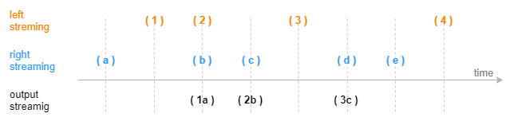
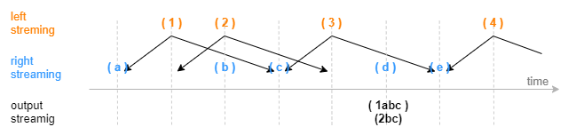
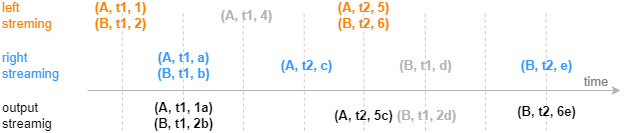

# DolphinDB Streaming Join Engines: Joining Multiple Data Streams

Data analysis often involves joining data from multiple sources. In addition to various SQL join operations for historical data, DolphinDB also provides streaming join engines for real-time computing scenarios that require low-latency processing. These engines use incremental calculation to ensure millisecond-level latency performance even with massive data streams.

This tutorial aims to introduce five types of join engines in DolphinDB and their applications in financial data analysis. All scripts used in this tutorial can be executed with DolphinDB version 2.00.8 and above. For version 1.30.20 and higher, you can still follow most code examples unless otherwise specified.

- [DolphinDB Streaming Join Engines: Joining Multiple Data Streams](#dolphindb-streaming-join-engines-joining-multiple-data-streams)
	- [Table Joins: From Batch to Stream](#table-joins-from-batch-to-stream)
		- [Batch Joins](#batch-joins)
		- [Streaming Joins](#streaming-joins)
	- [Streaming Join Engines](#streaming-join-engines)
		- [Asof Join Engine (`createAsofJoinEngine`)](#asof-join-engine-createasofjoinengine)
		- [Window Join Engine (`createWindowJoinEngine`)](#window-join-engine-createwindowjoinengine)
		- [Equi Join Engine (`createEquiJoinEngine`)](#equi-join-engine-createequijoinengine)
		- [Lookup Join Engine (`createLookupJoinEngine`)](#lookup-join-engine-createlookupjoinengine)
		- [Left Semi Join Engine (`createLeftSemiJoinEngine`)](#left-semi-join-engine-createleftsemijoinengine)
	- [Use Cases for Real-Time Joins](#use-cases-for-real-time-joins)
		- [Asof Join Engine: Calculating Transaction Costs](#asof-join-engine-calculating-transaction-costs)
		- [Window Join Engine: Joining 3-min OHLC with Trades Data](#window-join-engine-joining-3-min-ohlc-with-trades-data)
		- [Equi Join Engine: Combining Metrics in Data Sources Captured at One-Minute Interval](#equi-join-engine-combining-metrics-in-data-sources-captured-at-one-minute-interval)
		- [Lookup Join Engine: Joining Real-Time Market Data with Historical Daily Metrics](#lookup-join-engine-joining-real-time-market-data-with-historical-daily-metrics)
		- [Left Semi Join Engine: Joining Trades With Orders Data](#left-semi-join-engine-joining-trades-with-orders-data)
		- [Left Semi Join Engine: Correlating Individual Stocks to Index](#left-semi-join-engine-correlating-individual-stocks-to-index)
	- [Comparison of Join Engines](#comparison-of-join-engines)
	- [Conclusion](#conclusion)


## Table Joins: From Batch to Stream

### Batch Joins

For batch processing scenarios, DolphinDB offers SQL-compatible join methods (including equi join, full join, left join, prefix join, and cross join), and also methods especially designed for time-series data including asof join and window join.

For example, perform `asof join` on historical data:

```
// data
t1 = table(take(`A, 4) as Sym, 10:10:03.000+(10 2100 2890 6030) as Time, 12.5 12.5 12.6 12.6 as Price)
t2 = table(take(`A, 4) as Sym, 10:10:00.000+(0 3000 6000 9000) as Time, 12.6 12.5 12.7 12.6 as BidPrice)

// asof join calculation
select *  from aj(t1, t2, `Time)
```


For each record with a timestamp *T* in the left table, the `asof join` takes from the right table a record with the closest timestamp that is prior or equal to *T*. In the above example where the join column "Time" is specified, each record in table t1 is paired with the record in table t2 whose "Time" value is less than or equal to the "Time" value in t1.


### Streaming Joins

The joins over batch tables typically process bounded data sets, which means the input tables are processed all at once to generate a full output. Real-time streaming joins deal with data sets that are unbounded and have no defined end. In such cases, the streams have a starting point, but the arrival time of the next record is unpredictable. Unbounded streams must be continuously processed, i.e., incoming records must be promptly handled after ingestion, and the joined output will be generated incrementally.

To implement streaming joins, there are two technical challenges that need to be addressed:

- Triggering mechanism for join and output

Suppose the above `asof join` case processes streaming data. When the first record (with a "Time" value of 10:10:03:010) of stream t1 arrives, the join engine must decide whether to join the record with a record (with a "Time" value of 10:10:00.000) in stream t2 and output the result immediately. Alternatively, it can wait until a triggering condition is satisfied.

- Memory management

To accurately join streams, the join engine needs to cache historical data. Since the input streams are continuously ingested, a garbage collection mechanism is needed.


## Streaming Join Engines

DolphinDB offers five types of streaming join engines: as of engine, window join engine, equi join engine, left semi join engine, and lookup join engine. Join engines adhere to join rules consistent with batch joins. Differences are explained in subsequent sections.

The streaming join engine functions as a module that enables real-time joins on streams. It can be conceptualized as a computational black box that applies join rules to two input streams, producing a joined output stream. The engine internally maintains the computing states.


The following script implements `asof join` over streams (based on the code example in Section [Batch Joins](#batch-joins)).

First, we create two stream tables as inputs and one stream table as output. Then, we use the `createAsofJoinEngine` function to create the asof join engine, and the subscribeTable function to subscribe to the two streams. As data is continuously ingested into the join engine, the number of records in the output table will increase accordingly. For detailed instructions on streaming subscription, refer to "Streaming Subscription".

```
// create table
share streamTable(1:0, `Sym`Time`Price, [SYMBOL, TIME, DOUBLE]) as trade
share streamTable(1:0, `Sym`Time`BidPrice, [SYMBOL, TIME, DOUBLE]) as quotes
share table(1:0, `Time`Sym`Price`t2_Time`BidPrice, [TIME, SYMBOL, DOUBLE, TIME, DOUBLE]) as output

// create engine
ajEngine = createAsofJoinEngine(name="asofJoin", leftTable=trade, rightTable=quotes, outputTable=output, metrics=<[Price, quotes.Time, BidPrice]>, matchingColumn=`Sym, timeColumn=`Time, useSystemTime=false, delayedTime=1000)

// subscribe topic
subscribeTable(tableName="trade", actionName="joinLeft", offset=0, handler=getLeftStream(ajEngine), msgAsTable=true)
subscribeTable(tableName="quotes", actionName="joinRight", offset=0, handler=getRightStream(ajEngine), msgAsTable=true)
```

We use the following code to simulate the ingestion of streams and the join result is generated to the table "output".

```
// generate data
t1 = table(take(`A, 4) as Sym, 10:10:03.000+(10 2100 2890 6030) as Time, 12.5 12.5 12.6 12.6 as Price)
t2 = table(take(`A, 4) as Sym, 10:10:00.000+(0 3000 6000 9000) as Time, 12.6 12.5 12.7 12.6 as BidPrice)
// input data
quotes.append!(t2)
trade.append!(t1)
```

To address the challenges of real-time streaming joins discussed in Section [Streaming Joins](#streaming-joins), the streaming join engines adopt built-in computational rules and parameter interfaces to enhance the trigger mechanism. Memory management is handled through the parameter *garbageSize* which cleans up unneeded historical data. 

The join mechanisms can be classified as follows:

(1) For joins that involve the time order of the data, a join engine processes the inputs based on:

- The system time of data arrivals;
- OR the time columns of the inputs. In such case, the timestamps of subsequent records are unpredictable, and by default the engine processes ingested data as if it is ordered. Additional timeout triggers can be set to force the joins.

(2) For joins that ignore the time order of the data, a join engine:

- Calculates and outputs immediately when a record is ingested; 
- OR waits until a record is matched. Additional timeout triggers can be set to force the joins.

The join and trigger rules determine the calculation results of the engine. We will explain the behavior of each join engine in the following sections, and elaborate the application scenarios separately in the following chapter [Use Cases for Real-Time Joins](#-use-cases-for-real-time-joins).

### Asof Join Engine (`createAsofJoinEngine`)

Similar to the SQL `asof join`, the asof join engine groups data by the join column and associates the left and right tables based on temporal proximity within each group. The left or right stream ingested into the engine should be ordered in time. For each record from the left table, the engine matches it with a record in the right table where the timestamp is the closest prior or equal to the current timestamp. The engine outputs a result for each ingested left record.

The parameter *useSystemTime* determines the join behavior of an asof join engine:

(1) When *useSystemTime*=true, the engine joins the streams based on the system time of data arrivals. Each record from the left table is immediately associated and the join result is output.

(2) When *useSystemTime*=false, the engine joins the streams based on the time columns of the inputs. The join is triggered when a right record arrives with a timestamp greater than or equal to the timestamp of the latest left record. You can also set the parameter *delayedTime* to define a timeout trigger.

The following figure shows how an asof join engine outputs a result based on the data time (without timeout trigger). The calculation and output are triggered by new data arriving in the right table. 



For application scenarios of the engine, see Section [Asof Join Engine: Calculating Transaction Costs](#asof-join-engine-calculating-transaction-costs).

### Window Join Engine (`createWindowJoinEngine`)

Similar to the SQL `window join`, the window join engine groups data by the join column and associates a record from the left table with records within a window of the right table for each group. The left or right stream ingested into the engine should be ordered in time. Based on the timestamp of each record in the left table, the engine determines a window (which may contain zero or multiple records) in the right table. Each left record is joined with the aggregated value of the window in the right table. 

Note: The asof join engine introduced above can be seen as a special case of the window join engine.

The parameter *useSystemTime* determines the join behavior of a window join engine:

(1) When *useSystemTime*=true, the engine joins the streams based the system time of data arrivals. The join is triggered when the system time reaches the right boundary of the window.

(2) When *useSystemTime*=false, the engine joins the streams based on the time column of the input. The join is triggered when a right record arrives with a timestamp greater than the right boundary of the window. You can also set the parameter *delayedTime* to define a timeout trigger.

The following figures show how a window join engine outputs a result based on the time column of the input. 

- Standard windows (*window* = a:b)

The parameter *window* is set to -1:2. Suppose the current timestamp in the left table is t, a window over the right records is determined by moving the current timestamp one time unit backward and two time units forward, i.e., [t-1:t+2]. The calculation and output are triggered by a record arriving in the right table with a timestamp greater than or equal to the right boundary of the window. This record does not participate in the window calculation.



- Special windows (*window* = 0:0)

The parameter window is set to 0:0 to specify a special window. The boundaries of the window over the right table are determined by the current timestamp in the left table and its previous timestamp. The calculation and output is triggered by new data arriving in the right table with a timestamp greater than or equal to the current left timestamp. This record does not participate in the window calculation.


For application scenarios of the engine, see Section [Window Join Engine: Joining 3-min OHLC with Trades Data](#window-join-engine-joining-3-min-ohlc-with-trades-data).

### Equi Join Engine (`createEquiJoinEngine`)

*Note: Since DolphinDB 1.30.21/2.00.9, the function previously known as* `createEqualJoinEngine` *has been renamed to* `createEquiJoinEngine`*. The old function name can still be used as an alias.*

Similar to the SQL `equi join`, the equi join engine joins the left table and the right table on equivalent values in the join column(s) and the time column, and outputs a record when a match is identified.

Unlike the SQL equi join, the engine does not cache all the historical data. This means that a newly ingested record may not find a match in the other table if the matching record has already been removed from cache. This is because the engine is designed to efficiently process keyed streams that have the join columns and the time column as the key. For instance, it is used for processing streams where each stock has only one record per minute, ensuring optimal performance for high-frequency data processing.

The image below illustrates how the equi join engine processes ingested streams. Each stream has three columns, a join column, a time column, and a metrics column. For application scenarios of the engine, see Section [Equi Join Engine: Combining Metrics in Data Sources Captured at One-Minute Interval](#equi-join-engine-combining-metrics-in-data-sources-captured-at-one-minute-interval). 



We encourage users to use the equi join engine to process data with unique values in the join column(s) and the time column, as shown in the recommended application scenario. However, if you wish to explore the engine's behavior in other scenarios, the following paragraph explains its internal workings.

The equi join engine internally maintains two keyed tables in the cache, one for the left table and the other for the right table, with the join column(s) and the time column serving as the keys. When a record is ingested into the left table, the engine searches for its matching record in the cache for the right table. If a match is found, the engine outputs the join result and marks the matching record as joined in the cache for the right table. Since the record is immediately joined upon ingestion to the left table, it is not cached (which explains why the greyed record "(A,t1.4)" in the image above cannot find a matching record in the other table and, therefore, is not output). If a match is not found, the ingested record is added to the left table’s cache and marked as un-joined, awaiting a potential match in future ingestions. 

**Note:** As the left and right tables are interchangeable in the equi join engine, the same logic applies if the record is first ingested into the right table in this example.

The equi join engine regularly performs garbage collection on all cached data, whether joined or un-joined. For details on the garbage collection rules, refer to the [user manual](https://dolphindb.com/help200/FunctionsandCommands/FunctionReferences/c/createEquiJoinEngine.html). If the equi join engine produces different results from the SQL equi join, it could be due to the differences in the specified garbage collection rules.

### Lookup Join Engine (`createLookupJoinEngine`)

Similar to the SQL `left join`, the lookup join engine joins the left table and the right table on equivalent values in the join column(s). For each record ingested into the left table, the engine produces a result immediately. If no matching record is found in the right table, the corresponding columns are treated as NULL in the output.

Unlike the SQL `left join`, the engine caches only the latest record in the right table for each value in the join column(s). Therefore, for each record in the left table, there will only be one matching record in the right table at most, and only one record will be output. 

The lookup join engine is typically used to enrich a stream table (left table) with the data queried from another table (right table) through left join. The right table can be either a stream or a dataset. If it is a stream, the engine updates the cache for the right table in real-time as data is ingested. If it is a dataset (e.g., a dimension table), the engine regularly retrieves the latest data from the table to update the cache.

The image below illustrates how the lookup join engine returns a single record as soon as a record is ingested into the left table. Each record in the left table contains a join column and a metrics column. For application scenarios of the engine, see Section [Lookup Join Engine: Joining Real-Time Market Data with Historical Daily Metrics](#lookup-join-engine-joining-real-time-market-data-with-historical-daily-metrics).


### Left Semi Join Engine (`createLeftSemiJoinEngine`)

Similar to the SQL `equi join`, the left semi join engine pairs records from the left and right tables based on matching column values. For each record from the left table, the engine caches it until a record with the same matching column value is found in the right table. The join is triggered only when a match is identified.

Unlike the SQL `equi join`, the engine only caches the first or last record with the same matching column value in the right table. As a result, each left record is joined at most once.

The following figure depicts how the left semi join engine (which retains the latest record for each join column value from the right table) processes ingested streams. Each stream contains two columns: a join column and a metrics column.


For application scenarios of the engine, see Section [Left Semi Join Engine: Joining Trades With Orders Data](#left-semi-join-engine-joining-trades-with-orders-data) and [Left Semi Join Engine: Correlating Individual Stocks to Index](#left-semi-join-engine-correlating-individual-stocks-to-index).


## Use Cases for Real-Time Joins

This chapter will introduce the specific application scenarios for each join engine with simulated streaming ingestion. 

When developing and debugging stream-processing scripts, it is recommended to use the `getStreamingStat` function to check the streaming subscription status and the `getStreamEngineStat` function to monitor streaming engines. Additionally, we have included a script in the appendix to release all stream tables and streaming engines, and cancel all subscriptions with one click.

### Asof Join Engine: Calculating Transaction Costs

Since the tick trades and quotes often have different occuring times, we can use the asof join engine for non-exact match. This allows us to join each trade record with the nearest quotes that occurred before to calculate the transaction costs.

```
// create table
share streamTable(1:0, `Sym`TradeTime`TradePrice, [SYMBOL, TIME, DOUBLE]) as trades
share streamTable(1:0, `Sym`Time`Bid1Price`Ask1Price, [SYMBOL, TIME, DOUBLE, DOUBLE]) as quotes
share streamTable(1:0, `TradeTime`Sym`TradePrice`TradeCost`quotesTime, [TIME, SYMBOL, DOUBLE, DOUBLE, TIME]) as output

// create engine
ajEngine = createAsofJoinEngine(name="asofJoin", leftTable=trades, rightTable=quotes, outputTable=output, metrics=<[TradePrice, abs(TradePrice-(Bid1Price+Ask1Price)/2), quotes.Time]>, matchingColumn=`Sym, timeColumn=`TradeTime`Time, useSystemTime=false, delayedTime=1000)

// subscribe topic
subscribeTable(tableName="trades", actionName="appendLeftStream", handler=getLeftStream(ajEngine), msgAsTable=true, offset=-1, hash=0)
subscribeTable(tableName="quotes", actionName="appendRightStream", handler=getRightStream(ajEngine), msgAsTable=true, offset=-1, hash=1)
```

In this script, we subscribe to the table "trades" and "quotes" to ingest the streams into the join engine, where:

- The parameter *useSystemTime* is set to false, indicating the join is performed based on the input time columns, i.e., "TradeTime" from the left table and "Time" from the right table.
- The parameter *delayedTime* is set to force trigger the calculations. If *delayedTime* is not specified, the join is only triggered when a record arrives with a greater timestamp in the right table. However, the ingestion of the record may be delayed, or the timestamp may never be greater than that of a record in the left table. In this case, if you expect each incoming record in the left table to trigger an output record, it is recommended to set *delayedTime* and trigger the calculation once a timeout is reached.
- The "quotes.Time" specified in the parameter *metrics* indicates the column "Time" in the "quotes" table is taken as the time column in the output table. Since the "trades" table also contains a "Time" column, if "Time" is specified without a prefix, the output takes the column from the left table by default.
- The parameter *garbageSize* is not specified and the default value is used. This parameter does not affect the calculation results regardless of its value, but only affects the memory usage of the engine. 

The following script writes "quotes" to the right stream and "trades" to the left stream:

```
// generate data: trade
t1 = table(`A`A`B`A`B`B as Sym, 10:00:02.000+(1..6)*700 as TradeTime,  (3.4 3.5 7.7 3.5 7.5 7.6) as TradePrice)
// generate data: quotes
t2 = table(`A`B`A`B as Sym, 10:00:00.000+(3 3 6 6)*1000 as Time, (3.5 7.6 3.5 7.6) as Bid1Price, (3.5 7.6 3.6 7.6) as Ask1Price)
// input data
quotes.append!(t2)
trades.append!(t1)
```

The correspondence of records between the input streams is shown below:


The output table is shown below. 


In this example, the parameter *delayedTime* is specified. Even though no record with a timestamp greater than 10:00:06.200 is ingested in the right stream for the group "Sym" B, the join is still triggered two seconds after the last left record (B,10:00:06.200, 7.6) arrives.

### Window Join Engine: Joining 3-min OHLC with Trades Data

In this use case, we use the window join engine to join 3-minute OHLC with trades data. Each OHLC record is joined with the aggregated value of the trades records within a window. 

For the trades occurred between two adjacent OHLC records, we expect to calculate the total trading volume while maintaining the original trade information in the output columns. 

**Note**: The following code example uses array vectors which are only supported in DolphinDB beta version 2.00.

```
// create table
share streamTable(1:0, `Sym`TradeTime`Side`TradeQty, [SYMBOL, TIME, INT, LONG]) as trades
share streamTable(1:0, `Sym`Time`Open`High`Low`Close, [SYMBOL, TIME, DOUBLE, DOUBLE, DOUBLE, DOUBLE]) as ohlc
share streamTable(1:0, `Time`Sym`Open`High`Low`Close`BuyQty`SellQty`TradeQtyList`TradeTimeList, [TIME, SYMBOL, DOUBLE, DOUBLE, DOUBLE, DOUBLE, LONG, LONG, LONG[], TIME[]]) as output

// create engine
wjMetrics = <[Open, High, Low, Close, sum(iif(Side==1, TradeQty, 0)), sum(iif(Side==2, TradeQty, 0)), TradeQty, TradeTime]>
fillArray = [00:00:00.000, "", 0, 0, 0, 0, 0, 0, [[]], [[]]]
wjEngine = createWindowJoinEngine(name="windowJoin", leftTable=ohlc, rightTable=trades, outputTable=output, window=0:0, metrics=wjMetrics, matchingColumn=`Sym, timeColumn=`Time`TradeTime, useSystemTime=false, nullFill=fillArray)

// subscribe topic
subscribeTable(tableName="ohlc", actionName="appendLeftStream", handler=getLeftStream(wjEngine), msgAsTable=true, offset=-1, hash=0)
subscribeTable(tableName="trades", actionName="appendRightStream", handler=getRightStream(wjEngine), msgAsTable=true, offset=-1, hash=1)
```

In this script, we subscribe to table "ohlc" and "trades" to ingest the streams into the join engine, where:

- The parameter *useSystemTime* is set to false, indicating the join is performed based on the time columns, i.e., "Time" from the left table and "TradeTime" from the right table.
- The parameter *window* is set to 0:0, meaning the windows over the right table are determined by the current timestamp in the left table and its previous timestamp.
- The parameter *metrics* specifies the join metrics. For instance, the metrics Open, High, Low, and Close indicate that the corresponding columns are retrieved from the "ohlc" table, and `sum(iif(Side==1, TradeQty, 0))` is calculated based on the columns from the right table "trades". Note that TradeQty is a column retrieved from the right table "trades". Since no aggregate function is applied to the column, all values within the window will be retained in an output field in the form of an array vector.
- The parameter *nullFill* specifies how to fill the NULL values in the output table. In this example, null values in the price fields (such as "Open") are filled in with 0. Note that *nullFill* is a tuple that must be of the same length and type as the output table columns.

The following script writes "trades" to the right stream and "ohlc" to the left stream:

```
// generate data: ohlc
t1 = table(`A`B`A`B`A`B as Sym, 10:00:00.000+(3 3 6 6 9 9)*1000 as Time, (NULL NULL 3.5 7.6 3.5 7.6) as Open, (3.5 7.6 3.6 7.6 3.6 7.6) as High, (3.5 7.6 3.5 7.6 3.4 7.5) as Low, (3.5 7.6 3.5 7.6 3.6 7.5) as Close)
// generate data: trade
t2 = table(`A`A`B`A`B`B`A`B`A`A as Sym, 10:00:02.000+(1..10)*700 as TradeTime,  (1 2 1 1 1 1 2 1 2 2) as Side, (1..10) * 10 as TradeQty)
// input data
trades.append!(t2)
ohlc.append!(t1)
```

The correspondence of records between the input streams is shown below:


The output table is shown below. The last two columns use array vectors to display all values of column "TradeQty" and "TradeTime" within the window.


The output table has one record less than the left table "ohlc", i.e., the record with a timestamp of 10:00:09.000 of group "Sym" B was not joined or output. This is because no trade arrived with a timestamp equal to or greater than 10:00:09.000 to close the window. If a result is expected to be output once a left record arrives, you can set *useSystemTime*=true to join based on the system time. In this case, for any incoming record in the left table ("ohlc"), the windows over the right table ("trades") include all the records that arrived between the previous "ohlc" record and the current record.


### Equi Join Engine: Combining Metrics in Data Sources Captured at One-Minute Interval

In quantitative trading, it's common to downsample real-time quote data and trade data into one-minute intervals for use in trading strategies. This often involves combining metrics from different data sources into a single table. In this example, we demonstrate how to aggregate quotes data and trades data into one-minute intervals in real time and then join the metrics from both tables into a single unified table.

Notably, in this example, there’s only one quote/trade record for each stock per minute after the aggregation. Additionally, for each record, we expect it to be returned only after it has been joined. The equi join engine can implement this logic, as demonstrated in the following script.

*Note: If the version of your DolphinDB server is earlier than 1.30.21/2.00.9, please replace* `createEquiJoinEngine` *with* `createEqualJoinEngine` *in the script. The* `createEqualJoinEngine` *function has now been renamed to* `createEquiJoinEngine`*. You can still use the old name as an alias.*

```
// create table
share streamTable(1:0, `Sym`TradeTime`Side`TradeQty, [SYMBOL, TIME, INT, LONG]) as trades
share streamTable(1:0, `UpdateTime`Sym`BuyTradeQty`SellTradeQty, [TIME, SYMBOL, LONG, LONG]) as tradesMin
share streamTable(1:0, `Sym`Time`Bid1Price`Bid1Qty, [SYMBOL, TIME, DOUBLE, LONG]) as quotes
share streamTable(1:0, `UpdateTime`Sym`AvgBid1Amt, [TIME, SYMBOL, DOUBLE]) as quotesMin
share streamTable(1:0, `UpdateTime`Sym`AvgBid1Amt`BuyTradeQty`SellTradeQty, [TIME, SYMBOL, DOUBLE, LONG, LONG]) as output

// create engine: 
eqJoinEngine = createEquiJoinEngine(name="EquiJoin", leftTable=tradesMin, rightTable=quotesMin, outputTable=output, metrics=<[AvgBid1Amt, BuyTradeQty, SellTradeQty]>, matchingColumn=`Sym, timeColumn=`UpdateTime)
// create engine: 
tsEngine1 = createTimeSeriesEngine(name="tradesAggr", windowSize=60000, step=60000, metrics=<[sum(iif(Side==1, 0, TradeQty)), sum(iif(Side==2, 0, TradeQty))]>, dummyTable=trades, outputTable=getLeftStream(eqJoinEngine), timeColumn=`TradeTime, keyColumn=`Sym, useSystemTime=false, fill=(0, 0))
// create engine: 
tsEngine2 = createTimeSeriesEngine(name="quotesAggr", windowSize=60000, step=60000, metrics=<[avg(iif(Bid1Price!=NULL, Bid1Price*Bid1Qty, 0))]>, dummyTable=quotes, outputTable=getRightStream(eqJoinEngine), timeColumn=`Time, keyColumn=`Sym, useSystemTime=false, fill=(0.0))

// subscribe topic
subscribeTable(tableName="trades", actionName="minAggr", handler=tsEngine1, msgAsTable=true, offset=-1, hash=1)
subscribeTable(tableName="quotes", actionName="minAggr", handler=tsEngine2, msgAsTable=true, offset=-1, hash=2) 
```

- In this script, we create two time-series engines to aggregate trades and quotes data into one-minute intervals in real time. Next, by creating an engine cascade, we ingest the aggregated data into the left and right tables of an equi join engine. For more information about cascading, see xxxx.

**Note:** In the equi join engine, the left and right tables are interchangeable. If you swap the left and right tables, the join result would remain the same.

The following script creates two stream tables, "trades" and "quotes", which contain the data to be ingested into the time-series engines. 

```
// generate data: quotes
t1 = table(`A`B`A`B`A`B as Sym, 10:00:52.000+(3 3 6 6 9 9)*1000 as Time, (3.5 7.6 3.6 7.6 3.6 7.6) as Bid1Price, (1000 2000 500 1500 400 1800) as Bid1Qty)
// generate data: trades
t2 = table(`A`A`B`A`B`B`A`B`B`A as Sym, 10:00:54.000+(1..10)*700 as TradeTime,  (1 2 1 1 1 1 2 1 2 2) as Side, (1..10) * 10 as TradeQty)
// input
trades.append!(t2)
quotes.append!(t1)
```

Join result:


### Lookup Join Engine: Joining Real-Time Market Data with Historical Daily Metrics

In real-time trading, historical metrics is often used in calculations to gain a comprehensive understanding of the market. In this example, we join the latest real-time quotes data with daily trading metrics from the previous day on stock symbols in a table for further analysis.  

In this example, the engine is expected to produce an immediate output once a quote record is ingested, ensuring that each output record corresponds to a quote record. If a stock is not found in the daily dataset, the historical metrics for that stock will be output as null. Note that the metrics from the previous day are updated once a day, rather than in real-time. The following script demonstrates how the lookup join engine implements the scenario:

```
// create table
share streamTable(1:0, `Sym`Time`Open`High`Low`Close, [SYMBOL, TIME, DOUBLE, DOUBLE, DOUBLE, DOUBLE]) as quotes
historicalData = table(`A`B as Sym, (0.8 0.2) as PreWeight, (3.1 7.6) as PreClose)
share table(1:0, `Sym`Time`Open`High`Low`Close`PreWeight`PreClose, [SYMBOL, TIME, DOUBLE, DOUBLE, DOUBLE, DOUBLE, DOUBLE, DOUBLE]) as output

// create engine
lookupJoinEngine = createLookupJoinEngine(name="lookupJoin", leftTable=quotes, rightTable=historicalData, outputTable=output, metrics=<[Time, Open, High, Low, Close, PreWeight, PreClose]>, matchingColumn=`Sym, checkTimes=10s)

// subscribe topic
subscribeTable(tableName="quotes", actionName="appendLeftStream", handler=getLeftStream(lookupJoinEngine), msgAsTable=true, offset=-1)
```

- In this script, the lookup join engine subscribes to the stream table "quotes", which ingests data into its left table. 
- The engine's right table is an in-memory table, "historicalData". Upon its creation, the engine queries "historicalData" and stores the data in the cache. The parameter *checkTimes*=10s indicates that the engine updates its cache by fetching the latest data from "historicalData" every 10 seconds.

In the following script, we generate the data to be ingested into the engine’s left table:

```
// generate data: quotes
t1 = table(`A`B`A`B`A`B as Sym, 10:00:00.000+(3 3 6 6 9 9)*1000 as Time, (3.5 7.6 3.5 7.6 3.5 7.6) as Open, (3.5 7.6 3.6 7.6 3.6 7.6) as High, (3.5 7.6 3.5 7.6 3.4 7.5) as Low, (3.5 7.6 3.5 7.6 3.6 7.5) as Close)
quotes.append!(t1)
```

The correspondence of records between the left table and right table is shown below:


The engine immediately returns when a record is ingested. The final output is as follows:


### Left Semi Join Engine: Joining Trades With Orders Data

In this use case, we will enrich trading information by joining tick trades with buy and sell orders based on the order IDs. The trade record is only output after its corresponding orders are found.

We create a streaming cascade with two left semi join engines to associate trades with buy and sell orders. We create four stream tables for trades, orders, output intermediate results, and the final output.

```
// create table
share streamTable(1:0, `Sym`BuyNo`SellNo`TradePrice`TradeQty`TradeTime, [SYMBOL, LONG, LONG, DOUBLE, LONG, TIME]) as trades
share streamTable(1:0, `Sym`OrderNo`Side`OrderQty`OrderPrice`OrderTime, [SYMBOL, LONG, INT, LONG, DOUBLE, TIME]) as orders
share streamTable(1:0, `Sym`SellNo`BuyNo`TradePrice`TradeQty`TradeTime`BuyOrderQty`BuyOrderPrice`BuyOrderTime, [SYMBOL, LONG, LONG, DOUBLE, LONG, TIME, LONG, DOUBLE, TIME]) as outputTemp
share streamTable(1:0, `Sym`BuyNo`SellNo`TradePrice`TradeQty`TradeTime`BuyOrderQty`BuyOrderPrice`BuyOrderTime`SellOrderQty`SellOrderPrice`SellOrderTime, [SYMBOL, LONG, LONG, DOUBLE, LONG, TIME, LONG, DOUBLE, TIME, LONG, DOUBLE, TIME]) as output

// create engine: left join buy order
ljEngineBuy=createLeftSemiJoinEngine(name="leftJoinBuy", leftTable=outputTemp, rightTable=orders, outputTable=output,  metrics=<[SellNo, TradePrice, TradeQty, TradeTime, BuyOrderQty, BuyOrderPrice, BuyOrderTime, OrderQty, OrderPrice, OrderTime]>, matchingColumn=[`Sym`BuyNo, `Sym`OrderNo])

//  create engine: left join sell order 
ljEngineSell=createLeftSemiJoinEngine(name="leftJoinSell", leftTable=trades, rightTable=orders, outputTable=getLeftStream(ljEngineBuy),  metrics=<[BuyNo, TradePrice, TradeQty, TradeTime, OrderQty, OrderPrice, OrderTime]>, matchingColumn=[`Sym`SellNo, `Sym`OrderNo])

// subscribe topic
subscribeTable(tableName="trades", actionName="appendLeftStream", handler=getLeftStream(ljEngineSell), msgAsTable=true, offset=-1)
subscribeTable(tableName="orders", actionName="appendRightStreamForSell", handler=getRightStream(ljEngineSell), msgAsTable=true, offset=-1)
subscribeTable(tableName="orders", actionName="appendRightStreamForBuy", handler=getRightStream(ljEngineBuy), msgAsTable=true, offset=-1) 
```

In this script, the engine "leftJoinSell" joins "trades" and "orders" based on the sell order IDs. The output of "leftJoinSell" is then ingested as the left stream into the engine "leftJoinBuy" to be joined with the right stream of "orders" based on buy order IDs. 

To manage the memory usage of engines, we use the default value of the parameter *garbageSize*. Unlike other engines, the left semi join engine only clears the unneeded historical data from the left table and maintains all records from the right table in the cache. Thus, each engine created above is at least the size of the "orders" table.

The following script appends "orders" to the right stream and "trades" to the left stream of the engine "leftJoinSell":

```
// generate data: trade
t1 = table(`A`B`B`A as Sym, [2, 5, 5, 6] as BuyNo, [4, 1, 3, 4] as SellNo, [7.6, 3.5, 3.5, 7.6]as TradePrice, [10, 100, 20, 50]as TradeQty, 10:00:00.000+(400 500 500 600) as TradeTime)
// generate data: order
t2 = table(`B`A`B`A`B`A as Sym, 1..6 as OrderNo, [2, 1, 2, 2, 1, 1] as Side, [100, 10, 20, 100, 350, 50] as OrderQty, [7.6, 3.5, 7.6, 3.5, 7.6, 3.5] as OrderPrice, 10:00:00.000+(1..6)*100 as OrderTime)
// input data
orders.append!(t2)
trades.append!(t1)
```

The correspondence of records between the input streams is shown below:


The output table shows that each trade record is joined with its corresponding buy and sell order records from the "orders" stream. It now displays information on the buy and sell quantity, price, and time for each trade.


### Left Semi Join Engine: Correlating Individual Stocks to Index

This use case correlates individual stocks to a stock index. The stock and index data are downsampled to 1-minute interval. All stocks are associated with one index, and a join result is output for each input stock record. 

To achieve this, we cascade a left semi join engine with a reactive state engine. 

```
// create table
share streamTable(1:0, `Sym`Time`Close, [SYMBOL, TIME, DOUBLE]) as stockKline
share streamTable(1:0, `Sym`Time`Close, [SYMBOL, TIME, DOUBLE]) as indexKline
share streamTable(1:0, `Time`Sym`Close`Index1Close, [TIME, SYMBOL, DOUBLE, DOUBLE]) as stockKlineAddIndex1
share streamTable(1:0, `Sym`Time`Close`Index1Close`Index1Corr, [SYMBOL, TIME, DOUBLE, DOUBLE, DOUBLE]) as output

//  create engine: calculate correlation
rsEngine = createReactiveStateEngine(name="calCorr", dummyTable=stockKlineAddIndex1, outputTable=output, metrics=[<Time>, <Close>, <Index1Close>, <mcorr(ratios(Close)-1, ratios(Index1Close)-1, 3)>], keyColumn="Sym")

//  create engine: left join Index1
ljEngine1 = createLeftSemiJoinEngine(name="leftJoinIndex1", leftTable=stockKline, rightTable=indexKline, outputTable=getStreamEngine("calCorr"), metrics=<[Sym, Close, indexKline.Close]>, matchingColumn=`Time)

// subscribe topic
def appendIndex(engineName, indexName, msg){
	tmp = select * from msg where Sym = indexName
	getRightStream(getStreamEngine(engineName)).append!(tmp)
}
subscribeTable(tableName="indexKline", actionName="appendIndex1", handler=appendIndex{"leftJoinIndex1", "idx1"}, msgAsTable=true, offset=-1, hash=1)
subscribeTable(tableName="stockKline", actionName="appendStock", handler=getLeftStream(ljEngine1), msgAsTable=true, offset=-1, hash=0)
```

In this case, the user-defined function appendIndex is specified as the *handler* of the subscription to "indexKline", which selects index "idx1" and publishes the filtered stream to the join engine. The "leftJoinIndex1" engine joins stock data "stockKline" with filtered index data. The output of "leftJoinIndex1" is then ingested into the reactive state engine "calCorr" which uses the built-in state functions `mcorr` and `ratios` to calculate stock correlation. 

The following script appends "indexKline" to the right stream and "stockKline" to the left stream:

```
// generate data: stock Kline
t1 = table(`A`B`A`B`A`B`A`B`A`B as Sym, 10:00:00.000+(0 0 1 1 2 2 3 3 4 4)*60000 as Time, (4.1 7.6 3.8 7.6 4.3 7.5 3.5 7.6 4.2 7.6) as Close)
// generate data: index Kline
t2 = table(`idx1`idx2`idx1`idx2`idx1`idx2`idx1`idx2`idx1`idx2 as Sym, 10:00:00.000+(0 0 1 1 2 2 3 3 4 4)*60000 as Time, (2.1 5 2.2 5 1.9 5 1.7 5 1.7 5) as Close)
// input data
indexKline.append!(t2)
stockKline.append!(t1)
```

The correspondence of records between the input streams is shown below:


As shown in the output table, both the stocks A and B are correlated to index idx1. The result of the first two minutes is empty because the window size of `mcorr` is 3.


## Comparison of Join Engines

| **Engine**            | **Join Behavior**                                            | **Join Column**           | **Similar SQL Join** | **Number of Result Records**                                 | **Application** |
| --------------------- | ------------------------------------------------------------ | ------------------------- | -------------------- | ------------------------------------------------------------ | --------------- |
| asof join engine      | Joins each record from the left stream with the matching record having the closest (or equal) timestamp from the right table. | matchingColumn            | asof join            | less than or equal to the number of left records             | [Calculating Transaction Costs](#asof-join-engine-calculating-transaction-costs)                 |
| window join engine    | Joins each record from the left stream with the aggregated value of the matching records in the specified window over the right table. | matchingColumn            | window join          | less than or equal to the number of left records             | [Joining 3-min OHLC with Trades Data](#window-join-engine-joining-3-min-ohlc-with-trades-data)                 |
| equi join engine      | Joins each record from the left or right stream with the latest matching record from the other table. | matchingColumn </br> +timeColumn | equi join            | equal to the number of matched records from the two tables (provided that the values of join columns are unique) | [Combining Metrics in Data Sources Captured at One-Minute Interval](#equi-join-engine-combining-metrics-in-data-sources-captured-at-one-minute-interval)                 |
| look up join engine   | Joins each record from the left stream with the latest matching record from the right table. | matchingColumn            | left join            | equal to the number of left records                          | [Joining Real-Time Market Data with Historical Daily Metrics](#lookup-join-engine-joining-real-time-market-data-with-historical-daily-metrics)                 |
| left semi join engine | Joins each record from the left stream with the first or last matching record from the right table. | matchingColumn            | equi join            | less than or equal to the number of left records             | [Joining Trades With Orders Data](#left-semi-join-engine-joining-trades-with-orders-data) </br> [Correlating Individual Stocks to Index](#left-semi-join-engine-correlating-individual-stocks-to-index)                  |

##  Conclusion

In conclusion, DolphinDB offers built-in engines to enable efficient streaming joins with real-time triggering mechanism and memory management. Developers can easily implement complex real-time streaming joins through easy-to-configure parameters. Featuring streaming engines, stream pipeline processing, and parallel computing, the DolphinDB streaming framework can be applied to real-time business scenarios, providing timely insights and enabling faster decision-making.

