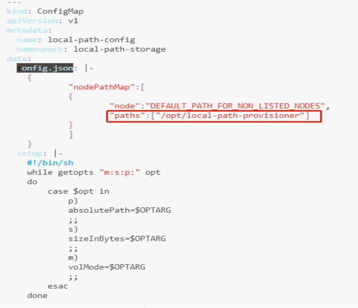
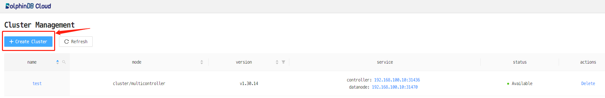
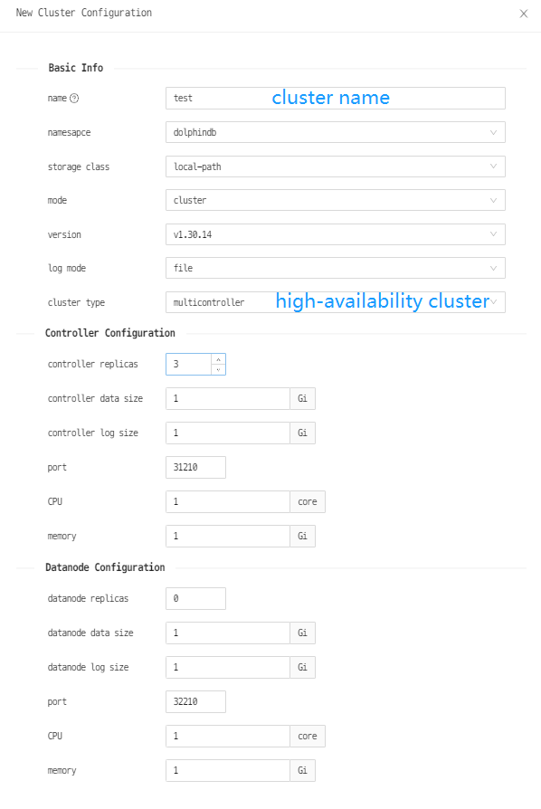
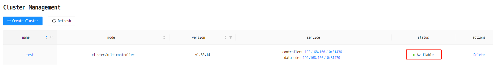
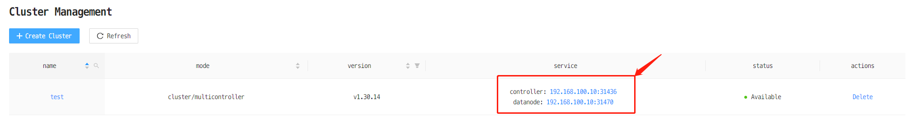
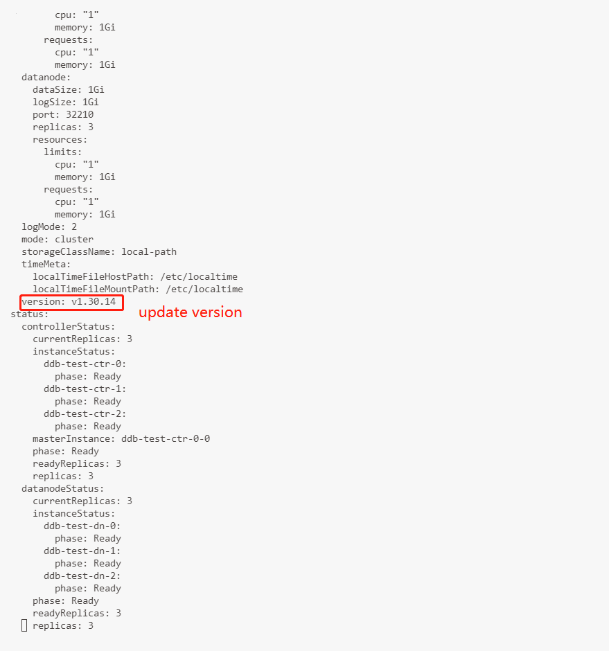
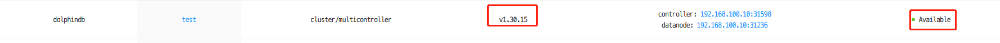
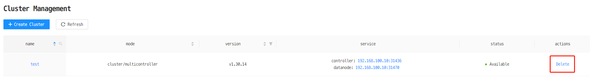

# Deploy DolphinDB on Kubernetes

Kubernetes, also known as K8s, is an open-source system for automating deployment, scaling, and management of containerized applications. DolphinDB-MGR (including DolphinDB-Operator and DolphinDB-Webserver) is an automated system deployed in Kubernetes for DolphinDB cluster operation and maintenance. It provides full lifecycle management including deployment, upgrade, scaling, and configuration changes. With DolphinDB-MGR, you can run DolphinDB seamlessly on a Kubernetes cluster deployed on-premise or in public cloud.

- [Deploy DolphinDB on Kubernetes](#deploy-dolphindb-on-kubernetes)
  - [1. Introduction to DolphinDB-MGR](#1-introduction-to-dolphindb-mgr)
  - [2. Quick Deployment of DolphinDB](#2-quick-deployment-of-dolphindb)
    - [2.1 Create a Kubernetes Cluster](#21-create-a-kubernetes-cluster)
    - [2.2 Deploy DolphinDB-MGR](#22-deploy-dolphindb-mgr)
    - [2.3 Deploy and Connect to DolphinDB Clusters](#23-deploy-and-connect-to-dolphindb-clusters)
    - [2.4 Upgrade DolphinDB Clusters](#24-upgrade-dolphindb-clusters)
    - [2.5 Delete Clusters](#25-delete-clusters)
    - [2.6 Uninstall DolphinDB-MGR](#26-uninstall-dolphindb-mgr)
  - [3. Enable Core Dump in Kubernetes](#3-enable-core-dump-in-kubernetes)
  - [4. FAQ](#4-faq)

## 1. Introduction to DolphinDB-MGR

DolphinDB runs as containerized applications in Kubernetes.

- Custom Resources: The custom resource ddb is an abstraction that describes DolphinDB in Kubernetes. It defines the properties that specify DolphinDB configurations in Kubernetes.
- Resource Management: The service component 'DolphinDB-Operator' manages the resources of DolphinDB in Kubernetes. It parses ddb into Pods, Services, ConfigMaps, etc., and monitors these resources in real time to make sure DolphinDB runs properly in Kubernetes.
- License Authentication: A license is required for authentication as a ConfigMap resource before running DolphinDB in Kubernetes. 

## 2. Quick Deployment of DolphinDB

The environment and software versions used in this tutorial are as follows:

- **Servers:** 3 servers on Alibaba Cloud with extranet IP addresses 192.168.100.10 (master), 192.168.100.11 (worker), and 192.168.100.12 (worker).
- **Operating System:** Linux (kernel version 3.10 and above)
- **Memory:** 8 GB
- **CPU:** x86_64 (8 cores)
- **Docker version:** `v20.10.12`. Deployed on all servers
- **Helm version:** `v3.7.2`. Deployed on all servers
- **Kubernetes version:** `v1.23.3`. Deployed on all servers
- **Kubectl and Kubeadm version:** `v1.21` and above. Deployed on all servers
- **DolphinDB-MGR version:** [`v1.0.0`](https://hub.docker.com/r/dolphindb/dolphindb-webserver/tags), official release. Only deployed on the master.

 

DolphinDB-MGR is a Helm package, which includes a collection of files describing DolphinDB resources and management components. Below are the key components:

- DolphinDB-Operator: custom resources manager
- DolphinDB-Webserver: web interface of cluster manager

This tutorial introduces how to create a Kubernetes cluster, deploy DolphinDB-MGR, and create a high-availability cluster with 3 controllers:

```
controller1  => agent1 => 1 datanode
controller2  => agent2 => 1 datanode
controller3  => agent3 => 1 datanode
```


### 2.1 Create a Kubernetes Cluster

Before creating a Kubernetes cluster, please set up Docker and Helm. Please refer to the official documentation of [Docker](https://docs.docker.com/install/) and [Helm](https://helm.sh/docs/intro/install/).

Once you install Docker, please execute the following Linux command. The installation is successful if the Docker version is displayed.

```
docker -v
```

Once you install Helm, execute the following Linux command. The installation is successful if the Helm version is displayed.

```
helm version
```

Below are 2 recommended ways to set up a Kubernetes cluster.

- Single-node Kubernetes cluster: see [minikube start](https://minikube.sigs.k8s.io/docs/start/)
- Multi-node Kubernetes cluster: see [Installing kubeadm](https://kubernetes.io/docs/setup/production-environment/tools/kubeadm/install-kubeadm/)

Once you install Kubernetes, execute the following Linux command. The installation is successful if the Kubernetes version is displayed.

```
kubectl version
```

###  2.2 Deploy DolphinDB-MGR

**Prerequisites:**

For hardware prerequisites, please see [Installing kubeadm](https://kubernetes.io/docs/setup/production-environment/tools/kubeadm/install-kubeadm/).

Software prerequisites:

- A Kubernetes cluster that can be accessed using kubectl (Kubeadm in this tutorial)
- Successful installation of [Helm](https://helm.sh/docs/intro/install/)
- Core dumps enabled in Kubernetes. See [Chap 3. Enable Core Dump in Kubernetes](#3-enable-core-dump-in-kubernetes)

To verify whether the installation is successful, see [Section 2.1 Create a Kubernetes Cluster](#21-create-a-kubernetes-cluster). This section will introduce the deployment process.

#### 2.2.1 Deploy Local Path Provisioner

[Local path provisioner](https://github.com/rancher/local-path-provisioner) can be used as a Container Storage Interface (CSI) for local paths in a Kubernetes environment to dynamically allocate PV using the node's local path.

> *Note: Local path provisioner only provides the user with Storage Class to create Persistent Volume Claims (PVC). It is not required for users with other types of CSI.*

(1) Download local-path-provisioner from GitHub.

```
wget https://raw.githubusercontent.com/rancher/local-path-provisioner/master/deploy/local-path-storage.yaml
```

Expected output

```
--2022-01-12 12:05:27--  https://raw.githubusercontent.com/rancher/local-path-provisioner/master/deploy/local-path-storage.yaml                              
Resolving raw.githubusercontent.com (raw.githubusercontent.com)... 185.199.108.133, 185.199.110.133, 185.199.109.133, ...                
Connecting to raw.githubusercontent.com (raw.githubusercontent.com)|185.199.108.133|:443... connected.          
HTTP request sent, awaiting response... 200 OK                          
Length: 3451 (3.4K) [text/plain]                                         
Saving to: ‘local-path-storage.yaml’                                     
100%[=================================================================================================================================================================================================>] 3,451        402B/s   in 8.6s                                                               
2022-01-12 12:09:35 (402 B/s) - ‘local-path-storage.yaml’ saved [3451/3451]
```

(2) Modify configuration:



The selected paths are for data persistence in the container (see [local-path-provisioner-configuration](https://github.com/rancher/local-path-provisioner#configuration))

> **Note:** To modify the local path for provisioning, find the config map "local-path-config" and specify a node path in the Kubernetes cluster for the selected "paths" under “data“. If more than one path was specified, the path would be chosen randomly when provisioning.

(3) Deploy in a Kubernetes environment:

```
kubectl apply -f  local-path-storage.yaml
```

Expected output

```
namespace/local-path-storage created
serviceaccount/local-path-provisioner-service-account created
clusterrole.rbac.authorization.k8s.io/local-path-provisioner-role created
clusterrolebinding.rbac.authorization.k8s.io/local-path-provisioner-bind created
deployment.apps/local-path-provisioner created
storageclass.storage.k8s.io/local-path created
configmap/local-path-config created
```

####  2.2.2 Install DolphinDB-MGR

DolphinDB-MGR is integrated into a Helm chart package “dolphidb-mgr” and stored in the Helm repository. You can install it with Helm.

(1) Add a chart repository

```
helm repo add dolphindb https://dolphindbit.github.io/helm-chart/
```

​	Expected output

```
"dolphindb" has been added to your repositories
```

(2) Install DolphinDB-MGR

```
helm install dolphindb-mgr dolphindb/dolphindb-mgr --set global.version="v1.0.0" --set global.serviceType=NodePort --set global.storageClass=local-path --set dolphindb-webserver.nodePortIP=192.168.100.10 --set-file license.content=$licensePath/license.lic  -ndolphindb --create-namespace
```

A license is required to start DolphinDB. Please add `license.content=$licensePath/license.lic` to the command and modify the path to where your license is located.

Expected output

```
NAME: dolphindb-mgr                                                     
LAST DEPLOYED: Wed Jan 12 14:39:11 2022                                 
NAMESPACE: dolphindb
STATUS: deployed
REVISION: 1
TEST SUITE: None
```

**Main Parameters:**

- `-ndolphindb --create-namespace`: deploy DolphinDB-MGR in the namespace "dolphindb" (create it if the namespace does not exist)

- `license.content`: the path of DolphinDB License

- `global.serviceType=NodePort, dolphindb-webserver.nodePortIP`: the service type provided by DolphinDB-MGR in Kubernetes. It can be:

  - clusterIP: Expose the Service on a cluster-internal IP. The service is only accessible within the cluster.

  - NodePort (default): Expose the Service on a static port of each node. The service is accessible from outside the cluster by requesting `<NodeIP>:<NodePort>`.

  - LoadBalancer: Expose the Service externally using a cloud provider's load balancer. The service is accessible from outside the cluster through load balancer in Kubernetes.

    This tutorial adopts service of the *NodePort* type. Modify the parameter if you need to use other Services.

- `global.version`: DolphinDB-MGR version ([`v1.0.0`](https://hub.docker.com/r/dolphindb/dolphindb-operator/tags) in the example).

> **Note:** The DolphinDB License must be obtained officially. If you use an invalid license, error "persistentvolumeclaim log-ddb-t3-crt-0-0 not found" will occur.

**Other Parameters:**

| **Parameters**                     | **Descriptions**                                             |
| :--------------------------------- | :----------------------------------------------------------- |
| `global.registry`                  | The container registry. The images are pulled from Docker Hub if unspecified. |
| `global.repository`                | The image repository. Do not change it unless necessary.     |
| `global.storageClass`              | The StorageClass to provision persistent volumes. The default StorageClass is used if unspecified. |
| `global.serviceAccount`            | The RBAC resource ServiceAccount. Do not change it unless necessary. |
| `global.allNamespace`              | Whether DolphinDB can run in all namespaces. *true* means DolphinDB can be deployed and managed in all namespaces; *false* means it can only be deployed and managed in the current namespace. |
| `dolphindb-operator.replicaCount`  | The number of replicas of DolphinDB-Operator                 |
| `dolphindb-operator.imageTag`      | DolphinDB-Operator version. It is the same as `global.version` if unspecified. |
| `dolphindb-webserver.replicaCount` | The number of replicas of DolphinDB-Webserver                |
| `dolphindb-webserver.imageTag`     | DolphinDB-Webserver version. It is the same as `global.version` if unspecified. |
| `dolphindb-webserver.nodePortIP`   | The IP address exposed by DolphinDB-Webserver. The parameter is required if `global.serviceType` is NodePort. It can be IP address of any node in the cluster. |
| `dolphindb.version`                | The default DolphinDB server version                         |
| `dolphindb.serviceType`            | The service types provided by DolphinDB in Kubernetes. See `global.serviceType`. |
| `dolphindb.controllerDataSize`     | The default size of the persistent data stored in each DolphinDB controller. |
| `dolphindb.datanodeDataSize`       | The default size of the persistent data stored in each DolphinDB data node. |
| `license.name`                     | The name of the ConfigMap for DolphinDB License. Do not change it unless necessary. |
| `license.resources`                | The default CPU and memory configurations for each DolphinDB container. It should be consistent with the DolphinDB License. |

(3) Check DolphinDB-MGR deployment

```
helm list -ndolphindb
```

​	Expected output

```
NAME          NAMESPACE     REVISION    UPDATED                               STATUS          CHART                   APPVERSION 
dolphindb-mgr DolphinDB     1           2022-01-12 14:39:11.493079194+0800CST deployed        dolphindb-mgr-v1.0.0    1.0.0
```

(4) Check if all pods are running

```
kubectl get pods -ndolphindb
```

​	Expected output


```shell
NAME                                   READY   STATUS    RESTARTS   AGE                                                         
dolphindb-operator-0                   1/1     Running   0          20m                                                         
dolphindb-operator-1                   1/1     Running   0          12m                                                         
dolphindb-webserver-5487785cfd-msr5w   1/1     Running   0          20m                                                         
dolphindb-webserver-5487785cfd-ns5dq   1/1     Running   0          20m
```

**Note:** DolphinDB-MGR is successfully deployed when the helm install command returns 'deployed' status and pods are running.


### 2.3 Deploy and Connect to DolphinDB Clusters

#### 2.3.1 Web User Interface 

DolphinDB-MGR provides a web user interface, which is hosted by a nodeport service by default. After successfully deploying DolphinDB-MGR, look for "dolphindb-webserver" service in Kubernetes.

```
kubectl -ndolphindb get svc | grep dolphindb-webserver
```

Output:

```
dolphindb-webserver   NodePort    10.109.94.68    <none>        8080:30908/TCP   43m
```

You can visit the following link to access the interface:

```
http://$nodeIP:$NodePort/dolphindb-cloud
```

**Parameters:**

- **$nodeIP:** IP address of any node in the Kubernetes cluster.
- **$NodePort:** Port corresponding to the DolphinDB-Webserver displayed in the terminal ("30908" in this example).

**Note**: If you use minikube to deploy DolphinDB-MGR, please execute the following command:

```
kubectl port-forward svc/dolphindb-webserver 8080 -ndolphindb
```

In this example, the address is http://192.168.100.10:30908/dolphindb-cloud/


#### 2.3.2 Deploy DolphinDB Clusters

(1) Create a cluster



(2) Configure the cluster



> Note:
>
> 1. The CPU, memory, and other resources allocated to the controllers and data nodes cannot exceed the resources of the servers. Otherwise, the cluster cannot be created.
>
> 2. There are two ways to output the system log: stdout and output to files (recommended).
>
> 3. The controller replicas and data node replicas indicate the number of controllers and data nodes in the cluster to be created.
>
> 4. Comparatively, the standard PVC (PersistentVolumeClaims) is a more flexible way but local path is easier and recommended to use. This tutorial uses local path provisioner used as the Storage Class to dynamically provision Persistent Volume (PV).
>
> 5. The port refers to the container port to specify the port used in LoadBalancer.

(3) Wait till cluster is successfully deployed



The cluster is successfully deployed once the status turns "Available".

(4) Connect to a DolphinDB cluster



As shown above, the `<NodeIP>:<NodePort>` of the controller is `192.168.100.10:31436` and that of the data node is `192.168.100.10:31470`. Click the link to connect to the corresponding node. 

For a newly created cluster, if you want to connect to data nodes, you need to connect to the controller first, and [start data nodes in the web interface of cluster management](https://github.com/dolphindb/Tutorials_EN/blob/master/single_machine_cluster_deploy.md#334-start-the-web-based-cluster-manager).


> Note:
>
> Currently, the ports of NodePort Services are assigned randomly and it cannot be specified.

### 2.4 Upgrade DolphinDB Clusters

With DolphinDB-MGR, the rolling upgrade of DolphinDB clusters can be simplified.

To upgrade the DolphinDB clusters to version 1.30.15, execute the following command and manually modify the version to be 1.30.15.

```
kubectl edit ddb $ddbname -ndolphindb
```



As shown below, the cluster is upgraded to `v1.30.15` and the status is `Available`.


 Note:

> The functionality of upgrading DolphinDB in the web user interface is under development.

### 2.5 Delete Clusters

#### 2.5.1 Delete Kubernetes Clusters

To delete a Kubernetes cluster, please refer to [this page](https://kubernetes.io/docs/setup/production-environment/tools/kubeadm/create-cluster-kubeadm/#tear-down) if you create it using Kubeadm, and [this page](https://minikube.sigs.k8s.io/docs/commands/delete/) if you create it using Minikube. 

#### 2.5.2 Delete DolphinDB Clusters

There are 2 ways to delete DolphinDB clusters.

Method 1: Click on the Delete button in the web-based cluster manager



Method 2: Run the following command

```
kubectl delete ddb $ddbName  -ndolphindb
```

**Parameter:**

- **$ddbName:** DolphinDB cluster name

### 2.6 Uninstall DolphinDB-MGR

Run the following command to uninstall DolphinDB-MGR:

```
helm uninstall dolphindb-mgr -n dolphindb
```

## 3. Enable Core Dump in Kubernetes

If core dump is enabled, when a fatal or unhandled error occurs in DolphinDB, the system terminates abnormally and a core dump is generated. Execute the following command in Kubernetes to enable core dump on the host of DolphinDB container.

```
echo "/data/ddb/core/core.%p"  | sudo tee /proc/sys/kernel/core_pattern
```

`/data/ddb/core` is the path to save the core dumps in the container. If it conflicts with the current host configuration, specify the parameter *dolphindb.coreDumpDir* when deploying DolphinDB-MGR.

## 4. FAQ

(1) If a Pod is not created after creating a cluster, you can troubleshoot in the following ways:

```
kubectl get pod -nlphindb
kubectl describe pod $podName -ndolphindb
kubectl get statefulsets -n dolphindb
kubectl describe statefulsets -n dolphindb
```

(2) Pod in the Pending state is usually caused by insufficient resources. The reasons could be:

​		i. For a Pod using PV for storage, the StorageClass of the PVC does not exist or the capacity of PV is insufficient.

​		ii. You have insufficient CPUs or memories on the available nodes.

​		You can check the exact cause using `kubectl describe pod` command.

```
kubectl describe po -n ${namespace} ${pod_name}
```

 
