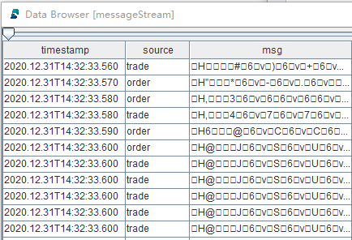
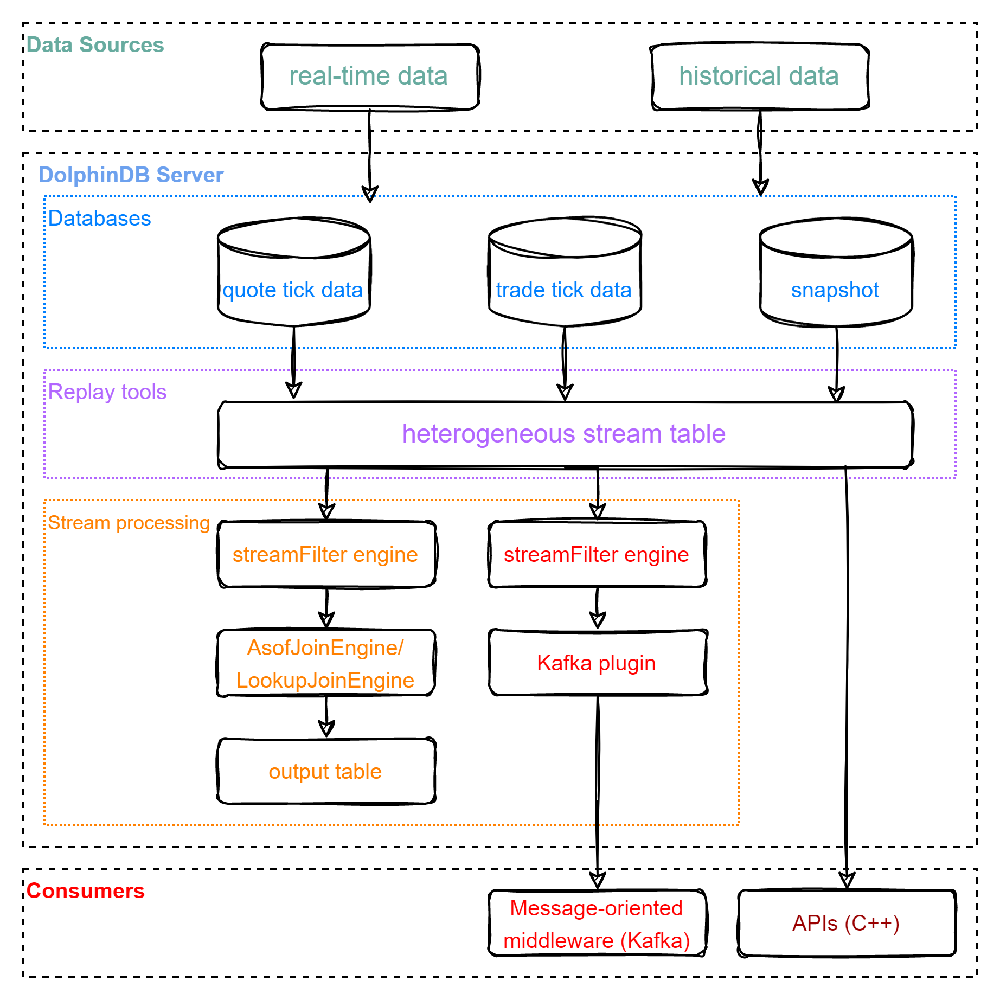
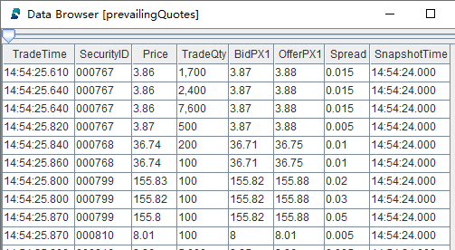
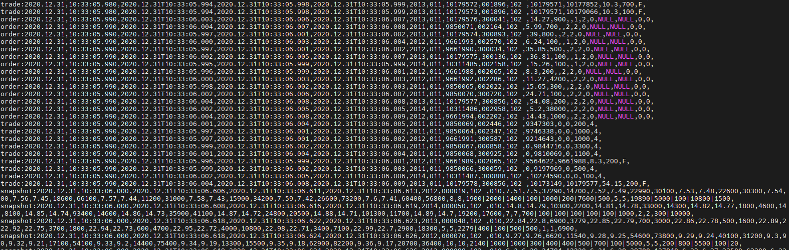

# Market Data Replay in DolphinDB

Tick data replay is critical for high-frequency trading strategy development. This tutorial introduces data replay in DolphinDB and gives detailed examples. An important feature is to ensure that data from multiple data sources (for examples, quotes and trades) is replayed to multiple tables in chronological order.

- [Market Data Replay in DolphinDB](#market-data-replay-in-dolphindb)
  - [1. Replay Types](#1-replay-types)
    - [1.1 1-to-1 Replay](#11-1-to-1-replay)
    - [1.2 N-to-N Replay](#12-n-to-n-replay)
    - [1.3 N-to-1 Replay](#13-n-to-1-replay)
  - [2. Replay Trades \& Quotes With Different Schemata](#2-replay-trades--quotes-with-different-schemata)
    - [2.1 Trades \& Quotes Replay and Consumption](#21-trades--quotes-replay-and-consumption)
    - [2.2 Test Data](#22-test-data)
    - [2.3 Trades \& Quotes Replay](#23-trades--quotes-replay)
    - [2.4 Replayed Data Consumption](#24-replayed-data-consumption)
      - [2.4.1 Consuming With DolphinDB Built-in Streaming Engine](#241-consuming-with-dolphindb-built-in-streaming-engine)
      - [2.4.2 Consuming with Kafka](#242-consuming-with-kafka)
      - [2.4.3 Consuming with DolphinDB C++ API](#243-consuming-with-dolphindb-c-api)
  - [3. Performance Testing](#3-performance-testing)
  - [4. Development Environment](#4-development-environment)
  - [5. Conclusion](#5-conclusion)
  - [Appendices](#appendices)


## 1. Replay Types

DolphinDB’s replay tools replay data at a certain rate to simulate real-time ingestion of stream data. To replay an in-memory table, use function `replay`. When replaying a DFS table with a large amount of data, if you load all data into memory first, you may have an out-of-memory problem. In such cases, you can use function `replayDS` to generate multiple data sources based on date (or date and time) and then use function `replay` to replay these data sources sequentially. 

There are 3 mapping types between the input table(s) and output table(s) : 1-to-1, N-to-1, and N-to-N.

### 1.1 1-to-1 Replay

**Replay a single table to a target table with the same schema.**

The following example replays data from table "trade" to table “tradeStream” at a rate of 10,000 records per second.

```python
tradeDS = replayDS(sqlObj=<select * from loadTable("dfs://trade", "trade") where Date = 2020.12.31>, dateColumn=`Date, timeColumn=`Time)
replay(inputTables=tradeDS, outputTables=tradeStream, dateColumn=`Date, timeColumn=`Time, replayRate=10000, absoluteRate=true)
```

### 1.2 N-to-N Replay

**Replay multiple tables to target tables.** Each of the output tables corresponds to an input table and has the same schema as the corresponding input table.

The following example replays data from three tables ("order", "trade", "snapshot") to three target tables ("orderStream", "tradeStream", "snapshotStream") at a rate of 10,000 records per second:

```python
orderDS = replayDS(sqlObj=<select * from loadTable("dfs://order", "order") where Date = 2020.12.31>, dateColumn=`Date, timeColumn=`Time)
tradeDS = replayDS(sqlObj=<select * from loadTable("dfs://trade", "trade") where Date = 2020.12.31>, dateColumn=`Date, timeColumn=`Time)
snapshotDS = replayDS(sqlObj=<select * from loadTable("dfs://snapshot", "snapshot") where Date =2020.12.31>, dateColumn=`Date, timeColumn=`Time)
replay(inputTables=[orderDS, tradeDS, snapshotDS], outputTables=[orderStream, tradeStream, snapshotStream], dateColumn=`Date, timeColumn=`Time, replayRate=10000, absoluteRate=true)
```

### 1.3 N-to-1 Replay

**Replay multiple tables to one table.** Prior to version 1.30.7/2.00.5, replay only supports inputting tables with the same schema, which is called homogeneous replay. Starting from version 1.30.17/2.00.5, heterogeneous replay is supported to replay multiple data sources with different schemata to the same output table. 

Different from N-to-1 homogeneous replay and N-to-N replay, the *inputTables* of heterogeneous replay is a dictionary. The key of the dictionary is the unique identifier of the input table, and the value is the table object or data source.

The following example replays data from three tables ("order", "trade", "snapshot") with different schemata to one target table ("messageStream") at a rate of 10,000 records per second:

```python
orderDS = replayDS(sqlObj=<select * from loadTable("dfs://order", "order") where Date = 2020.12.31>, dateColumn=`Date, timeColumn=`Time)
tradeDS = replayDS(sqlObj=<select * from loadTable("dfs://trade", "trade") where Date = 2020.12.31>, dateColumn=`Date, timeColumn=`Time)
snapshotDS = replayDS(sqlObj=<select * from loadTable("dfs://snapshot", "snapshot") where Date =2020.12.31>, dateColumn=`Date, timeColumn=`Time)
inputDict = dict(["order", "trade", "snapshot"], [orderDS, tradeDS, snapshotDS])
replay(inputTables=inputDict, outputTables=messageStream, dateColumn=`Date, timeColumn=`Time, replayRate=10000, absoluteRate=true)
```

The output table "messageStream" has the following schema:

| name    | typeString | comment                                  |
| ------- | ---------- | ---------------------------------------- |
| timestamp | TIMESTAMP  | The timestamp specified by *dateColumn*/*timeColumn*                                |
| source | SYMBOL     | The unique identifier of data sources ("order", "trade", "snapshot") |
| msg | BLOB       | The serialized result of each replayed record (in binary format)               |

Part of the table "messageStream":



Such schema guarantees multiple data sources are replayed in strict chronological order, and replayed data (stored in the same table "messageStream") can also be processed by a single thread in chronological order.

To process data in table "messageStream" (e.g., calculating metrics), deserialize the replayed records (column "msg" above). DolphinDB supports deserializing data in heterogeneous stream tables with built-in function `streamFilter` or DolphinDB APIs.

## 2. Replay Trades & Quotes With Different Schemata

Examples of N-to-1 heterogenous replay in this chapter show how to replay and process market data (trades, quotes, snapshot) in DolphinDB.

### 2.1 Trades & Quotes Replay and Consumption

The figure below is the market data replay flowchart:



The replay processing has two major phases: replay and consumption.

(1) Replay data stored in multiple databases to a stream table in DolphinDB server;

(2) The stream table can be consumed with:
- DolphinDB built-in streaming engines to calculate metrics;
- Kafka (message-oriented middleware) through DolphinDB Kafka plugin;
- DolphinDB APIs.

### 2.2 Test Data

The example in this tutorial replays Shanghai Stock Exchange market data of a given day. 

The following chart displays the data we use in the example (which is stored in TSDB databases):

| Data          | The number of columns | The number of records   | Data size | Table     | Partitioning scheme   | Sort column         |
| -------------- | ------ | -------- | -------- | -------- | -------------------------------- | -------------- |
| quote tick data <br>(*dfs://order*)       | 20     | 49018552 | 6.8G     | order    | VALUE: trade date; HASH: [SYMBOL, 20] | Time; SecurityID |
| trade tick data<br>(*dfs://trade*)       | 15     | 43652718 | 3.3G     | trade    | VALUE: trade date; HASH: [SYMBOL, 20] | Time; SecurityID |
| snapshots of level 2 tick data<br>(*dfs://snapshot*) | 55     | 8410359  | 4.1G     | snapshot | VALUE: trade date; HASH: [SYMBOL, 20] | Time; SecurityID |

### 2.3 Trades & Quotes Replay

We use DolphinDB GUI to implement all scripts in this example. For details about test environment configuration, see [Chapter 4: Development Environment](#4-development-environment).

In this section, we replay three tables with different schemata to a single stream table. See full scripts in [01. MarketDataReplay](script/market_data_replay/01.marketDataReplay.txt).

- Define the shared stream table "messageStream".

```python
colName = `timestamp`source`msg
colType = [TIMESTAMP,SYMBOL, BLOB]
messageTemp = streamTable(1000000:0, colName, colType)
enableTableShareAndPersistence(table=messageTemp, tableName="messageStream", asynWrite=true, compress=true, cacheSize=1000000, retentionMinutes=1440, flushMode=0, preCache=10000)
messageTemp = NULL
```

- Replay three tables ("order", "trade", "snapshot") to the stream table "messageStream" and execute the replay function as a background job using function `submitJob`. 

```python
timeRS = cutPoints(09:15:00.000..15:00:00.000, 100)
orderDS = replayDS(sqlObj=<select * from loadTable("dfs://order", "order") where Date = 2020.12.31>, dateColumn=`Date, timeColumn=`Time, timeRepartitionSchema=timeRS)
tradeDS = replayDS(sqlObj=<select * from loadTable("dfs://trade", "trade") where Date = 2020.12.31>, dateColumn=`Date, timeColumn=`Time, timeRepartitionSchema=timeRS)
snapshotDS = replayDS(sqlObj=<select * from loadTable("dfs://snapshot", "snapshot") where Date =2020.12.31>, dateColumn=`Date, timeColumn=`Time, timeRepartitionSchema=timeRS)
inputDict = dict(["order", "trade", "snapshot"], [orderDS, tradeDS, snapshotDS])

submitJob("replay", "replay stock market", replay, inputDict, messageStream, `Date, `Time, , , 3)
```

The above script has tuned the replay function with the following parameters:

- *timeRepartitionSchema* (of `replayDS`) deliminates multiple data sources based on "timeColumn" within each date. The SQL query job is broken down into multiple tasks.

With parameter *timeRepartitionSchema* specified, each table in the above example is divided into 100 data sources based on the "Time" column within date "2020.12.31". Each data source is loaded by a query task, which prevents the out-of-memory problem.

If *timeRepartitionSchema* is not specified, the SQL query is as follows:

```python
select * from loadTable("dfs://order", "order") where Date = 2020.12.31 order by Time
```

If *timeRepartitionSchema* is specified, the SQL query is as follows:

```python
select * from loadTable("dfs://order", "order") where Date = 2020.12.31, 09:15:00.000 <= Time < 09:18:27.001 order by Time
```

- *parallelLevel* (of `replay`) is the number of threads loading data into memory from data sources. The default value is 1.

With *parallelLevel* parameter set to 3 in the above example, multiple data sources are loaded by three threads in parallel, thus improving performance of query.

After submitting the replay job, check its status with the `getRecentJobs` function. In case you need to cancel the replay, use the `cancelJob` function with the job ID obtained from `getRecentJobs`.

If there is no available data, you can get started with the sample data listed in Appendices.
> Replace "/yourDataPath/" in the following script with path where csv files are stored.

```python
orderDS = select * from loadText("/yourDataPath/replayData/order.csv") order by Time
tradeDS = select * from loadText("/yourDataPath/replayData/trade.csv") order by Time
snapshotDS = select * from loadText("/yourDataPath/replayData/snapshot.csv") order by Time
inputDict = dict(["order", "trade", "snapshot"], [orderDS, tradeDS, snapshotDS])

submitJob("replay", "replay text", replay, inputDict, messageStream, `Date, `Time, , , 1)
```

### 2.4 Replayed Data Consumption

#### 2.4.1 Consuming With DolphinDB Built-in Streaming Engine

In the following example, we define asof join engine that returns the as of join result of trade and snapshot (from "messageStream") to calculate the transaction cost. See full scripts in [02. CalculateTxnCost_asofJoin](script/market_data_replay/02.calculateTxnCost_asofJoin.txt).

- Define the shared stream table "prevailingQuotes" as the output table.

```python
colName = `TradeTime`SecurityID`Price`TradeQty`BidPX1`OfferPX1`Spread`SnapshotTime
colType = [TIME, SYMBOL, DOUBLE, INT, DOUBLE, DOUBLE, DOUBLE, TIME]
prevailingQuotesTemp = streamTable(1000000:0, colName, colType)
enableTableShareAndPersistence(table=prevailingQuotesTemp, tableName="prevailingQuotes", asynWrite=true, compress=true, cacheSize=1000000, retentionMinutes=1440, flushMode=0, preCache=10000)
prevailingQuotesTemp = NULL
```

- Define the asof join engine. The user-defined function createSchemaTable is used to get the table schema and use it as a parameter of [createAsofJoinEngine](https://www.dolphindb.com/help200/FunctionsandCommands/FunctionReferences/c/createAsofJoinEngine.html).

```python
def createSchemaTable(dbName, tableName){
	schema = loadTable(dbName, tableName).schema().colDefs
	return table(1:0, schema.name, schema.typeString)
}
tradeSchema = createSchemaTable("dfs://trade", "trade")
snapshotSchema = createSchemaTable("dfs://snapshot", "snapshot")

joinEngine=createAsofJoinEngine(name="tradeJoinSnapshot", leftTable=tradeSchema, rightTable=snapshotSchema, outputTable=prevailingQuotes, metrics=<[Price, TradeQty, BidPX1, OfferPX1, abs(Price-(BidPX1+OfferPX1)/2), snapshotSchema.Time]>, matchingColumn=`SecurityID, timeColumn=`Time, useSystemTime=false, delayedTime=1)
```

For each stock, the asof join engine matches each record of table "trade" with the most recent record from table "snapshot", and then you can calculate transaction costs with the price and quote.

Considering the common practice, we set parameter useSystemTime to false in the above script to perform asof join based on the "timeColumn".

Alternatively, you can set parameter useSystemTime to true or use [lookup join engine](https://www.dolphindb.cn/cn/help/200/FunctionsandCommands/FunctionReferences/c/createLookupJoinEngine.html) (see full script in [03. CalculateTxnCost_lookupJoin](script/market_data_replay/03.calculateTxnCost_lookupJoin.txt)).

- Define a stream filter engine.

```python
def appendLeftStream(msg){
	tempMsg = select * from msg where Price > 0 and Time>=09:30:00.000
	getLeftStream(getStreamEngine(`tradeJoinSnapshot)).tableInsert(tempMsg)
}
filter1 = dict(STRING,ANY)
filter1["condition"] = "trade"
filter1["handler"] = appendLeftStream
filter2 = dict(STRING,ANY)
filter2["condition"] = "snapshot"
filter2["handler"] = getRightStream(getStreamEngine(`tradeJoinSnapshot))
schema = dict(["trade", "snapshot"], [tradeSchema, snapshotSchema])
engine = streamFilter(name="streamFilter", dummyTable=messageStream, filter=[filter1, filter2], msgSchema=schema)
```

The ingested data is deserialized according to parameter *msgSchema* and processed based on the handler of parameter *filter*. The serial execution of multiple handlers guarantees the strict chronological order of data processing.

The "messageStream" table is splitted into two streams. Table "trade" is processed with user-defined function appendLeftStream before it is ingested into asof join engine as the left table. Table "snapshot" is directly ingested into asof join engine as the right table.

- Subscribe to the replayed data (heterogeneous stream table)

```python
subscribeTable(tableName="messageStream", actionName="tradeJoinSnapshot", offset=-1, handler=engine, msgAsTable=true, reconnect=true)
```

With parameter *offset* set to -1, the subscription starts with the next new message. To consume data from the first record, it is recommended to submit the subscription first and replay as background job afterwards.

- Check the result



Within each group of the *matchingColumn* (“SecurityID”), the order of the output is the same as the order of the input.

#### 2.4.2 Consuming with Kafka

In the following example, we send subscribed table (“messageStream”) to Kafka consumer. 

You need to start Kafka server and install DolphinDB Kafka Plugin first. For details about test environment configuration, see [Chapter 4: Development Environment](#4-development-environment). For full scripts about this example, see [04. SendMsgToKafka](script/market_data_replay/04.sendMsgToKafka.txt).

- Load Kafka Plugin and define a Kafka producer

```python
loadPlugin("/DolphinDB/server/plugins/kafka/PluginKafka.txt")
go
producerCfg = dict(STRING, ANY)
producerCfg["metadata.broker.list"] = "localhost"
producer = kafka::producer(producerCfg)
```

Replace the *loadPlugin* path and you can modify *producerCfg* as required. Kafka and DolphinDB server are on the same server, thus, the *metadata.broker.list* parameter is set as localhost.

- Define the function to send messages to Kafka topic

```python
def sendMsgToKafkaFunc(dataType, producer, msg){
	startTime = now()
	try {
		kafka::produce(producer, "topic-message", 1, msg, true)
		cost = now() - startTime
		writeLog("[Kafka Plugin] Successed to send" + dataType + ":" + msg.size() + "rows," + cost + "ms.")
	}
	catch(ex) {writeLog("[Kafka Plugin] Failed to send msg to kafka with error:" +ex)}
}
```

Function `kafka::produce` sends messages of any table schema in json format to specified Kafka topic. You can check the status of a batch of messages sent previously with the `writeLog` function.

You can consume subscribed data after sending messages to Kafka.

- Define a stream filter engine

```python
filter1 = dict(STRING,ANY)
filter1["condition"] =  "order"
filter1["handler"] = sendMsgToKafkaFunc{"order", producer}
filter2 = dict(STRING,ANY)
filter2["condition"] = "trade"
filter2["handler"] = sendMsgToKafkaFunc{"trade", producer}
filter3 = dict(STRING,ANY)
filter3["condition"] = "snapshot"
filter3["handler"] = sendMsgToKafkaFunc{"snapshot", producer}

schema = dict(["order","trade", "snapshot"], [loadTable("dfs://order", "order"), loadTable("dfs://trade", "trade"), loadTable("dfs://snapshot", "snapshot")])

engine = streamFilter(name="streamFilter", dummyTable=messageStream, filter=[filter1, filter2, filter3], msgSchema=schema)
```

The ingested data is deserialized according to parameter *msgSchema* and processed based on the handler of parameter *filter*. The serial execution of multiple handlers guarantees the strict chronological order of data processing.

sendMsgToKafka{"order", producer} is a partial application of functional programming, which fixes part of the parameters of the sendMsgToKafka function to generate a new function with fewer parameters.

- Subscribe to the replayed data (heterogeneous stream table)

```python
subscribeTable(tableName="messageStream", actionName="sendMsgToKafka", offset=-1, handler=engine, msgAsTable=true, reconnect=true)
```

With parameter *offset* set to -1, the subscription starts with the next new message. To consume data from the first record, it is recommended to submit the subscription and then to submit the replay as the background job.

- Check the result in the terminal

Start consumption from the first topic named “topic-message”.

```
./bin/kafka-console-consumer.sh --bootstrap-server localhost:9092 --from-beginning --topic topic-message
```

Return:


#### 2.4.3 Consuming with DolphinDB C++ API

The following example uses function `ThreadedClient::subscribe` to subscribe to the replayed data ("messageStream") and outputs results in real-time. 

To run the script below, you have to install C++ API first (refer to [Chapter 4: Development Environment](#4-development-environment)). For full scripts about this example, see [05. SubscribeInCppApi](script/market_data_replay/05.subscribeInCppApi.cpp).

```c++
int main(int argc, char *argv[]){
    DBConnection conn;
    string hostName = "127.0.0.1";
    int port = 8848;
    bool ret = conn.connect(hostName, port);

    conn.run("login(\"admin\", \"123456\")");
    DictionarySP t1schema = conn.run("loadTable(\"dfs://snapshotL2\", \"snapshotL2\").schema()");
    DictionarySP t2schema = conn.run("loadTable(\"dfs://trade\", \"trade\").schema()");
    DictionarySP t3schema = conn.run("loadTable(\"dfs://order\", \"order\").schema()");

    unordered_map<string, DictionarySP> sym2schema;
    sym2schema["snapshot"] = t1schema;
    sym2schema["trade"] = t2schema;
    sym2schema["order"] = t3schema;
    StreamDeserializerSP sdsp = new StreamDeserializer(sym2schema);
    auto myHandler = [&](Message msg) {
            const string &symbol = msg.getSymbol();
            cout << symbol << ":";
            size_t len = msg->size();
            for (int i = 0; i < len; i++) {
                    cout <<msg->get(i)->getString() << ",";
            }
            cout << endl;
    };

    int listenport = 10260;
    ThreadedClient threadedClient(listenport);
    auto thread = threadedClient.subscribe(hostName, port, myHandler, "messageStream", "printMessageStream", -1, true, nullptr, false, false, sdsp);
    cout<<"Successed to subscribe messageStream"<<endl;
    thread->join();

    return 0;
}
```

Instance `StreamDeserializerSP` is specified as a parameter (*filter*) of function `ThreadedClient::subscribe`. Therefore, when subscribing, the ingested data is deserialized and sent to the user-defined callback function `myHandler`.

The *listenport* parameter is the subscription port for the single-threaded client, you can set any free port of the server where the C++ program is hosted.

- Check the result in the terminal



**Note**:

If the script (in section 2.3 and 2.4) is executed repeatedly, the overwrite error may be thrown. Therefore, you have to remove all objects that are stored in your environment ( including operations such as unsubscribing tables, droping stream tables and streaming engines, etc.) To clean your environment, see [06. RemoveObjectsFromEnvironment](script/market_data_replay/06.removeObjectsFromEnvironment.txt).

## 3. Performance Testing

A performance testing is conducted for heterogeneous replay.

For details about test environment configuration, see[Chapter 4: Development Environment](#4-development-environment).

Test data: see section 2.2 for more information.

Test script: 

```python
timeRS = cutPoints(09:15:00.000..15:00:00.000, 100)
orderDS = replayDS(sqlObj=<select * from loadTable("dfs://order", "order") where Date = 2020.12.31>, dateColumn=`Date, timeColumn=`Time, timeRepartitionSchema=timeRS)
tradeDS = replayDS(sqlObj=<select * from loadTable("dfs://trade", "trade") where Date = 2020.12.31>, dateColumn=`Date, timeColumn=`Time, timeRepartitionSchema=timeRS)
snapshotDS = replayDS(sqlObj=<select * from loadTable("dfs://snapshot", "snapshot") where Date =2020.12.31>, dateColumn=`Date, timeColumn=`Time, timeRepartitionSchema=timeRS)
inputDict = dict(["order", "trade", "snapshot"], [orderDS, tradeDS, snapshotDS])

submitJob("replay", "replay stock market", replay{inputDict, messageStream, `Date, `Time, , , 3})
```
With the maximum speed (*replayRate* is unspecified) and no subscriptions to the output table, it takes 4m18s to replay 101,081,629 records. Around 390,000 records are replayed per second and the maximum memory usage reaches 4.7GB.

## 4. Development Environment

**Server**

- Processor family: Intel(R) Xeon(R) Silver 4216 CPU @ 2.10GHz
- CPU(s): 8
- Memory: 64GB
- OS: 64-bit CentOS Linux 7 (Core)

**DolphinDB server**

- Server Version: 2.00.6
- Deployment: standalone mode (see [standalone deployment](https://github.com/dolphindb/Tutorials_EN/blob/master/standalone_deployment.md))
- Configuration：dolphindb.cfg

```
localSite=localhost:8848:local8848
mode=single
maxMemSize=32
maxConnections=512
workerNum=8
maxConnectionPerSite=15
newValuePartitionPolicy=add
webWorkerNum=2
dataSync=1
persistenceDir=/DolphinDB/server/persistenceDir
maxPubConnections=64
subExecutors=16
subPort=8849
subThrottle=1
persistenceWorkerNum=1
lanCluster=0
```

> Note: Replace configuration parameter persistenceDir with your own path.

**DolphinDB client**

- Processor family: Intel(R) Core(TM) i7-7700 CPU @ 3.60GHz 3.60 GHz
- CPU(s): 8
- Memory: 32GB
- OS: Windows 10 Pro
- DolphinDB GUI Version: 1.30.15

See [GUI Manual](https://www.dolphindb.cn/cn/gui/index.html) to install DolphinDB GUI.

**DolphinDB Kafka Plugin**

- Kafka Plugin Version: release 200

> It is recommended installing Kafka plugin with the version corresponding to DolphinDB server. For example, install the Kafka plugin of release 200 for the DolphinDB server V2.00.6.

For information about installing and using Kafka plugin, see [Kafka plugin](https://github.com/dolphindb/DolphinDBPlugin/blob/release200/kafka/README.md).

**Kafka server**

- zookeeper Version: 3.4.6
- Kafka Version: 2.12-2.6.2
- Deployment: standalone mode
- Create the Kafka topic

```
./bin/kafka-topics.sh --create --zookeeper localhost:2181 --replication-factor 1 --partitions 4 --topic topic-message
```

**DolphinDB C++ API**

- C++ API Version: release200

> It is recommended installing C++API with the version corresponding to DolphinDB server. For example, install the API of release 200 for the DolphinDB server V2.00.6.

For instruction on installing and using C++ API, see [C++ API](https://github.com/dolphindb/api-cplusplus/blob/master/README.md).

## 5. Conclusion

This tutorial introduces how to simulate real-time ingestion of stream data, which provides the solution to market data replay and real-time data consumption. On a practical basis, users can quickly build a system for tick data replay.

## Appendices

- [01. marketDataReplay](script/market_data_replay/01.marketDataReplay.txt)
- [02. calculateTxnCost_asofJoin](script/market_data_replay/02.calculateTxnCost_asofJoin.txt)
- [03. calculateTxnCost_lookupJoin](script/market_data_replay/03.calculateTxnCost_lookupJoin.txt)
- [04. sendMsgToKafka](script/market_data_replay/04.sendMsgToKafka.txt)
- [05. subscribeInCppApi](script/market_data_replay/05.subscribeInCppApi.cpp)
- [06. removeObjectsFromEnvironment](script/market_data_replay/06.removeObjectsFromEnvironment.txt)
- [Sample data](https://www.dolphindb.com/downloads/docs/stock_market_replay.zip)
