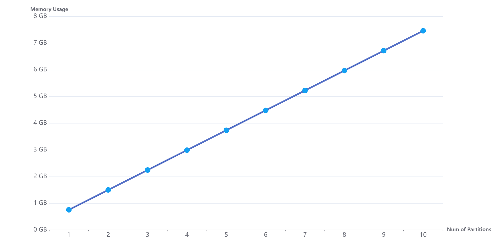

# DolphinDB Tutorial: Memory Management

This tutorial explains memory management in DolphinDB. 

- [DolphinDB Tutorial: Memory Management](#dolphindb-tutorial-memory-management)
  - [1. Important Memory-related Configuration Parameters](#1-important-memory-related-configuration-parameters)
  - [2. How to Optimize Memory Usage](#2-how-to-optimize-memory-usage)
  - [3. Memory Monitoring and Troubleshooting](#3-memory-monitoring-and-troubleshooting)
    - [3.1 Memory Monitoring](#31-memory-monitoring)
    - [3.2 Troubleshooting](#32-troubleshooting)
  - [4. Using Variables](#4-using-variables)
    - [4.1 Creating Variables](#41-creating-variables)
    - [4.2 Releasing Memory of Variables](#42-releasing-memory-of-variables)
  - [5. Read Cache for DFS Databases](#5-read-cache-for-dfs-databases)
    - [5.1 The OLAP Storage Engine](#51-the-olap-storage-engine)
    - [5.2 The TSDB Storage Engine](#52-the-tsdb-storage-engine)
  - [6. Write Cache for DFS Databases](#6-write-cache-for-dfs-databases)
    - [6.1 The OLAP Storage Engine](#61-the-olap-storage-engine)
    - [6.2 The TSDB Storage Engine](#62-the-tsdb-storage-engine)
  - [7. Message Queues for Streaming Data Processing](#7-message-queues-for-streaming-data-processing)

## 1. Important Memory-related Configuration Parameters

DolphinDB implements [TCMalloc](https://google.github.io/tcmalloc/) for memory allocation. It requests a memory block of 512MB from the operating system (OS) each time. If the OS cannot provide a memory block of 512MB, it will provide a memory block of 256MB, 128MB or less. DolphinDB scans the memory blocks every 30 seconds to release the idle ones. If a memory block is partially in use (for example, 10MB of a 512MB block is in use), then it will not be released.

DolphinDB provides the following configuration parameters related to memory management:

__*maxMemSize* for setting the maximum memory usage for DolphinDB on each node__ - If *maxMemSize* is set too small, it can severely limit the performance of the cluster. On the other hand, if *maxMemSize* exceeds the physical memory on your machine, the OS may kill the process when the memory usage is too high. It is recommended that the sum of the maximum memory usage of the data nodes on a server be set to 75% of the machine's total available memory. For example, if the machine has 16GB of memory and only 1 node is deployed, it is recommended to set *maxMemSize* to about 12GB.

__*warningMemSize* for setting the maximum cache size__ - As long as a node's memory usage hasn't reached *warningMemSize* (defaults to 75% of *maxMemSize*, specified in GB), DolphinDB will cache the data used in queries to speed up future queries on the same data. When the memory usage exceeds *warningMemSize*, the system will discard the least recently used (LRU) data from memory to avoid out-of-memory (OOM) exceptions.

__*reservedMemSize* and *maxBlockSizeForReservedMemory* for protecting critical operations__ - Insufficient available memory may lead to read and write failures, OOM errors, etc. With these two parameters, you can restrict the memory allocation for each memory request to improve the likelihood that there are enough memory for critical operations that use a small amount of memory (error reporting, rollbacks, etc.). For example, when data writes fail due to insufficient memory, the transactions can be rolled back to guarantee data consistency.

__*memoryReleaseRate* for specifying the rate at which unused memory is released to the OS__ - It is a floating point number between 0 to 10. 0 means DolphinDB never releases memory back to the operating system. Increase *memoryReleaseRate* to return memory faster; decrease it to return memory slower. The default value is 5.

__*maxPartitionNumPerQuery* for setting the maximum amount of partitions that a single query can use__ - By default, a query can use up to 65,536 partitions. If too many partitions are queried at once, too much data need to be loaded into memory and this may result in OOM errors.

<!--For more information about the configuration parameters for memory management, see "Memory-related Parameters" in the [user guide](https://dolphindb.com/help/DatabaseandDistributedComputing/Configuration/StandaloneMode.html).-->


## 2. How to Optimize Memory Usage

Improper operations may exhaust memory and lead to OOM exceptions. Please pay attention to the following guidelines:

- __Carefully design your partitioning scheme__: A well-designed partitioning scheme with data evenly distributed across partitions would optimize memory usage and query performance. The amount of data of a partition before compression is recommended to be between 100MB and 1GB. For more informatin about database partitioning, see [DolphinDB Partitioned Database Tutorial](https://github.com/dolphindb/Tutorials_EN/blob/master/database.md).
- __Undefine large variables when they are no longer needed__: When you create a variable with a large size (e.g., `v = 1..10000000`), or assign a large amount of data returned by a query to a variable (e.g., `t = select * from pt where date = 2010.01.01`), these variables will occupy a lot of memory. If the occupied memory is not released, the system may not have sufficient memory for other queries. It is recommended that once the variables are no longer needed,  call `undef()` or use "= NULL" to remove the variables from memory, or close the session to release the memory.
- __Query only the columns you need__: Avoid using `select *` in your query as it will load all columns in the partitions into memory. In most scenarios, querying only a few columns would be sufficient. To avoid wasting memory, please explicitly list the columns you want to retrieve in your query statement.
- __Use partitioning columns in the "where" clause__: Without specifying a "where" clause with at least one partitioning column, all partitions will be scanned and memory may be exhausted with a large table. Please always specify the "where" clause with at least one partitioning column. When there're multiple conditions in the "where" clause, put the ones involving the partitioning columns first.
- __Set a reasonable cache capacity for streaming data__: In general, the capacity of the stream table affects the memory usage on the publisher node. For example, when persisting stream table to disk, if the *cacheSize* is set to 10 million rows, then when the records ingested to the stream table reach 10 million rows, half of the records will be persisted to disk and then removed from memory, leaving about 5 million rows in the memory. Therefore, to optimize memory usage and avoid memory insufficiency, please carefully choose the capacity of a stream table, especially when there are more than one stream table on the publisher node.


## 3. Memory Monitoring and Troubleshooting

### 3.1 Memory Monitoring

#### 3.1.1 Monitor memory usage of all cluster nodes from the controller

Execute `getClusterPerf()` on the controller to check the memory usage of each node in the cluster, specifically:

- __memoryAlloc__: The total memory allocated to DolphinDB on the node, which is roughly equal to the total amount of memory requested from the operating system.
- __memoryUsed__: The memory used by the node, including the memory consumed by the variables, DFS tables, message queues, etc.
- __maxMemSize__: The maximum amount of memory that can be used by the node.

#### 3.1.2 Monitor memory usage of the current node

Execute `mem()` to display the memory usage of the current node. It returns a dictionary where *allocatedBytes* indicates the size of the allocated memory, and *freeBytes* indicates the size of the available memory. The total size of memory used by the node can be calculated via `mem().allocatedBytes - mem().freeBytes`. (**Note**: For 1.20.0 or earlier versions, execute `sum(mem().allocatedBytes - mem().freeBytes)`).

#### 3.1.3 Monitor the memory consumed by session variables on the current node

Execute `objs()` to view the variables in the current session. It returns a table of variables where the "bytes" column indicates the memory usage by the variables. In addition to the memory usage by the variables in the current session, `objs(true)` also returns the memory usage by shared variables (including variables shared by other sessions).

#### 3.1.4 View the size of memory occupied by a specific object

Execute `memSize()` to view the size (in bytes) of memory occupied by an object. For example:
```
v=1..1000000
memSize(v)
```
The output is 4000000 (bytes).

#### 3.1.5 Monitor the memory consumed by each session on the current node

Execute `getSessionMemoryStat()` to get the memory usage of each session on the current node. The result doesn't include memory usage of shared tables or DFS tables, as they don't belong to any particular user or session. As the result includes the "userId" for each session, you can get the memory usage of each user.

#### 3.1.6 View background jobs

The functions introduced above do not take into account the memory usage by the jobs running in the background. You can use `getRecentJobs()` to view the background jobs on the local node, which may use a lot of memory. Currently, DolphinDB doesn't provide any function to get the memory usage of background jobs. You may need to estimate their memory usage. If the memory usage of a node is very high, consider cancelling some nonurgent background jobs.

### 3.2 Troubleshooting

#### 3.2.1 Memory usage is too high 

If the memory usage of a node is close to *maxMemSize*, release all cached data on the node via `clearAllCache()`. If memory usage is still very high, check the following items: 

- Check if there are sessions consuming too much memory via `getSessionMemoryStat()` and identify the corresponding users. Execute `objs(true)` to identify the variables (including the variables shared by other sessions) occupying large amount of memory in the current session.

- Check if there are background jobs or interactive jobs running longer than expected via `getRecentJobs()` and `getConsoleJobs()`. The memory usage of these jobs is not reflected in the result of `getSessionMemoryStat()`.

- Check if the streaming data is consuming too much memory via `getStreamingStat()` (see section 7 "Caching Streaming Data").

#### 3.2.2 "Out of Memory" (OOM) exceptions

An OOM occurs often because a query requires more memory than the system can provide. Please first execute the following query to check the memory usage of all data nodes, where *maxMemSize* is the memory limit for the node, *memoryUsed* is the amount of memory consumed by the node, and *memoryAlloc* is the amount of memory allocated to the node.

```
select site, maxMemSize, memoryUsed, memoryAlloc from rpc(getControllerAlias(),getClusterPerf)
```

OOM exceptions usually have the following causes:

- The "where" clause doesn't specify any partitioning column or involves too many partitions. As a result, too much data needs to be loaded into memory.

Use `sqlDS()` to check how many partitions are involved in your query. For example:

```
ds=sqlDS(<select * from loadTable("dfs://demo","sensor")>)
ds.size()
```

To solve this issue, see **Use partitioning columns in the "where" clause** in section 2 "How to Optimize Memory Usage". For more information, see section 5 "Read Cache for DFS Databases".

- The write caches use too much memory.

```
getCacheEngineMemSize() //Check the memory consumed by the OLAP cache engine
getTSDBCacheEngineSize() //Check the memory consumed by the TSDB cache engine
```

For solution and more information, see section 6 “Write Cache for DFS Databases”.

- Data is not evenly distributed across partitions. A query that attempts to load a large partition into memory will cause OOM if the partition is larger than the available memory.

Use `getTabletsMeta()` to check the size of each partition. For example:

```
getTabletsMeta("/demo/%", `sensor, true);
```

To solve this issue, see **Carefully design your partitioning scheme** in section 2 "How to Optimize Memory Usage". For more information, see section 5 "Read Cache for DFS Databases".

- A session contains variables that occupy a large amount of memory on the node, leaving little space for other objects or operations.

Use `getSessionMemoryStat()` to check the size of memory used by each session and the corresponding users.

Execute the following script to check the variables and their memory usage on each node:

```
pnodeRun(objs) //Return the memory occupied by the non-shared variables of the current session
pnodeRun(objs{true}) //Return the memory occupied by the variables, including the shared variables
```

To solve this issue, see **Undefine large variables when they are no longer needed** in section 2 "How to Optimize Memory Usage". For more information, see section 4 "Using Variables".

- The streaming engines use too much memory.

Use `getStreamingStat()` to check the queue depth of the publishing queue and subscribing queues. Use `getStreamingEnghineStat()` to check the memory usage by streaming engines. 

To solve this issue, see **Set a reasonable cache capacity for streaming data** in section 2 "How to Optimize Memory Usage". For more information, see section 7 "Caching Streaming Data".

#### 3.2.3 DolphinDB exits and no core dump is generated

This issue is often due to the fact that the memory allocated to the node exceeds the system's physical memory limit and the operating system forces DolphinDB to quit. The Linux kernel has a mechanism called Out of Memory (OOM) Killer, which monitors the processes that occupy too much memory, especially the processes that suddenly take up a lot of memory. These processes will be automatically killed to prevent memory exhaustion. To check if DolphinDB exits because of the OOM killer, use the `dmesg` command:

```
dmesg -T|grep dolphindb
```

If you see "Out of Memory: Kill process" in the output, it means that the operating system killed the DolphinDB process (For more information, see the [Linux kernel official documentation](https://www.kernel.org/doc/gorman/html/understand/understand016.html)). The solution to this problem is to specify a memory limit for DolphinDB via the configuration parameter *maxMemSize* (for single node mode, modify the parameter in *dolphindb.cfg*; for cluster mode, modify it in *cluster.cfg*).

#### 3.2.4 The actual memory usage in the operating system (such as the RSS in Linux) is not reduced after executing `clearAllCache()` or `mem(true)` 

Specify the configuration parameter *memoryReleaseRate* to adjust the rate at which unused memory is released to the OS. *memoryReleaseRate* = 10 means that DolphinDB will return the idle memory to the OS at the fastest rate. The default value is 5. Setting this parameter is equivalent to setting the *tcmallloc_release_rate* parameter in [TCMalloc](https://gperftools.github.io/gperftools/tcmalloc.html).

**Note**: Execute `mem()` to display the memory usage of the current node. If the parameter *freeUnusedBlocks* = true, unused memory blocks will be released from memory.

#### 3.2.5 When loading large amount of data to memory via `loadText()`, the transaction takes too long or gets stuck

Check if there's any information about the cache engine in the log. If there is, it means the amount of data that is intended to be loaded into memory by `loadText()` exceeds *chunkCacheEngineMemSize* (OLAP engine) or *TSDBCacheEngineSize* (TSDB engine), resulting in a stuck transaction. (For more information about the cache engines in DolphinDB, see Section 6 "Write Cache for DFS Databases" below.)

Try the following solutions:

1. Specify a greater value for the configuration parameter *chunkCacheEngineMemSize* (OLAP engine) or *TSDBCacheEngineSize* (TSDB engine).

2. For 2.00.4 and higher versions, use `loadTextEx()` instead and specify the *atomic* parameter to split the loading process into multiple transactions.

<!--

#### 3.2.6 The amount of allocated memory (*memoryAlloc*) returned by `getClusterPerf()` doesn't match the DolphinDB memory usage reported by the operating system

As a C++ program, DolphinDB itself needs to store some basic data structures in the memory, and they are not included in the result of `getClusterPerf().memoryAlloc`. Execute `clearAllCache()`, then compare *memoryAlloc* and the memory usage reported by the OS. Quite often you would observe *memoryAlloc* is more than 80% of the memory usage reported by the OS. -->


## 4. Using Variables

### 4.1 Creating Variables

**Example 1. Memory usage of a vector**

Create a vector with 100 million integers. The size of the vector is about 400MB.

```
v = 1..100000000
mem().allocatedBytes - mem().freeBytes // print the memory usage. 
```

The result is 402,865,056, indicating the vector uses about 400MB of memory.

**Example 2. Memory usage of a table**

Create a table of 10 million rows and 5 columns with 4 bytes per column. The table takes up 200MB.

```
n = 10000000
t = table(n:n,["tag1","tag2","tag3","tag4","tag5"],[INT,INT,INT,INT,INT])
mem().allocatedBytes - mem().freeBytes
```

The result is 612,530,448, indicating vector *v* and table *t* use about 600MB of the memory.

### 4.2 Releasing Memory of Variables

Use the `undef()` command to undefine a variable and release memory. Another way to release memory of a variable is to assign the NULL value to it.

**Example 3. Undefine variables**

```
undef(`v)
```

Or:

```
v = NULL
```

To release memory of a shared variable:

```
undef("sharedTable", SHARED)
```

Alternatively, you can simply end a session (e.g., by exiting the DolphinDB GUI or disconnecting an API connection) to release the memory taken by this session. If you use the DolphinDB web interface to connect to the server, the session will end after 10 minutes of inactivity and the occupied memory will be released.


## 5. Read Cache for DFS Databases 

For the OLAP storage engine, recently queried data are stored in the read cache so it can be accessed faster in subsequent queries; and the cached data of DFS tables are shared across sessions to optimize memory usage. In comparison, the TSDB storage engine uses index to quickly access data of a DFS table, so it only caches the index for the queried data.

### 5.1 The OLAP Storage Engine

With the OLAP engine, queried data of a DFS table is cached to speed up subsequent queries. DolphinDB maintains a version control system that determines whether the cached partition data is up-to-date or must be reloaded from disk for a query. There's no need to configure the read cache - It's managed by DolphinDB and will be released when there's insufficient memory.

In DolphinDB, historical data is usually stored in DFS tables, and most queries operate on these tables. Below are the basic rules of the memory management of DFS tables:

- Memory is managed in units of one column of a partition.
- Data will be loaded to the memory of the local node instead of being transferred to other nodes.
- When multiple users query the same partition, they use the same copy of cached data.
- DolphinDB continues caching data until memory usage exceeds *warningMemSize*.
- When the cache reaches *warningMemSize*, DolphinDB starts to release some of the cached data from memory.

The following examples in this tutorial are executed in a cluster with 2 data nodes and a single replica per node. The queried database uses a VALUE partition on date and has 30 partitions, each containing 10 million records and 11 columns (1 DATE column, 1 INT column, 9 LONG columns):

- The size of each LONG column in a partition is about 80MB (10 million rows * 8 bytes); 
- The size of a partition is about 800MB (10 million rows * (4+4+8*9) bytes per row);
- The entire DFS table has 300 million rows (30 partitions * 10 million rows per partition), so the total size is about 24GB.

**Note**: Before running each example given below, please use `clearAllCache()` to clear all cached data from the memory.

```
login(`admin,`123456)
if(existsDatabase("dfs://mem")){
	dropDatabase("dfs://mem")
}
db = database("dfs://mem",VALUE,2022.01.01..2022.01.30)
m = "tag" + string(1..9)
schema = table(1:0,`id`day join m, [INT,DATE] join take(LONG,9) )
db.createPartitionedTable(schema,"pt1",`day)
//write simulated data to the database
for (i in 0..29){
	t=table(1..10000000 as tagid,take(2022.01.01+i,10000000) as date,1..10000000 as tag1,1..10000000 as tag2,1..10000000 as tag3,1..10000000 as tag4,1..10000000 as tag5,1..10000000 as tag6,1..10000000 as tag7,1..10000000 as tag8,1..10000000 as tag9 )
	dfsTable=loadTable("dfs://mem","pt1")
	dfsTable.append!(t)
}

//Query 15 partitions from node1
t=select top 15 * from rpc(getControllerAlias(),getClusterChunksStatus) where file like "/mem%" and replicas like "node1%" order by file
pnodeRun(clearAllCache)
days=datetimeParse(t.file.substr(5,8),"yyyyMMdd")
for(d in days){
    select * from loadTable("dfs://mem","pt1") where  day= d
    print mem().allocatedBytes - mem().freeBytes
}
```

#### 5.1.1 Memory is managed in units of one column of a partition.

DolphinDB uses columnar storage. Only the relevant columns of a query are loaded into memory.

**Example 4.** Calculate the maximum value of the column "tag1" in the "2019.01.01" partition and check the memory usage. As the query involves only 1 column from 1 partition, only this column is loaded to memory. As explained in the section above, the size of a column in a partition is about 80MB. 

The "2019.01.01" partition is stored on node1 (execute `getClusterChunksStatus()` on the controller to check the location of each partition). Connect to node1 and execute the following code:

```
select max(tag1) from loadTable(dbName,tableName) where day = 2019.01.01
mem().allocatedBytes - mem().freeBytes
```

The result is 84,267,136 (bytes), which is consistent with the expectation of 80MB.

**Example 5.** Query the first 100 records in the "2019.01.01" partition on node1 and check the memory usage.

Although only 100 records are selected, all columns in the partition (about 800 MB) are loaded because the smallest loading unit is a column of a partition.

Execute the following code on node1:

```
select top 100 * from loadTable(dbName,tableName) where day = 2019.01.01
mem().allocatedBytes - mem().freeBytes
```

The result is 839,255,392 (bytes), which is close to the expectation of 800MB.

> **A well-designed partitioning scheme helps to avoid OOM exceptions**
>
> As DolphinDB manages memory in units of a column of a partition, memory usage is closely related to how the database is partitioned. If data is not evenly distributed across partitions, and the size of a partition is even larger than the total memory size of your machine, then an OOM occurs when this partition is queried (when all columns are selected). As a rule of thumb, for a DFS table, the amount of data of a partition before compression is recommended to be between 100MB to 1GB. For example, if a table has 10 columns and each cell is 8 bytes, then each partition is recommended to store 1 - 2 million rows.

#### 5.1.2 Data will be loaded to the memory of the local node instead of being transferred to other nodes.

Moving large amount of data between nodes is time-consuming. When executing a query in a DFS database, DolphinDB sends the task to the nodes with the relevant data and collects the result from other nodes to the node that sends out the query. Raw data is moved across nodes only if the query cannot be completed otherwise. 

**Example 6.** On node1, query the maximum value in the "tag1" columns from 2 partitions, "2019.01.02" and "2019.01.03". The "2019.01.02" partition is stored on node1 and "2019.01.03" is stored on node2. Execute the code below on node1 and node2 to check the memory usage.

```
select max(tag1) from loadTable(dbName,tableName) where day in [2019.01.02,2019.01.03]
mem().allocatedBytes - mem().freeBytes)
```

The result is 84,284,096 on node1 and 84,250,624 on node 2. This indicates that node1 loaded the relevant column from the "2019.01.02" partition to memory, and node2 loaded the relevant column from the "2019.01.03" partition to memory.

**Example 7.** Execute the following code on both nodes. We expect that the partition of "2019.01.02" would be loaded into memory on node1 and the partition of "2019.01.03" would be loaded into memory on node2. Memory usage is about 800MB on each node.

```
select top 100 * from loadTable(dbName,tableName) where day in [2019.01.02,2019.01.03]
mem().allocatedBytes - mem().freeBytes
```

The result on node1 is 839,279,968 (bytes) and the result on node2 is 839,246,496 (bytes), which is consistent with the expectation.

**Note**: Please avoid using `select *` statement without setting any filtering conditions, as it will load all data into memory and likely cause OOM with a large table. Especially for tables with many columns, it is recommended to load only the required columns.

#### 5.1.3 When multiple users query the same partition, they use the same copy of cached data.

For efficient use of memory, DolphinDB only stores a single copy of cached data for each partition across the entire cluster.

**Example 8.** Open two DolphinDB GUI windows and connect to node1 and node2. Run the following script on both nodes to get the data from the "2019.01.01" partition that is located on node1.

```
select * from loadTable(dbName,tableName) where date = 2019.01.01
mem().allocatedBytes - mem().freeBytes
```

The result on the node1 is 839,101,024 (bytes) whereas no memory is occupied on node2. The system loads the partition into memory of node1, and then transfers it to the memory of node2. After downloading the data to the client side, the system releases the memory from node2.

#### 5.1.4 DolphinDB continues caching data until memory usage exceeds *warningMemSize*.

**Example 9.** Set *maxMemSize* = 10 (GB) and *warningMemSize* = 8 (GB) on the data nodes. Execute the following script to load 9 partitions (about 7.2GB in total) located on the same node to memory, one partition (about 800MB) at a time. 

```
dbPath =  right(dbName,strlen(dbName)-5)
p = select top 9 * from rpc(getControllerAlias(),getClusterChunksStatus) 
    where file like dbPath +"%" and replicas like "node1%" 
    order by file
days = datetimeParse(t.file.substr(strlen(dbPath)+1,8),"yyyyMMdd")
for(d in days){
    select * from loadTable(dbName,tableName) where  date= d
    print mem().allocatedBytes - mem().freeBytes
}
```

The memory usage increases with the loading of each partition:

<!--  -->


All partitions will be cached in the memory as long as the memory usage is below *warningMemSize*. If these partitions are queried by a subsequent query, they can be fetched from the memory instead of from the disk.

#### 5.1.5 When the cache reaches *warningMemSize*, DolphinDB starts to release some of the cached data.

When the total memory usage reaches *warningMemSize*, DolphinDB will release the least recently used (LRU) data from memory to make room for the new data.

**Example 10.** In Example 9, we loaded only 9 partitions to memory. In this example, we load 15 partitions to memory one by one so eventually the total amount of the loaded data will exceed the *warningMemSize*. Let's see how memory usage evolves during the process:


As shown in the figure above, when the amount of cached data exceeds *warningMemSize*, DolphinDB will remove a part of the cached data to keep the total memory usage below *warningMemSize*.

**Example 11.**  In this example, we show how memory usage changes when the cached data is close to the *warningMemSize* and a session object requests more memory.

First, check the current memory usage:

```
mem().allocatedBytes - mem().freeBytes
```

The result is 7,550,138,448 (MB) - a little over 7GB. The specified maximum memory usage is 10GB. Now we create a variable that takes 4GB of memory, then print the memory usage.

```
v = 1..1000000000
mem().allocatedBytes - mem().freeBytes
```

The result is 8,196,073,856, roughly 8GB. This implies that DolphinDB automatically removes cached data from memory to make room for new variables.

### 5.2 The TSDB Storage Engine

Unlike the OLAP engine which stores data in column files, the TSDB engine stores data in level files. Each level file contains metadata, data blocks and data block indexes. For a query on a DFS table with the TSDB engine, DolphinDB first loads the indexes for the level files in the relevant partitions to the memory, and then loads the data based on the indexes. As the data can be located quickly with the indexes, with the TSDB engine the system doesn't keep the queried data in the cache. The capacity of the cache for TSDB indexes is specified by the configuration parameter *TSDBLevelFileIndexCacheSize* (in GB). The default value is 5% of *maxMemSize* and the minimum value is 0.1 GB. If there is not enough memory for caching the indexes, 5% of the least recently used (LRU) cached data will be released. Use the function `getLevelFileIndexCacheStatus()` to check the memory usage of the TSDB indexes.

**Example 12.** Create a DFS table with the TSDB engine.

```
n=10000
ID=rand(100, n)
dates=2021.08.07..2021.08.11
date=rand(dates, n)
vol=rand(1..10 join int(), n)
t=table(ID, date, vol)
if(existsDatabase("dfs://TSDB_db1")){
dropDatabase("dfs://TSDB_db1")
}
db=database(directory="dfs://TSDB_db1", partitionType=VALUE, partitionScheme=2021.08.07..2021.08.11, engine="TSDB")
pt1=db.createPartitionedTable(table=t, tableName=`pt1, partitionColumns=`date, sortColumns=`ID)
```

Restart the server and check the memory usage of the cached index:

```
getLevelFileIndexCacheStatus().usage
//output: 0
```

Load the records of 2021.08.07 to memory and check the memory usage of the cached index and the cached data.

```
select * from loadTable("dfs://TSDB_db1",`pt1) where date=2021.08.07
getLevelFileIndexCacheStatus().usage
//output: 39128
mem().allocatedBytes - mem().freeBytes
//output: 28537352
```

Now load the records of 2021.08.08, and check the memory usage of the cached index and the cached data. The cached index in memory has increased while the cached data barely changed. The TSDB engine releases memory of the cached data when the query is finished.

```
select * from loadTable("dfs://TSDB_db1",`pt1) where date=2021.08.08
getLevelFileIndexCacheStatus().usage  
//output: 78256
mem().allocatedBytes - mem().freeBytes  
//output: 28561912
```

## 6. Write Cache for DFS Databases

Write cache improves write throughput. Data is written to redo log and cache engine first. The cache engine stores the data until they reach a certain amount, then writes the data to disk in bulk. Please note that starting from version 2.00.0, DolphinDB supports both the OLAP storage engine and the TSDB storage engine. Each storage engine has its own cache engine.

Things to consider when setting the capacity of cache engine:

If the capacity is set too low, the cache engine may write data to disk too frequently and write performance suffers. If the capacity is set too high to allow the cache engine to store large amount of data before writing to disk, then in cases of a power outage or server crash, it would be very slow to restart the server as all the unwritten data will need to be loaded from the redo log.

### 6.1 The OLAP Storage Engine

By default, redo log is disabled in the OLAP storage engine. Data is written to disk directly instead of going through the cache engine. Specify the capacity of the OLAP cache engine with configuration parameter *chunkCacheEngineMemSize* and enable redo log by specifying *dataSync*=1. 
The following figure shows how data are written to the database through the redo log and the cache engine. The transactions are first written to the redo log and the cache engine. In the cache engine, once the conditions for writing cached data to the database are met, the data of the three transactions will be written to the DFS database at the same time. 


As a rule of thumb, *chunkCacheEngineMemSize* should be set to 1/8 - 1/4 of *maxMemSize* with the upper limit of 32GB.

Call `getCacheEngineMemSize()` to check the memory usage of the OLAP cache engine.

### 6.2 The TSDB Storage Engine

Unlike the OLAP engine, cache engine (the capacity is set by configuration parameter *TSDBCacheEngineSize*) and redo log must be enabled for the TSDB engine. The data in the cache engine are sorted on the sort columns as the data come in. The cache engine becomes read-only when writing data to disk. If there's data coming in while the cache engine is writing, extra memory will be allocated to a new cache engine to process the incoming data. Therefore, the TSDB cache engine may occupy up to twice the size of *TSDBCacheEngineSize*.

Use the configuration parameter *TSDBCacheEngineCompression* to compress the data in the TSDB cache engine, which may allow the cache engine to store up to 5 times of *TSDBCacheEngineSize*. 

You can call the function `getTSDBCacheEngineSize()` to check the memory usage of the TSDB cache engine.

## 7. Message Queues for Streaming Data Processing

DolphinDB provides a persistent queue and message-sending queue on the stream publisher node, and a message-receiving queue on the subscriber nodes. 

As the streaming data enter the stream processing system, they are first appended to the stream table on the publisher side, then to the persistent queue and the sending queue. Assuming the asynchronous persistence is enabled, data in the persistent queue will be written to disk asynchronously; data in the sending queue will be sent to the receiving queue on the subscriber nodes, awaiting the specified handler to fetch it for further processing. The figure below illustrates the entire process:


**Parameters related to managing streaming data in memory**:

- **maxPersistenceQueueDepth**: The maximum depth (number of records) of a message queue to persist a stream table to disk. The default value is 10,000,000. When disk writes become the bottleneck, data may pile up in the queue.
- **maxPubQueueDepthPerSite**: The maximum depth (number of records) of a message queue on the publisher node. The default value is 10,000,000. When the network is congested, data may pile up in the queue.
- **maxSubQueueDepth**: The maximum depth (number of records) of a message queue on the subscriber node. The default value is 10,000,000. If the speed the handler processes messages is slower than the speed of data ingestion, data may pile up in the queue.
- **cacheSize** (of a stream table): This is a parameter of `enableTablePersistence()`. It is an integer indicating the maximum number of rows of the stream table to keep in memory.

Use `objs(true)` or `objs()` to check the memory usage of stream tables, and use `getStreamingStat()` to check the depth of the queues. Streaming engines may use large amount of memory and you can use `getStreamEngineStat()` to check the memory usage of each engine. For example, execute `getStreamEngineStat().TimeSeriesEngine.memoryUsed` to get the memory usage of the time-series engines.
