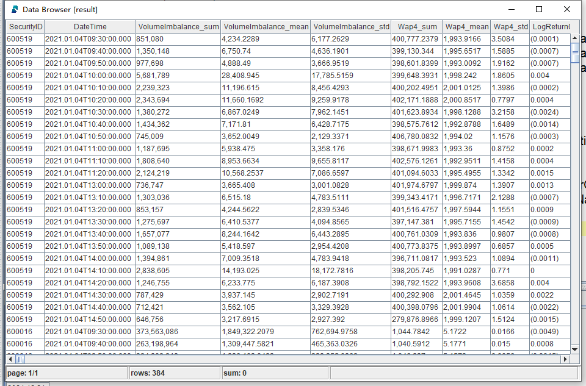

Feature Engineering for Stock Volatility Prediction
====
The Unified Stream and Batch Processing Framework in DolphinDB
---

This article introduces how to conduct [feature engineering](https://en.wikipedia.org/wiki/Feature_engineering) for model training and prediction in DolphinDB. Inspired by the [1st place solution](https://www.kaggle.com/competitions/optiver-realized-volatility-prediction/discussion/274970) of the time series prediction competition [Kaggle Optiver Realized Volatility Prediction](https://www.kaggle.com/c/optiver-realized-volatility-prediction), we propose a solution applicable to both batch and stream processing in DolphinDB to fit in comprehensive machine learning application scenarios. The comparison shows that DolphinDB delivers about 30x performance improvement than Python pandas.

>  The examples in this tutorial use DolphinDB server (Enterprise Edition) 2.00.6 and above.

- [Feature Engineering for Stock Volatility Prediction](#feature-engineering-for-stock-volatility-prediction)
  - [The Unified Stream and Batch Processing Framework in DolphinDB](#the-unified-stream-and-batch-processing-framework-in-dolphindb)
  - [1. Snapshot Market Data](#1-snapshot-market-data)
  - [2. Feature Engineering](#2-feature-engineering)
    - [2.1 Technical Indicators](#21-technical-indicators)
    - [2.2 Derived Features](#22-derived-features)
  - [3. DolphinDB Metaprogramming](#3-dolphindb-metaprogramming)
    - [3.1 Calculation of Indicators](#31-calculation-of-indicators)
    - [3.2 Calculation of Derived Features](#32-calculation-of-derived-features)
  - [4. DolphinDB vs Python](#4-dolphindb-vs-python)
  - [5. Modeling](#5-modeling)
    - [5.1 Data Processing](#51-data-processing)
    - [5.2 Train Test Split](#52-train-test-split)
    - [5.3 Training and Evaluation](#53-training-and-evaluation)
  - [6. Stream Processing](#6-stream-processing)
    - [6.1 Streaming Framework](#61-streaming-framework)
    - [6.2 Latency](#62-latency)
  - [7. Conclusion](#7-conclusion)
  - [Appendices](#appendices)

## 1. Snapshot Market Data

The data used in this project is 3-second snapshots of level 2 tick data. It contains the following columns:

| **Field Name** | **Definition**                              | **Field Name**       | **Definition**                      | **Field Name**        | **Definition**                         |
| :--------- | :-------------------------------------- | :--------------- | :------------------------------ | :---------------- | :--------------------------------- |
| SecurityID | Security Code                           | LowPx            | Low price                       | BidPrice[10]      | 10 highest bid prices              |
| DateTime   | Date and time                           | LastPx           | Last price                      | BidOrderQty[10]   | sizes of the 10 highest bid prices |
| PreClosePx | Close price on the previous trading day | TotalVolumeTrade | Total volume on the trading day | OfferPrice[10]    | 10 lowest ask prices               |
| OpenPx     | Open price                              | TotalValueTrade  | Turnover on the trading day     | OfferOrderQty[10] | sizes of the 10 lowest ask prices  |
| HighPx     | High price                              | InstrumentStatus | Trading Status                  | ……                | ……                                 |


## 2. Feature Engineering

### 2.1 Technical Indicators

The following indicators are calculated based on the 10 highest bid prices and 10 lowest ask prices mentioned above.

- **wap:** weighted average price


- **priceSpread:** bid-ask spread

*2}}{{OfferPrice_0+BidPrice_0}})

- **bidSpread:** difference between the lowest and second lowest bid prices


- **offerSpread:** difference between the highest and second highest ask prices


- **totalVolume:** total size of the 10 highest bids and 10 lowest asks

})

- **volumeImbalance:** absolute value of the difference between the sizes of 10 highest bid prices and 10 lowest ask prices


- **logReturnOffer:** log return of ask prices


- **logReturnBid:** log return of bid prices


- **wapBalance:** absolute value of wap difference


- **logReturnWap:** log return of wap


### 2.2 Derived Features

The derived features are generated by aggregating over the indicators with 10-minute windows.

The following aggregate functions are used:

| **Feature Name**       | **Methods**                            |
| :----------------- | :--------------------------------- |
| DateTime           | count                              |
| Wap[10]            | sum, mean, std                     |
| LogReturn[10]      | sum, realizedVolatility, mean, std |
| LogReturnOffer[10] | sum, realizedVolatility, mean, std |
| LogReturnBid[10]   | sum, realizedVolatility, mean, std |
| WapBalance         | sum, mean, std                     |
| PriceSpread        | sum, mean, std                     |
| BidSpread          | sum, mean, std                     |
| OfferSpread        | sum, mean, std                     |
| TotalVolume        | sum, mean, std                     |
| VolumeImbalance    | sum, mean, std                     |

We will predict the realized volatility:

- **realizedVolatility:** realized volatility


Considering the features are time-sensitive, we form 4 overlapping windows based on the 10-minute window (0-600s, 150-600s, 300-600s, and 450-600s) and conduct calculations on all of them. 

Finally, 676 dimensions of derived features are generated.

## 3. DolphinDB Metaprogramming

This section introduces how to generate features in batches with metaprogramming (see [Metaprogramming](https://www.dolphindb.com/help/Objects/Metaprogramming.html)). 

The DolphinDB scripts for batch processing define an aggregate function `featureEngineering` which calculate the indicators and generate derived features in batches with metaprogramming.

### 3.1 Calculation of Indicators

The following part in function `featureEngineering` calculates the indicators:

```
 wap = (BidPrice * OfferOrderQty + BidOrderQty * OfferPrice) \ (BidOrderQty + OfferOrderQty)
 wapBalance = abs(wap[0] - wap[1])
 priceSpread = (OfferPrice[0] - BidPrice[0]) \ ((OfferPrice[0] + BidPrice[0]) \ 2)
 BidSpread = BidPrice[0] - BidPrice[1]
 OfferSpread = OfferPrice[0] - OfferPrice[1]
 totalVolume = OfferOrderQty.rowSum() + BidOrderQty.rowSum()
 volumeImbalance = abs(OfferOrderQty.rowSum() - BidOrderQty.rowSum())
 LogReturnWap = logReturn(wap)
 LogReturnOffer = logReturn(OfferPrice)
 LogReturnBid = logReturn(BidPrice)
```

### 3.2 Calculation of Derived Features

In Python, we can pass a dictionary (where key is column names and value is a list of aggregate functions) to the pandas function `groupby.agg` to implement aggregation on selected columns.

In DolphinDB, we use a user-defined function `createAggMetaCode` to convert the above dictionary to SQL statements with metaprogramming.

```
 def createAggMetaCode(aggDict){
     metaCode = []
     metaCodeColName = []
     for(colName in aggDict.keys()){
         for(funcName in aggDict[colName])
         {
             metaCode.append!(sqlCol(colName, funcByName(funcName), colName + `_ + funcName$STRING))
             metaCodeColName.append!(colName + `_ + funcName$STRING)
         }
     }
     return metaCode, metaCodeColName$STRING
 }
 ​
 features = {
     "DateTime":[`count]
 }
 for( i in 0..9)
 {
     features["Wap"+i] = [`sum, `mean, `std]
     features["LogReturn"+i] = [`sum, `realizedVolatility, `mean, `std]
     features["LogReturnOffer"+i] = [`sum, `realizedVolatility, `mean, `std]
     features["LogReturnBid"+i] = [`sum, `realizedVolatility, `mean, `std]
 }
 features["WapBalance"] = [`sum, `mean, `std]
 features["PriceSpread"] = [`sum, `mean, `std]
 features["BidSpread"] = [`sum, `mean, `std]
 features["OfferSpread"] = [`sum, `mean, `std]
 features["TotalVolume"] = [`sum, `mean, `std]
 features["VolumeImbalance"] = [`sum, `mean, `std]
 aggMetaCode, metaCodeColName = createAggMetaCode(features)
```

It returns a vector of metacode and the corresponding column names:


The function `featureEngineering` generates a table with indicators and renamed columns, which facilitates the calculation of derived features with metaprogramming.

```
subTable = table(DateTime as `DateTime, BidPrice, BidOrderQty, OfferPrice, OfferOrderQty, wap, wapBalance, priceSpread, BidSpread, OfferSpread, totalVolume, volumeImbalance, LogReturnWap, LogReturnOffer, LogReturnBid)
colNum = 0..9$STRING
colName = `DateTime <- (`BidPrice + colNum) <- (`BidOrderQty + colNum) <- (`OfferPrice + colNum) <- (`OfferOrderQty + colNum) <- (`Wap + colNum) <- `WapBalance`PriceSpread`BidSpread`OfferSpread`TotalVolume`VolumeImbalance <- (`LogReturn + colNum) <- (`LogReturnOffer + colNum) <- (`LogReturnBid + colNum)
subTable.rename!(colName) 
```

> The operator "<-" merges multiple fields into a vector. 

Finally, the metacode is passed to function `featureEngineering` and the derived features are calculated based on the table generated in the last step. It returns a matrix with 676 columns.

```
 subTable['BarDateTime'] = bar(subTable['DateTime'], 10m)
 result = sql(select = aggMetaCode, from = subTable).eval().matrix()
 result150 = sql(select = aggMetaCode, from = subTable, where = <time(DateTime) >= (time(BarDateTime) + 150*1000) >).eval().matrix()
 result300 = sql(select = aggMetaCode, from = subTable, where = <time(DateTime) >= (time(BarDateTime) + 300*1000) >).eval().matrix()
 result450 = sql(select = aggMetaCode, from = subTable, where = <time(DateTime) >= (time(BarDateTime) + 450*1000) >).eval().matrix()
 return concatMatrix([result, result150, result300, result450])
```

Part of the output table:



See the full scripts of calculating 676 derived features with DolphinDB metaprogramming: 

- [Batch processing in DolphinDB](https://github.com/dolphindb/Tutorials_EN/blob/master/script/metacode_derived_features/metacode_derived_features.txt): storing 10 highest bids and 10 lowest asks with multiple columns
- [Batch processing in DolphinDB (with array vectors)](https://github.com/dolphindb/Tutorials_EN/blob/master/script/metacode_derived_features/metacode_derived_features_arrayVector.txt): storing 10 levels of quotes with array vectors

## 4. DolphinDB vs Python

In this article, the performances of Python and DolphinDB regarding feature engineering are compared.

- Data: 3-second snapshots of level 2 tick data of 16 securities of a year. The total number of records is 19,220,237.
- Calculation: Perform aggregation on each column with 10-minute windows in each group to generate 676 derived features.
- Scripts:
  - [Batch processing in DolphinDB](https://github.com/dolphindb/Tutorials_EN/blob/master/script/metacode_derived_features/metacode_derived_features.txt): storing 10 levels of quotes with multiple columns
  - [Batch processing in DolphinDB (with array vectors)](https://github.com/dolphindb/Tutorials_EN/blob/master/script/metacode_derived_features/metacode_derived_features_arrayVector.txt): storing 10 levels of quotes with array vectors
  - [Batch processing in Python](https://github.com/dolphindb/Tutorials_EN/blob/master/script/metacode_derived_features/metacode_derived_features_python_script.py)

As DolphinDB adopts distributed parallel computing, the parallelism in the project is configured to 8 (i.e., the tasks are processed by 8 CPU cores simultaneously). For a fair comparison, the Python script also uses 8 processors for parallel processing.

The execution time of the script is 3,039 seconds in Python, while in DolphinDB it only takes 100 seconds. The result shows that feature engineering in DolphinDB outperforms Python by around 30 times. 

## 5. Modeling

DolphinDB provides users with many common machine learning algorithms such as least squares regression, random forest, and K-means for regression, classification and clustering, etc.

In this project, DolphinDB XGBoost plugin is used for model training and prediction. [XGBoost](https://xgboost.ai/) is an optimized distributed gradient boosting library designed to be highly efficient, flexible and portable. XGBoost provides a parallel tree boosting (also known as GBDT, GBM) that solves many data science problems in a fast and accurate way.

Evaluation Metric: Root Mean Square Percentage Error, RMSPE

%5E2%7D%7B%7B%7By_i%7D%5E2%7D%7D%7D%7D)

> See [script of Model building and training](https://github.com/dolphindb/Tutorials_EN/blob/master/script/metacode_derived_features/metacode_derived_features_buildmodel.txt).

### 5.1 Data Processing

The following script first excludes records with NULL values from the table. The metric LogReturn0_realizedVolatility is used to label the results. The table is adjusted to be passed to the XGBoost method.

```
//delete records with NULL values
 result = result[each(isValid, result.values()).rowAnd()]
 ​
 result_input = copy(result)
 ​
//Use LogReturn0_realizedVolatility as the label
 label = result[`LogReturn0_realizedVolatility]
 ​
//convert the data type of column SecurityID to INT
 result_input.update!(`SecurityID_int, int(result[`SecurityID]))
 ​
//remove columns that are not needed
 result_input.dropColumns!(`SecurityID`DateTime`LogReturn0_realizedVolatility)
```

> Note: This project aims to predict the realized volatility in the next 10 minutes. As Wap_0 is the closest to the stock price, we use LogReturn0_realizedVolatility (which is calculated based on Wap_0) as the label.

### 5.2 Train Test Split

We do not set validation dataset in this project. The data is split into training set and testing set with a 70-30 split.

```
 def trainTestSplit(x, testRatio) {
     xSize = x.size()
     testSize =( xSize * (1-testRatio))$INT
     return x[0: testSize], x[testSize:xSize]
 }
 ​
 Train_x, Test_x = trainTestSplit(result_input, 0.3)
 Train_y, Test_y = trainTestSplit(label, 0.3)
```

### 5.3 Training and Evaluation

[DolphinDB XGBoost plugin](https://github.com/dolphindb/DolphinDBPlugin/blob/release200/xgboost/README.md) provides the following 4 methods:

- `xgboost::train()`: train a model
- `xgboost::predict`: make predictions with a model
- `xgboost::saveModel`: save a model to disk
- `xgboost::loadModel`: load a model from disk

The following script is used for model training and evaluation in DolphinDB:

```
 //define the validation metrics RMSPE
 def RMSPE(a,b)
 {
     return sqrt( sum( ((a-b)\a)*((a-b)\a) ) \a.size()  )
 }
 ​
 //define parameters for XGBoost training
 params = {
     objective: 'reg:squarederror',
     colsample_bytree: 0.8,
     subsample: 0.8,
     min_child_weight: 1,
     max_leaves:128,
     eta: 0.1,
     max_depth:10,
     eval_metric : 'rmse'
     }
 ​
 //model training
 model_1 = xgboost::train(Train_y ,Train_x, params, 500)
 ​
 //predict with the testing set and calculate RMPSE
 y_pred = xgboost::predict(model_1, Test_x)
 print('RMSPE='+RMSPE(Test_y, y_pred))
```

**Result:**

```
 RMSPE：0.559
 Training Time：1m 3s 327ms
```

> The *params* defined above is manually adjusted.

Save and load the model:

```
//save the model to modelSavePath, you can modify the path as you need
xgboost::saveModel(model_1, modelSavePath)

//load the model from modelSavePath, you can modify the path as you need
model = xgboost::loadModel(modelSavePath)
```

**Prediction Performance Evaluation**

| **Number of Records** | **Prediction Time (ms)** |
| :---------------- | :------------------- |
| 1                 | 0.94                 |
| 10                | 1.83                 |
| 100               | 9.31                 |
| 1000              | 49.27                |
| 10000             | 317.66               |


## 6. Stream Processing

Calculations in the previous chapters are batch processing of historical data. However, data is often generated as “streams” in production environments, and it is quite challenging to apply the complex computational logic of derived features to stream processing.

To handle such problem, DolphinDB offers various built-in stream engines to provide low-latency solutions.

### 6.1 Streaming Framework


The above diagram depicts the streaming process: 

1. Ingest real-time stream data into table snapshotStream via DolphinDB API; 
2. Subscribe to the table and ingest the data into DolphinDB time-series stream engine where calculations are conducted in a sliding window of 10 minutes (with step of 10 minutes). 

The following is the main script for stream processing: 

- Create the following stream tables:
  - snapshotStream: to store the snapshot data
  - aggrFeatures10min: the output table of feature engineering
  - result10min: the output table of predictions

```
name = `SecurityID`DateTime`PreClosePx`OpenPx`HighPx`LowPx`LastPx`TotalVolumeTrade`TotalValueTrade`BidPrice0`BidPrice1`BidPrice2`BidPrice3`BidPrice4`BidPrice5`BidPrice6`BidPrice7`BidPrice8`BidPrice9`BidOrderQty0`BidOrderQty1`BidOrderQty2`BidOrderQty3`BidOrderQty4`BidOrderQty5`BidOrderQty6`BidOrderQty7`BidOrderQty8`BidOrderQty9`OfferPrice0`OfferPrice1`OfferPrice2`OfferPrice3`OfferPrice4`OfferPrice5`OfferPrice6`OfferPrice7`OfferPrice8`OfferPrice9`OfferOrderQty0`OfferOrderQty1`OfferOrderQty2`OfferOrderQty3`OfferOrderQty4`OfferOrderQty5`OfferOrderQty6`OfferOrderQty7`OfferOrderQty8`OfferOrderQty9

type =`SYMBOL`TIMESTAMP`DOUBLE`DOUBLE`DOUBLE`DOUBLE`DOUBLE`INT`DOUBLE`DOUBLE`DOUBLE`DOUBLE`DOUBLE`DOUBLE`DOUBLE`DOUBLE`DOUBLE`DOUBLE`DOUBLE`INT`INT`INT`INT`INT`INT`INT`INT`INT`INT`DOUBLE`DOUBLE`DOUBLE`DOUBLE`DOUBLE`DOUBLE`DOUBLE`DOUBLE`DOUBLE`DOUBLE`INT`INT`INT`INT`INT`INT`INT`INT`INT`INT

share streamTable(100000:0, name, type) as snapshotStream
share streamTable(100000:0 , `DateTime`SecurityID <- metaCodeColName <- (metaCodeColName+"_150") <- (metaCodeColName+"_300") <- (metaCodeColName+"_450"),`TIMESTAMP`SYMBOL <- take(`DOUBLE, 676)) as aggrFeatures10min
share streamTable(100000:0 , `Predicted`SecurityID`DateTime, `FLOAT`SYMBOL`TIMESTAMP) as result10min
```

- Register a time-series stream engine

```
metrics=sqlColAlias(<featureEngineering(DateTime,
		matrix(BidPrice0,BidPrice1,BidPrice2,BidPrice3,BidPrice4,BidPrice5,BidPrice6,BidPrice7,BidPrice8,BidPrice9),
		matrix(BidOrderQty0,BidOrderQty1,BidOrderQty2,BidOrderQty3,BidOrderQty4,BidOrderQty5,BidOrderQty6,BidOrderQty7,BidOrderQty8,BidOrderQty9),
		matrix(OfferPrice0,OfferPrice1,OfferPrice2,OfferPrice3,OfferPrice4,OfferPrice5,OfferPrice6,OfferPrice7,OfferPrice8,OfferPrice9),
		matrix(OfferOrderQty0,OfferOrderQty1,OfferOrderQty2,OfferOrderQty3,OfferOrderQty4,OfferOrderQty5,OfferOrderQty6,OfferOrderQty7,OfferOrderQty8,OfferOrderQty9), aggMetaCode)>, metaCodeColName <- (metaCodeColName+"_150") <- (metaCodeColName+"_300") <- (metaCodeColName+"_450"))

createTimeSeriesEngine(name="aggrFeatures10min", windowSize=600000, step=600000, metrics=metrics, dummyTable=snapshotStream, outputTable=aggrFeatures10min, timeColumn=`DateTime, useWindowStartTime=true, keyColumn=`SecurityID)
```

- First subscription: subscribe to table snapshotStream

```
subscribeTable(tableName="snapshotStream", actionName="aggrFeatures10min", offset=-1, handler=getStreamEngine("aggrFeatures10min"), msgAsTable=true, batchSize=2000, throttle=1, hash=0, reconnect=true)
```

- Second subscription: subscribe to table aggrFeatures10min

```
def predictRV(mutable result10min, model, mutable msg){
	startTime = now()
	temp_table = select SecurityID, DateTime from msg
	msg.update!(`SecurityID_int, int(msg[`SecurityID])).dropColumns!(`SecurityID`DateTime`LogReturn0_realizedVolatility)
	Predicted = xgboost::predict(model , msg)
	temp_table_2 = table(Predicted, temp_table)
	result10min.append!(temp_table_2)
}
subscribeTable(tableName="aggrFeatures10min", actionName="predictRV", offset=-1, handler=predictRV{result10min, model}, msgAsTable=true, hash=1, reconnect=true)
```

As DolphinDB has implemented a unified framework of batch and stream processing, the function `featureEngineering` called in the metrics defined above is identical to the user-defined function `featureEngineering` used in batch processing.

After constructing the streaming framework, the [test data](https://github.com/dolphindb/Tutorials_EN/blob/master/data/metacode_derived_features/testData.csv) is replayed into a shared stream table. The predicted realized volatility is output as follows:


### 6.2 Latency

In this section, we measure the computational latency in the time-series engine. It consists of 2 parts: the execution time of calculating aggregate features and of predicting realized volatility.

- Measure the execution time of calculating aggregate features:

```
timer getStreamEngine('aggrFeatures10min').append!(data)
```

- Measure the execution time of predicting realized volatility:

```
test_x  = select * from aggrFeatures10min
timer{
temp_table = select SecurityID, DateTime from test_x
test_x.update!(`SecurityID_int, int(test_x[`SecurityID])).dropColumns!(`SecurityID`DateTime`LogReturn0_realizedVolatility)
Predicted = xgboost::predict(model , test_x)
}
```

- **Results**

| Number of Securities | Number of Records (in 10 min) | Calculating Aggregate Features (ms) | Predicting Realized Volatility (ms) | Total Latency (ms) |
| :------------------- | :---------------------------- | :---------------------------------- | :---------------------------------- | ------------------ |
| 1                    | 201                           | 22                                  | 3                                   | 25                 |
| 10                   | 2011                          | 92                                  | 3                                   | 95                 |
| 20                   | 4020                          | 162                                 | 4                                   | 168                |
| 30                   | 6030                          | 257                                 | 5                                   | 262                |
| 40                   | 8040                          | 321                                 | 6                                   | 327                |
| 50                   | 10054                         | 386                                 | 7                                   | 393                |

See the full script of stream processing in DolphinDB: 

[Stream processing in DolphinDB](https://github.com/dolphindb/Tutorials_EN/blob/master/script/metacode_derived_features/metacode_derived_features_streaming.txt)

[Test data (3-second snapshots of level 2 tick data)](https://github.com/dolphindb/Tutorials_EN/blob/master/data/metacode_derived_features/testData.csv)


## 7. Conclusion

This tutorial introduces a unified batch and stream processing solution in DolphinDB for machine learning use cases. Specifically, the same function can be applied to historical data or real-time stream data to generate derived features highly efficiently and conveniently. We construct 10-minute features based on 3-second snapshot data to generate 676 derived features for performance comparison. The comparison shows that our proposed solution is 30 times faster than Python. 


## Appendices

- [Batch processing in DolphinDB](https://github.com/dolphindb/Tutorials_EN/blob/master/script/metacode_derived_features/metacode_derived_features.txt)
- [Batch processing in DolphinDB (with array vectors)](https://github.com/dolphindb/Tutorials_EN/blob/master/script/metacode_derived_features/metacode_derived_features_arrayVector.txt)
- [Model building and training](https://github.com/dolphindb/Tutorials_EN/blob/master/script/metacode_derived_features/metacode_derived_features_buildmodel.txt)
- [Batch processing in Python](https://github.com/dolphindb/Tutorials_EN/blob/master/script/metacode_derived_features/metacode_derived_features_python_script.py)
- [Stream processing in DolphinDB](https://github.com/dolphindb/Tutorials_EN/blob/master/script/metacode_derived_features/metacode_derived_features_streaming.txt)
- [Test data](https://github.com/dolphindb/Tutorials_EN/blob/master/data/metacode_derived_features/testData.csv): 3-second snapshots of level 2 tick data


**Development Environment**

- CPU: Intel(R) Xeon(R) Silver 4216 CPU @ 2.10GHz
- Logical CPU cores: 8
- Memory: 64GB
- OS: 64-bit CentOS Linux 7 (Core)
- Disk: SSD (maximum read/write speed of 520MB/s)
- Server Version: 2.00.6 (Enterprise Edition)
- Deployment: [standalone mode](https://github.com/dolphindb/Tutorials_EN/blob/master/standalone_deployment.md) 
- Configuration: dolphindb.cfg (Specify *volumes*, *persistenceDir*, and *TSDBRedoLogDir* as appropriate)