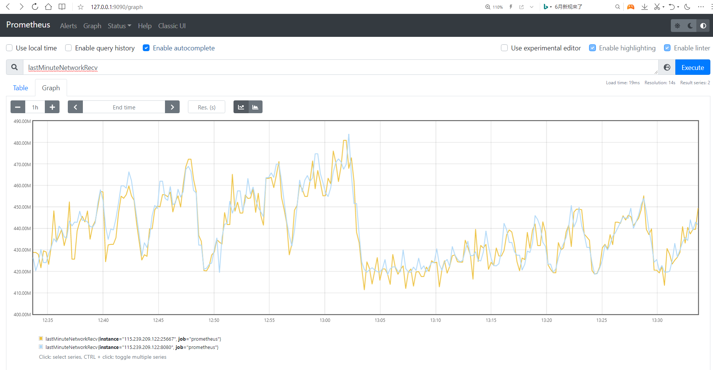

# Monitoring with Prometheus

DolphinDB provides the following 3 ways of performance monitoring:

- With built-in functions:
  - [getPerf](https://www.dolphindb.com/help/FunctionsandCommands/FunctionReferences/g/getPerf.html): return performance monitoring measures for the local node. It can be run on each node in a cluster.
  - [getClusterPerf](https://www.dolphindb.com/help/FunctionsandCommands/FunctionReferences/g/getClusterPerf.html): return performance monitoring measures for all the nodes in the cluster. It can only be executed on the controller.
  - [getJobStat](https://www.dolphindb.com/help/FunctionsandCommands/FunctionReferences/g/getJobStat.html): monitor the number of jobs and tasks that are running or in the job queue.
- On the web-based user interface;
- With third-party services, such as *Prometheus* and *Grafana*.

This tutorial illustrates how to install and configure Prometheus and its Alertmanager component to monitor the average load of DolphinDB and automatically send alert emails when the specified alerting conditions are met. 

- [Monitoring with Prometheus](#monitoring-with-prometheus)
  - [1. Prometheus Metrics](#1-prometheus-metrics)
  - [2. Download Prometheus](#2-download-prometheus)
  - [3. Install and Configure](#3-install-and-configure)
    - [3.1 Install and Configure Prometheus](#31-install-and-configure-prometheus)
    - [3.2 Install and Configure Alertmanager](#32-install-and-configure-alertmanager)
    - [3.3 Start Prometheus and Alertmanager](#33-start-prometheus-and-alertmanager)
  - [4. Visualization](#4-visualization)


## 1. Prometheus Metrics

You can monitor DolphinDB database with Prometheus using the following metrics.


| DolphinDB Metric      | Description                                                  | Units        |
| :-------------------- | :----------------------------------------------------------- | :----------- |
| cpuUsage              | CPU usage                                                    | -            |
| memoryUsed            | memory used by the node                                      | Bytes        |
| memoryAlloc           | memory allocated to the node                                 | Bytes        |
| diskCapacity          | disk capacity                                                | Bytes        |
| diskFreeSpace         | available disk space                                         | Bytes        |
| lastMinuteWriteVolume | data written to disk in the last minute                      | Bytes        |
| lastMinuteReadVolume  | data read from disk in the last minute                       | Bytes        |
| lastMinuteNetworkRecv | data received in the last minute                             | Bytes        |
| lastMinuteNetworkSend | data sent in the last minute                                 | Bytes        |
| diskReadRate          | the rate at which data are read from disk                    | Bytes/Sec    |
| diskWriteRate         | the rate at which data are written to disk                   | Bytes/Sec    |
| networkSendRate       | the rate at which data are sent                              | Bytes/Sec    |
| networkRecvRate       | the rate at which data are received                          | Bytes/Sec    |
| cumMsgLatency         | cumulative latency of messages                               | Milliseconds |
| lastMsgLatency        | latency of the last received message                         | Milliseconds |
| maxLast10QueryTime    | the maximum execution time of the previous 10 finished queries | Nanoseconds |
| medLast10QueryTime    | the median execution time of the previous 10 finished queries | Nanoseconds |
| medLast100QueryTime   | the median execution time of the previous 100 finished queries | Nanoseconds |
| maxLast100QueryTime   | the maximum execution time of the previous 100 finished queries | Nanoseconds |
| maxRunningQueryTime   | the maximum elapsed time of the queries that are currently running | Nanoseconds |
| avgLoad               | average CPU load                                             | -            |
| jobLoad               | CPU load of a job                                            | -            |
| runningJobs           | number of running jobs                                       | -            |
| queuedJobs            | number of jobs in the queue                                  | -            |
| connectionNum         | number of connections                                 | -            |


You can view the metrics in the following 2 ways:

- With Prometheus Server
- Enter "http://ip:port/metrics" in your browser where "ip:port" is the IP address and port number of the selected node. For example, DolphinDB is deployed on port 8848, you can view the metrics at http://127.0.0.1:8848/metrics .


## 2. Download Prometheus

This example uses Ubuntu 16.04 LTS desktop, Prometheus 2.26.0 and Alertmanager 0.21.0.

Download Prometheus and Alertmanager at [Download Prometheus](https://prometheus.io/download/) and deploy them on the server. You can also refer to the [official doc](https://prometheus.io/docs/prometheus/latest/getting_started/).

 
There are 3 ways of DolphinDB deployment and you can refer to [DolphinDB tutorials](https://github.com/dolphindb/Tutorials_EN/blob/master/README.md#dolphindb-tutorials) for the detailed instructions:

- Deploy directly
- Deploy with Docker-compose
- Deploy with k8s


## 3. Install and Configure

### 3.1 Install and Configure Prometheus

- Unzip package

The unzipped files are as follows:

```
demo@zhiyu:~/prometheus-2.26.0.linux-amd64$ ls
console_libraries  consoles  data  LICENSE  NOTICE  prometheus  prometheus.yml  promtool
```

- Configure prometheus.yml

Modify the configuration file *prometheus.yml*:

```
global:
  scrape_interval:     15s 
  evaluation_interval: 15s

alerting:
  alertmanagers:
  - static_configs:
    - targets:
      - 127.0.0.1:9093

rule_files:
  - "./avgLoadMonitor.yml"

scrape_configs:
  - job_name: 'DolphinDB'
    static_configs:
    - targets: ['115.239.209.122:8080','115.239.209.122:25667']
```

The `targets` in the `alerting` section specifies the port of Alertmanager.

The `rule_files` block specifies the alerting rules. The following section introduces the creation of file `avgLoadMonitor.yml`.

The last block `scrape_configs` controls what resources Prometheus monitors and the `targets` specifies the `ip:port` of DolphinDB nodes. This example monitors 2 nodes with IP address `115.239.209.122` and port numbers 8080 and 25667. You can also add a node in the format of "`IP:PORT`".
 

- Create avgLoadMonitor.yml 

The content of file *avgLoadMonitor.yml* is as follows:

```
groups:
- name: avgLoadMonitor
  rules:
  - alert: avgLoadMonitor
    expr: avgLoad > 0.1
    for: 15s
    labels:
      severity: 1
      team: node
    annotations:
      summary: "{{ $labels.instance }} avgLoad larger than 0.1!"
```

In this example, we use metrics `avgLoad` and set the alerting rule as `avgLoad`>0.1. 

### 3.2 Install and Configure Alertmanager

- Unzip package

The unzipped files are as follows:

```
demo@zhiyu:~/alertmanager-0.21.0.linux-amd64$ ls
alertmanager  alertmanager.yml  amtool  LICENSE  NOTICE
```

Users can specify the alert receivers (such as email, PagerDuty, or OpsGenie) in the configuration file alertmanager.yml. Alerting rules in Prometheus servers send alerts to an Alertmanager specified in the file prometheus.yml. The Alertmanager then manages those alerts and sent out emails to the receivers.

- Configure alertmanager.yml

You can refer to [Configuration](https://prometheus.io/docs/alerting/latest/configuration/) for the Alertmanager configuration and see the [example file](https://github.com/prometheus/alertmanager/blob/main/doc/examples/simple.yml) using email.

### 3.3 Start Prometheus and Alertmanager

- Start Prometheus with the following command:

```
demo@zhiyu:~/prometheus-2.26.0.linux-amd64$ nohup ./prometheus --config.file=prometheus.yml &
```

By default, you can browse to a status page about Prometheus at [http://localhost:9090](http://localhost:9090/).

- Start Alertmanager with the following command:

```
demo@zhiyu:~/alertmanager-0.21.0.linux-amd64$ nohup ./alertmanager --config.file=alertmanager.yml &
```

Alertmanager will now be reachable at http://localhost:9093. If the alerting rule is triggered in Prometheus, you can view the notifications in the above address. Then the Alertmanager will send alerts to the receivers. In this example, when the average load exceeds 0.1, alerting emails will be sent.

## 4. Visualization

With a built-in web interface of Prometheus, users can view alerts, configuration and status conveniently.

For example:

- View the target nodes at http://127.0.0.1:9090/targets:


- View the alerting rules at http://127.0.0.1:9090/rules:


- Go to http://127.0.0.1:9090/graph and enter a metric such as *lastMinuteNetworkRecv* to view the graphical status:



In production environment, users often use Prometheus as the data source for Grafana to view metrics or create dashboards. DolphinDB has implemented dolphindb-datasource plugin and the HTTP data interface to Grafana. See [DolphinDB Grafana DataSource Plugin](https://github.com/dolphindb/grafana-datasource/blob/master/README.md) for more information.

