# DolphinDB Multi-Machine Cluster Deployment

A DolphinDB cluster consists of 4 types of nodes: controller, agent，data node, and compute node.

- Controller: The controllers are the core of a DolphinDB cluster. They collect heartbeats of agents and data nodes, monitor the status of each node, and manage metadata and transactions of the distributed file system. There is only one controller in a multi-machine cluster (except a high-availability cluster) .
- Agent: An agent executes the commands issued by a controller to start/stop local data nodes. Each physical server has one and only one agent within a cluster.
- Data node: Data are stored and queries (or more complex computations) are executed on data nodes. A physical server can be configured with multiple data nodes.
- Compute node: The compute node is used for queries and computation, including historical data queries, distributed joins, batch processing, streaming, and machine learning model training. A physical server can be configured with multiple compute nodes. Since data is not stored on a compute node, you can use `loadTable` to load data from a data node to a compute node for computational work. On a compute node, you can create the database and partitioned tables, and write data to the partitioned tables by calling a write interface. However, writing data on a compute node will lead to more network overhead than a data node as the compute node need to send data to data nodes for storage.

This tutorial describes how to deploy the DolphinDB multi-machine cluster, and update the cluster and license file on Linux OS Distros. It serves as a quick start guide for you.

  - [1. Deploy Multi-machine Cluster on Linux Distros](#1-deploy-multi-machine-cluster-on-linux-distros)
    - [Step 1: Download](#step-1-download)
    - [Step 2: Update License File](#step-2-update-license-file)
    - [Step 3: Configure a DolphinDB Cluster](#step-3-configure-a-dolphindb-cluster)
    - [Step 4: Start DolphinDB Cluster](#step-4-start-dolphindb-cluster)
    - [Step 5: Create Databases and Partitioned Tables on Data Nodes](#step-5-create-databases-and-partitioned-tables-on-data-nodes)
    - [Step 6: Perform Queries and Computation on Compute Nodes](#step-6-perform-queries-and-computation-on-compute-nodes)
  - [2. Web-Based Cluster Management](#2-web-based-cluster-management)
    - [2.1 Controller Configuration](#21-controller-configuration)
    - [2.2 Data Nodes and Compute Nodes Configuration](#22-data-nodes-and-compute-nodes-configuration)
    - [2.3 Access Cluster Manager via External Address](#23-access-cluster-manager-via-external-address)
  - [3. Upgrade DolphinDB Cluster](#3-upgrade-dolphindb-cluster)
    - [Step 1: Close all nodes](#step-1-close-all-nodes)
    - [Step 2: Back up the Metadata](#step-2-back-up-the-metadata)
    - [Step 3: Upgrade](#step-3-upgrade)
    - [Step 4: Restart the Cluster](#step-4-restart-the-cluster)
  - [4. Update License File](#4-update-license-file)
    - [Step 1: Replace the License File](#step-1-replace-the-license-file)
    - [Step 2: Update License File](#step-2-update-license-file-1)
  - [5. FAQ](#5-faq)
    - [Q1: Common causes of node startup failure](#q1-common-causes-of-node-startup-failure)
    - [Q2: Use the systemd command to start DolphinDB cluster](#q2-use-the-systemd-command-to-start-dolphindb-cluster)
    - [Q3: Failed to access the web interface](#q3-failed-to-access-the-web-interface)
    - [Q4: Roll back a failed upgrade on Linux](#q4-roll-back-a-failed-upgrade-on-linux)
    - [Q5. Failed to update license file online](#q5-failed-to-update-license-file-online)
    - [Q6: Failed to start nodes on a cloud server](#q6-failed-to-start-nodes-on-a-cloud-server)
    - [Q7: Specify volume path](#q7-specify-volume-path)
    - [Q8: Change configuration](#q8-change-configuration)
  - [6. See Also](#6-see-also)


## 1. Deploy Multi-machine Cluster on Linux Distros

The cluster architecture in this tutorial is as follows:

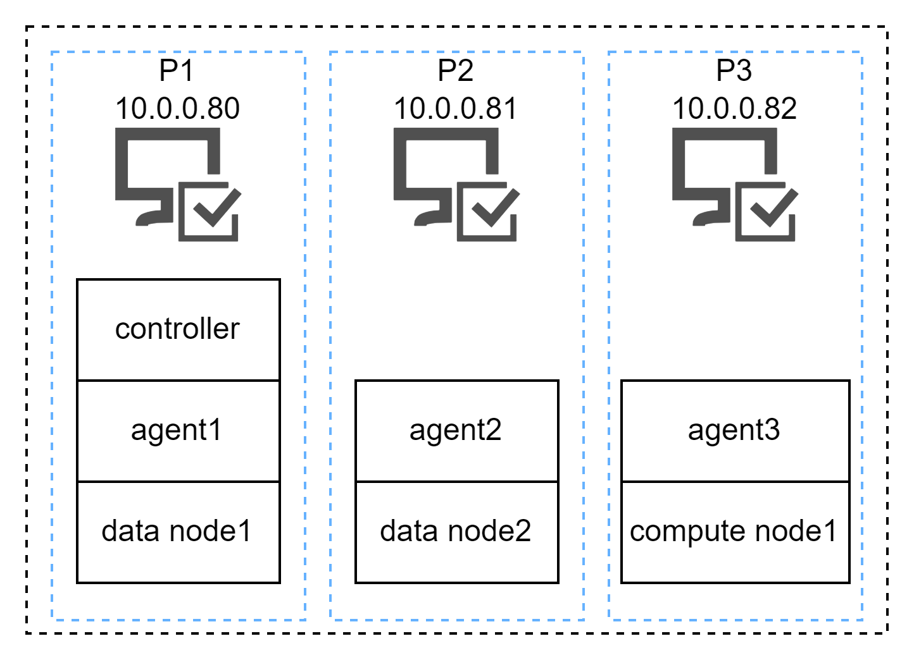

The internal IP addresses of the 3 servers are:

```
P1：10.0.0.80
P2：10.0.0.81
P3：10.0.0.82

```

Requirements and preparation before deployment:

- The number of nodes in the sample cluster of this tutorial exceeds the limit of the Community Edition License. So you must apply for [Enterprise Edition License](https://www.dolphindb.com/mx_form/mx_form.php?id=98) and update the license as described in [Step 2, Chapter 1](#step-2-update-license-file).
- The IP address of nodes should be an internal address with 10 Gigabit Ethernet. Using an external address may have an impact on the network communication between nodes.
- A DolphinDB cluster can only have one controller.
- Each server must have an agent to start or close the local data nodes.

### Step 1: Download

Download DolphinDB installation package and unzip it on each physical server.

- Official website: [DolphinDB](https://www.dolphindb.com/alone/alone.php?id=75)
- Download DolphinDB with a shell command. Take version 2.00.9.1 for example:

```
wget "https://www.dolphindb.cn/downloads/DolphinDB_Linux64_V2.00.9.1.zip"
```

Then extract the installation package to the specified directory (e.g., to */DolphinDB*):

```
unzip DolphinDB_Linux64_V2.00.9.1.zip -d /DolphinDB
```

> ❗ The directory name cannot contain any space characters, otherwise the startup of the data node will fail.

### Step 2: Update License File

With a license for Enterprise edition, you can deploy DolphinDB across multiple nodes with more CPU cores and memory. If you have an Enterprise License, please use it to replace the following license file **on each physical server**.

```
/DolphinDB/server/dolphindb.lic
```

### Step 3: Configure a DolphinDB Cluster

**(1) Configuration Files of P1 Server**

Log in the **P1** server and then navigate to */DolphinDB/server/clusterDemo/config*.

- ***controller.cfg***

Execute the following shell command to modify *controller.cfg*:

```
vim ./controller.cfg
```

```
mode=controller
localSite=10.0.0.80:8900:controller8900
dfsReplicationFactor=1
dfsReplicaReliabilityLevel=2
dataSync=1
workerNum=4
localExecutors=3
maxConnections=512
maxMemSize=8
lanCluster=0
```

Parameter *localSite* must be configured to specify IP address, port number, and alias of the controller. All other parameters can be modified as needed.

- ***cluster.nodes*** 

*cluster.nodes* stores detailed configuration details about agents, data nodes and compute nodes. The cluster configuration file in this tutorial contains 3 agents, 2 data nodes and 1 compute node. You can configure the number of nodes as required. The configuration file is divided into two columns (*localSite* and *mode*). The parameter *localSite* contains the node IP address, port number and alias, which are separated by colons ":". The parameter *mode* specifies the node type.

> ❗ Node aliases are case sensitive and must be unique in a cluster.

Execute the following shell command to modify *cluster.nodes* of servers **P1**, **P2**, and **P3**:

```
vim ./cluster.nodes
```

```
localSite,mode
10.0.0.80:8901:P1-agent,agent
10.0.0.80:8902:P1-datanode,datanode
10.0.0.81:8901:P2-agent,agent
10.0.0.81:8902:P2-datanode,datanode
10.0.0.82:8901:P3-agent,agent
10.0.0.82:8902:P3-computenode,computenode
```

- ***cluster.cfg***

Execute the following shell command to modify *cluster.cfg*:

```
vim ./cluster.cfg
```

```
maxMemSize=32
maxConnections=512
workerNum=4
localExecutors=3
maxBatchJobWorker=4
chunkCacheEngineMemSize=2
TSDBCacheEngineSize=1
newValuePartitionPolicy=add
maxPubConnections=64
subExecutors=4
lanCluster=0
enableChunkGranularityConfig=true
```

These configuration parameters apply to each data node and compute node in the cluster. You can modify them based on your own device.

- ***agent.cfg***

Execute the following shell command to modify *agent.cfg*:

```
vim ./agent.cfg
```

```
mode=agent
localSite=10.0.0.80:8901:P1-agent
controllerSite=10.0.0.80:8900:controller8900
workerNum=4
localExecutors=3
maxMemSize=4
lanCluster=0
```

For the agent to interact the controller, the parameter *controllerSite* in the file *agent.cfg* must match with the parameter *localSite* in *controller.cfg* of the server **P1**. In addition, the parameter *localSite* must be configured to specify IP address, port number, and alias of the controller. All other parameters are optional. 

**(2) Configuration Files of P2 Server**

Log in the **P2** server and then navigate to */DolphinDB/server/clusterDemo/config*.

- ***agent.cfg***

Execute the following shell command to modify *agent.cfg*:

```
vim ./agent.cfg
```

```
mode=agent
localSite=10.0.0.81:8901:P2-agent
controllerSite=10.0.0.80:8900:controller8900
workerNum=4
localExecutors=3
maxMemSize=4
lanCluster=0
```

For the agent to interact the controller, the parameter *controllerSite* in the file *agent.cfg* must match with the parameter *localSite* in *controller.cfg* of the server **P2**. In addtion, the parameter *localSite* must be configured to specify IP address, port number, and alias of the controller. All other parameters are optional.

**(3) Configuration Files of P3 Server**

Log in the **P3** server and then navigate to */DolphinDB/server/clusterDemo/config*.

- ***agent.cfg***

Execute the following shell command to modify *agent.cfg*:

```
vim ./agent.cfg
```

```
mode=agent
localSite=10.0.0.82:8901:P3-agent
controllerSite=10.0.0.80:8900:controller8900
workerNum=4
localExecutors=3
maxMemSize=4
lanCluster=0
```

For the agent to interact the controller, the parameter *controllerSite* in the file *agent.cfg* must match with the parameter *localSite* in *controller.cfg* of the server **P3**. In addtion, the parameter *localSite* must be configured to specify IP address, port number, and alias of the controller. All other parameters are optional.

### Step 4: Start DolphinDB Cluster

Log in the servers **P1**, **P2**, and **P3** and then navigate to */DolphinDB/server* of each server. The file permissions need to be modified for the first startup. Execute the following shell command:

```
chmod +x dolphindb
```

- **Start Controller**

Navigate to  */DolphinDB/server/clusterDemo* of **P1**. Execute the following shell command:

```
sh startController.sh
```

> ❗ Start the controller on P1 since it is only deployed on this server.

To check whether the node was started, execute the following shell command:

```
ps aux|grep dolphindb
```

The following information indicates a successful startup:


- **Start Agent**

Navigate to */DolphinDB/server/clusterDemo* of each server. Execute the following shell command:

```
sh startagent.sh
```

To check whether the node was started, execute the following shell command:

```
ps aux|grep dolphindb
```

The following information indicates a successful startup:


- **Start Data Nodes and Compute Nodes**

You can start or stop data nodes and compute nodes, and modify cluster configuration parameters on DolphinDB cluster management web interface. Enter the IP address and port number of the controller in the browser to navigate to the DolphinDB Web. The server address (*ip:port*) used in this tutorial is 10.0.0.80:8900. Below is the web interface. Log in with the default administrator account (username: admin, password: 123456). Then select the required data nodes and compute nodes, and click on the **execute**/**stop** button.

Click on the **refresh** button to check the status of the nodes. The following green check marks mean all the selected nodes have been turned on:

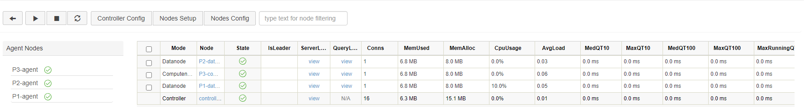

### Step 5: Create Databases and Partitioned Tables on Data Nodes

Data nodes can be used for data storage, queries and computation. The following example shows how to create databases and write data on data nodes. 

First, open the web interface of the **Controller**, and click on the corresponding **Data node** to open its **Shell** interface (e.g. P1-datanode):

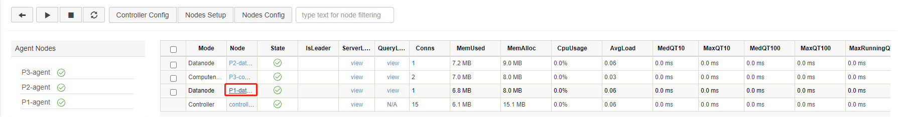

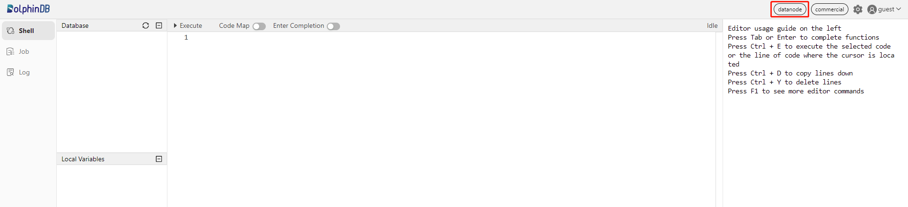

You can also enter IP address and port number of the data nodes in your browser to navigate to the **Shell** interface.

Execute the following script to create a database and a partitioned table：

```
// create a database and a partitioned table
login("admin", "123456")
dbName = "dfs://testDB"
tbName = "testTB"
if(existsDatabase(dbName)){
        dropDatabase(dbName)
}
db = database(dbName, VALUE, 2021.01.01..2021.12.31)
colNames = `SecurityID`DateTime`PreClosePx`OpenPx`HighPx`LowPx`LastPx`Volume`Amount
colTypes = [SYMBOL, DATETIME, DOUBLE, DOUBLE, DOUBLE, DOUBLE, DOUBLE, INT, DOUBLE]
schemaTable = table(1:0, colNames, colTypes)
db.createPartitionedTable(table=schemaTable, tableName=tbName, partitionColumns=`DateTime)

```

Then, run the following scripts to generate 1-minute OHLC bars and append the data to the created partitioned table “tbName”:

```
// simulate OHLC data and append it to the partitioned table
n = 1210000
randPrice = round(10+rand(1.0, 100), 2)
randVolume = 100+rand(100, 100)
SecurityID = lpad(string(take(0..4999, 5000)), 6, `0)
DateTime = (2023.01.08T09:30:00 + take(0..120, 121)*60).join(2023.01.08T13:00:00 + take(0..120, 121)*60)
PreClosePx = rand(randPrice, n)
OpenPx = rand(randPrice, n)
HighPx = rand(randPrice, n)
LowPx = rand(randPrice, n)
LastPx = rand(randPrice, n)
Volume = int(rand(randVolume, n))
Amount = round(LastPx*Volume, 2)
tmp = cj(table(SecurityID), table(DateTime))
t = tmp.join!(table(PreClosePx, OpenPx, HighPx, LowPx, LastPx, Volume, Amount))
dbName = "dfs://testDB"
tbName = "testTB"
loadTable(dbName, tbName).append!(t)

```

For more details about the above functions, see [DolphinDB user manual](https://www.dolphindb.com/help/FunctionsandCommands/index.html) or the function documentation popup on the web interface.

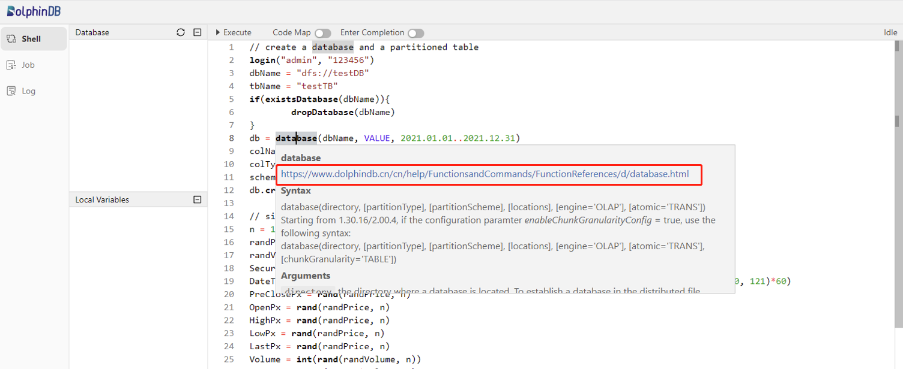

You can check the created database and table in the **Database** on the left side of the web interface.

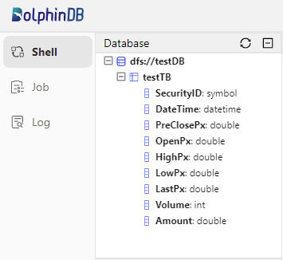

Variables you created can be checked in **Local Variables**. You can click on the corresponding variable name to preview the related information (including data type, size, and occupied memory size).


Return to the **DFS** file page of the controller to check the created partitions under the databases.


### Step 6: Perform Queries and Computation on Compute Nodes

Compute nodes are used for queries and computation. The following example shows how to perform these operations in partitioned tables on a compute node. 

First, open the web interface of the **Controller**, and then click the corresponding **Compute node** to open its **Shell** interface:

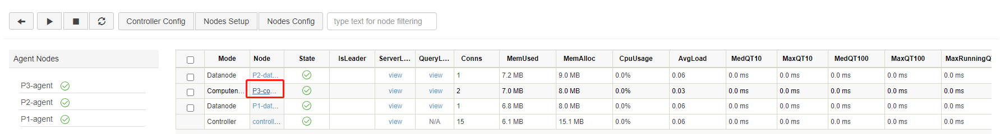


You can also enter IP address and port number of a compute node in your browser to navigate to the **Shell** interface.

Execute the following script to load the partitioned table: 

```
// load the partitioned table
pt = loadTable("dfs://testDB", "testTB")

```

Note that only metadata of the partitioned table is loaded here. Then execute the following script to count the records for each day in table “pt“:

```
// If the result contains a small amount of data, you can download it to display on the client directly.
select count(*) from pt group by date(DateTime) as Date

```

The result will be displayed at the bottom of the web interface:

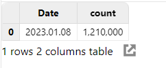

Execute the following script to caculate OHLC bars for each stock per day:

```
// If the result contains a large amount of data, you can assign it to a variable that occupies the server memory, and download it to display in separate pages on the client.
result = select first(LastPx) as Open, max(LastPx) as High, min(LastPx) as Low, last(LastPx) as Close from pt group by date(DateTime) as Date, SecurityID

```

The result is assigned to the variable `result`. It will not be displayed on the client directly, thus reducing the memory of the client. To check the results, click `result` in the **Local Variables**.


## 2. Web-Based Cluster Management

After completing the deployment, you can modify the cluster configuration through the Web interface of the controller.

### 2.1 Controller Configuration

Click **Controller Config** to modify the configuration parameters of controller. The following parameters are specified in *controller.cfg*. You can add, remove, and modify them in this web interface, and they will take effect after the controller is restarted.

> ❗ If the parameter *localSite* of the controller is modified, the parameter *controllerSite* in all *agent.cfg*s must be changed accordingly. Otherwise, the cluster will fail to run.

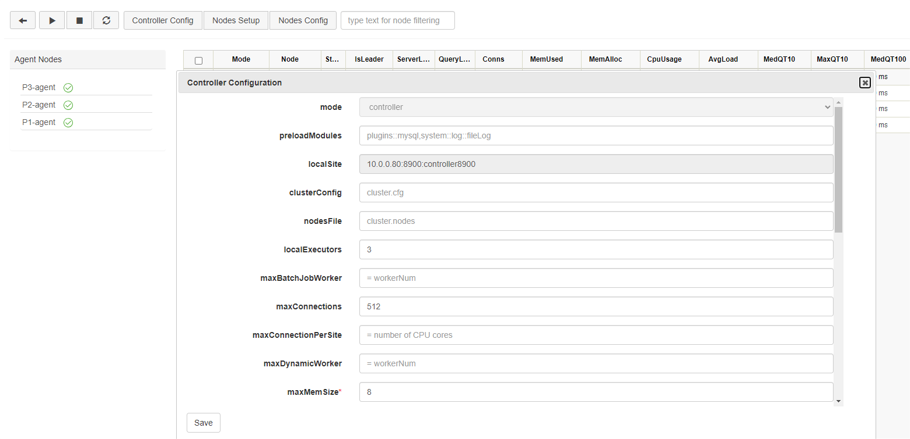

 

### 2.2 Data Nodes and Compute Nodes Configuration

Click **Nodes Config** to modify the configuration parameters of data nodes and compute nodes. The following parameters are specified in *cluster.cfg*. You can add, remove, and modify them, and they will take effect after the data nodes and compute nodes are restarted.

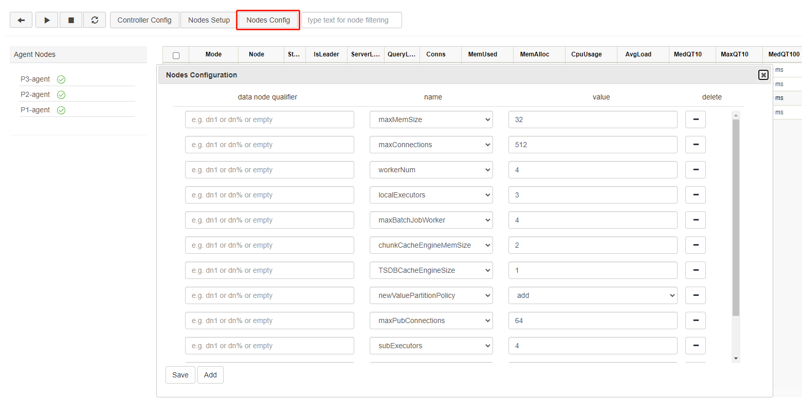

 

### 2.3 Access Cluster Manager via External Address

If the nodes in a cluster are located within the same LAN, set the site information to the internal IP address for optimal network communication. To access the cluster manager via an external address, configure the *publicName* of the controller with an external IP address, or a domain name for HTTPS. The following script in *cluster.cfg* sets up the external addresses of all nodes on **P1**, **P2**, and **P3**, where `%` is a wildcard for the node alias.

```
P1-%.publicName=19.56.128.21
P2-%.publicName=19.56.128.22
P3-%.publicName=19.56.128.23

```

You also need to add the corresponding external domain name or IP address in *controller.cfg*.

```
publicName=19.56.128.21
```

## 3. Upgrade DolphinDB Cluster

### Step 1: Close all nodes

Log in the servers **P1**, **P2**, and **P3**. Navigate to  */DolphinDB/server/clusterDemo* to execute the following shell command:

```
./stopAllNode.sh
```

### Step 2: Back up the Metadata

The metadata file is created only when data is written to the multi-machine cluster. Otherwise, you can just skip this step.

- Back up the Metadata of Controller

By default, the metadata of controller is stored in the *DFSMetaLog.0* file under */DolphinDB/server/clusterDemo/dfsMeta*:

```
/DolphinDB/server/clusterDemo/dfsMeta
```

If the metadata exceeds certain size limits, a *DFSMasterMetaCheckpoint.0* file will also be generated.  

Log in the server **P1**. Then navigate to */DolphinDB/server/clusterDemo/dfsMeta* to execute the following shell commands:

```
mkdir backup
cp -r DFSMetaLog.0 backup
cp -r DFSMasterMetaCheckpoint.0 backup
```

- Back up the Metadata of Data Nodes

By default, the metadata of data nodes is stored in  */DolphinDB/server/clusterDemo/data/\<data node alias>/storage/CHUNK_METADATA*. The default storage directory in this tutorial is:

```
/DolphinDB/server/clusterDemo/data/dnode1/storage/CHUNK_METADATA
```

Log in the server **P1**. Then navigate to the above directory to execute the following shell command:

```
cp -r CHUNK_METADATA ../../backup
```

> ❗ If the backup files are not in the above default directory, check the directory specified by the configuration parameters *dfsMetaDir* and *chunkMetaDir*. If the two parameters are not modified but the configuration parameter *volumes* is specified, then you can find the CHUNK_METADATA under the *volumes* directory.

### Step 3: Upgrade

> ❗ When the server is upgraded to a certain version, the plugin should also be upgraded to the corresponding version.

- Online Upgrade

Log in the servers **P1**, **P2**, and **P3**. Navigate to  */DolphinDB/server/clusterDemo* to execute the following command:

```
./upgrade.sh
```

The following prompt is returned:


Type y and press Enter:


Type 1 and press Enter:


Type a version number and press Enter. To upgrade to version 2.00.9.1, for example, type 2.00.9.1 and press Enter. The following prompt indicates a successful upgrade.


- Offline upgrade

Download a new version of server package from [DolphinDB website](https://dolphindb.com/).

Upload the installation package to */DolphinDB/server/clusterDemo* of  the servers **P1**, **P2**, and **P3**. Take version 2.00.9.1 as an example.

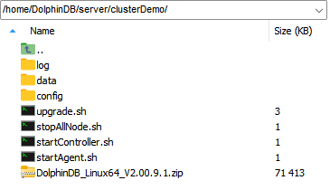

Log in the servers **P1**, **P2**, and **P3**. Navigate to */DolphinDB/server/clusterDemo* to execute the following command:

```
./upgrade.sh
```

The following prompt is returned:


Type y and press Enter:


Type 2 and press Enter:


Type a version number and press Enter. To upgrade to version 2.00.9.1, for example, type 2.00.9.1 and press Enter. The following prompt indicates a successful upgrade.


### Step 4: Restart the Cluster

- Start Controller

Execute the following shell command in */DolphinDB/server/clusterDemo* of **P1** to start the controller:

```
sh startController.sh
```

> ❗ Start the controller on P1 since it is only deployed on this server.

- Start Agent

Execute the following shell command in */DolphinDB/server/clusterDemo* of each server:

```
sh startagent.sh
```

- Start Data Nodes and Compute Nodes

You can start or stop data nodes and compute nodes, and modify cluster configuration parameters on the web interface. Enter the deployment server IP address and controller port number in the browser to navigate to the DolphinDB Web. The server address (*ip:port*) used in this tutorial is 10.0.0.80:8900. Below is the web interface. Log in with the default administrator account (username: admin, password: 123456). Then select the required data nodes and compute nodes, and click on the **execute**/**stop** button.

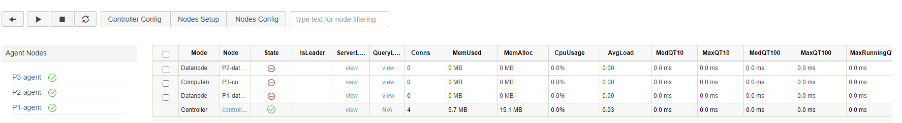

Click on the **refresh** button to check the status of the nodes. The following green check marks mean all the selected nodes have been turned on:

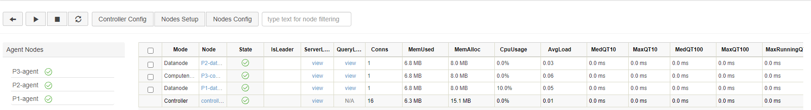

 

Open the web interface and execute the following script to check the current version of DolphinDB.

```
version()
```

## 4. Update License File

Before updating, open the web interface of any node and execute the following code to check the expiration time:

```
use ops
getAllLicenses()
```

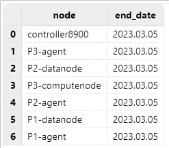

Check the “end_date“ to confirm whether the update is successful.

### Step 1: Replace the License File

Log in the servers **P1**, **P2**, and **P3**. Replace an existing license file with a new one.

License file path on Linux:

```
/DolphinDB/server/dolphindb.lic
```

### Step 2: Update License File

- Online Update

Open the web interface of any node to execute the following script:

```
use ops
updateAllLicenses()
```

The “end_date” is updated:

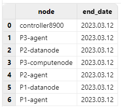

💡**Note:**

> The client name of the license cannot be changed.
>
> The number of nodes, memory size, and the number of CPU cores cannot be smaller than the original license.
>
> The update takes effect only on the node where the function is executed. Therefore, in a cluster mode, the function needs to be run on all controllers, agents, data nodes, and compute nodes.
>
> The license type must be either commercial (paid) or free.


- Offline Update

Restart DolphinDB cluster to complete the updates.

## 5. FAQ

### Q1: Common causes of node startup failure

- **Port is occupied.**

If you cannot start the server, you can first check the log file of nodes under */DolphinDB/server/clusterDemo/log.*

If the following error occurs, it indicates that the specified port is occupied by other programs.

```
<ERROR> :Failed to bind the socket on port 8900 with error code 98
```

In such case, you can change to another free port in the config file.

- **The first line in *cluster.nodes* is empty.**

If you cannot start the server, you can first check the log file of nodes under */DolphinDB/server/clusterDemo/log.*

If the following error occurs, it means the first line in the file *cluster.nodes* is empty. 

```
<ERROR> :Failed to load the nodes file [/home/DolphinDB/server/clusterDemo/config/cluster.nodes] with error: The input file is empty.
```

In this case, remove the empty line from the file and restart the node.

- **The macro variable \<ALIAS> has no effect when the node is specified.**

In *cluster.cfg*, if the macro variable \<ALIAS> is used when a node is specified, e.g., `P1-datanode.persistenceDir = /hdd/hdd1/streamCache/<ALIAS>`, the node will not start. 

```
P1-datanode.persistenceDir = /hdd/hdd1/streamCache/<ALIAS>
```

In this case, replace \<ALIAS> with a specific node alias. For example:

```
P1-datanode.persistenceDir = /hdd/hdd1/streamCache/P1-datanode
```

To use macro variables for all nodes, try the following script:

```
persistenceDir = /hdd/hdd1/streamCache/<ALIAS>
```

### Q2: Use the systemd command to start DolphinDB cluster

First, create the script files *controller.sh* and *agent.sh* in the *DolphinDB/server/clusterDemo* directory on each server with the following scripts:

```
vim ./controller.sh
```

```
#!/bin/bash
#controller.sh
workDir=$PWD

start(){
    cd ${workDir} && export LD_LIBRARY_PATH=$(dirname "$workDir"):$LD_LIBRARY_PATH
    nohup ./../dolphindb -console 0 -mode controller -home data -script dolphindb.dos -config config/controller.cfg -logFile log/controller.log -nodesFile config/cluster.nodes -clusterConfig config/cluster.cfg > controller.nohup 2>&1 &
}

stop(){
    ps -o ruser=userForLongName -e -o pid,ppid,c,time,cmd |grep dolphindb|grep -v grep|grep $USER|grep controller| awk '{print $2}'| xargs kill -TERM
}

case $1 in
    start)
        start
        ;;
    stop)
        stop
        ;;
    restart)
        stop
        start
        ;;
esac
```


```
vim ./agent.sh
```

```
#!/bin/bash
#agent.sh


workDir=$PWD

start(){
    cd ${workDir} && export LD_LIBRARY_PATH=$(dirname "$workDir"):$LD_LIBRARY_PATH
    nohup ./../dolphindb -console 0 -mode agent -home data -script dolphindb.dos -config config/agent.cfg -logFile log/agent.log  > agent.nohup 2>&1 &
}

stop(){
    ps -o ruser=userForLongName -e -o pid,ppid,c,time,cmd |grep dolphindb|grep -v grep|grep $USER|grep agent| awk '{print $2}'| xargs kill -TERM
}

case $1 in
    start)
        start
        ;;
    stop)
        stop
        ;;
    restart)
        stop
        start
        ;;
esac
```

Then, execute the following shell command to configure the daemon for the controller:

```
vim /usr/lib/systemd/system/ddbcontroller.service
```

The following parameters should be configured:

```
[Unit]
Description=ddbagent
Documentation=https://www.dolphindb.com/

[Service]
Type=forking
WorkingDirectory=/home/DolphinDB/server/clusterDemo
ExecStart=/bin/sh agent.sh start
ExecStop=/bin/sh agent.sh stop
ExecReload=/bin/sh agent.sh restart
Restart=always
RestartSec=10s
LimitNOFILE=infinity
LimitNPROC=infinity
LimitCORE=infinity

[Install]
WantedBy=multi-user.target
```

> ❗ Specify *WorkingDirectory* as */DolphinDB/server/clusterDemo*.

Execute the following shell command to configure the daemon for the agent:

```
vim /usr/lib/systemd/system/ddbagent.service
```

The following parameters should be configured:

```
[Unit]
Description=ddbagent
Documentation=https://www.dolphindb.com/

[Service]
Type=forking
WorkingDirectory=/home/DolphinDB/server/clusterDemo
ExecStart=/bin/sh agent.sh start
ExecStop=/bin/sh agent.sh stop
ExecReload=/bin/sh agent.sh restart
Restart=always
RestartSec=10s
LimitNOFILE=infinity
LimitNPROC=infinity
LimitCORE=infinity

[Install]
WantedBy=multi-user.target
```

> ❗ Specify *WorkingDirectory* as */DolphinDB/server/clusterDemo*.

Finally, execute the following shell command to start the controller:

```
systemctl enable ddbcontroller.service   #enable the service
systemctl start ddbcontroller.service    #start the service
systemctl stop  ddbcontroller.service    #stop the service
systemctl status  ddbcontroller.service  #check the status
```

Execute the following shell command to start the agent:

```
systemctl enable ddbagent.service   #enable the service
systemctl start ddbagent.service    #start the service
systemctl stop  ddbagent.service    #stop the service
systemctl status  ddbagent.service  #check the status
```

### Q3: Failed to access the web interface

Despite the server running and the URL being correct, the web interface remains inaccessible.

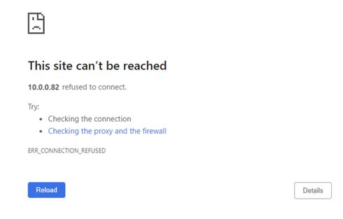

A common reason for the above problem is that the browser and DolphinDB are not deployed on the same server, and a firewall is enabled on the server where DolphinDB is deployed. You can solve this issue by turning off the firewall or by opening the corresponding port. 

### Q4: Roll back a failed upgrade on Linux

If you cannot start DolphinDB multi-machine cluster after upgrade, you can follow steps below to roll back to the previous version.

**Step 1: Restore metadata files**

- Restore metadata files of controller

Log in the server where controller is deployed. Navigate to */DolphinDB/server/clusterDemo/dfsMeta* to restore metadata files from *backup* with the following commands:

```
cp -r backup/DFSMetaLog.0 ./
cp -r backup/DFSMasterMetaCheckpoint.0 ./
```

- Restore metadata files of data nodes

Log in the server where data nodes are deployed (e.g. **P1**). Navigate to */DolphinDB/server/clusterDemo/data* to restore metadata files from *backup* with the following command:

```
cp -r backup/CHUNK_METADATA ./P1-datanode/storage
```

**Step 2: Restore program files**

Download the previous version of server package from the official website. Replace the server that failed to update with all files (except *dolphindb.cfg*, *clusterDemo* and *dolphindb.lic*) just downloaded.

### Q5. Failed to update license file online

Updating the license file online requires meeting the requirements described in [Step 2, Chapter 4](#step-2-update-license-file-1). Otherwise, you can update offline or apply for an [Enterprise Edition License](https://www.dolphindb.com/mx_form/mx_form.php?id=98).

### Q6: Failed to start nodes on a cloud server

A DolphinDB cluster can be deployed on a LAN, or on cloud environment. By default, the DolphinDB cluster is deployed within a LAN (`lanCluster=1`) and uses UDP to monitor the heartbeats of nodes. However, the nodes on a cloud server are not necessarily located within the same LAN, and the cluster may not support UDP. On a cloud server, you must specify `lanCluster=0` in *controller.cfg* and *agent.cfg* to implement communication between nodes in a non-UDP mode. Otherwise, the cluster may malfunction due to the possible failure to detect the heartbeat of a node.

### Q7: Specify volume path

A volume is a folder on a data node that holds data in a DFS database in DolphinDB. A node can have multiple volumes. For optimal performance, each volume represents a unique hard disk.

The volume path can be specified in *cluster.cfg*. If it is not specified, the system will use the data node alias as the path name. For example, if the node alias is P1-datanode, the system automatically creates a subdirectory *P1-datanode* under the home directory */DophinDB/server/clusterDemo/data* of the node to store data. Note that only an absolute path can be used to specify a volume.

> ❗ It is recommended not to mount a remote NAS volume, which may affect the performance. If the partitions have been mounted with NFS protocol, please switch user to root to access the database. A database process started by a regular user is not allowed to read or write to the NAS disk, whereas a process started by a sudo user will cause access errors.

There are 3 ways to specify the volume path:

- **Specify separately for each node**

```
P1-datanode.volumes=/DFS/P1-datanode
P2-datanode.volumes=/DFS/P2-datanode

```

- **Specify with wildcard characters** `%` **and** `?`

`?`  represents a single character; `%` can represent 0, 1 or more characters.

To store the data of all the nodes ending with "-datanode" to */VOL1*:

```
%-datanode.volumes=/VOL1
```

This is equivalent to:

```
P1-datanode.volumes=/VOL1
P2-datanode.volumes=/VOL1

```

- **Specify with symbol ALIAS**

If each volume path contains a node alias, you can use \<ALIAS> to specify the volume paths. For example, to configure 2 volumes (*/VOL1* and */VOL2*) on each node:

```
volumes=/VOL1/<ALIAS>,/VOL2/<ALIAS>
```

This is equivalent to:

```
P1-datanode.volumes=/VOL1/P1-datanode,/VOL2/P1-datanode
P2-datanode.volumes=/VOL1/P2-datanode,/VOL2/P2-datanode

```

### Q8: Change configuration

For more details on configuration parameters, refer to [Configuration](https://www.dolphindb.com/help/DatabaseandDistributedComputing/Configuration/index.html).

If you encounter performance problems, you can contact our team on [Slack](https://dolphindb.slack.com/) for technical support.

## 6. See Also

For more information, refer to [DolphinDB Manual](https://www.dolphindb.com/help/index.html).