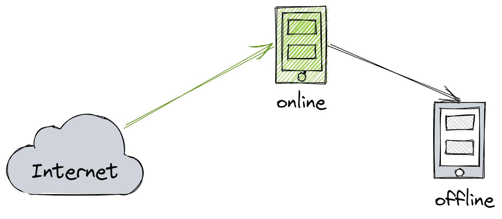

# Offline Installation Guide for DolphinDB Python API

- [Offline Installation Guide for DolphinDB Python API](#offline-installation-guide-for-dolphindb-python-api)
  - [1. Prerequisites](#1-prerequisites)
    - [1.1 Linux](#11-linux)
    - [1.2 Windows](#12-windows)
  - [2. Installing Python API on Linux with conda](#2-installing-python-api-on-linux-with-conda)
    - [2.1 Installing Miniconda](#21-installing-miniconda)
    - [2.2 Configuring conda](#22-configuring-conda)
    - [2.3 Downloading Packages in the Online Environment](#23-downloading-packages-in-the-online-environment)
    - [2.4 Installing conda in the Offline Environment](#24-installing-conda-in-the-offline-environment)
    - [2.5 Installing DolphinDB Python API](#25-installing-dolphindb-python-api)
  - [3. Installing Python API on Linux Using Wheels](#3-installing-python-api-on-linux-using-wheels)
    - [3.1 Building *.whl* Files in the Online Environment](#31-building-whl-files-in-the-online-environment)
    - [3.2 Installing Wheels in the Offline Environment](#32-installing-wheels-in-the-offline-environment)
  - [4 Installing Python API on Windows with conda](#4-installing-python-api-on-windows-with-conda)
    - [4.1 Installing Miniconda](#41-installing-miniconda)
    - [4.2 Configuring Miniconda](#42-configuring-miniconda)
    - [4.3 Downloading Dependencies in the Online Environment](#43-downloading-dependencies-in-the-online-environment)
    - [4.4 Installing Dependencies in the Offline Environment](#44-installing-dependencies-in-the-offline-environment)
    - [4.5 Installing DolphinDB Python API](#45-installing-dolphindb-python-api)
  - [5. Installing Python API on Windows Using Wheels](#5-installing-python-api-on-windows-using-wheels)
    - [5.1 Building *.whl* Files in the Online Environment](#51-building-whl-files-in-the-online-environment)
    - [5.2 Installing Wheels in the Offline Environment](#52-installing-wheels-in-the-offline-environment)
    - [5.3 Verifying the Installations](#53-verifying-the-installations)
  - [6. Conclusion](#6-conclusion)
  - [7. Appendices](#7-appendices)
    - [7.1 Commonly-Used pip Commands](#71-commonly-used-pip-commands)
    - [7.2 Commonly-Used conda Commands](#72-commonly-used-conda-commands)
    - [7.3 Troubleshooting](#73-troubleshooting)


This tutorial explains how to install the DolphinDB Python API in an offline Windows or Linux environment. There are two installation options for each environment:

- install in a conda environment
- install using wheel packages directly

## 1. Prerequisites

Building and deploying DolphinDB Python API requires setting up separate build and target environments:

- The build environments require:
  - an online environment to download and build resources
  - an offline environment to test and verify the installation of the built DolphinDB Python API packages
- The target environment is where the built DolphinDB Python API packages will ultimately be deployed for use.

The build and target environments should have the same operating system version, CPU architecture, Python version, and other relevant characteristics.



### 1.1 Linux

It is recommended to use a virtualization tool such as VirtualBox to create the required environments. For example, if you need to install the DolphinDB Python API in a target environment which runs with KyLin v10, x86-64 and Python 3.8, prepare the build environments as follows:

- **Online environment**

Operating system: Kylin v10

CPU: Intel(R) Core(TM) i7-10700 CPU @ 2.90GHz

Hosting platform: VirtualBox 6.1

Network: NetWork Bridge

- **Offline environment**

Operating system: Kylin v10

CPU: Intel(R) Core(TM) i7-10700 CPU @ 2.90GHz

Hosting platform: VirtualBox 6.1

Network: HostOnly

The *Host-only* mode makes sure the offline environment does not have internet access.

### 1.2 Windows

Prepare two machines for API installation on Windows. One machine must have internet access for downloading and building resources, and the other must be offline for installation and validation.

## 2. Installing Python API on Linux with conda

### 2.1 Installing Miniconda

As production environments are often complex, it is recommended to use Miniconda to create an isolated virtual environment for Python.

 [Miniconda — conda documentation](https://docs.conda.io/en/latest/miniconda.html)

  1. Download and install Miniconda:

```
wget https://repo.anaconda.com/miniconda/Miniconda3-latest-Linux-x86_64.sh
sh Miniconda3-latest-Linux-x86_64.sh
```

  2. Activate the the changes:

```
source ~/.bashrc
```

  3. [optional] Enter `conda env list` to verify installation:


### 2.2 Configuring conda

Configure conda in the online and offline environments, respectively.

  1. Display configuration settings:

```
conda config    // The .condarc file appears under the ~/ directory
```

  2. Edit the `~/.condarc` file:

```show_channel_urls: true
envs_dirs:
  - ~/envs
pkgs_dirs:
  - ~/pkgs
```

### 2.3 Downloading Packages in the Online Environment

  1. Run the following command to download the packages:

```
conda create -n test38 numpy=1.22.3 pandas python=3.8.13 --download-only
```

Note that *numpy* must be between version 1.18-1.22.3 (recommended).

  2. Compress the dependency packages under `.condarc pkgs_dirs` into a tar archive *pkgs.tar.gz*, and upload it to the *pkgs* directory in the offline environment.

```tar -zcvf pkgs.tar.gz pkgs/
md5sum pkgs.tar.gz > pkgs.tar.gz.md5
```

### 2.4 Installing conda in the Offline Environment

  1. In the offline environment, verify the checksums of the *pkgs.tar.gz*:

```
(base) root@peter-VirtualBox:~# md5sum -c pkgs.tar.gz.md5
pkgs.tar.gz: OK
```

  2. Decompress *pkgs.tar.gz*:

```
tar -zxvf pkgs.tar.gz
```

  3. Create a virtual environment with the specified packages:

```
conda create -n offline38 numpy pandas python=3.8.13 --offline
conda activate offline38
```

### 2.5 Installing DolphinDB Python API

  1. Download the *.whl* file

Based on your CPU architecture and OS, download the *.whl* file for DolphinDB Python API as appropriate from [pypi.org](https://pypi.org/project/dolphindb/##files). For example, if you are running 64-bit Linux with Python 3.8, download [this .whl file](https://files.pythonhosted.org/packages/2b/9d/d26f21b5ef2589dfe788ff2d65c0b4f368cd66f22c01271cedefc5a047a1/dolphindb-1.30.19.2-cp38-cp38-manylinux2010_x86_64.whl) for DolphinDB 1.30.19.2:

  2. Use pip to install the package offline:

```
pip install dolphindb-1.30.19.2-cp38-cp38-manylinux2010_x86_64.whl
```

  3. Verify installation with the following script:

```
(offline38) root@peter-VirtualBox:~# python
Python 3.8.13 (default, Mar 28 2022, 11:38:47)
[GCC 7.5.0] :: Anaconda, Inc. on linux
Type "help", "copyright", "credits" or "license" for more information.
>>> import dolphindb as ddb
>>> s = ddb.Session()
>>> s
<dolphindb.session.Session object at 0x7fa5d6534280>
```

If a Session object is created, it means you have successfully installed the DolphinDB Python API.

## 3. Installing Python API on Linux Using Wheels

### 3.1 Building *.whl* Files in the Online Environment

Use the `pip wheel` command to build *.whl* files for DolphinDB Python API and dependencies: 

```
pip install wheel && pip wheel dolphindb
```

Once the build is complete, the .*whl* files are saved in the current directory by default.

```
(py38) [root@node1 ~]# ls *.whl|sort
dolphindb-1.30.19.2-cp38-cp38-manylinux2010_x86_64.whl
future-0.18.2-py3-none-any.whl
numpy-1.22.3-cp38-cp38-manylinux_2_17_x86_64.manylinux2014_x86_64.whl
pandas-1.5.0-cp38-cp38-manylinux_2_17_x86_64.manylinux2014_x86_64.whl
python_dateutil-2.8.2-py2.py3-none-any.whl
pytz-2022.2.1-py2.py3-none-any.whl
six-1.16.0-py2.py3-none-any.whl
```

### 3.2 Installing Wheels in the Offline Environment

  1. Install all *.whl* files from the current directory.

```
pip install *.whl
```

```
(py38) root@peter-VirtualBox:~/wpkgs# pip install *.whl
Processing ./dolphindb-1.30.19.2-cp38-cp38-manylinux2010_x86_64.whl
Processing ./future-0.18.2-py3-none-any.whl
Processing ./numpy-1.22.3-cp38-cp38-manylinux_2_17_x86_64.manylinux2014_x86_64.whl
Processing ./pandas-1.5.0-cp38-cp38-manylinux_2_17_x86_64.manylinux2014_x86_64.whl
Processing ./python_dateutil-2.8.2-py2.py3-none-any.whl
Processing ./pytz-2022.2.1-py2.py3-none-any.whl
Processing ./six-1.16.0-py2.py3-none-any.whl
Installing collected packages: pytz, six, numpy, future, python-dateutil, pandas, dolphindb
Successfully installed dolphindb-1.30.19.2 future-0.18.2 numpy-1.22.3 pandas-1.5.0 python-dateutil-2.8.2 pytz-2022.2.1 six-1.16.0
```

  2. Verify the installations of the *.wheel* files and test the DolphinDB Python API.

- Run `pip list` to get a list of installed Python packages for the current environment:

```
(py38) root@peter-VirtualBox:~/wpkgs# pip list
Package         Version
--------------- ---------
certifi         2022.9.14
dolphindb       1.30.19.2
future          0.18.2
numpy           1.22.3
pandas          1.5.0
pip             22.1.2
python-dateutil 2.8.2
pytz            2022.2.1
setuptools      63.4.1
six             1.16.0
wheel           0.37.1
```

- Run the following script in your Python client:

```
(offline38) root@peter-VirtualBox:~# python
Python 3.8.13 (default, Mar 28 2022, 11:38:47)
[GCC 7.5.0] :: Anaconda, Inc. on linux
Type "help", "copyright", "credits" or "license" for more information.
>>> import dolphindb as ddb
>>> s = ddb.session()
>>> s
<dolphindb.session.session object at 0x7fa5d6534280>
```

If a Session object is created, it means you have successfully installed the DolphinDB Python API.

## 4 Installing Python API on Windows with conda

Configure the Miniconda in the online and offline environments respectively. Then use the online environment to build:

- *.whl* files for DolphinDB Python API dependencies
- a *.whl* file for DolphinDB Python API

Finally, upload the files to the offline environment for installation.

Note: Miniconda should be installed and configured independently in the online and offline environments. However, the directory structures in both environments must be kept consistent with each other.

### 4.1 Installing Miniconda

Go to [Miniconda — miniconda   documentation](https://docs.conda.io/en/latest/miniconda.html) and download the Miniconda version that matches your Python version. In this example, download and install [Miniconda3 Windows 64-bit](https://repo.anaconda.com/miniconda/Miniconda3-latest-Windows-x86_64.exe). Then add the path to conda to your system’s PATH environment variable:

  1. In **Settings**, search “environment variables“ 

  2. Click **Environment Variables…**  

  3. In **System variables**, select **Path** and click **Edit**. 

  4. Click **New**. Then enter the complete path of the condabin directory. For example:

```
D:\ProgramData\Miniconda3\condabin
```

  Then click **OK**.

  5. Start the Command Prompt and verify your changes with the following command:

```
C:\Users\username>conda -V
conda 4.12.0
```

### 4.2 Configuring Miniconda

Add the conda packages directory  (*pkgs_dirs*). For example:


```
D:\pythonApi>conda config --add pkgs_dirs D:\pkgs
```

### 4.3 Downloading Dependencies in the Online Environment

Once you have configured the packages directory (*pkgs_dirs*) in the online environment, download the dependencies of the DolphinDB Python API - totaling around 450MB after compression:


```
conda create -n test38 numpy=1.22.3 future pandas python=3.8.13 --download-only
```

The packages are saved to the *pkgs_dirs* directory configured earlier.

### 4.4 Installing Dependencies in the Offline Environment

  1. Upload the compressed packages from the online environment’s *pkgs_dirs* to the offline environment. Double check the upload is complete by comparing the total bytes before and after.

  2. Decompress the uploaded packages into the offline environment's *pkgs_dirs* directory.

  3. Create an offline virtual environment from the packages:

```
conda create -n offline38 numpy pandas future python=3.8.13 --offline
conda activate offline38
```


### 4.5 Installing DolphinDB Python API

  1. Download the *.whl* file

Based on your CPU architecture and OS, download the *.whl* file for DolphinDB Python API as appropriate from [pypi.org](https://pypi.org/project/dolphindb/##files). For example, if you are running x86_64 Windows with Python 3.8, download [this .whl file](https://files.pythonhosted.org/packages/62/ff/382aff0a2add9ce5c779c14d0d7fbfcec62ab0748b5778731a7fe524c2af/dolphindb-1.30.19.2-cp38-cp38-win_amd64.whl) for DolphinDB 1.30.19.2:

  2. Use pip to install the package offline:

```
pip install dolphindb-1.30.19.2-cp38-cp38-win_amd64.whl
```


  3. Verify installation with the following script:

```
import dolphindb as ddb
s = ddb.session()
s.connect("192.168.1.157", 8848, "admin", "123456")
s.run("print(\"Welcome to DolphinDB!\")")
s.close()
```

If the message is printed, it means you have successfully installed the DolphinDB Python API.

```
D:\pythonApi>python hello_ddb.py
Welcome to DolphinDB!
```

## 5. Installing Python API on Windows Using Wheels

The build environments should match the target environment. For example, if the target offline environment is a x86-64 bit Windows Server 2016 system running Python 3.8.10, the build system should replicate this configuration. Ideally, set up the build PC as a x86-64 bit Windows 10 machine with Python 3.8.10 installed.

### 5.1 Building *.whl* Files in the Online Environment

Build *.whl* files for DolphinDB Python API and generate a *requirements.txt*.

  1. `pip wheel`

Use the `pip wheel` command to build *.whl* files for DolphinDB Python API and dependencies: 

```
pip wheel dolphindb
```

Once the build is complete, the .*whl* files are saved in the current directory by default.

  2. `pip install`

Install DolphinDB Python API:

```
pip install dolphindb
```

  3. `pip freeze`

Output the installed packages to a *requirements.txt* file:

```
pip freeze dolphindb > requirements.txt
```

After these steps, the directory will contain these files. 


The specific files contained in the directory may vary by DolphinDB Python API version.

### 5.2 Installing Wheels in the Offline Environment

Upload all the *.whl* files and *requirements.txt* to the offline environment and install them with `pip install`. 

Use the `-r` parameter to batch install the wheels specified in *requirements.txt*:

```
pip install -r requirements.txt
```

```
D:\pythonApi>pip install -r requirements.txt
Processing d:\pythonapi\dolphindb-1.30.19.2-cp38-cp38-win_amd64.whl
Processing d:\pythonapi\numpy-1.22.3-cp38-cp38-win_amd64.whl
Processing d:\pythonapi\pandas-1.5.1-cp38-cp38-win_amd64.whl
Processing d:\pythonapi\python_dateutil-2.8.2-py2.py3-none-any.whl
Processing d:\pythonapi\pytz-2022.6-py2.py3-none-any.whl
Processing d:\pythonapi\six-1.16.0-py2.py3-none-any.whl
Collecting future==0.18.2
  Using cached future-0.18.2-py3-none-any.whl
Installing collected packages: six, pytz, python-dateutil, numpy, pandas, future, dolphindb
Successfully installed dolphindb-1.30.19.2 future-0.18.2 numpy-1.22.3 pandas-1.5.1 python-dateutil-2.8.2 pytz-2022.6 six-1.16.0
```

### 5.3 Verifying the Installations

Verify the installations of the *.wheel* files and test the DolphinDB Python API.

- Run `pip list` to get a list of installed Python packages for the current environment:

```
C:\pythonApi>pip list
Package         Version
--------------- ---------
dolphindb       1.30.19.2
future          0.18.2
numpy           1.22.3
pandas          1.5.1
pip             21.1.1
python-dateutil 2.8.2
pytz            2022.6
setuptools      56.0.0
six             1.16.0
```

- Run the following script in your Python client:

```
import dolphindb as ddb
s = ddb.session()
s.connect("192.168.1.157", 8848, "admin", "123456")
s.run("print(\"Welcome to DolphinDB!\")")
s.close()
```

```
D:\pythonApi>python hello_ddb.py
Welcome to DolphinDB!
```

If the message is printed, it means you have successfully installed the DolphinDB Python API.

## 6. Conclusion

Installing DolphinDB's Python API using wheels offers simplicity and convenience. However, conda allows configuring isolated environments, which provides more control for offline systems.

| **Installation Method** | **Pros**                                        | **Cons**                                                     |
| :---------------------- | :---------------------------------------------- | :----------------------------------------------------------- |
| conda                   | Provides a virtual environment for installation | Large installation packages (totaling around 500MB) which cost more time to transfer.<br/>File integrity checks needed when transferring packages |
| wheel                   | Simple, lightweight installation                | No environment isolation. May cause conflicts with existing Python environment. |

## 7. Appendices

### 7.1 Commonly-Used pip Commands

```
pip list // shows installed packages
pip freeze packageA // outputs the installed version of packageA in the requirements format, which allows you to pin a dependency version.
pip wheel packageA  // builds a wheel archive for packageA
pip search packageA // searches PyPI for packageA 
```

### 7.2 Commonly-Used conda Commands

- Create a virtual conda environment without internet access

```
conda create -n py38 python=3.8.13 --offline
```

- Activate / deactivate virtual conda environment

```
conda env list //list all environments
conda activate py38 //activate environemtn py38
conda deactivate // exit out of the current virtual environment
```

- Deactivate the current conda environment and then remove it

```
conda deactivate
conda remove -n offline38 --all
```

### 7.3 Troubleshooting

  1. The system cannot find the required packages during conda offline installation. The error message is:

```
PackagesNotFoundError: The following packages are not available from current channels:
  - pandas
  - python=3.8.13
  - numpy
```

  Solution: Check if *pkgs_dir* is correctly specified and it contains the required packages. The *pkgs_dir* must point directly to the folder containing the package files. Subdirectories within *pkgs_dir* will not be searched. For example, if *pkgs_dir* is set to “pkgs“, packages saved under `pkgs/pkgs/numpy` will not be found.

  2. The following error is raised in Python:

```
error: invalid command 'bdist_wheel'
```

Solution: This occurs when the wheel package is not installed in the environment. Install wheel with pip command:

```
pip install wheel
```

  3. The future wheel package is missing:

```
ERROR: Could not find a version that satisfies the requirement future (from dolphindb) (from versions: none)
ERROR: No matching distribution found for future
```

Solution: Manually build the future wheel package and upload it to the offline environment:

```
pip wheel future
```

  4. Building a wheel package for future failed with the following error:

```
Failed to build future
ERROR: Failed to build one or more wheels
WARNING: Ignoring invalid distribution -ip (d:\program files\python3.7\lib\site-packages)
```

Solution: This occurs when there are corrupted files in the pip installation directory due to failed pip downloads or installations. Navigate to the `site-package/pip` directory and delete any temporary files that begin with the prefix "~".

```
(base) [root@node1 ~]# pip --version
pip 21.2.4 from /root/miniconda3/lib/python3.9/site-packages/pip (python 3.9)
```

  5. Installing DolphinDB Python API failed with the following error:

```
ERROR: Could not find a version that satisfies the requirement dolphindb (from versions: none)
```

Solution: This occurs when the environment does not match the wheel package. Follow the steps below:

(1) Search for the *dolphindb* wheel that matches your current OS architecture (e.g., Linux ARM, Mac ARM, etc.) on [PyPI](https://pypi.org/project/dolphindb/#files). Download the wheel (*.whl* file) to your local system.

(2) Execute the following command. The `Compatible tags` section indicates which distributions are compatible with your system.

```
pip debug --verbose
```

(3) Rename the downloaded *dolphindb* wheel according to the compatibility tags. For example, the file name for Mac(x86_64) is “dolphindb-1.30.19.2-cp37-cp37m-macosx_10_16_x86_64.whl“. If the compatibility tags show that the system version supported by pip is 10.13, then replace the “10_16“ in the original filename with “10_13“.

(4) Install the renamed wheel.

If the installation or import still fails, please post your question on [StackOverflow ](https://stackoverflow.com/questions/tagged/dolphindb)with the “dolphindb“ tag. We will get back to you soon.