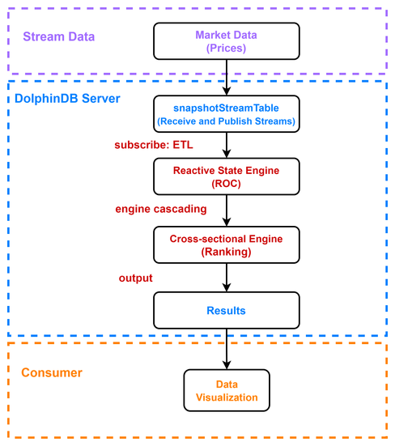
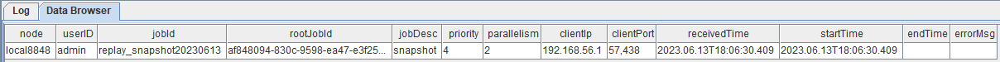
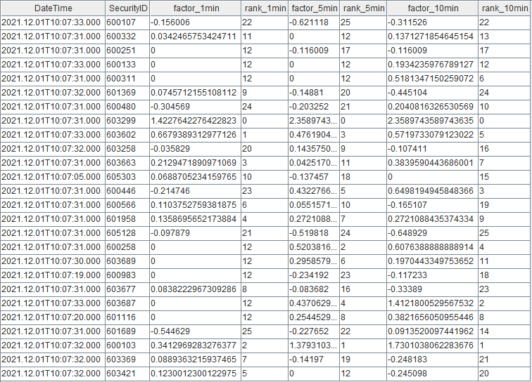
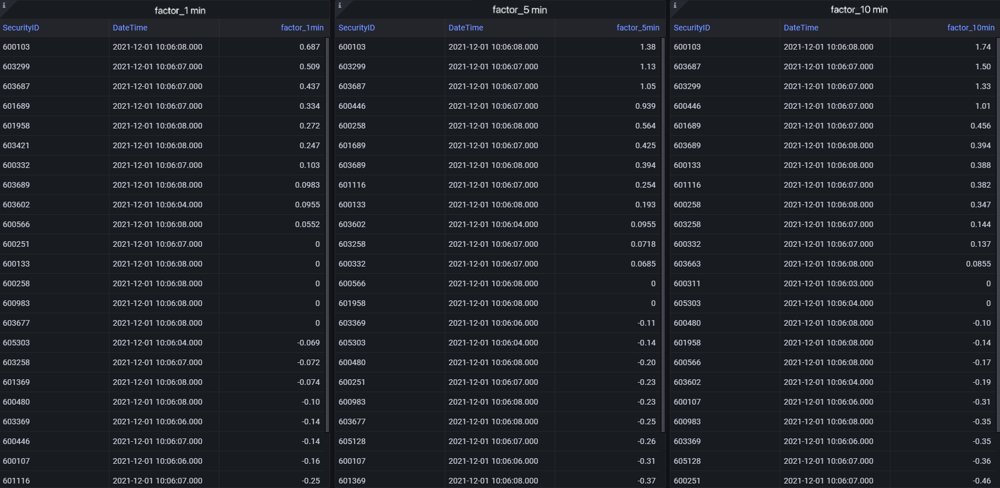

# DolphinDB Streaming: Calculate Real-time Rank of Price Rate of Change

The price rate of change (ROC) is a momentum-based indicator used in the stock market, measuring the percentage difference in price between the current price and the price n periods ago. It helps investors and traders analyze the momentum and direction of price changes to make informed investment decisions.

This tutorial provides a low-latency solution which utilizes streaming engines to track the ROC rankings for 1-min, 5-min, and 10-min intervals, respectively.

- [DolphinDB Streaming: Calculate Real-time Rank of Price Rate of Change](#dolphindb-streaming-calculate-real-time-rank-of-price-rate-of-change)
	- [1. Before Calculation](#1-before-calculation)
		- [1.1 Sample Data](#11-sample-data)
		- [1.2 Calculated Metrics](#12-calculated-metrics)
		- [1.3 Workflow](#13-workflow)
	- [2. Implementation](#2-implementation)
		- [2.1 Create a Database and Table](#21-create-a-database-and-table)
		- [2.2 Import Sample Data](#22-import-sample-data)
		- [2.3 Create a Stream Table](#23-create-a-stream-table)
		- [2.4 Create Streaming Engines and Subscribe to the Stream Table](#24-create-streaming-engines-and-subscribe-to-the-stream-table)
		- [2.5 Data Visualization with Grafana](#25-data-visualization-with-grafana)
		- [2.6 Data Replay](#26-data-replay)
	- [3. Results](#3-results)
	- [4. Performance Testing](#4-performance-testing)
		- [4.1 Response Time for Single-record Calculation](#41-response-time-for-single-record-calculation)
		- [4.2 Response Time for Batch Calculation](#42-response-time-for-batch-calculation)
	- [5. Conclusion](#5-conclusion)
	- [Appendices](#appendices)

## 1. Before Calculation

### 1.1 Sample Data

This tutorial uses the market data on 2021.12.01 as the sample data. The table schema is as follows:

| **Columns** | **Data Types** | **Meaning** |
| :----------- | :----------- | :----------- |
| SecurityID   | SYMBOL       | security ID  |
| DateTime     | TIMESTAMP    | date         |
| PreClosePx   | DOUBLE       | closing price  |
| OpenPx       | DOUBLE       | opening price  |
| HighPx       | DOUBLE       | highest price  |
| LowPx        | DOUBLE       | lowest price   |
| LastPx       | DOUBLE       | last price     |
| ……           | ……           | ……           |

### 1.2 Calculated Metrics

Before calculating the ROC rankings, we need to obtain the ROC first.

* Formula to calculate the ROC:
*(lastPx - prevLastPx) / prevLastPx \* 100 %*

where: *prevLastPx* is the price n minutes before the current time.

* Three metrics are defined based on the formula above:
	- factor_1min: 1 minute ROC;
	- factor_5min: 5 minute ROC;
	- factor_10min: 10 minute ROC.

* The following rules should be noted:

- Only ROC of the stocks whose ID start with 60 will be calculated. 
- Since the earliest price comes at 09:25:00, only records after 09:25:00 will be filtered to participate in the calculation.
- If there is no match at (current time - n), *prevLastPx* takes the price of the most recent record n minutes ago. 
	For example, for factor_5min, supposing that the last record for the morning session is at 11:30:00, after which no data is generated (between 11:30:01 and 12:59:59). For the record at 13:03:00 in the afternoon session, *prevLastPx* takes the most recent value, i.e., *lastPx* at 11:30:00.
- If no record exists at (current time - n) or before, *prevLastPx* takes the price of the first available record.
	For example, for factor_10min, supposing that the current time is 09:30:00 and the first record comes at 09:25:00, there is no record 10 minutes ago (09:20:00). In this case, prevLastPx takes the price of the first record, i.e., lastPx at 09:25:00.
  - 比如 10 分钟涨幅，假设 09:30:00 时，只有 09:25:00~09:30:00 的数据，没有前 10 分钟的 09:20:00 的数据，也没有 10 分钟前的临近时间的数据，则 *prevLastPx* 为窗口第一条数据，即 09:25:00 的 *lastPx*。
- The first result will be output at 09:30:00, which is the start time of a trading day.

### 1.3 Workflow

 The following figure illustrates the process to calculate the ROC rankings:



where:

- **Stream Data**: The market data on 2021.12.01, which is replayed (with function [replay](https://docs.dolphindb.cn/en/help200/FunctionsandCommands/FunctionReferences/r/replay.html)) at a specified rate to simulate real-time ingestion.
- **DolphinDB server**:
  - snapshotStreamTable: The DolphinDB stream table used to receive and publish the stream to streaming engines for calculation. The stream table is subscribed with function [subscribeTable](https://docs.dolphindb.cn/en/help200/FunctionsandCommands/FunctionReferences/s/subscribeTable.html). The stocks whose ID start with 60 are filtered and appended to the reactive state engine.
  - Reactive State Engine: Used to calculate the ROC with [tmfirst](https://docs.dolphindb.cn/en/help200/FunctionsandCommands/FunctionReferences/t/tmfirst.html) and [tmove](https://docs.dolphindb.cn/en/help200/FunctionsandCommands/FunctionReferences/t/tmove.html) functions nested within user-defined function (specified in *metrics*).

## 2. Implementation

> The following script is all developed with DolphinDB GUI.

### 2.1 Create a Database and Table

```
def createDfsTb(dbName, tbName){
	//create database
	if(existsDatabase(dbName)){
		dropDatabase(dbName)
	}
	db1 = database(, VALUE, 2020.01.01..2021.01.01)
	db2 = database(, HASH, [SYMBOL, 30])
	db = database(dbName, COMPO, [db1, db2], , "TSDB")
	//create table
	schemaTable = table(
		array(SYMBOL, 0) as SecurityID,
		array(TIMESTAMP, 0) as DateTime,
		array(DOUBLE, 0) as PreClosePx,
		array(DOUBLE, 0) as OpenPx,
		array(DOUBLE, 0) as HighPx,
		array(DOUBLE, 0) as LowPx,
		array(DOUBLE, 0) as LastPx,
		array(INT, 0) as TotalVolumeTrade,
		array(DOUBLE, 0) as TotalValueTrade,
		array(SYMBOL, 0) as InstrumentStatus,
		array(DOUBLE[], 0) as BidPrice,
		array(INT[], 0) as BidOrderQty,
		array(INT[], 0) as BidNumOrders,
		array(INT[], 0) as BidOrders,
		array(DOUBLE[], 0) as OfferPrice,
		array(INT[], 0) as OfferOrderQty,
		array(INT[], 0) as OfferNumOrders,
		array(INT[], 0) as OfferOrders,
		array(INT, 0) as NumTrades,
		array(DOUBLE, 0) as IOPV,
		array(INT, 0) as TotalBidQty,
		array(INT, 0) as TotalOfferQty,
		array(DOUBLE, 0) as WeightedAvgBidPx,
		array(DOUBLE, 0) as WeightedAvgOfferPx,
		array(INT, 0) as TotalBidNumber,
		array(INT, 0) as TotalOfferNumber,
		array(INT, 0) as BidTradeMaxDuration,
		array(INT, 0) as OfferTradeMaxDuration,
		array(INT, 0) as NumBidOrders,
		array(INT, 0) as NumOfferOrders,
		array(INT, 0) as WithdrawBuyNumber,
		array(INT, 0) as WithdrawBuyAmount,
		array(DOUBLE, 0) as WithdrawBuyMoney,
		array(INT, 0) as WithdrawSellNumber,
		array(INT, 0) as WithdrawSellAmount,
		array(DOUBLE, 0) as WithdrawSellMoney,
		array(INT, 0) as ETFBuyNumber,
		array(INT, 0) as ETFBuyAmount,
		array(DOUBLE, 0) as ETFBuyMoney,
		array(INT, 0) as ETFSellNumber,
		array(INT, 0) as ETFSellAmount,
		array(DOUBLE, 0) as ETFSellMoney
	)
	db.createPartitionedTable(table=schemaTable, tableName=tbName, partitionColumns=`DateTime`SecurityID, compressMethods={DateTime:"delta"}, sortColumns=`SecurityID`DateTime, keepDuplicates=ALL)
}

dbName, tbName = "dfs://snapshot", "snapshot"
createDfsTb(dbName, tbName)
```

- The partition type of database defined above is specified as COMPO with two levels of partitions. The first level uses the VALUE domain partitioned by date. The second level uses the HASH domain with 30 partitions. 
  Such partition scheme is designed for memory reasons. The recommended size for a single partition is between 150MB and 500MB. For example, the market data on 2021.12.01 has 7873799 records with 194 columns, occupying about 7.3 GB in memory. Each partition takes up approximately 249MB.
- The TSDB storage engine is adopted to create the database.
- The table is created with columns "DateTime" and "SecurityID" as partitioning columns. To enable partition pruning when querying, you can specify a filtering condition in a where clause that includes at least one partitioning column ("DateTime" and/or "SecurityID").
- The default compression algorithm is "lz4". For data of temporal types, it is recommended to specify the *compressMethods* as "delta" to improve the compression ratio.

### 2.2 Import Sample Data

```
def transform(t){
	temp = select lpad(string(SecurityID), 6, "0") as SecurityID, DateTime, PreClosePx, OpenPx, HighPx, LowPx, LastPx, TotalVolumeTrade, TotalValueTrade, InstrumentStatus,
			fixedLengthArrayVector(BidPrice0, BidPrice1, BidPrice2, BidPrice3,  BidPrice4, BidPrice5, BidPrice6, BidPrice7, BidPrice8, BidPrice9) as BidPrice,
			fixedLengthArrayVector(BidOrderQty0, BidOrderQty1, BidOrderQty2, BidOrderQty3,  BidOrderQty4, BidOrderQty5, BidOrderQty6, BidOrderQty7, BidOrderQty8, BidOrderQty9) as BidOrderQty,
			fixedLengthArrayVector(BidNumOrders0, BidNumOrders1, BidNumOrders2, BidNumOrders3,  BidNumOrders4, BidNumOrders5, BidNumOrders6, BidNumOrders7, BidNumOrders8, BidNumOrders9) as BidNumOrders,
			fixedLengthArrayVector(BidOrders0, BidOrders1, BidOrders2, BidOrders3,  BidOrders4, BidOrders5, BidOrders6, BidOrders7, BidOrders8, BidOrders9, BidOrders10, BidOrders11, BidOrders12, BidOrders13,  BidOrders14, BidOrders15, BidOrders16, BidOrders17, BidOrders18, BidOrders19, BidOrders20, BidOrders21, BidOrders22, BidOrders23,  BidOrders24, BidOrders25, BidOrders26, BidOrders27, BidOrders28, BidOrders29, BidOrders30, BidOrders31, BidOrders32, BidOrders33,  BidOrders34, BidOrders35, BidOrders36, BidOrders37, BidOrders38, BidOrders39, BidOrders40, BidOrders41, BidOrders42, BidOrders43,  BidOrders44, BidOrders45, BidOrders46, BidOrders47, BidOrders48, BidOrders49) as BidOrders,
			fixedLengthArrayVector(OfferPrice0, OfferPrice1, OfferPrice2, OfferPrice3,  OfferPrice4, OfferPrice5, OfferPrice6, OfferPrice7, OfferPrice8, OfferPrice9) as OfferPrice,
			fixedLengthArrayVector(OfferOrderQty0, OfferOrderQty1, OfferOrderQty2, OfferOrderQty3,  OfferOrderQty4, OfferOrderQty5, OfferOrderQty6, OfferOrderQty7, OfferOrderQty8, OfferOrderQty9) as OfferOrderQty,
			fixedLengthArrayVector(OfferNumOrders0, OfferNumOrders1, OfferNumOrders2, OfferNumOrders3,  OfferNumOrders4, OfferNumOrders5, OfferNumOrders6, OfferNumOrders7, OfferNumOrders8, OfferNumOrders9) as OfferNumOrders,
			fixedLengthArrayVector(OfferOrders0, OfferOrders1, OfferOrders2, OfferOrders3,  OfferOrders4, OfferOrders5, OfferOrders6, OfferOrders7, OfferOrders8, OfferOrders9, OfferOrders10, OfferOrders11, OfferOrders12, OfferOrders13,  OfferOrders14, OfferOrders15, OfferOrders16, OfferOrders17, OfferOrders18, OfferOrders19, OfferOrders20, OfferOrders21, OfferOrders22, OfferOrders23,  OfferOrders24, OfferOrders25, OfferOrders26, OfferOrders27, OfferOrders28, OfferOrders29, OfferOrders30, OfferOrders31, OfferOrders32, OfferOrders33,  OfferOrders34, OfferOrders35, OfferOrders36, OfferOrders37, OfferOrders38, OfferOrders39, OfferOrders40, OfferOrders41, OfferOrders42, OfferOrders43,  OfferOrders44, OfferOrders45, OfferOrders46, OfferOrders47, OfferOrders48, OfferOrders49) as OfferOrders,
			NumTrades, IOPV, TotalBidQty, TotalOfferQty, WeightedAvgBidPx, WeightedAvgOfferPx, TotalBidNumber, TotalOfferNumber, BidTradeMaxDuration, OfferTradeMaxDuration, 
			NumBidOrders, NumOfferOrders, WithdrawBuyNumber, WithdrawBuyAmount, WithdrawBuyMoney,WithdrawSellNumber, WithdrawSellAmount, WithdrawSellMoney, ETFBuyNumber, ETFBuyAmount, 
			ETFBuyMoney, ETFSellNumber, ETFSellAmount, ETFSellMoney
			from t
	return temp
}

csvDataPath = "/home/v2/下载/data/20211201snapshot_30stocks.csv"
loadTextEx(dbHandle=database(dbName), tableName=tbName, partitionColumns=`DateTime`SecurityID, filename=csvDataPath, transform=transform)
```

- We only use the data of 30 stocks generated before 10:30:00 on 2021.12.01, with a total of 32,972 records, occupying about 30 MB in memory.
- The CSV file takes up 23 MB in the disk. 
- Use function [loadTextEx](https://docs.dolphindb.cn/en/help200/FunctionsandCommands/FunctionReferences/l/loadTextEx.html) to load the CSV file into database. The function ``transform`` (specified in parameter *transform*) will combine the columns with the same metric (e.g., 10 highest bid prices) into one array vector column and then its results are saved to the database. Note that you can specify the *filename* parameter as the directory where your own CSV file is located.

Validate the data import:

```
select count(*) from loadTable(dbName, tbName) group by date(DateTime) as TradeDate
```

Expected result:

| TradeDate  | count  |
| :--------- | :----- |
| 2021.12.01 | 32,972 |

### 2.3 Create a Stream Table

Before creating the stream table, make sure that your environment has been cleaned up.

```
use ops

// clean up environment
def cleanEnvironment(){
	cancelJobEx()
	try{ unsubscribeTable(tableName=`snapshotStreamTable, actionName="snapshotFilter") } catch(ex){ print(ex) }
	try{ dropStreamEngine("calChange")} catch(ex){ print(ex) }
	try{ dropStreamEngine("crossSectionalEngine") } catch(ex){ print(ex) }
	try{ undef("snapshotStreamTable", SHARED) } catch(ex){ print(ex) }
	try{ undef("changeCrossSectionalTable", SHARED) } catch(ex){ print(ex) }
}
```

Create two shared tables:
- A stream table whose schema is the same as the "tbName" table in the "dbName" database to receive the streams.
- A keyed table to display the ROC ranking.

```
// create stream table
def createStreamTable(dbName, tbName){
	schemaTB = loadTable(dbName, tbName).schema().colDefs
	share(streamTable(40000:0, schemaTB.name, schemaTB.typeString), `snapshotStreamTable)
	share(keyedTable(`SecurityID, 50:0, `DateTime`SecurityID`factor_1min`rank_1min`factor_5min`rank_5min`factor_10min`rank_10min, [TIMESTAMP, SYMBOL, DOUBLE,  INT, DOUBLE, INT, DOUBLE, INT]), `changeCrossSectionalTable)
}

cleanEnvironment()
dbName, tbName = "dfs://snapshot", "snapshot"
createStreamTable(dbName, tbName)
```

### 2.4 Create Streaming Engines and Subscribe to the Stream Table

(1) Subscribe to the stream table "snapshotStreamTable". Filter the records from 09:25:00 onwards for stocks whose ID start with 60 and then append the filtered data to the reactive state engine.

```
def snapshotFilter(engineName, mutable data){
	t = select * from data where left(SecurityID, 2)="60" and time(DateTime)>=09:25:00.000
	getStreamEngine(engineName).append!(t)
}

subscribeTable(tableName="snapshotStreamTable", actionName="snapshotFilter", offset=-1, handler=snapshotFilter{"calChange"}, msgAsTable=true, hash=0)
```

- Parameters *batchSize* and *throttle* are not specified because the amount of the sample data (with 30 stocks in total) is relatively small. The handler processes incoming messages as soon as they come in.
- When processing real-time data, you can use ``getStreamingStat().subWorkers`` to check the status of workers of subscriber nodes. If the "queueDepth" keeps increasing, it means that the message queue is blocked. At this point, you can consider configuring the *batchSize* and *throttle* parameters.

(2) Create the reactive state engine "calChange".

```
@state
def calculateChange(DateTime, LastPx, lag){
	windowFirstPx = tmfirst(DateTime, LastPx, lag)
	preMinutePx = tmove(DateTime, LastPx, lag)
	prevLastPx = iif(preMinutePx == NULL, windowFirstPx, preMinutePx)
	return 100 * (LastPx - prevLastPx) \ prevLastPx
}

createReactiveStateEngine(name="calChange", metrics=<[DateTime, calculateChange(DateTime, LastPx, lag=1m), calculateChange(DateTime, LastPx, lag=5m), calculateChange(DateTime, LastPx, lag=10m)]>, dummyTable=objByName("snapshotStreamTable"), outputTable=getStreamEngine("crossSectionalEngine"), keyColumn=`SecurityID, filter=<time(DateTime) >= 09:30:00.000>)
```

- "@state" is added at the beginning to declare a state function before the definition. Functions ``tmfirst`` and ``tmove`` are state functions involved in the calculation.
- Create an engine cascade, i.e., the output of reactive state engine is directly ingested into the cross-sectional engine. Since the *outputTable* is specified as ``getStreamEngine("crossSectionalEngine")``, execute the following script to create the cross-sectional engine before running the above script.

(3) Create the cross-sectional engine "crossSectionalEngine".

```
schemaTB = table(1:0, `SecurityID`DateTime`factor_1min`factor_5min`factor_10min, [SYMBOL, TIMESTAMP, DOUBLE, DOUBLE, DOUBLE])
createCrossSectionalEngine(name="crossSectionalEngine", metrics=<[SecurityID, factor_1min, rank(factor_1min, ascending=false), factor_5min, rank(factor_5min, ascending=false), factor_10min, rank(factor_10min, ascending=false)]>, dummyTable=schemaTB, outputTable=objByName("changeCrossSectionalTable"), keyColumn=`SecurityID, triggeringPattern='perBatch', useSystemTime=false, timeColumn=`DateTime)
```

- Parameter *dummyTable* is specified as ``schemaTB`` whose schema is the same as the output table of engine "calChange".
- Parameter *triggeringPattern* can set how to trigger the calculations. It is specified as 'perBatch' that calculates when a batch of data arrives.

### 2.5 Data Visualization with Grafana

Refer to [DolphinDB Grafana DataSource Plugin](https://gitee.com/dolphindb/grafana-datasource/blob/master/README.md) for detailed instruction on how to configure and visualize data.

Execute the following script to check the ROC rankings with Grafana.

- 1 minute ROC ranking:

```
select SecurityID, DateTime, factor_1min from changeCrossSectionalTable order by rank_1min
```

- 5 minute ROC ranking:

```
select SecurityID, DateTime, factor_5min from changeCrossSectionalTable order by rank_5min
```

- 10 minute ROC ranking:

```
select SecurityID, DateTime, factor_10min from changeCrossSectionalTable order by rank_10min
```

### 2.6 Data Replay

```
t = select * from loadTable("dfs://snapshot", "snapshot") where date(DateTime)=2021.12.01 order by DateTime
submitJob("replay_snapshot", "snapshot",  replay{t, snapshotStreamTable, `DateTime, `DateTime, 1000, true, 1})
getRecentJobs()
```

Output:



The empty columns "endTime" and "errorMsg" indicate that the job has not been completed.

## 3. Results

- Query Result displayed in DolphinDB GUI



> You can check the results with all DolphinDB APIs in real time.

- Results Dispalyed with Grafana



## 4. Performance Testing

We test the response time for single-record calculation and batch calculation.
- Response time: Calculated from the receipt of the input by the reactive state engine to the output of the results by the cross-sectional engine
- Test data: The records of 1650 stocks on a certain day in 2021 
- The server CPU: the Intel(R) Xeon(R) Silver 4216 CPU @ 2.10GHz

### 4.1 Response Time for Single-record Calculation

We test the response time of calculating one record for a single stock and one record for each of 1650 stocks. The execution is performed 10 times and the average value is taken. 

The following is the testing results:

| Stocks | Elapsed Time (ms) |
| :------- | :------------ |
| 1        | 0.20          |
| 1650     | 3.45          |

### 4.2 Response Time for Batch Calculation

We test the response time of calculating a batch of records (6.58 million) for 1650 stocks. The total response time is 17 seconds, and the engine can process up to 380,000 records per second.

## 5. Conclusion

Based on the DolphinDB streaming framework, this tutorial provides a low-latency solution for calculating the price rate of change, aiming to improve the development efficiency within streaming business scenarios, and to facilitate more effective exploration of real-time streaming solutions.

## Appendices

Sample data: [20211201snapshot_30stocks.zip](data/realtime_ROC_rankings/20211201snapshot_30stocks.zip) 

Script:

 [01. Create database and import data](script/realtime_ROC_rankings/01._Create_database_and_import_data.txt) 

 [02. Create stream table](script/realtime_ROC_rankings/02._Create_stream_table.txt) 

 [03. Create streaming engine](script/realtime_ROC_rankings/03._Create_streaming_engine.txt) 

 [04. Replay data](script/realtime_ROC_rankings/04._Replay_data.txt) 

 [05. Performance testing](script/realtime_ROC_rankings/05._Performance_testing.txt) 

