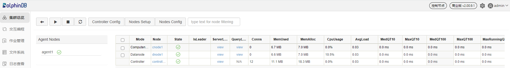
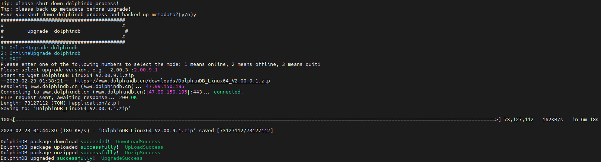

# DolphinDB Single-Server Cluster Deployment

A DolphinDB cluster consists of 4 types of nodes: controller, agent，data node, and compute node.

- Controller: The controllers are the core of a DolphinDB cluster. They collect heartbeats of agents and data nodes, monitor the status of each node, and manage metadata and transactions of the distributed file system. There is only one controller in a single-machine cluster. 
- Agent: An agent executes the commands issued by a controller to start/stop local data nodes. Each physical server has one and only one agent within a cluster.
- Data node: Data are stored and queries (or more complex computations) are executed on data nodes. A physical server can be configured with multiple data nodes.
- Compute node: The compute node is used for queries and computation, including historical data queries, distributed joins, batch processing, streaming, and machine learning model training. A physical server can be configured with multiple compute nodes. Since data is not stored on a compute node, you can use `loadTable` to load data from a data node to a compute node for computational work. On a compute node, you can create the database and partitioned tables, and write data to the partitioned tables by calling a write interface. However, writing data on a compute node will lead to more network overhead than a data node as the compute node need to send data to data nodes for storage. 

This tutorial describes how to deploy the DolphinDB single-server cluster, and update the cluster and license file. It serves as a quick start guide for you.


  - [1. Deploy Single-server Cluster on Linux OS](#1-deploy-single-server-cluster-on-linux-os)
    - [Step 1: Download](#step-1-download)
    - [Step 2: Update License File](#step-2-update-license-file)
    - [Step 3: Start DolphinDB Cluster](#step-3-start-dolphindb-cluster)
    - [Step 4: Create Databases and Partitioned Tables on Data Nodes](#step-4-create-databases-and-partitioned-tables-on-data-nodes)
    - [Step 5: Perform Queries and Computation on Compute Nodes](#step-5-perform-queries-and-computation-on-compute-nodes)
  - [2. Deploy Single-server Cluster on Windows OS](#2-deploy-single-server-cluster-on-windows-os)
    - [Step 1: Download](#step-1-download-1)
    - [Step 2: Update License File](#step-2-update-license-file-1)
    - [Step 3: Start DolphinDB Cluster](#step-3-start-dolphindb-cluster-1)
    - [Step 4: Create Databases and Partitioned Tables on Data Nodes](#step-4-create-databases-and-partitioned-tables-on-data-nodes-1)
    - [Step 5: Perform Queries and Computation on Compute Nodes](#step-5-perform-queries-and-computation-on-compute-nodes-1)
  - [3. Upgrade DolphinDB Cluster](#3-upgrade-dolphindb-cluster)
    - [3.1 Upgrade on Linux](#31-upgrade-on-linux)
    - [3.2 Upgrade on Windows](#32-upgrade-on-windows)
  - [4. Update License File](#4-update-license-file)
    - [Step 1: Replace the License File](#step-1-replace-the-license-file)
    - [Step 2: Update License File](#step-2-update-license-file-2)
  - [5. Cluster Configuration Files](#5-cluster-configuration-files)
    - [5.1 *controller.cfg*](#51-controllercfg)
    - [5.2 *agent.cfg*](#52-agentcfg)
    - [5.3 *cluster.nodes*](#53-clusternodes)
    - [5.4 *cluster.cfg*](#54-clustercfg)
  - [6. FAQ](#6-faq)
    - [Q1: Failed to start the server for the port is occupied by other programs](#q1-failed-to-start-the-server-for-the-port-is-occupied-by-other-programs)
    - [Q2: Failed to access the web interface](#q2-failed-to-access-the-web-interface)
    - [Q3: Roll back a failed upgrade on Linux](#q3-roll-back-a-failed-upgrade-on-linux)
    - [Q4: Roll back a failed upgrade on Windows](#q4-roll-back-a-failed-upgrade-on-windows)
    - [Q5: Failed to update the license file](#q5-failed-to-update-the-license-file)
    - [Q6: Change configuration](#q6-change-configuration)
  - [7. See Also](#7-see-also)


## 1. Deploy Single-server Cluster on Linux OS

In this tutorial, you will learn how to deploy a basic single-server cluster. Use the config file from the installation package to deploy a single-server cluster with 1 controller, 1 agent, 1 data node and 1 compute node.

### Step 1: Download

- Official website: [DolphinDB](https://www.dolphindb.com/alone/alone.php?id=75)
- Download DolphinDB with a shell command. Take version 2.00.9.1 for example:

```
wget "https://www.dolphindb.cn/downloads/DolphinDB_Linux64_V2.00.9.1.zip"
```

Then extract the installation package to the specified directory (e.g., to */DolphinDB*):

```
unzip DolphinDB_Linux64_V2.00.9.1.zip -d /DolphinDB
```

> ❗ The directory name cannot contain any space characters, otherwise the startup of the data node will fail.

### Step 2: Update License File

If you have obtained the Enterprise Edition license, use it to replace the following file:

```
/DolphinDB/server/dolphindb.lic
```

Otherwise, continue to use the community version, which allows up to 8 GB RAM use for 20 years.

### Step 3: Start DolphinDB Cluster

Navigate to the folder */DolphinDB/server/*. The file permissions need to be modified for the first startup. Execute the following shell command:

```
chmod +x dolphindb
```

Then go to */DolphinDB/server/clusterDemo* to start the controller and agent with no specified order.

- **Start Controller**

```
sh startController.sh
```

- **Start Agent**

```
sh startagent.sh
```

To check whether the node was started, execute the following shell command:

```
ps aux|grep dolphindb
```

The following information indicates a successful startup:


- **Start Data Nodes and Compute Nodes**

You can start or stop data nodes and compute nodes, and modify cluster configuration parameters on DolphinDB cluster management web interface. Enter the deployment server IP address and controller port number in the browser to navigate to the DolphinDB Web. The server address (*ip:port*) used in this tutorial is 10.0.0.80:8900. Below is the web interface. Log in with the default administrator account (username: admin, password: 123456). Then select the required data nodes and compute nodes, and click on the **execute**/**stop** button.


Click on the **refresh** button to check the status of the nodes. The following green check marks mean all the selected nodes have been turned on:



> ❗ If the browser and DolphinDB are not deployed on the same server, you should turn off the firewall or open the corresponding port beforehand.

### Step 4: Create Databases and Partitioned Tables on Data Nodes

Data nodes can be used for data storage, queries and computation. The following example shows how to create databases and write data on data nodes. First, open the web interface of the **Controller**, and click on the corresponding **Data node** to open its **Shell** interface:


You can also enter IP address and port number of the data nodes in your browser to navigate to the **Shell** interface.

Execute the following script to create a database and a partitioned table:

```
//create a database and a partitioned table
login("admin", "123456")
dbName = "dfs://testDB"
tbName = "testTB"
if(existsDatabase(dbName)){
        dropDatabase(dbName)
}
db = database(dbName, VALUE, 2021.01.01..2021.12.31)
colNames = `SecurityID`DateTime`PreClosePx`OpenPx`HighPx`LowPx`LastPx`Volume`Amount
colTypes = [SYMBOL, DATETIME, DOUBLE, DOUBLE, DOUBLE, DOUBLE, DOUBLE, INT, DOUBLE]
schemaTable = table(1:0, colNames, colTypes)
db.createPartitionedTable(table=schemaTable, tableName=tbName, partitionColumns=`DateTime)

```

Then, run the following script to generate 1-minute OHLC bars and append the data to the created partitioned table “tbName”:

```
//simulate OHLC data and append it to the partitioned table
n = 1210000
randPrice = round(10+rand(1.0, 100), 2)
randVolume = 100+rand(100, 100)
SecurityID = lpad(string(take(0..4999, 5000)), 6, `0)
DateTime = (2023.01.08T09:30:00 + take(0..120, 121)*60).join(2023.01.08T13:00:00 + take(0..120, 121)*60)
PreClosePx = rand(randPrice, n)
OpenPx = rand(randPrice, n)
HighPx = rand(randPrice, n)
LowPx = rand(randPrice, n)
LastPx = rand(randPrice, n)
Volume = int(rand(randVolume, n))
Amount = round(LastPx*Volume, 2)
tmp = cj(table(SecurityID), table(DateTime))
t = tmp.join!(table(PreClosePx, OpenPx, HighPx, LowPx, LastPx, Volume, Amount))
dbName = "dfs://testDB"
tbName = "testTB"
loadTable(dbName, tbName).append!(t)

```

For more details about the above functions, see [DolphinDB user manual](https://www.dolphindb.com/help/FunctionsandCommands/index.html) or the function documentation popup on the web interface.


You can check the created database and table in the **Database** on the left side of the web interface.


Variables you created can be checked in **Local Variables**. You can click on the corresponding variable name to preview the related information (including data type, size, and occupied memory size).


Return to the **DFS** file page of the controller to check the created partitions under the databases.


### Step 5: Perform Queries and Computation on Compute Nodes

Compute nodes are used for queries and computation. The following example shows how to perform these operations in partitioned tables on a compute node. 

First, open the web interface of the **Controller**, and then click the corresponding **Compute node** to open its **Shell** interface:


You can also enter IP address and port number of the compute nodes in your browser to navigate to the **Shell** interface.

Execute the following script to load the partitioned table:  

```
// load the partitioned table
pt = loadTable("dfs://testDB", "testTB")

```

Note that only metadata of the partitioned table is loaded here. Then execute the following script to count the number of the records for each day in table “pt”:

```
//If the result contains a small amount of data, you can download it to display on the client directly.
select count(*) from pt group by date(DateTime) as Date

```

The result will be displayed at the bottom of the web interface:


Execute the following script to calculate OHLC bars for each stock per day:

```
// If the result contains a large amount of data, you can assign it to a variable that occupies the server memory, and download it to display in seperate pages on the client.
result = select first(LastPx) as Open, max(LastPx) as High, min(LastPx) as Low, last(LastPx) as Close from pt group by date(DateTime) as Date, SecurityID

```

The result is assigned to the variable `result`. It will not be displayed on the client directly, thus reducing the memory of the client. To check the results, click on the `result` in the **Local Variables**.


## 2. Deploy Single-server Cluster on Windows OS

In this tutorial, you will learn how to deploy a basic single-server cluster. Use the config file from the installation package to deploy a single-server cluster with 1 controller, 1 agent, 1 data node and 1 compute node.

### Step 1: Download

- Official website: [DolphinDB](https://www.dolphindb.com/alone/alone.php?id=75)
- Extract the installation package to the specified directory (e.g., to *C:\DolphinDB*):

```
C:\DolphinDB
```

> ❗ The directory name cannot contain any space characters, otherwise the startup of the data node will fail. For example, do not extract it to the *Program Files* folder on Windows.

### Step 2: Update License File

If you have obtained the Enterprise Edition license, use it to replace the following file:

```
C:\DolphinDB\server\dolphindb.lic
```

Otherwise, continue to use the community version, which allows up to 8 GB RAM use for 20 years.

### Step 3: Start DolphinDB Cluster

- **Start Controller and Agent in Console Mode**

Navigate to the folder *C:\DolphinDB\server\clusterDemo*. Then double click *startController.bat* and *startAgent.bat*.

- **Start Controller and Agent in Background Mode**

Navigate to the folder *C:\DolphinDB\server\clusterDemo*. Then double click *backgroundStartController.vbs* and *backgroundStartAgent.vbs*.

- **Start Data Nodes and Compute Nodes**

You can start or stop data nodes and compute nodes, and modify cluster configuration parameters on the web interface. Enter the deployment server IP address and controller port number in the browser to navigate to the DolphinDB Web. The server address (*ip:port*) used in this tutorial is 10.0.0.80:8900. Below is the web interface. Log in with the default administrator account (username: admin, password: 123456). Then select the required data nodes and compute nodes, and click on the **execute**/**stop** button.


Click on the **refresh** button to check the status of the nodes. The following green check marks mean all the selected nodes have been turned on:


> ❗ If the browser and DolphinDB are not deployed on the same server, you should turn off the firewall or open the corresponding port beforehand.

### Step 4: Create Databases and Partitioned Tables on Data Nodes

Data nodes can be used for data storage, queries and computation. The following example shows how to create databases and write data on data nodes. First, open the web interface of the **Controller**, and click on the corresponding **Data node** to open its **Shell** interface:


You can also enter IP address and port number of the data nodes in your browser to navigate to the **Shell** interface.

Execute the following script to create a database and a partitioned table：

```
// create a database and a partitioned table
login("admin", "123456")
dbName = "dfs://testDB"
tbName = "testTB"
if(existsDatabase(dbName)){
        dropDatabase(dbName)
}
db = database(dbName, VALUE, 2021.01.01..2021.12.31)
colNames = `SecurityID`DateTime`PreClosePx`OpenPx`HighPx`LowPx`LastPx`Volume`Amount
colTypes = [SYMBOL, DATETIME, DOUBLE, DOUBLE, DOUBLE, DOUBLE, DOUBLE, INT, DOUBLE]
schemaTable = table(1:0, colNames, colTypes)
db.createPartitionedTable(table=schemaTable, tableName=tbName, partitionColumns=`DateTime)

```

Then, run the following scripts to generate 1-minute OHLC bars and append the data to the created partitioned table “tbName”:

```
// simulate OHLC data and append it to the partitioned table
n = 1210000
randPrice = round(10+rand(1.0, 100), 2)
randVolume = 100+rand(100, 100)
SecurityID = lpad(string(take(0..4999, 5000)), 6, `0)
DateTime = (2023.01.08T09:30:00 + take(0..120, 121)*60).join(2023.01.08T13:00:00 + take(0..120, 121)*60)
PreClosePx = rand(randPrice, n)
OpenPx = rand(randPrice, n)
HighPx = rand(randPrice, n)
LowPx = rand(randPrice, n)
LastPx = rand(randPrice, n)
Volume = int(rand(randVolume, n))
Amount = round(LastPx*Volume, 2)
tmp = cj(table(SecurityID), table(DateTime))
t = tmp.join!(table(PreClosePx, OpenPx, HighPx, LowPx, LastPx, Volume, Amount))
dbName = "dfs://testDB"
tbName = "testTB"
loadTable(dbName, tbName).append!(t)

```

For more details about the above functions, see [DolphinDB user manual](https://www.dolphindb.com/help/FunctionsandCommands/index.html) or the function documentation popup on the web interface.


You can check the created database and table in the **Database** on the left side of the web interface.


Variables you created can be checked in **Local Variables**. You can click on the corresponding variable name to preview the related information (including data type, size, and occupied memory size).


Return to the **DFS** file page of the controller to check the created partitions under the databases.


### Step 5: Perform Queries and Computation on Compute Nodes

Compute nodes are used for queries and computation. The following example shows how to perform these operations in partitioned tables on a compute node. First, open the web interface of the **Controller**, and then click the corresponding **Compute node** to open its **Shell** interface:


You can also enter IP address and port number of the compute nodes in your browser to navigate to the **Shell** interface.

Execute the following script to load the partitioned table: 

```
// load the partitioned table
pt = loadTable("dfs://testDB", "testTB")

```

Note that only metadata of the partitioned table is loaded here. Then execute the following script to count the number of the records for each day in table “pt“:

```
//If the result contains a small amount of data, you can download it to display on the client directly.
select count(*) from pt group by date(DateTime) as Date

```

The result will be displayed at the bottom of the web interface:


Execute the following script to calculate OHLC bars for each stock per day:

```
// If the result contains a large amount of data, you can assign it to a variable that occupies the server memory, and download it to display in seperate pages on the client.
result = select first(LastPx) as Open, max(LastPx) as High, min(LastPx) as Low, last(LastPx) as Close from pt group by date(DateTime) as Date, SecurityID

```

The result is assigned to the variable `result`. It will not be displayed on the client directly, thus reducing the memory of the client. To check the results, click on the `result` in the **Local Variables**.


## 3. Upgrade DolphinDB Cluster

### 3.1 Upgrade on Linux

**Step 1: Close all nodes**

Navigate to the folder */DolphinDB/server/clusterDemo* to execute the following command:

```
./stopAllNode.sh
```

**Step 2: Back up the Metadata**

The metadata file is created only when data is written to the single-server cluster. Otherwise, you can just skip this step.

- Back up the Metadata of Controller

By default, the metadata of controller is stored in the *DFSMetaLog.0* file under the folder */DolphinDB/server/clusterDemo/dfsMeta*:

```
/DolphinDB/server/clusterDemo/dfsMeta
```

When the metadata exceeds certain size limits, a *DFSMasterMetaCheckpoint.0* file will be generated.  

Navigate to the folder */DolphinDB/server/clusterDemo/dfsMeta* to execute the following shell commands:

```
mkdir backup
cp -r DFSMetaLog.0 backup
cp -r DFSMasterMetaCheckpoint.0 backup
```

- Back up the Metadata of Data Nodes

By default, the metadata of data nodes is stored in the folder */DolphinDB/server/clusterDemo/data/\<data node alias>/storage/CHUNK_METADATA*. The default storage directory in this tutorial is:

```
/DolphinDB/server/clusterDemo/data/dnode1/storage/CHUNK_METADATA
```

Navigate to the above directory to execute the following shell command:

```
cp -r CHUNK_METADATA ../../backup
```

> ❗ If the backup files are not in the above default directory, check the directory specified by the configuration parameters *dfsMetaDir* and *chunkMetaDir*. If the two parameters are not modified but the configuration parameter *volumes* is specified, then you can find the CHUNK_METADATA under the *volumes* directory.

**Step 3: Upgrade**

> ❗ When the server is upgraded to a certain version, the plugin should also be upgraded to the corresponding version.

- Online Upgrade

Navigate to the folder */DolphinDB/server/clusterDemo* to execute the following command:

```
./upgrade.sh
```

The following prompt is returned:


Type y and press Enter:


Type 1 and press Enter:


Type a version number and press Enter. To update to version 2.00.9.1, for example, type 2.00.9.1 and press Enter. The following prompt indicates a successful upgrade.



- Offline Upgrade

Download a new version of server package from [DolphinDB website](https://dolphindb.com/).

Upload the installation package to */DolphinDB/server/clusterDemo*. Take version 2.00.9.1 as an example.


Navigate to the folder */DolphinDB/server/clusterDemo* to execute the following command:

```
./upgrade.sh
```

The following prompt is returned:


Type y and press Enter:


Type 2 and press Enter:


Type a version number and press Enter. To update to version 2.00.9.1, for example, type 2.00.9.1 and press Enter. The following prompt indicates a successful upgrade.


**Step 4: Restart the Cluster**

Navigate to folder */DolphinDB/server/clusterDemo* to start the controller and agent with no specified order.

- Start Controller

```
sh startController.sh
```

- Start Agent

```
sh startagent.sh
```

Open the web interface and execute the following script to check the current version of DolphinDB.

```
version()
```

### 3.2 Upgrade on Windows

**Step 1: Close all nodes**

- In console mode, close the foreground process.
- In background mode, close DolphinDB process from Task Manager.

**Step 2: Back up the Metadata**

The metadata file is created only when data is written to the single-server cluster. Otherwise, you can just skip this step.

- Back up the Metadata of Controller

By default, the metadata of controller is stored in the *DFSMetaLog.0* file under the folder *C:\DolphinDB\server\clusterDemo\dfsMeta*:

```
C:\DolphinDB\server\clusterDemo\dfsMeta
```

When the metadata exceeds certain size limits, a *DFSMasterMetaCheckpoint.0* file will be generated.  

Create a folder *backup* in this directory, then copy the *DFSMetaLog.0* file and *DFSMasterMetaCheckpoint.0* file to the folder:


- Back up the Metadata of Data Nodes

By default, the metadata of data nodes is stored in the folder *C:\DolphinDB\server\clusterDemo\data\ \<data node alias>\storage\CHUNK_METADATA*. The default storage directory in this tutorial is:

```
C:\DolphinDB\server\clusterDemo\data\dnode1\storage\CHUNK_METADATA
```

Copy the *CHUNK_METADATA* file to the above *backup* folder:


> ❗ If the backup files are not in the above default directory, check the directory specified by the configuration parameters *dfsMetaDir* and *chunkMetaDir*. If the two parameters are not modified but the configuration parameter *volumes* is specified, then you can find the CHUNK_METADATA under the *volumes* directory.

**Step 3: Upgrade**

- Download a new version of installation package from [DolphinDB website](https://dolphindb.com/).
- Replace an existing files with all files (except *dolphindb.cfg* and *dolphindb.lic*) in the current *\DolphinDB\server* folder.

> ❗ When the server is upgraded to a certain version, the plugin should also be upgraded to the corresponding version.

**Step 4: Restart the Cluster**

- Start Controller and Agent in Console Mode:

Navigate to the folder *C:\DolphinDB\server\clusterDemo*. Then double click *startController.bat* and *startAgent.bat*.

- Start Controller and Agent in Background Mode

Navigate to the folder *C:\DolphinDB\server\clusterDemo*. Then double click *backgroundStartController.vbs* and *backgroundStartAgent.vbs*.

Open the web interface and execute the following script to check the current version of DolphinDB.

```
version()
```

## 4. Update License File

Before updating, open the web interface and execute the following code to check the expiration time:

```
use ops
updateAllLicenses()
```


Check the “end_date“ to confirm whether the update is successful.

### Step 1: Replace the License File

Replace an existing license file with a new one.

License file path on Linux:

```
/DolphinDB/server/dolphindb.lic
```

License file path on Windows:

```
C:\DolphinDB\server\dolphindb.lic
```

### Step 2: Update License File

- Online Update

Open the web interface to execute the following script:

```
use ops
updateAllLicenses()
```

The “end_date” is updated:


💡**Note:**

> The client name of the license cannot be changed.
>
> The number of nodes, memory size, and the number of CPU cores cannot be smaller than the original license.
>
> The update takes effect only on the node where the function is executed. Therefore, in a cluster mode, the function needs to be run on all controllers, agents, data nodes, and compute nodes.
>
> The license type must be either commercial (paid) or free.

- Offline Update

Restart DolphinDB cluster to complete the updates.

## 5. Cluster Configuration Files

The DolphinDB installer includes a built-in cluster configuration file, which can be used to configure a basic single-server cluster with 1 controller, 1 agent, 1 data node, and 1 compute node.

The cluster configuration file for Linux is located in the folder */DolphinDB/server/clusterDemo/config*. The configuration file for Windows is in *C:\DolphinDB\server\clusterDemo\config*. For better performance, you need to manually modify the cluster configuration file (including *controller.cfg*, *agent.cfg*, *cluster.nodes* and *cluster.cfg)*.

### 5.1 *controller.cfg*

Execute the following shell command to modify *controller.cfg*:

```
vim ./controller.cfg
```

```
mode=controller
localSite=localhost:8900:controller8900
dfsReplicationFactor=1
dfsReplicaReliabilityLevel=2
dataSync=1
workerNum=4
localExecutors=3
maxConnections=512
maxMemSize=8
lanCluster=0
 
```

The default port number of the controller is 8900. You can specify its IP address, port number and alias by modifying the *localSite* parameter.

- For example, specify \<ip>:\<port>:\<alias> as 10.0.0.80:8900:controller8900:

```
localSite=10.0.0.80:8900:controller8900
```

Other parameters can be modified based on your own device.

### 5.2 *agent.cfg*

Execute the following shell command to modify *agent.cfg*:

```
vim ./agent.cfg
```

```
mode=agent
localSite=localhost:8901:agent1
controllerSite=localhost:8900:controller8900
workerNum=4
localExecutors=3
maxMemSize=4
lanCluster=0

```

The parameter *controllerSite* in the file *agent.cfg* must be identical with the parameter *localSite* in *controller.cfg*, because the agent has to use this information to contact the controller.

The default port number of the agent is 8901. You can specify its IP address, port number and alias by modifying the *localSite* parameter.

- For example:

```
localSite=10.0.0.80:8901:agent1
```

Other parameters can be modified based on your own device.

### 5.3 *cluster.nodes*

Execute the following shell command to modify *cluster.nodes*:

```
vim ./cluster.nodes
```

```
localSite,mode
localhost:8901:agent1,agent
localhost:8902:dnode1,datanode
localhost:8903:cnode1,computenode

```

*cluster.nodes* is used to store information about agents, data nodes and compute nodes. The default cluster configuration file contains 1 agent, 1 data node and 1 compute node. You can configure the number of nodes as required. The configuration file is divided into two columns (*localSite* and *mode*). The parameter *localSite* contains the node IP address, port number and alias, which are separated by colons ":". The parameter *mode* specifies the node type.

> ❗ Node aliases are case sensitive and must be unique in a cluster.

### 5.4 *cluster.cfg*

Execute the following shell command to modify *cluster.cfg*:

```
vim ./cluster.cfg
```

```
maxMemSize=32
maxConnections=512
workerNum=4
localExecutors=3
maxBatchJobWorker=4
OLAPCacheEngineSize=2
TSDBCacheEngineSize=1
newValuePartitionPolicy=add
maxPubConnections=64
subExecutors=4
lanCluster=0
enableChunkGranularityConfig=true

```

The configuration parameters in this file apply to each data node and compute node in the cluster. You can modify them based your own device.

## 6. FAQ

### Q1: Failed to start the server for the port is occupied by other programs

If you cannot start the server, you can first check the log file of nodes under */DolphinDB/server/clusterDemo/log.*

If the following error occurs, it indicates that the specified port is occupied by other programs.

```
<ERROR> :Failed to bind the socket on port 8900 with error code 98
```

In such case, you can change to another free port in the config file.  


### Q2: Failed to access the web interface

Despite the server running and the server address being correct, the web interface remains inaccessible.


A common reason for the above problem is that the browser and DolphinDB are not deployed on the same server, and a firewall is enabled on the server where DolphinDB is deployed. You can solve this issue by turning off the firewall or by opening the corresponding port.  


### Q3: Roll back a failed upgrade on Linux

If you cannot start DolphinDB single-server cluster after upgrade, you can follow steps below to roll back to the previous version.

**Step 1: Restore metadata files**

Navigate to the folder */DolphinDB/server/clusterDemo/dfsMeta* to restore metadata files from *backup* with the following commands:

```
cp -r backup/DFSMetaLog.0 ./
cp -r backup/DFSMasterMetaCheckpoint.0 ./
cp -r backup/CHUNK_METADATA ./dnode1/storage

```

**Step 2: Restore program files**

Download the previous version of server package from the official website. Replace the server that failed to upgrade with all files (except *dolphindb.cfg*, *clusterDemo* and *dolphindb.lic*) just downloaded.  


### Q4: Roll back a failed upgrade on Windows

If you cannot start DolphinDB single-server cluster after upgrade, you can follow steps below to roll back to the previous version.

**Step 1: Restore metadata files**

Replace the *DFSMetaLog.0* and *DFSMasterMetaCheckpoint.0* files under *C:\DolphinDB\server\clusterDemo\dfsMeta* with the corresponding backup files under the *backup* folder created before upgrade. 

Replace the *CHUNK_METADATA* files under *C:\DolphinDB\server\clusterDemo\data\dnode1\storage* with the corresponding backup files under the *backup* folder created before upgrade.  

**Step 2: Restore program files**

Download the previous version of server package from the official website. Replace the server that failed to upgrade with all files (except *dolphindb.cfg*, *clusterDemo* and *dolphindb.lic*) just downloaded.  


### Q5: Failed to update the license file

Updating the license file online has to meet the requirements listed in [Step 2, Chapter 4](#step-2-update-license-file-2).

If not, you can choose to update offline or apply for an [Enterprise Edition License](https://www.dolphindb.com/mx_form/mx_form.php?id=98).

### Q6: Change configuration

For more details on configuration parameters, refer to [Configuration](https://www.dolphindb.com/help/DatabaseandDistributedComputing/Configuration/index.html).

If you encounter performance problems, you can contact our team on [Slack](https://dolphindb.slack.com/) for technical support.

## 7. See Also

For more information, refer to [DolphinDB User Manual](https://www.dolphindb.com/help/index.html).
