# DolphinDB Standalone Deployment

This tutorial is a quick start guide describing how to deploy the DolphinDB server standalone, and update the server and license file. You can also find solutions to common issues in the FAQ section.

- [DolphinDB Standalone Deployment](#dolphindb-standalone-deployment)
  - [1. Standalone Deployment on Linux OS](#1-standalone-deployment-on-linux-os)
    - [Step 1: Download](#step-1-download)
    - [Step 2: Update License File](#step-2-update-license-file)
    - [Step 3: Run DolphinDB Server](#step-3-run-dolphindb-server)
    - [Step 4: Check the Node Status on DolphinDB Web](#step-4-check-the-node-status-on-dolphindb-web)
  - [2. Standalone Deployment on Windows OS](#2-standalone-deployment-on-windows-os)
    - [Step 1: Download](#step-1-download-1)
    - [Step 2: Update License File](#step-2-update-license-file-1)
    - [Step 3: Run DolphinDB Server](#step-3-run-dolphindb-server-1)
    - [Step 4: Check the Node Status on DolphinDB Web](#step-4-check-the-node-status-on-dolphindb-web-1)
  - [3. Update DolphinDB Server](#3-update-dolphindb-server)
    - [3.1 Update on Linux](#31-update-on-linux)
    - [3.2 Update on Windows](#32-update-on-windows)
  - [4. Update License File](#4-update-license-file)
    - [Step 1: Replace the License File](#step-1-replace-the-license-file)
    - [Step 2: Update License File](#step-2-update-license-file-2)
  - [5. FAQ](#5-faq)
  - [6. See Also](#6-see-also)


## 1. Standalone Deployment on Linux OS

### Step 1: Download

- Official website: [DolphinDB](https://www.dolphindb.com/alone/alone.php?id=75)
- Download DolphinDB with a shell command. Take version 2.00.9.1 for example:

```sh
wget "https://www.dolphindb.cn/downloads/DolphinDB_Linux64_V2.00.9.1.zip"
```

Then extract the installation package to the specified directory (e.g., to */DolphinDB*):

```sh
unzip DolphinDB_Linux64_V2.00.9.1.zip -d /DolphinDB
```

**Note**: The directory name cannot contain any space characters, otherwise the startup of the data node will fail.  

### Step 2: Update License File

If you have obtained the Enterprise Edition license, use it to replace the following file:

```sh
/DolphinDB/server/dolphindb.lic
```

Otherwise, you can continue to use the community version of DolphinDB, which allows up to 8GB of memory use for 20 years.

### Step 3: Run DolphinDB Server

Navigate to the folder */DolphinDB/server/*. The file permissions need to be modified for the first startup. Execute the following shell command:

```sh
chmod +x dolphindb
```

- Linux console mode:

```sh
./dolphindb
```

The default port number of the system is 8848. To change it (e.g., to 8900), use the following command line:

```sh
./dolphindb -localSite localhost:8900:local8900
```

- Linux background mode:

```sh
sh startSingle.sh
```

To check whether the node was successfully started, execute the following shell command:

```sh
ps aux|grep dolphindb
```

The following information indicates a successful startup:

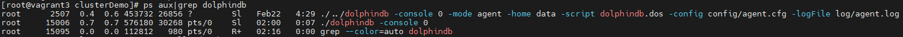

### Step 4: Check the Node Status on DolphinDB Web

Enter the deployment server IP address and port number (8848 by default) in the browser to navigate to the DolphinDB Web. The server address (*ip*:*port*) used in this tutorial is 10.0.0.82:8848. Below is the web interface.


**Note**: If the browser and DolphinDB are not deployed on the same server, you should turn off the firewall or open the corresponding port beforehand.

## 2. Standalone Deployment on Windows OS

### Step 1: Download

- Official website: [DolphinDB](https://www.dolphindb.com/alone/alone.php?id=75)

- Extract the installation package to the specified directory:

```sh
C:\DolphinDB
```

**Note**: The directory name cannot contain any space characters, otherwise the startup of the data node will fail. For example, do not extract it to the Program Files folder on Windows.

### Step 2: Update License File

If you have obtained the Enterprise Edition license, use it to replace the following file:

```sh
C:\DolphinDB\server\dolphindb.lic
```

Otherwise, you can continue to use the community version of DolphinDB, which allows up to 8GB of memory use for 20 years.

### Step 3: Run DolphinDB Server

Navigate to the folder *C:\DolphinDB\server*:

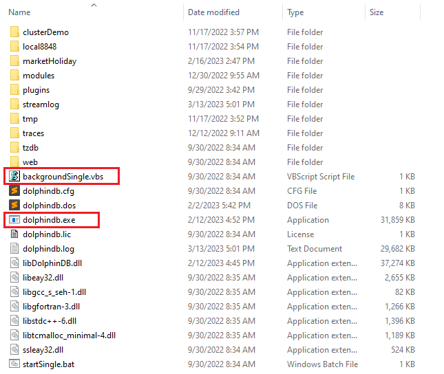

- Windows console mode:

Double click to execute *dolphindb.exe*:

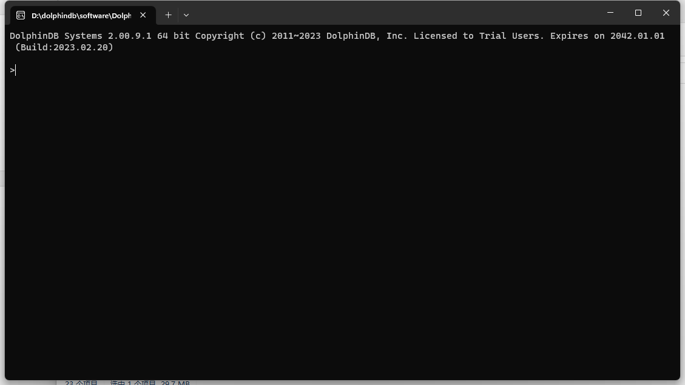

The default port number of the system is 8848. You can change it by modifying the *localSite* parameter in config file *dolphindb.cfg*.

- Windows background mode:

Double click to execute *backgroundSingle.vbs*, and check DolphinDB process in your Task Manager.

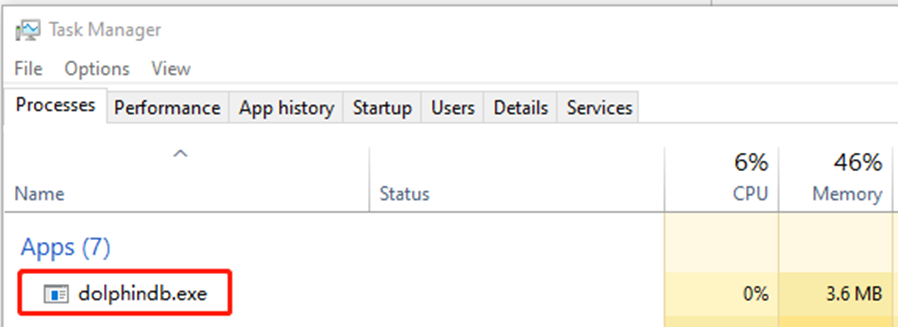

Or you can check the process in Command Prompt with the following command.

```sh
tasklist|findstr "dolphindb"
```

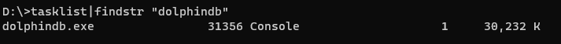

### Step 4: Check the Node Status on DolphinDB Web

Enter the deployment server IP address and port number (8848 by default) in the browser to navigate into the DolphinDB Web. The server address (*ip*:*port*) used in this tutorial is 10.0.0.82:8848. Below is the web interface.

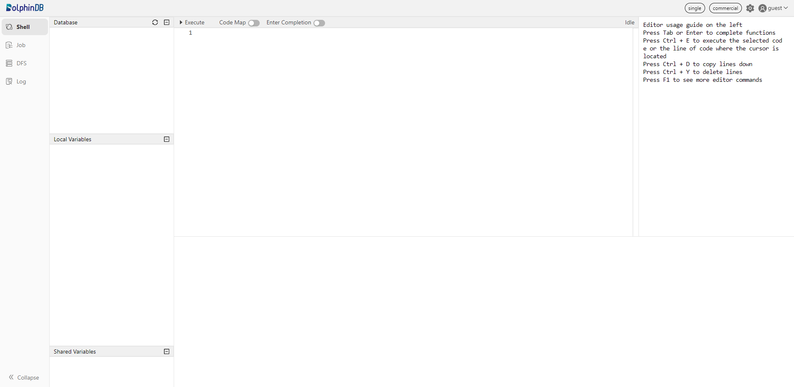

**Note**: If the browser and DolphinDB are not deployed on the same server, you should turn off the firewall or open the corresponding port beforehand.

## 3. Update DolphinDB Server

### 3.1 Update on Linux

**Step 1: Close the Server**

Navigate to the folder */DolphinDB/server/clusterDemo* to execute the following command:

```sh
./stopAllNode.sh
```

**Step 2: Backup the Metadata**

The default directory to save the metadata for a standalone mode is:

```sh
/DolphinDB/server/local8848/dfsMeta/
```

```sh
/DolphinDB/server/local8848/storage/CHUNK_METADATA/
```

You can execute the following command to back up the metadata:

```sh
mkdir backup
cp -r local8848/dfsMeta/ backup/dfsMeta
cp -r local8848/storage/CHUNK_METADATA/ backup/CHUNK_METADATA
```

**Note**: If the backup files are not in the above default directories, check the directories specified by the configuration parameters *dfsMetaDir* and *chunkMetaDir*. If the configuration parameters are not modified but the configuration parameter *volumes* is specified, then you can find the *CHUNK_METADATA* under the *volumes* directory.

**Step 3: Update**

- Online Update

Navigate to the folder */DolphinDB/server/clusterDemo* to execute the following command:

```sh
./upgrade.sh
```

The following prompt is returned:

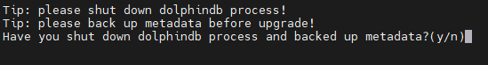

Type "y" and press Enter:

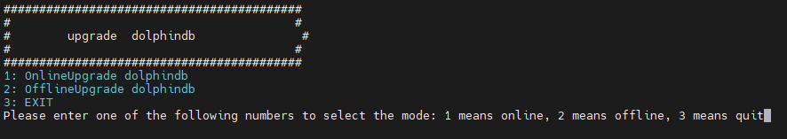

Type "1" and press Enter:

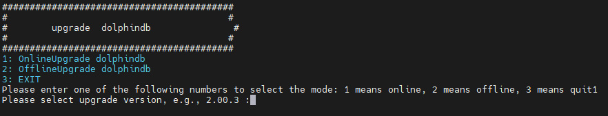

Type a version number and press Enter. To update to version 2.00.9.1, for example, enter 2.00.9.1 and press Enter. The following prompt indicates a successful upgrade.

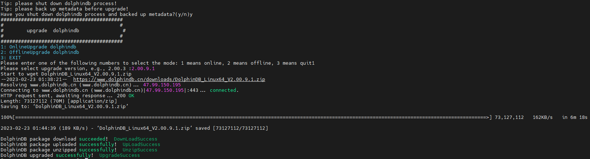

- Offline Update

Download a new version of server package from [DolphinDB website](https://www.dolphindb.com/alone/alone.php?id=75)

Upload the installation package to */DolphinDB/server/clusterDemo*. Take version 2.00.9.1 as an example.

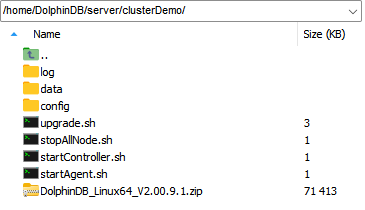

Navigate to the folder */DolphinDB/server/clusterDemo* to execute the following command:

```sh
./upgrade.sh
```

The following prompt is returned:


Type "y" and press Enter:


Type "1" and press Enter:


Type a version number and press Enter. To update to version 2.00.9.1, for example, enter 2.00.9.1 and press Enter. The following prompt indicates a successful upgrade.

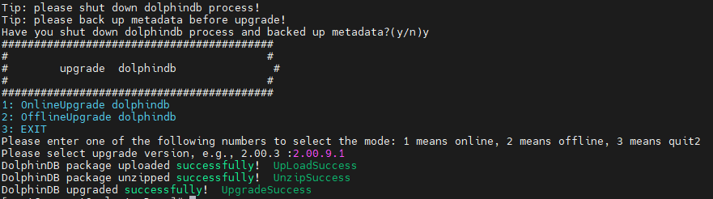

**Step 4: Restart the Server**

Navigate to the folder */DolphinDB/server* to start the server with the following command:

```sh
sh startSingle.sh
```

Open the web interface and execute the following script to check the current version of DolphinDB.

```sh
version()
```

### 3.2 Update on Windows

**Step 1: Close the Server**

- In console mode, close the foreground process.
- In background mode, close DolphinDB process from Task Manager.

**Step 2: Back up the Metadata**

The default directory to save the metadata for a standalone mode is:

```sh
C:\DolphinDB\server\local8848\dfsMeta\
```

```sh
C:\DolphinDB\DolphinDB\server\local8848\storage\CHUNK_METADATA\
```

Create a new folder *backup* under *C:\DolphinDB*, and copy the following files to it:

- file *dfsMeta* under *C:\DolphinDB\server\local8848*
- file *CHUNK_METADATA* under *C:\DolphinDB\server\local8848\storage*

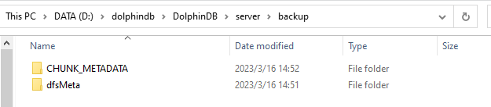

**Note**: If the backup files are not in the above default directories, check the directories specified by the configuration parameters *dfsMetaDir* and *chunkMetaDir*. If the configuration parameters are not modified but the configuration parameter *volumes* is specified, then you can find the *CHUNK_METADATA* under the *volumes* directory.

**Step 3: Update**

- Download a new version of server package from [DolphinDB website](https://www.dolphindb.com/alone/alone.php?id=75)
- Replace the old server with all files (except *dolphindb.cfg* and *dolphindb.lic*) in the current *\DolphinDB\server* folder.

**Step 4: Restart the Server**

Double click to execute *dolphindb.exe*.

Open the web interface and execute the following script to check the current version of DolphinDB.

```sh
version()
```

## 4. Update License File

### Step 1: Replace the License File

Replace an existing license file with a new one.

License file path on Linux:

```sh
/DolphinDB/server/dolphindb.lic
```

License file path on Windows:

```sh
C:\DolphinDB\server\dolphindb.lic
```

### Step 2: Update License File

- Online Update

Execute the following script in web interface:

```sh
updateLicense()
```

**Note:**
* The client name of the license cannot be changed. 
* The number of nodes, memory size, and the number of CPU cores cannot be smaller than the original license. 
* The update takes effect only on the node where the function is executed. Therefore, in a cluster mode, the function needs to be run on all controllers, agents, data nodes, and compute nodes. 
* The license type must be either commercial (paid) or free.

- Offline Update

Restart DolphinDB server to complete the updates.

## 5. FAQ

**Q1: Failed to start the server for the port is occupied by other programs**

The default port number of the system is 8848. If you cannot start the server, you can first check the log file *dolphindb.log* under */DolphinDB/server*.

If the following error occurs, it indicates that the specified port is occupied by other programs. 

```sh
<ERROR> :Failed to bind the socket on port 8848 with error code 98
```

In such case, you can change to another free port in the config file.

**Q2: Failed to access the web interface**

Despite the server running and the server address (*ip*:*port*) being correct, the web interface remains inaccessible.

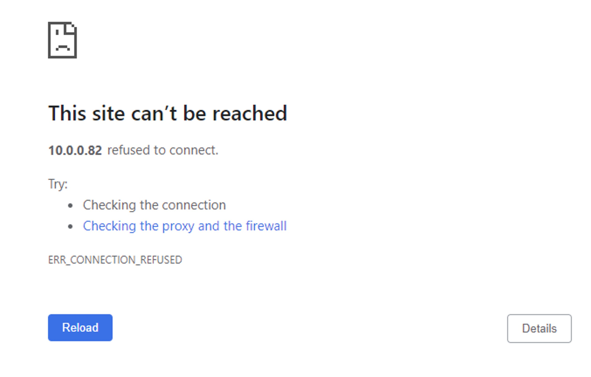

A common reason for the above problem is that the browser and DolphinDB are not deployed on the same server, and a firewall is enabled on the server where DolphinDB is deployed. You can solve this issue by turning off the firewall or by opening the corresponding port.

**Q3: Roll back a failed upgrade on Linux**

If you cannot start DolphinDB server after upgrade, you can follow steps below to roll back to the previous version.

- Step 1: Restore Metadata Files

Navigate to the folder */DolphinDB/server* to restore metadata files from backup with the following commands:

```sh
cp -r backup/dfsMeta/ local8848/dfsMeta
cp -r backup/CHUNK_METADATA/ local8848/storage/CHUNK_METADATA
```

- Step 2: Restore Program Files

Download the previous version of server package from the official website. Replace the server that failed to update with all files (except *dolphindb.cfg* and *dolphindb.lic*) just downloaded.

**Q4: Roll back a failed upgrade on Windows**

If you cannot start DolphinDB server after upgrade, you can follow steps below to roll back to the previous version.

- Step 1: Restore Metadata Files

Use metadata files from folder backup to replace the following files:

> file *dfsMeta* under *local8848*
>
> file *CHUNK_METADATA* under *local8848/storage*

- Step 2: Restore Program Files

Download the previous version of server package from the official website. Replace the server that failed to update with all files (except *dolphindb.cfg* and *dolphindb.lic*) just downloaded.

**Q5: Failed to update the license file**

Updating the license file online has to meet the requirements listed in [Step 2, Chapter 4](#step-2-update-license-file-2). 

If not, you can choose to update offline or apply for an [Enterprise Edition License](https://www.dolphindb.com/mx_form/mx_form.php?id=98)。

**Q6: Change configuration**

For more details on configuration parameters, refer to [Configuration](https://www.dolphindb.com/help/DatabaseandDistributedComputing/Configuration/index.html)。

If you encounter performance problems, you can contact our team on [Slack](https://dolphindb.slack.com/) for technical support.

## 6. See Also

For more information, refer to [DolphinDB User Manual](https://www.dolphindb.com/help/index.html).
