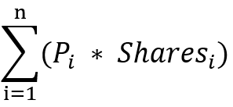
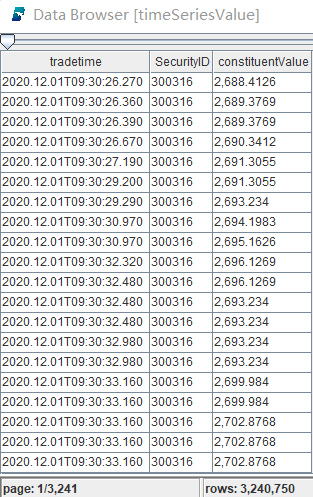
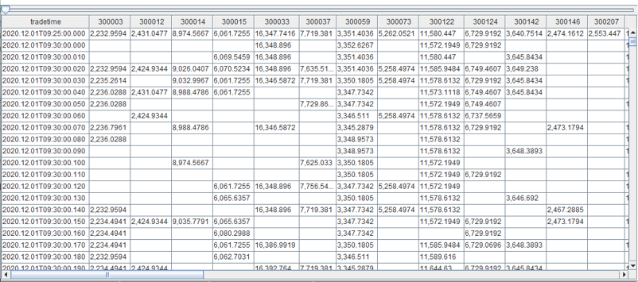
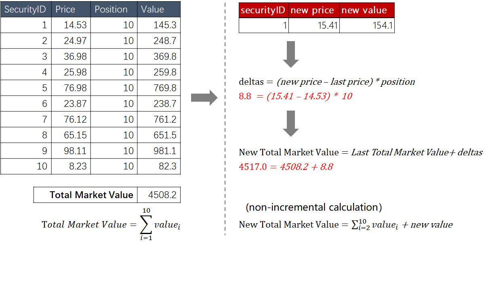

# Calculating ETF IOPV in DolphinDB
- [Calculating ETF IOPV in DolphinDB](#calculating-etf-iopv-in-dolphindb)
  - [1. The IOPV Formula](#1-the-iopv-formula)
  - [2. Constructing ETF Samples](#2-constructing-etf-samples)
    - [2.1 One ETF](#21-one-etf)
    - [2.2 Multiple ETFs](#22-multiple-etfs)
    - [2.3 Schema for Tick Data](#23-schema-for-tick-data)
  - [3. Calculating IOPVs with Historical Data](#3-calculating-iopvs-with-historical-data)
  - [4. Calculating IOPVs in Real Time (A Straightforward Approach)](#4-calculating-iopvs-in-real-time-a-straightforward-approach)
    - [4.1 Data Ingestion: Replaying Historical Data with `replayDS` and `replay`](#41-data-ingestion-replaying-historical-data-with-replayds-and-replay)
    - [4.2 Real-Time Computing: Calculating IOPVs with the Cross-Sectional Streaming Engine](#42-real-time-computing-calculating-iopvs-with-the-cross-sectional-streaming-engine)
  - [5. Calculating IOPVs in Real Time (the Optimal Approach)](#5-calculating-iopvs-in-real-time-the-optimal-approach)
    - [5.1 Filtering Out Records with Unchanged Price](#51-filtering-out-records-with-unchanged-price)
    - [5.2 Calculating the Changes of the Weighted Price](#52-calculating-the-changes-of-the-weighted-price)
    - [5.3 Incremental Computing](#53-incremental-computing)
  - [6. Scripts](#6-scripts)

Indicative Optimized Portfolio Value (IOPV, aka iNAV) represents a near real-time view of the net asset value of an ETF. IOPV is typically reported every 15 seconds by the listing exchange. This tutorial introduces how to calculate real-time IOPV, i.e., the net asset value of an ETF that is updated with each new trade of any constituent.

With historical market data, converting it to panel data can significantly simplify the script and improve the performance; with real-time market data, use the streaming engines to filter out the trade records with no price change and then implement incremental computing for optimal performance.

The following topics are discussed:

\- Generating panel data with the `pivot by` clause;

\- Replaying historical market data with the `replayDS` and `replay`  functions;

\- Working with the cross-sectional streaming engine and the reactive state streaming engine; 

\- Optimizing performance with incremental computing.

## 1. The IOPV Formula

To calculate IOPV, multiply the last available price of each security in the calculation basket by the number of shares of that security included in the calculation basket. After doing this for each security in the calculation basket, the totals are summed, cash components are added, and liabilities are subtracted. To convert the final result to a “per share” value, the calculation agent divides the final result by the number of ETF shares in a creation unit.

For the sake of convenience, this tutorial will not take into consideration the cash components, liabilities and the number of ETF shares in a creation unit as these factors do not have much impact on the methodology we use and the performance. We will use the following formula:



- P<sub>i</sub> - the real-time net price of the i<sup>th</sup> constituent in the creation/redemption basket
- Shares<sub>i</sub>- the number of shares (in lots) of the i<sup>th</sup> constituent included in the creation/redemption basket

## 2. Constructing ETF Samples

### 2.1 One ETF

We use the constituents of an ETF from SZSE (Shenzhen Stock Exchange) and specify a random position for each constituent. Create a dictionary object to represent the ETF.

```
symbols = `300073`300363`300373`300474`300682`300769`301029`300390`300957`300763`300979`300919`300037`300832`300866`300896`300751`300223`300676`300274`300413`300496`300661`300782`300142`300759`300595`300285`300146`300207`300316`300454`300529`300699`300628`300760`300601`300450`300433`300408`300347`300124`300122`300059`300033`300015`300014`300012`300003`300750
positions = rand(76339..145256, 50)
portfolio = dict(symbols, positions)
```

### 2.2 Multiple ETFs

Define the function `getBusketData` to construct 100 ETFs by picking 50 random stocks from the SZSE tick data for each basket and setting a random position for each stock.

```
def getBasketData(allSymbol, n){
    return loop(x->table(take(x, 50) as BasketID, rand(allSymbol, 50) as SecurityID, rand(76339..145256, 50) as Position), 1..n).unionAll(false)
}
trade = loadTable("dfs://LEVEL2_SZ","Trade")
allSyms = select count(*) from trade where date(tradetime) = 2020.01.02 group by SecurityID
basket = getBasketData(allSyms.SecurityID, 100)
```

### 2.3 Schema for Tick Data

This tutorial uses the level 2 tick data of trades on SZSE for IOPV calculation. The following 4 columns (data types inside parentheses) are used: tradedate (DATE), tradetime (TIMESTAMP), SecurityID (SecurityID) and Price (DOUBLE).

## 3. Calculating IOPVs with Historical Data

You can use `pivot by` to create a pivot table (panel data) for vectorized operations. This optimizes the performance and makes your code more concise.

The following script calculates IOPVs based on the SZSE tick data on 12/01/2022:

```
timeSeriesValue = select tradetime, SecurityID, price * portfolio[SecurityID] as constituentValue from loadTable("dfs://LEVEL2_SZ","Trade") where SecurityID in portfolio.keys(), tradedate = 2020.12.01, price > 0
iopvHist = select rowSum(ffill(constituentValue)) as IOPV from timeSeriesValue pivot by tradetime, SecurityID
```

- **Calculating Stock Values**

The first line in the script calculates the weighted prices of all constituents at each timestamp using the tick data ( from `loadTable("dfs://LEVEL2_SZ","Trade")`).



In the result table, the "constituentValue” column holds the constituents' weighted prices at each timestamp.

- **Calculating IOPVs with Panel Data**

The second line of the script generates a pivot table where the columns represent the 50 constituents, the rows represent the timestamps, and each cell holds the weighted price of a constituent at a timestamp.



The second line in the script also forward fills the null values in the pivot table, and then sums up the weighted prices of each row.

- [ffill](https://dolphindb.com/help/FunctionsandCommands/FunctionReferences/f/ffill.html) - Forward fill the NULL values with the last non-NULL value. 
- [rowSum](https://dolphindb.com/help/FunctionsandCommands/FunctionReferences/r/rowSum.html) - Sum up the values (weighted prices) in each row.

The complex logic of IOPV calculation can be completed in just one line of script in DolphinDB. As DolphinDB supports vector programming, the calculation can be efficiently conducted in multi-threaded mode.

## 4. Calculating IOPVs in Real Time (A Straightforward Approach)

In Section 3, we discussed how to calculate IOPV with historical data. In this section, we will show how to calculate IOPV with real-time data.

Please note that the methodology in this section is quite straightforward. It, however, can be further improved. Section 5 introduces the optimal solution to calculate IOPV in real time.

### 4.1 Data Ingestion: Replaying Historical Data with `replayDS` and `replay`

With the built-in functions `replayDS` and `replay`, we can easily replay the historical data as real-time data.

```
t  = streamTable(100:0, `SecurityID`tradedate`tradetime`price,[SYMBOL, DATE,TIMESTAMP,DOUBLE])
enableTableShareAndPersistence(table=t, tableName=`TradeStreamData, cacheSize=1000000)
rds = replayDS(<select SecurityID, tradedate, tradetime , price from loadTable("dfs://LEVEL2_SZ","Trade") where tradedate = 2020.12.01, price>0 >, `tradedate, `tradetime, cutPoints(09:30:00.000..16:00:00.000, 60));
submitJob("replay_order", "replay_trades_stream", replay, rds,  `TradeStreamData, `tradedate, `tradetime, 1000000, true, 4)
```

The script above replays the tick data for 12/01/2022 and ingests the data to the stream table TradeStreamData.

### 4.2 Real-Time Computing: Calculating IOPVs with the Cross-Sectional Streaming Engine

```
share streamTable(1000:0, `tradetime`tradedate`IOPV, [TIMESTAMP,DATE,DOUBLE]) as IOPVStreamResult
IOPV_engine = createCrossSectionalEngine(name="IOPV_calculator", metrics=[<last(tradedate)>, <sum(ffill(price) * portfolio[SecurityID])>], dummyTable=TradeStreamData, outputTable=IOPVStreamResult, keyColumn=`SecurityID, triggeringPattern='perRow',  timeColumn=`tradetime, useSystemTime=false)
subscribeTable(tableName="TradeStreamData", actionName="trade_subscribe", offset=0, handler=append!{IOPV_engine}, msgAsTable=true, batchSize=10000, throttle=1, hash=0, filter=portfolio.keys());
```

- First, we create the stream table `IOPVStreamResult` to save the calculation results.
- As the calculation of IOPV at each timestamp uses cross-sectional data, we use the cross-sectional streaming engine (`IOPV_engine`) to conduct the IOPV calculation.
- Through subscription to the stream table `TradeStreamData`, the data is ingested into the `IOPV_engine` for calculation. A filter `portfolio.keys()` is added to filter out the non-constituents. 

**The logic for cross-sectional calculation**

> (1) [Cross-sectional calculation](https://dolphindb.com/help/FunctionsandCommands/FunctionReferences/c/createCrossSectionalEngine.html) is performed on a number of subjects at one timestamp. In our example, it means summing up all constituent values at one timestamp.
>
> (2) The real-time calculation of IOPV is triggered immediately after any constituent’s price changes. This is achieved by specifying `triggeringPattern='perRow'` which triggers calculation upon the arrival of a new trade record.
>
> (3) `metrics=[<last(tradedate)>, <sum(ffill(price) * portfolio[SecurityID])>]` indicates the calculation formula.

## 5. Calculating IOPVs in Real Time (the Optimal Approach)

With the methodology from Section 4, an aggregation is performed each time a new trade record is ingested into the streaming engine.

This can be further improved in the following aspects: 

- filter out the records of each stock with no price change from the last trade; 
- implement incremental computing to only use the IOPV at the last timestamp and those constituents with price changes, instead of calculating the sum of all constituents.

### 5.1 Filtering Out Records with Unchanged Price

For each stock in the tick data, about 75% of the records have the same trade price as the previous record. We can filter out these records as they won’t make any difference to the incremental calculation of IOPV. 

```
metricsFunc = [
    <tradetime>,
    <Price>] 
createReactiveStateEngine(name="tradeProcessPriceChange", metrics=metricsFunc, dummyTable=tradeOriginalStream, outputTable=tradeOriginalStream, keyColumn=`SecurityID, filter=<deltas(Price) != 0>, keepOrder=true)
```

The script above specifies that only the records satisfying `deltas(Price) != 0` (i.e., the price of a stock has changed compared with the most recent record of the stock) participate in subsequent calculations.

### 5.2 Calculating the Changes of the Weighted Price

```
1 metricsProcess = [ 2   <tradetime>, 3   <deltas(Price*Position)>] 4 createReactiveStateEngine(name="tradeProcessIOPVChange", metrics=metricsProcess, dummyTable=tradeProcessDummy, outputTable=getStreamEngine(`IOPVResult), keyColumn=`BasketID`SecurityID, keepOrder=true) 
```

This script uses `<deltas(Price*Position)>` to calculate the difference between the weighted prices of the same stock in the adjacent records.

### 5.3 Incremental Computing

The built-in function `cumsum` implements incremental computing for aggregation.

```
metricsResult = [
    <tradetime>,
    <cumsum(deltaValue)>]
createReactiveStateEngine(name="IOPVResult", metrics=metricsResult, dummyTable=tradeResultDummy, outputTable=IOPVResult, keyColumn=`BasketID, keepOrder=true)
```

The following simple example of a 10-constituents ETF illustrates the logic for the incremental computing with[ reactive state streaming engine](https://www.dolphindb.cn/cn/help/200/FunctionsandCommands/FunctionReferences/c/createReactiveStateEngine.html) as introduced in sections 5.1 to 5.3: 

 <p>

(1) Create a table with 4 columns: “securityID”, “price”, “position” and “value” (price * position). 

(2) Sum up the values of all constituents in the table and you will get the ETF’s total market value.

(3) Assume that the price of a constituent (`securityID=1`) rises from 14.53 to 15.41.

(4) Calculate the weighted price change of the constituent with `deltas= (new price - last price) * position`

(5) Use `Last Total Market Value + deltas` to calculate the latest total market value, which takes less time than summing up all constituents' weighted prices.

(6) `<filter=<deltas(Price) != 0>` filters out the records with no price change. If there’s no price change, the IOPV will not change, and hence no need for another calculation.

## 6. Scripts

1. [Calculating IOPVs with Historical Data](https://github.com/dolphindb/Tutorials_EN/blob/master/script/streaming_IOPV/1.%20IOPV_hist.dos)
2. [Calculating IOPVs in Real Time (A Straightforward Approach)](https://github.com/dolphindb/Tutorials_EN/blob/master/script/streaming_IOPV/2.%20IOPV_realtime_single.dos)
3. [Calculating IOPVs in Real Time (the Optimal Approach)](https://github.com/dolphindb/Tutorials_EN/blob/master/script/streaming_IOPV/3.%20IOPV_realtime_mult.dos)