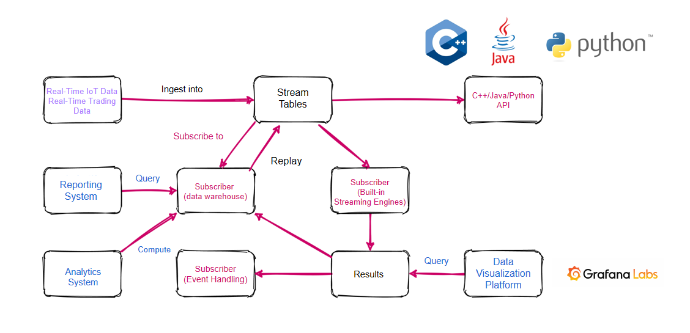

# Tutorial: Stream for DolphinDB

- [Tutorial: Stream for DolphinDB](#tutorial-stream-for-dolphindb)
  - [1. Flowchart and related concepts](#1-flowchart-and-related-concepts)
    - [1.1 Stream table](#11-stream-table)
    - [1.2 Publish-subscribe](#12-publish-subscribe)
    - [1.3 Stream engine](#13-stream-engine)
  - [2. Core functionalities](#2-core-functionalities)
    - [2.1 Publish streaming data](#21-publish-streaming-data)
    - [2.2 Subscribe to streaming data](#22-subscribe-to-streaming-data)
    - [2.3 Automatic reconnection](#23-automatic-reconnection)
    - [2.4 Filtering of streaming data on the publisher node](#24-filtering-of-streaming-data-on-the-publisher-node)
    - [2.5 Unsubscribe](#25-unsubscribe)
    - [2.6 Streaming data persistence](#26-streaming-data-persistence)
  - [3. Data Replay](#3-data-replay)
  - [4. Streaming API](#4-streaming-api)
    - [4.1 Java API](#41-java-api)
    - [4.2 Python API](#42-python-api)
    - [4.3 C++ API](#43-c-api)
    - [4.4 C# API](#44-c-api)
  - [5. Status monitoring](#5-status-monitoring)
    - [5.1 pubConns](#51-pubconns)
    - [5.2 subConns](#52-subconns)
    - [5.3 persistWorkers](#53-persistworkers)
    - [5.4 subWorkers](#54-subworkers)
  - [6. Performance tuning](#6-performance-tuning)
  - [7. Visualization](#7-visualization)

The advantages of Stream for DolphinDB over other streaming analytics systems are:
- High throughput and low latency
- One-stop solution that is seamlessly integrated with time-series database and data warehouse
- Natural support of stream-table duality and SQL statements

Stream for DolphinDB provides numerous convenient features, such as:
- Built-in time-series, cross-sectional, anomaly detection, and reactive state stream engines. 
- High frequency data replay
- Streaming data filtering

This tutorial will cover the following topics:
- Flowchart and related concepts
- Core functionalities
- Replay
- API
- Status monitoring
- Performance tuning
- Visualization

## 1. Flowchart and related concepts

Stream for DolphinDB uses the publish-subscribe model. Real-time data is ingested into the stream table and is then published to all subscribers. A data node or a third-party application can subscribe to and consume the streaming data through DolphinDB script or API.



The figure above is the DolphinDB streaming flowchart. Real-time data is ingested into a stream table on a publisher node. The streaming data can be subscribed by various types of objects:
- Streaming data can be subscribed and saved by the data warehouse for further analysis and reporting.
- Streaming data can be subscribed by a stream engine to perform calculations and to output the results to another stream table. The results can be displayed in real time in a platform such as Grafana and can also serve as a data source for event processing by another subscription.
- Streaming data can be subscribed by an API. For example, a third-party Java application can subscribe to streaming data with Java API.

### 1.1 Stream table

Stream table is a special type of in-memory table to store and publish streaming data. Stream table supports concurrent read and write. A stream table can be appended to, but the records of a stream table cannot be modified or deleted. SQL statements can be used to query stream tables. 

### 1.2 Publish-subscribe

Stream for DolphinDB uses the classic publish-subscribe model. After new data is ingested to a stream table, all subscribers are notified to process the new data. 

A data node uses function `subscribeTable` to subscribe to the streaming data.

### 1.3 Stream engine

The stream engine refers to a module dedicated to real-time calculation and analysis of streaming data. DolphinDB provides functions `createTimeSeriesEngine`, `createReactiveStateEngine`, `createCrossSectionalEngine `, `createSessionWindowEngine` and `createAnomalyDetectionEngine` for real-time calculation with streaming data. 

## 2. Core functionalities

To enable the streaming module, we need to specify the configuration parameter 'maxPubConnections' on the publisher node and 'subPort' on the subscriber nodes. The following configuration parameters are related to streaming.

Configuration parameters for the publisher node:

- maxPubConnections: the maximum number of subscriber nodes that the publisher can connect to. If maxPubConnections>0，the node is a publisher node. The default value is 0.
- persistenceDir: the folder path where the shared stream table that publishes the messages is saved. This parameter must be specified to save the stream table. It is strongly recommend to specify this parameter in all production environments. If it is not specified, the memory will be exhausted eventually as the messages accumulate. 
- persistenceWorkerNum: the number of worker threads responsible for saving the stream table in asynchronous mode. The default value is 0.
- maxPersistenceQueueDepth: the maximum depth (number of records) of the message queue when the stream table is saved in asynchronous mode. The default value is 10,000,000.
- maxMsgNumPerBlock: the maximum number of records in a message block that is published to the subscribers. The default value is 1024.
- maxPubQueueDepthPerSite: the maximum depth (number of records) of the message queue at the publisher node. The default value is 10,000,000.

Configuration parameters for the subscriber nodes:

- subPort: subcription port number. It is required for a subscriber node. The default value is 0.
- subExecutors: the number of message processing threads in the subscriber node. The default value is 0, which indicates that the parsing message thread also processes the message.
- maxSubConnections: the maximum number of publishers that the subscriber node can connec to. The default value is 64.
- subExecutorPooling: a Boolean value indicating whether the streaming threads are in pooling mode. The default value is false.
- maxSubQueueDepth: the maximum depth (number of records) of the message queue at the subscriber node. The default value is 10,000,000.

### 2.1 Publish streaming data

Use function `streamTable` to define a stream table. Real-time data is ingested into the stream table and is then published to all subscribers. Since for a publisher there are usually multiple subscribers in multiple sessions, a stream table must be shared across all sessions with command `share` before it can publish streaming data. Stream tables that are not shared cannot publish streaming data.

Define and share the stream table "pubTable":
```
share streamTable(10000:0,`timestamp`temperature, [TIMESTAMP,DOUBLE]) as pubTable
```
The stream table created by function `streamTable` may contain duplicate records. We can create a stream table with primary keys with function `keyedStreamTable`. For a stream table with primary keys, subsequent records with identical primary key values as an existing record will not be written to the stream table.

```
share keyedStreamTable(`timestamp, 10000:0,`timestamp`temperature, [TIMESTAMP,DOUBLE]) as pubTable
```
### 2.2 Subscribe to streaming data

Use function [`subscribeTable`](https://www.dolphindb.com/help/FunctionsandCommands/FunctionReferences/s/subscribeTable.html) to subscribe to streaming data. 

Syntax of function `subscribeTable`:
```
subscribeTable([server],tableName,[actionName],[offset=-1],handler,[msgAsTable=false],[batchSize=0],[throttle=1],[hash=-1],[reconnect=false],[filter],[persistOffset=false],[timeTrigger=false],[handlerNeedMsgId=false)
```

Only parameters 'tableName' and 'handler' are required. All other parameters are optional.

- server: a string indicating the alias or the remote connection handle of a server where the stream table is located. If it is unspecified or an empty string (""), it means the local instance.

There are 3 possibilities regarding the locations of the publisher and the subscriber: 

1. Publisher and subscriber are on the same local data node: use empty string ("") for 'server' or leave it unspecified. 
```
subscribeTable(tableName="pubTable", actionName="act1", offset=0, handler=subTable, msgAsTable=true)
```
2. Publisher and subscriber are not on the same data node but in the same cluster: use the publisher node's alias for 'server'.
```
subscribeTable(server="NODE2", tableName="pubTable", actionName="act1", offset=0, handler=subTable, msgAsTable=true)
```
3. The publisher is not in the same cluster as the subscriber: use the remote connection handle of the publisher node for 'server'.
```
pubNodeHandler=xdb("192.168.1.13",8891)
subscribeTable(server=pubNodeHandler, tableName="pubTable", actionName="act1", offset=0, handler=subTable, msgAsTable=true)
```
- tableName: a string indicating the shared stream table name.
```
subscribeTable(tableName="pubTable", actionName="act1", offset=0, handler=subTable, msgAsTable=true)
```
- actionName: a string indicating the subscription task name. It can have letters, digits and underscores. It must be specified if multiple subscriptions on the same node subscribe to the same stream table. 
```
topic1 = subscribeTable(tableName="pubTable", actionName="realtimeAnalytics", offset=0, handler=subTable, msgAsTable=true)
topic2 = subscribeTable(tableName="pubTable", actionName="saveToDataWarehouse", offset=0, handler=subTable, msgAsTable=true)
```
Function `subscribeTable` returns the subscription topic. It is the combination of the alias of the node where the stream table is located, the stream table name, and the subscription task name (if 'actionName' is specified), separated by forward slash "/". If the local node alias is NODE1, the two topics returned by the example above are as follows:

topic1:
```
NODE1/pubTable/realtimeAnalytics
```
topic2:
```
NODE1/pubTable/saveToDataWarehouse
```
If the subscription topic already exists, an exception is thrown. 

- offset: an integer indicating the position of the first message where the subscription begins. A message is a row of the stream table. The offset is relative to the first row of the stream table when it is created. If offset is unspecified or -1, the subscription starts with the next new message. If offset=-2, the system will get the persisted offset on disk and start subscription from there. If some rows were cleared from memory due to cache size limit, they are still included in determining where the subscription starts.

The following example illustrates the role of 'offset'. We write 100 rows to 'pubTable' and create 2 subscription topics:
```
share streamTable(10000:0,`timestamp`temperature, [TIMESTAMP,DOUBLE]) as pubTable
share streamTable(10000:0,`ts`temp, [TIMESTAMP,DOUBLE]) as subTable1
share streamTable(10000:0,`ts`temp, [TIMESTAMP,DOUBLE]) as subTable2
vtimestamp = 1..100
vtemp = norm(2,0.4,100)
tableInsert(pubTable,vtimestamp,vtemp)
topic1 = subscribeTable(tableName="pubTable", actionName="act1", offset=-1, handler=subTable1, msgAsTable=true)
topic2 = subscribeTable(tableName="pubTable", actionName="act2", offset=50, handler=subTable2, msgAsTable=true)
```
subTable1 is empty and subTable2 has 50 rows. When 'offset' is -1, the subscription will start from the next new message.

- handler: a unary function or a table. If handler is a function, it is used to process the subscribed data. The only parameter of the function is the subscribed data, which can be a table or a tuple of the subscribed table columns. Quite often we need to insert the subscribed data into a table. For convenience handler can also be a table, and the subscribed data is inserted into the table directly.

The following example shows the two uses of 'handler'. In the subscription of "act1", the subscribed data is written directly to subTable1; in the subscription of "act2", the subscribed data is filtered with the user-defined function `myHandler` and then written to subTable2.
```
def myhandler(msg){
	t = select * from msg where temperature>0.2
	if(size(t)>0)
		subTable2.append!(t)
}
share streamTable(10000:0,`timestamp`temperature, [TIMESTAMP,DOUBLE]) as pubTable
share streamTable(10000:0,`ts`temp, [TIMESTAMP,DOUBLE]) as subTable1
share streamTable(10000:0,`ts`temp, [TIMESTAMP,DOUBLE]) as subTable2
topic1 = subscribeTable(tableName="pubTable", actionName="act1", offset=-1, handler=subTable1, msgAsTable=true)
topic2 = subscribeTable(tableName="pubTable", actionName="act2", offset=-1, handler=myhandler, msgAsTable=true)

vtimestamp = 1..10
vtemp = 2.0 2.2 2.3 2.4 2.5 2.6 2.7 0.13 0.23 2.9
tableInsert(pubTable,vtimestamp,vtemp)
```
The result shows that 10 messages are written to pubTable. SubTable1 receives all of them whereas subTable2 receives 9 messages as the row with vtemp=0.13 is filtered by `myhandler`.

- msgAsTable: a Boolean value indicating whether the subscribed data is ingested into handler as a table or as a tuple. If msgAsTable=true, the subscribed data is ingested into handler as a table and can be processed with SQL statements. The default value is false, which means the subscribed data is ingested into handler as a tuple of columns. 

```
def myhandler1(table){
	subTable1.append!(table)
}
def myhandler2(tuple){
	tableInsert(subTable2,tuple[0],tuple[1])
}
share streamTable(10000:0,`timestamp`temperature, [TIMESTAMP,DOUBLE]) as pubTable
share streamTable(10000:0,`ts`temp, [TIMESTAMP,DOUBLE]) as subTable1
share streamTable(10000:0,`ts`temp, [TIMESTAMP,DOUBLE]) as subTable2

topic1 = subscribeTable(tableName="pubTable", actionName="act1", offset=-1, handler=myhandler1, msgAsTable=true)
topic2 = subscribeTable(tableName="pubTable", actionName="act2", offset=-1, handler=myhandler2, msgAsTable=false)

vtimestamp = 1..10
vtemp = 2.0 2.2 2.3 2.4 2.5 2.6 2.7 0.13 0.23 2.9
tableInsert(pubTable,vtimestamp,vtemp)
```

- batchSize: an integer indicating the number of unprocessed messages to trigger the handler. If it is positive, the handler does not process messages until the number of unprocessed messages reaches batchSize. If it is unspecified or non-positive, the handler processes incoming messages as soon as each batch is ingested.

In the following example, 'batchSize' is set to 11. 
```
share streamTable(10000:0,`timestamp`temperature, [TIMESTAMP,DOUBLE]) as pubTable
share streamTable(10000:0,`ts`temp, [TIMESTAMP,DOUBLE]) as subTable1
topic1 = subscribeTable(tableName="pubTable", actionName="act1", offset=-1, handler=subTable1, msgAsTable=true, batchSize=11)
vtimestamp = 1..10
vtemp = 2.0 2.2 2.3 2.4 2.5 2.6 2.7 0.13 0.23 2.9
tableInsert(pubTable,vtimestamp,vtemp)

print size(subTable1)
```
10 messages are written to pubTable. Now the subscribing table subTable1 is empty. 

```
insert into pubTable values(11,3.1)
print size(subTable1)
```
After 1 more message is written to pubTable, the number of unprocessed messages reaches the value of 'batchSize' and it triggers the handler. The subscribing table subTable1 receives 11 records. 

- throttle: a floating number indicating the maximum waiting time (in seconds) before the handler processes the messages if the number of unprocessed messages is smaller than batchSize. The default value is 1. This optional parameter has no effect if batchSize is not specified. If throttle is less than the configuration parameter subThrottle/1000, throttle is effectively subThrottle/1000.  

There is little difference in the amount of time it takes to process one message versus a batch of messages (for example, 1000 messages). If each individual message triggers the handler, the speed of data ingestion may overwhelm the speed of data consumption. Moreover, data may pile up at the subscriber node and use up all memory. If 'batchSize' and 'throttle' are configured properly, we can improve throughput by adjusting the frequency at which the handler processes the messages. 

- hash: a hash value (a nonnegative integer) indicating which subscription executor will process the incoming messages for the subscription. If it is unspecified, the system automatically assigns an executor. When we need to keep the messages synchronized from multiple subscriptions, we can set 'hash' of all these subscriptions to be the same, so that the same executor is used to synchronize multiple data sources. 

- reconnect: a Boolean value indicating whether the subscription may be automatically resumed if it is interrupted. With a successful resubscription, the subscriber receives all streaming data since the interruption. The default value is false. If reconnect=true, depending on how the subscription is interrupted, there are the following 3 scenarios:

(1) If the network is disconnected while both the publisher and the subscriber node remain on, the subscription will be automatically reconnected when the network connection is resumed.

(2) If the publisher node crashes, the subscriber node will keep attempting to resubscribe until it can reconnect with the publisher node.

If the publisher node enables persistence for the stream table, the publisher will first load persisted data into memory after restarting. The subscriber won't be able to successfully resubscribe until the publisher reaches the row of data where the subscription was interrupted. If the publisher node does not enable persistence for the stream table, the automatic resubscription will fail.

(3) If the subscriber node crashes, even after the subscriber node restarts, it won't automatically resubscribe. To resubscribe we need to execute `subscribeTable` again.

When both the publisher and the subscriber nodes are relatively stable with routine tasks, such as in IoT applications, we recommend setting reconnect=true. On the other hand, if the subscriber node is tasked with complicated queries with large amounts of data, we recommend setting reconnect=false.

- filter: selected values in the filtering column. The filtering column is set with function `setStreamTableFilterColumn`. Only the messages with filtering column values in filter are subscribed. filter does not support Boolean types. 

The filter parameter can be specified in the following 3 ways:
*  value filtering: a vector.   
*  range filtering: a pair. The range includes the lower bound but excludes the upper bound. 
*  hash filtering: a tuple. The first element is the number of buckets. The second element is a scalar meaning the bucket index (starting from 0) or a pair meaning the bucket index range (including the lower bound but excluding the upper bound). 

- persistOffset: a Boolean value indicating whether to persist the offset of the last processed message in the current subscription. The default value is false. It is used for resubscription and can be obtained with function `getTopicProcessedOffset`. 

- timeTrigger: a Boolean value. If it is set to true, 'handler' is triggered at the intervals specified by parameter 'throttle' even if no new messages arrive. 

- handlerNeedMsgId: a Boolean value. If it is true, the parameter handler must support 2 parameters: msgBody and msgId; if it is false, the parameter handler must support just 1 parameter: msgBody. The default value is false. 

### 2.3 Automatic reconnection

To enable automatic reconnection after network disruption, the stream table must be persisted on the publisher. Please refer to section 2.6 for enabling persistence. When parameter 'reconnect' is set to true, the subscriber will record the offset of the streaming data. When the network connection is interrupted, the subscriber will automatically resubscribe from the offset. If the subscriber crashes or the stream table is not persisted on the publisher, the subscriber cannot automatically reconnect.

### 2.4 Filtering of streaming data on the publisher node

Streaming data can be filtered at the publisher. It may significantly reduce network traffic. Use command `setStreamTableFilterColumn` on the stream table to specify the filtering column (as of now a stream table can have only one filtering column), then specify the parameter 'filter' in function `subscribeTable`. Only the rows with filtering column values in 'filter' are published to the subscriber. Please refer to section 2.2 for more details about the parameter 'filter'. 

In the following example, the value of the parameter 'filter' is a vector. Only the data of 'IBM' and 'GOOG' are published to the subscriber:

```
share streamTable(10000:0,`time`symbol`price, [TIMESTAMP,SYMBOL,INT]) as trades
setStreamTableFilterColumn(trades, `symbol)
trades_slave=table(10000:0,`time`symbol`price, [TIMESTAMP,SYMBOL,INT])

filter=symbol(`IBM`GOOG)

subscribeTable(tableName="trades", actionName="trades_1", handler=append!{trades_1}, msgAsTable=true, filter=filter)
```

In the following example, the value of the parameter 'filter' is a pair.

```
share streamTable(10000:0,`time`symbol`price, [TIMESTAMP,SYMBOL,INT]) as trades
setStreamTableFilterColumn(trades, `price)
trades_1=table(10000:0,`time`symbol`price, [TIMESTAMP,SYMBOL,INT])

subscribeTable(tableName="trades", actionName="trades_1", handler=append!{trades_1}, msgAsTable=true, filter=1:100)
```

In the following example, the value of the parameter 'filter' is a tuple.

```
share streamTable(10000:0,`time`symbol`price, [TIMESTAMP,SYMBOL,INT]) as trades
setStreamTableFilterColumn(trades, `price)
trades_1=table(10000:0,`time`symbol`price, [TIMESTAMP,SYMBOL,INT])

subscribeTable(tableName="trades", actionName="trades_1", handler=append!{trades_1}, msgAsTable=true, filter=(10,1:5))
```

### 2.5 Unsubscribe

Each subscription is uniquely identified with a subscription topic. If a new subscription has the same topic as an existing subscription, the new subscription cannot be established. To make a new subscription with the same subscription topic as an existing subscription, we need to cancel the existing subscription with command `unsubscribeTable`. 

Unsubscribe from a local table:
```
unsubscribeTable(tableName="pubTable", actionName="act1")
```
Unsubscribe from a remote table:
```
unsubscribeTable(server="NODE_1", tableName="pubTable", actionName="act1")
```
To delete a shared stream table, use command `undef`:
```
undef("pubStreamTable", SHARED)
```
### 2.6 Streaming data persistence

By default, the stream table keeps all streaming data in memory. Streaming data can be persisted to disk for the following 3 reasons:
- Backup and restore streaming data. When a node reboots, the persisted data can be automatically loaded into the stream table.
- Avoid out-of-memory problem.
- Resubscribe from any position. 

If the number of rows in the stream table reaches a preset threshold, the first half of the table will be persisted to disk. The persisted data can be resubscribed. 

To initiate streaming data persistence, we need to add a persistence path to the configuration file of the publisher node:
```
persisitenceDir = /data/streamCache
```
Then execute command [`enableTableShareAndPersistence`](https://www.dolphindb.com/help/FunctionsandCommands/ComandsReferences/e/enableTableShareAndPersistence.html) to share the stream table and enable persistence of it.

The following example shares pubTable as sharedPubTable and enables the persistence of it. The parameter 'cacheSize' is set to 1000000, and the default values of parameters 'asynWrite' and 'compress' are both true. When the stream table reaches 1 million rows, the first half of them are compressed to disk asynchronously.
```
pudTable=streamTable(10000:0,`timestamp`temperature, [TIMESTAMP,DOUBLE])
enableTableShareAndPersistence(table=pubTable, tableName=`sharedPubTable, cacheSize=1000000)
```

When `enableTableShareAndPersistence` is executed, if the persisted data of sharedPubTable already exists on the disk, the system will load the latest cacheSize=1000000 rows into the memory.

Whether to enable persistence in asynchronous mode is a trade-off between data consistency and latency. If data consistency is the priority, we should use the synchronous mode. This ensures that data enters the publishing queue after the persistence is completed. On the other hand, if low latency is more important and we don't want disk I/O to affect latency, we should use asynchronous mode. The configuration parameter 'persistenceWorkerNum' only works when asynchronous mode is enabled. With multiple publishing tables to be persisted, increasing the value of 'persistenceWorkerNum' can improve the efficiency of persistence in asynchronous mode.

Persisted data can be deleted with command `clearTablePersistence`.
```
clearTablePersistence(pubTable)
```

To turn off persistence, use command [`disableTablePersistence`](https://www.dolphindb.com/help/FunctionsandCommands/ComandsReferences/d/disableTablePersistence.html).
```
disableTablePersistence(pubTable)
```

Use function `getPersistenceMeta` to get detailed information regarding the persistence of a stream table:
```
getPersistenceMeta(pubTable);
```
The result is a dictionary with the following keys:
```
//The number of rows in memory:
sizeInMemory->0
//Whether asynchronous mode is enabled:
asynWrite->true
//The total number of rows of the stream table:
totalSize->0
//Whether the data is persisted with compression:
compress->true
//The offset of data in memory relative to the total number of rows. memoryOffset = totalSize - sizeInMemory. 
memoryOffset->0
//The number of rows that have been persisted to disk:
sizeOnDisk->0
//How long the log file will be kept in terms of minutes. The default value is 1440 minutes (one day).
retentionMinutes->1440
//The path where the persisted data is saved
persistenceDir->/hdd/persistencePath/pubTable
//hashValue is the identifier of the worker for persistence of the stream table.
hashValue->0
//The offset of the first of the persisted streaming messages on disk relative to the entire stream table. 
diskOffset->0
```
## 3. Data Replay

DolphinDB provides function `replay` to replay historical data. For details please refer to [Data Replay Tutorial](historical_data_replay.md). 

## 4. Streaming API

The consumer of streaming data may be a stream engine, a third-party message queue, or a third-party program. DolphinDB provides streaming API for third-party programs to subscribe to streaming data. When new data arrives, API subscribers receive notifications in a timely manner. This allows DolphinDB streaming modules to be integrated with third-party applications. Currently, DolphinDB provides Java, Python, C++ and C# streaming API.

### 4.1 Java API

Java API handles data in two ways: polling and eventHandler.

1. Polling method sample code:
```
PollingClient client = new PollingClient(subscribePort);
TopicPoller poller1 = client.subscribe(serverIP, serverPort, tableName, offset);

while (true) {
   ArrayList<IMessage> msgs = poller1.poll(1000);
   if (msgs.size() > 0) {
         BasicInt value = msgs.get(0).getEntity(2);  // Take the second field in the first row of the data
   }
}
```

Poller1 pulls new data when the stream table publishes new data. When no new data is published, the program will wait at the poller1.poll method.

The Java API uses pre-configured MessageHandler to get and process new data. First, the caller needs to define the Handler. The Handler needs to implement the com.xxdb.streaming.client.MessageHandler interface.

2. Event mode sample code:
```
public class MyHandler implements MessageHandler {
       public void doEvent(IMessage msg) {
               BasicInt qty = msg.getValue(2);
               //..Message processing
       }
}
```

When the subscription is initiated, the handler instance is passed as a parameter to the subscription function.
```
ThreadedClient client = new ThreadedClient(subscribePort);
client.subscribe(serverIP, serverPort, tableName, new MyHandler(), offsetInt);
```
Whenever new data is published by the stream table, the Java API calls the MyHandler method and passes the new data through parameter 'msg'.

3. Reconnection

The parameter 'reconnect' is a Boolean value indicating whether to automatically reconnect after a network disconnection. The default value is false. 

Parameter 'reconnect' is set to true in the following example.

```
PollingClient client = new PollingClient(subscribePort);
TopicPoller poller1 = client.subscribe(serverIP, serverPort, tableName, offset, true);
```

4. Filtering

The parameter 'filter' is a vector. Use `setStreamTableFilterColumn` on the publisher node to specify the filtering column of the stream table. Only the rows with values of the filtering column in the vector specified by the parameter 'filter' are published to the subscriber. 

In the following example, parameter 'filter' takes the value of an integer vector with 1 and 2. 

```
BasicIntVector filter = new BasicIntVector(2);
filter.setInt(0, 1);
filter.setInt(1, 2);

PollingClient client = new PollingClient(subscribePort);
TopicPoller poller1 = client.subscribe(serverIP, serverPort, tableName, actionName, offset, filter);
```

### 4.2 Python API

Please note that right now only [Python API](https://github.com/dolphindb/python3_api_experimental) supports streaming.

1. Specify the subscriber port number

```
import dolphindb as ddb
conn = ddb.session()
conn.enableStreaming(8000)
```

2. Call function `subscribe`

Use function `subscribe` in Python API to subscribe to stream tables in DolphinDB. 

Syntax of function `subscribe`:
```
conn.subscribe(host, port, handler, tableName, actionName="", offset=-1, resub=False, filter=None)
```
- host is the IP address of the publisher node. 
- port is the port number of the publisher node.
- handler is a user-defined function to process the subscribed data. 
- tableName is a string indicating the name of the publishing stream table. 
- actionName is a string indicating the name of the subscription task. 
- offset is an integer indicating the position of the first message where the subscription begins. A message is a row of the stream table. Offset is relative to the first row of the stream table when it is created. If offset is unspecified, or -1, or above the number of rows of the stream table, the subscription starts with the next new message. If some rows were cleared from memory due to cache size limit, they are still considered in determining where the subscription starts.
- resub is a Boolean value indicating whether to resubscribe after network disconnection.
- filter is a vector indicating filtering condition. Only the rows with values of the filtering column in the vector specified by the parameter 'filter' are published to the subscriber. 

Example: Create a shared stream table 'trades' in DolphinDB and insert data into the table.
```
share streamTable(1:0,`id`price`qty,[INT,DOUBLE,INT]) as trades
trades.append!(table(1..10 as id,rand(10.0,10) as price,rand(10,10) as qty))
```

Subscribe to table 'trades' in Python:
```
def printMsg(msg):
    print(msg)

conn.subscribe("192.168.1.103", 8941, printMsg, "trades", "sub_trades", 0)

[1, 0.47664969926699996, 8]
[2, 5.543625105638057, 4]
[3, 8.10016839299351, 4]
[4, 5.821204076055437, 9]
[5, 9.768875930458307, 0]
[6, 3.7460641632787883, 7]
[7, 2.4479272053577006, 6]
[8, 9.394394161645323, 5]
[9, 5.966209815815091, 6]
[10, 0.03534660907462239, 2]

```

3. Unsubscribe

Use `conn.unsubscribe` to unsubscribe. 

Syntax of `conn.unsubscribe`:
```
conn.unsubscribe(host,port,tableName,actionName="")
```
Unsubscribe in the example of the previous section:
```
conn.unsubscribe(192.168.1.103", 8941,"sub_trades")
```

### 4.3 C++ API

There are 3 ways for a C++ API to process streaming data: ThreadedClient, ThreadPooledClient and PollingClient.

#### 4.3.1 ThreadedClient

Each time the stream table publishes new messages, a single thread acquires and processes the messages.

1. Create an instance of ThreadedClient 
```
ThreadedClient::ThreadClient(int listeningPort);
```
- listeningPort is the port number on the subscriber node. 

2. Call function `subscribe`:
```
ThreadSP ThreadedClient::subscribe(string host, int port, MessageHandler handler, string tableName, string actionName = DEFAULT_ACTION_NAME, int64_t offset = -1);
```
- host is the IP address of the publisher node. 
- port is the port number of the publisher node.
- handler is a user-defined function to process the subscribed data. The signature of the message handler is void(Message) where Message is a row. 
- tableName is a string indicating the name of the publishing stream table. 
- actionName is a string indicating the name of the subscription task. 
- offset is an integer indicating the position of the first message where the subscription begins. A message is a row of the stream table. Offset is relative to the first row of the stream table when it is created. If offset is unspecified, or -1, or above the number of rows of the stream table, the subscription starts with the next new message. If some rows were cleared from memory due to cache size limit, they are still considered in determining where the subscription starts.
- resub is a Boolean value indicating whether to resubscribe after network disconnection.
- filter is a vector indicating filtering condition. Only the rows with values of the filtering column in the vector specified by the parameter 'filter' are published to the subscriber. 

Function `subscribe` returns a pointer of the thread that calls the message handler repeatedly. 

Example:
```
auto t = client.subscribe(host, port, [](Message msg) {
    // user-defined routine
    }, tableName);
t->join();
```

3. Unsubscribe
```
void ThreadClient::unsubscribe(string host, int port, string tableName, string actionName = DEFAULT_ACTION_NAME);
```
- host is the IP address of the publisher node. 
- port is the port number of the publisher node.
- tableName is a string indicating the name of the publishing stream table.
- actionName is a string indicating the name of the subscription task. 

#### 4.3.2 ThreadPooledClient

Each time the stream table publishes new messages, multiple threads acquires and processes the messages.

1. Create an instance of ThreadPooledClient 
```
ThreadPooledClient::ThreadPooledClient(int listeningPort, int threadCount);
```
- listeningPort is the port number on the subscriber node. 
- threadCount is the size of the thread pool.

2. Call function `subscribe`
```
vector\<ThreadSP\> ThreadPooledClient::subscribe(string host, int port, MessageHandler handler, string tableName, string actionName = DEFAULT_ACTION_NAME, int64_t offset = -1);
```
The parameters are the same as those of ThreadedClient::subscribe in section 4.3.1. Function `subscribe` returns a vector of pointers, each of which for a thread that calls the message handler repeatedly. 

Example:
```
auto vec = client.subscribe(host, port, [](Message msg) {
    // user-defined routine
    }, tableName);
for(auto& t : vec) {
    t->join();
}
```

3. Unsubscribe
```
void ThreadPooledClient::unsubscribe(string host, int port, string tableName, string actionName = DEFAULT_ACTION_NAME);
```
The parameters are the same as those of ThreadedClient::unsubscribe in section 4.3.1.

#### 4.3.3 PollingClient

We can acquire and process data by polling for a message queue generated by subscription. 

1. Create an instance of PollingClient 
```
PollingClient::PollingClient(int listeningPort);
```
- listeningPort is the port number on the subscriber node.

2. Subscribe
```
MessageQueueSP PollingClient::subscribe(string host, int port, string tableName, string actionName = DEFAULT_ACTION_NAME, int64_t offset = -1);
```
The parameters are the same as those of ThreadedClient::unsubscribe in section 4.3.1. The function returns a pointer of the message queue that calls the message handler repeatedly. 

Example:
```
auto queue = client.subscribe(host, port, handler, tableName);
Message msg;
while(true) {
    if(queue->poll(msg, 1000)) {
        if(msg.isNull()) break;
        // handle msg
    }
}
```

3. Unsubscribe
```
void PollingClient::unsubscribe(string host, int port, string tableName, string actionName = DEFAULT_ACTION_NAME);
```
The parameters are the same as those of ThreadedClient::unsubscribe in section 4.3.1. 

### 4.4 C# API

When streaming data arrives at the subscriber nodes, there are 2 ways to process data in C# API:

1. The subscriber node periodically checks whether new data has arrived. If new data has arrived, the subscriber node acquires the new data and then processes it.
```
PollingClient client = new PollingClient(subscribePort);
TopicPoller poller1 = client.subscribe(serverIP, serverPort, tableName, offset);

while (true) {
   ArrayList<IMessage> msgs = poller1.poll(1000);

   if (msgs.size() > 0) {
       BasicInt value = msgs.get(0).getValue<BasicInt>(2);  //take the second field in the first row of the table
   }
}
```

2. Process new data directly through a predefined MessageHandler.

First, define a handler that inherits dolphindb.streaming.MessageHandler. 
```
public class MyHandler implements MessageHandler {
       public void doEvent(IMessage msg) {
               BasicInt qty = msg.getValue<BasicInt>(2);
               //..Processing data
       }
}
```

Use the handler as a parameter of function `subscribe`.
```
ThreadedClient client = new ThreadedClient(subscribePort);
client.subscribe(serverIP, serverPort, tableName, new MyHandler(), offsetInt);
```

Call function `subscribe`
```
ThreadPooledClient client = new ThreadPooledClient(subscribePort);
client.subscribe(serverIP, serverPort, tableName, new MyHandler(), offsetInt);
```

3. Reconnect

Parameter 'reconnect' is a Boolean value indicating whether to resubscribe after network disconnection. The default value is false.

In the following example, parameter 'reconnect' is set to true. 
```
PollingClient client = new PollingClient(subscribePort);
TopicPoller poller1 = client.subscribe(serverIP, serverPort, tableName, offset, true);
```

4. Filtering

The parameter 'filter' is a vector. Use `setStreamTableFilterColumn` on the publisher node to specify the filtering column of the stream table. Only the rows with values of the filtering column in the vector specified by the parameter 'filter' are published to the subscriber. 

In the following example, parameter 'filter' takes the value of an integer vector with 1 and 2. 
```
BasicIntVector filter = new BasicIntVector(2);
filter.setInt(0, 1);
filter.setInt(1, 2);

PollingClient client = new PollingClient(subscribePort);
TopicPoller poller1 = client.subscribe(serverIP, serverPort, tableName, actionName, offset, filter);
```

## 5. Status monitoring

As streaming calculations are conducted in the background, DolphinDB provides function `getStreamingStat` to monitor streaming. It returns a dictionary with 4 tables: pubConns, subConns, persistWorkers and subWorkers.

### 5.1 pubConns

Table pubConns displays the status of the connections between the local publisher node and all of its subscriber nodes. Each row represents a subscriber node.

Column|Description
---|---
Client|IP address and port number of a subscriber node
queueDepthLimit|The maximum depth (number of records) of the message queue that is allowed on the publisher node. There is only one publishing message queue for each publisher node.
queueDepth|Current depth (number of records) of the message queue on the publisher node
Tables|All shared stream tables in the publisher node, separated by commas.

Run getStreamingStat().pubConns in DolphinDB GUI to view the contents of the table:


Table pubConns lists information about all the subscription nodes of the publisher node, as well as the status of the message queue and the names of stream tables on the publisher node.

### 5.2 subConns

Table subConns displays the status of the connections between the local subscriber node and the publisher nodes. Each row is a publisher node that the local node subscribes to.

Column|Description
---|---
Publisher|A publisher node alias
cumMsgCount|The number of messages that have been received
cumMsgLatency|The average latency (in milliseconds) of all received messages. Latency refers to the time it takes for a message from entering the release queue to entering the subscription queue.
lastMsgLatency|The latency (in milliseconds) of the last received message
lastUpdate|The last time a message is received

Run getStreamingStat().subConns in DolphinDB GUI:


### 5.3 persistWorkers

Table persistWorkers monitors the status of workers (threads) responsible for streaming data persistence. Each row represents a worker thread.

Column|Description
---|---
workerId|Worker ID
queueDepthLimit|The maximum allowed depth (number of records) of a message queue for table persistence
queueDepth|Current depth (number of records) of the message queue for table persistence
Tables|Names of the persisted tables, separated by commas.

Table persistWorkers can be obtained with function `getStreamingStat` only if persistence is enabled. The number of rows of the table is the value of the configuration parameter 'persistenceWorkerNum'. 

The following example runs getStreamingStat().persistWorkers in DolphinDB GUI.

When persistenceWorkerNum=1:


When persistenceWorkerNum=3:


To persist multiple tables in parallel, we need to set persistenceWorkerNum>1. 

### 5.4 subWorkers

Table subWorkers displays the status of workers of subscriber nodes responsible for streaming. Each row represents a subscription topic.

Column|Description
---|---
workerId|Subscriber node worker ID
Topic|Subscription topic
queueDepthLimit|The maximum allowed depth (number of records) of a message queue on the subscriber node
queueDepth|Current depth (number of records) of the message queue on the subscriber node
processedMsgCount|The number of messages that have been processed
failedMsgCount|The number of messages that failed to be processed
lastErrMsg|The last error message

The following example shows the results of executing getStreamingStat().subWorkers in DolphinDB GUI with various values of configuration parameters 'subExecutorPooling' and 'subExecutors'.

subExecutorPooling=false, subExecutors=1:


The subscribed messages of both tables share the same subscriber worker. 

subExecutorPooling=false, subExecutors=2:


The subscribed messages of each table are assigned to a different subscriber worker queue.

subExecutorPooling=true,subExecutors=2:


The subscribed messages of both tables share a thread pool with two threads.

We can monitor the amount of processed messages and other information in this table:


## 6. Performance tuning

If an extremely large amount of streaming data arrive in a short period of time, we may see an extremely high value of 'queueDepth' in table subWorkers on the subscriber node. When the message queue depth on the a subscriber node reaches 'queueDepthLimit', new messages from the publisher node are blocked from entering subscriber nodes. This leads to a growing message queue on the publisher node. When the message queue depth of the publisher node reaches 'queueDepthLimit', the system blocks new messages from entering the stream table on the publisher node.

There are several ways to optimize streaming performance:

1. Adjust parameters 'batchSize' and 'throttle' to balance the cache on the publisher and the subscriber nodes. This can achieve a dynamic balance between streaming data ingestion speed and data processing speed. To take full advantage of batch processing, we can set 'batchSize' to wait for streaming data to accumulate to a certain amount before consumption. This, however, needs a certain amount of memory usage. If 'batchSize' is too large, it is possible that some data below the threshold of 'batchSize' get stuck in the buffer for a long time. To handle this issue, we can set parameter 'throttle' to consume the buffer data even if 'batchSize' is not met.

2. Increase parallelism by adjusting the configuration parameter 'subExecutors' to speed up message queue processing on the subscriber node. 

3. When each executor processes a different subscription, if there is great difference in throughput of different subscriptions or the complexities of calculation, some executors may idle. If we set subExecutorPooling=true, all executors form a shared thread pool to process all subscribed messages together. All subscribed messages enter the same queue and multiple executors read messages from the queue for parallel processing. With the shared thread pool, however, there is no guarantee that messages will be processed in the order they arrive. Therefore parameter 'subExecutorPooling' should not be turned on when messages need to be processed in the order they arrive. By default, the system uses a hash algorithm to assign an executor to each subscription. If we would like to ensure the messages in two subscriptions are processed by the order as they arrive, we can specify the same value for parameter 'hash' in function `subscribeTable` of the two subscriptions, so that the same executor processes the messages of the two subscriptions.

4. If the stream table enables synchronous persistence, disk I/O maybe become a bottleneck. One way to handle this is to use the method in section 2.4 to persist data in asynchronous mode while setting up a reasonable persistence queue by specifying 'maxPersistenceQueueDepth' (default 10 million messages). Alternatively, we can also use SSD hard drives to improve write performance.

5. Publisher node may become the bottleneck. For example, there may be too many subscribing clients. We can use the following methods to handle this problem. First, we can reduce the number of subscriptions for each publisher node with multi-level cascading. Applications that can tolerate delay can subscribe to secondary or even third tier publisher nodes. Second, some parameters can be adjusted to balance throughput and latency. The parameter 'maxMsgNumPerBlock' sets the size of the messages batches. The default value is 1024. In general, larger batches increase throughput but increase network latency.

6. If the ingestion speed of streaming data fluctuates greatly and peak periods cause the consumption queue to reach the queue depth limit (default 10 million), then we can modify configuration parameters 'maxPubQueueDepthPerSite' and 'maxSubQueueDepth' to increase the maximum queue depth of the publisher and the subscriber. However, as memory consumption increases as queue depth increases, memory usage should be planned and monitored to properly allocate memory.

## 7. Visualization

Streaming data visualization can be either real-time value monitoring or trend monitoring. 

- Real-time value monitoring: conduct rolling-window computation of aggregate functions with streaming data periodically.

- Trend monitoring: generate dynamic charts with streaming data and historical data.

Various data visualization platforms support real-time monitoring of streaming data, such as the popular open source data visualization framework Grafana. DolphinDB has implemented the interface between the server and client of Grafana. For details, please refer to the tutorial：https://github.com/dolphindb/grafana-datasource/blob/master/README.md
