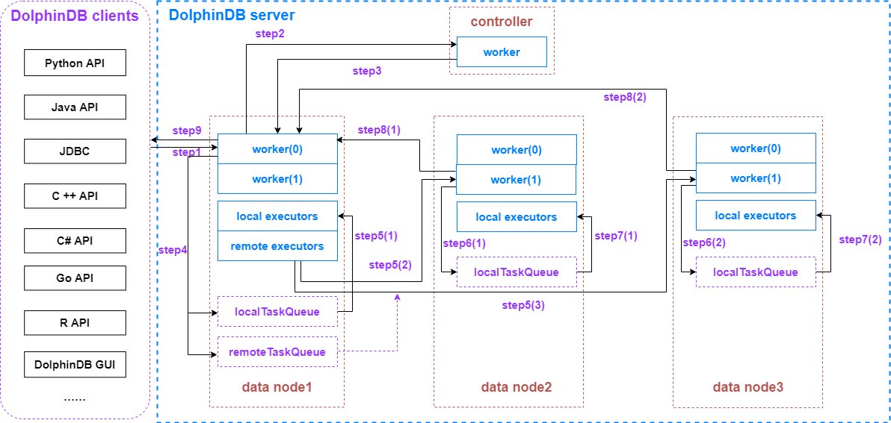

# Overview of Threading Model in DolphinDB 

A distributed database is a complex system where read and write operations often require the coordination of multiple nodes. Understanding the threading model in the DolphinDB distributed database gives us a better insight into the configurations and performance tuning in DolphinDB.

This tutorial takes a distributed SQL query execution as an example to examine the flows of data and the various thread pools they go through during the process. 


- [Overview of Threading Model in DolphinDB](#overview-of-threading-model-in-dolphindb)
  - [1. Before We Start: What are the Node Types?](#1-before-we-start-what-are-the-node-types)
  - [2. Thread Types](#2-thread-types)
  - [3. Process of a Multi-threaded SQL Query](#3-process-of-a-multi-threaded-sql-query)
  - [4. Configurations and Performance Tuning](#4-configurations-and-performance-tuning)
  - [5. Configuration Parameters](#5-configuration-parameters)

## 1. Before We Start: What are the Node Types?

- **controller**

A controller checks the heartbeats of agent nodes, data nodes and compute nodes to monitor the node status and manages the metadata and transactions in the distributed file system (DFS). 

- **data node**

A data node stores data and performs the computational work. 

- **compute node** (1.30.14/2.00.1 and later versions)

Compute nodes only perform the computational work and do not store any data. Compute nodes are designed for computationally intensive operations such as streaming, distributed joins, and machine learning. Use [`loadTable`](https://dolphindb.com/help/FunctionsandCommands/FunctionReferences/l/loadTable.html) to load data to a compute node for computational work. With compute nodes in the cluster, you can separate storage and compute by submitting all write requests to the data nodes and all read requests to the compute nodes, thus preventing data nodes from being overloaded with intensive computational tasks.

## 2. Thread Types

- **worker**

A thread that handles regular interactive jobs. 

Since version 1.30.19/2.00.7, DolphinDB has introduced a multilevel task assignment algorithm which divides the jobs and tasks (broken down from jobs) into different levels. The jobs and tasks are handled by the workers at the same levels. 

A job submitted to the node starts at level 0 and is handled by a level 0 worker. Based on the number of partitions involved in the job, the level 0 worker breaks it down into the same amount of tasks. Local tasks are executed concurrently by the level 0 worker and local executors, and remote tasks are sent to remote nodes by remote executors. The tasks sent to the remote nodes are marked as level 1 and will be handled by level 1 workers on the remote nodes. If a task is further broken down into subtasks, the remote subtasks are marked a level lower than their parent and will be handled by workers at the same level on the remote nodes. 

With different levels of workers handling different levels of jobs/tasks, deadlock issues caused by circular dependencies across nodes can be effectively prevented.

- **local executor**

A thread that executes tasks on local machines assigned by workers.

A worker breaks down a job into a number of tasks and adds them to the task queues. Each local executor can only process one task from the local task queue at a time. Computational tasks generated by the parallel-processing functions such as [`ploop`](https://dolphindb.com/help/Functionalprogramming/TemplateFunctions/loopPloop.html) and [`peach`](https://www.dolphindb.com/help/Functionalprogramming/TemplateFunctions/each.html) are also handled by the local executors.

- **remote executor**

An independent thread that sends tasks in the remote task queue to the remote nodes.

- **dynamic worker**

When all workers are busy, the system will create dynamic workers to process incoming jobs. Depending on how busy the system is with concurrent jobs, a total of three groups of dynamic workers can be created with *maxDynamicWorker* dynamic threads in each group. A dynamic worker will be destroyed after being idle for 60 seconds. 

- **diskIO worker**

Set by the configuration parameter *diskIOConcurrencyLevel*. *diskIOConcurrencyLevel* = 0 means the threads handling the current jobs will read and write to the disk directly. When *diskIOConcurrencyLevel* > 0, the system will create the specified number of threads to read and write to the disk concurrently. For more information about *diskIOConcurrencyLevel*, see [5. Configuration Parameters](#5-configuration-parameters).

## 3. Process of a Multi-threaded SQL Query

A SQL query can be sent to any data node or compute node in the cluster. The node that receives the request acts as the coordinator for this operation.

This example illustrates the execution of a SQL query to introduce the threads that are involved in the process. 



**Step 1. The DolphinDB client sends a query to the coordinator** (data node / compute node)

In this example, the coordinator is a data node. The following is the query for this example:

```
select avg(price) from loadTable("dfs://database", "table") where date between 2021.01.01 : 2021.12.31 group by date
```

Suppose the query involves 300 partitions in total and the data are evenly distributed on datanode1, datanode2, and datanode3 (i.e., each data node contains 100 of the queried partitions).

The DolphinDB client serializes the query and sends it to datanode1 using the TCP protocol.

**Step 2.** **datanode1 receives the query**

Datanode1 assigns a worker (level 0) to deserialize and parse the request from the client. If it’s a SQL query, the worker sends a request to the controller for metadata about all the partitions involved in the query. This worker (level 0) is dedicated to this query and will remain busy until the query is complete. 

**Step 3. The controller receives the request from datanode1**

The controller starts a worker (level 0) to deserialize and parse the request from datanode1. The worker (level 0) then serializes the requested partition information and sends it back to datanode1 using TCP. 

**Step 4. datanode1 gets the requested information from the controller**

The worker (level 0) dedicated to the query deserializes and parses the partition information. It then adds the 100 tasks involving only the local partitions to the local task queue on datanode1. The other tasks are organized into two task groups (marked as datanode2 and datanode3 respectively) and added to the remote task queue on datanode1.

**Step 5 (1). The local worker (level 0) and local executors process the local tasks**

On datanode1, the dedicated worker (level 0) executes some of the local tasks while the local executors consume from the local task queue in parallel. This explains why the concurrent processing capability of DolphinDB is largely determined by the maximum number of workers and local executors (set by the configuration parameters *workerNum* and *localExecutors*).

**Step 5 (2) (3). The remote executors send remote tasks to remote nodes**

Meanwhile, after serializing the tasks in the remote task queue, the remote executors on datanode1 send the tasks to datanode2 and datanode3 using TCP.

**Step 6 (1) (2). The remote nodes receive the tasks**

Datanode2 and datanode3 each allocate a worker (level 1) to deserialize and parse the tasks, adding 100 tasks to the level 1 local task queue on each node.

**Step 7 (1) (2). The worker (level 1) and local executors on remote nodes process the local tasks**

On datanode2 and datanode3, the dedicated workers (level 1) execute the tasks assigned to themselves while the local executors execute the tasks in the local task queue in parallel.

**Step 8 (1) (2). Remote nodes send the intermediate results back to datanode1**

When datanode2 and datanode3 complete the computation, the dedicated workers (level 1) serialize the results and send them back to datanode1 using TCP. 

**Step 9. datanode1 returns the final result of the query and sends it back to the client**

The dedicated worker (level 0)  on datanode1 deserializes the intermediate results from the remote nodes. Based on the intermediate results, the worker (level 0) generates the final result of the query, serializes it, and sends it to the DolphinDB client using TCP.

The client then deserializes the data and prints the final result of the SQL query.

**Data node as the coordinator vs. compute node as the coordinator:**

> \- Unlike data nodes, compute nodes do not store any data. When a compute node receives a query, it parses the query and gets the information of all the partitions involved in this query from the controller. It then breaks down the query into tasks and assigns all of the tasks to the nodes storing the involved partitions. After collecting the intermediate results from each node, the worker on the compute node calculates the final result and sends it to the client.
>
> \- To write a large amount of real-time data, it is recommended to submit all SQL queries to compute nodes. This helps to reduce the computational load on data nodes by decoupling storage and compute.

## 4. Configurations and Performance Tuning

In the example above, data transfer with TCP occurred 8 times during the SQL query, 2 of which are between the DolphinDB server and the client. If your queries usually involve a large amount of data and are latency-sensitive, consider the following tips for performance optimization:

- Use 10 Gigabit Ethernet for communication between cluster nodes, and between nodes and clients.
- Tune the configuration parameters according to the recommendations in Section 5.
- Increase the number of physical disks per node. Concurrent reads of partitions are faster when these partitions are stored across more disks.
- Optimize your SQL queries: Add partitioning columns to the *where* condition to enable partition pruning and avoid the full table scan. 
- When querying a large amount of data, compress the query result of your API requests to improve data transmission efficiency. Data will be compressed before they are downloaded from the server. See the code sample below in JAVA:

```
//When setting up the API connection, set the third parameter (compress) to true to enable compression algorithm                       
  DBConnection connection = new DBConnection(false, false, true);        
  connection.connect(HOST, PORT, "admin", "123456");        
  BasicTable basicTable = (BasicTable) connection.run("select * from loadTable(\"dfs://database\", \"table\")");
```

- Increase the maximum number of CPU cores and memory size (both are specified in your DolphinDB license) to increase the concurrent processing capability of DolphinDB.

## 5. Configuration Parameters

| Thread Type      | Configuration Parameter | Default Value           | Recommended Configuration                                                                                                 |
|------------------|-------------------------|-------------------------|---------------------------------------------------------------------------------------------------------------------------|
| worker           | workerNum               | The number of CPU cores | Whichever is smaller between the number of CPU cores specified in the license and the number of CPU cores on your machine |
| local executor   | localExecutors          | workerNum-1             |                                                                                                                           |
| remote executor  | remoteExecutors         | 1                       | The number of cluster nodes - 1 *                                                                                         |                                                                        |
| dynamic worker   | maxDynamicWorker        | workerNum               |                                                                                                                           |                                                                                                                       |
| diskIO worker    | diskIOConcurrencyLevel  | 1                       | Separate configuration for HDDs and SSDs **                                                                               |


Note:

\* For single-server clusters or clusters with only one data node, *remoteExecutors* is not required.

\** For HDDs, it is recommended to set *diskIOConcurrencyLevel* to the number of volumes configured on the node (specified by the configuration parameter *volumes*). For SSDs, *diskIOConcurrencyLevel* = 0
