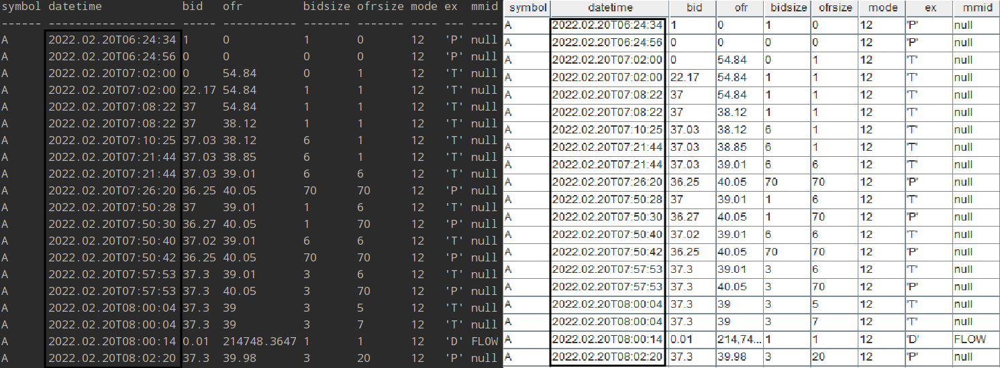
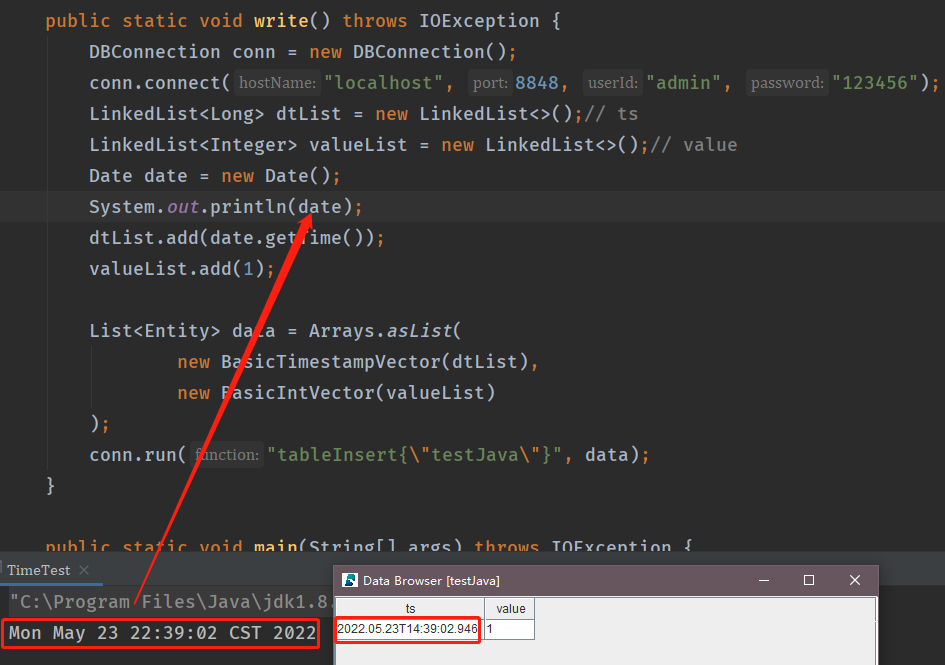
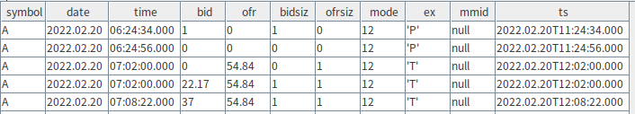
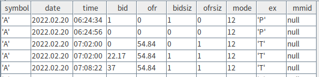
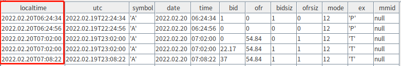
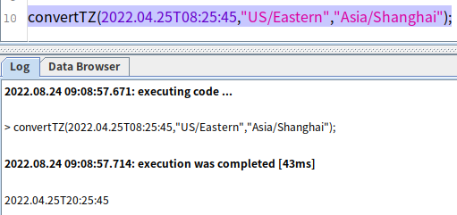

# Time Zones in DolphinDB

This tutorial introduces how to address time zone-related issues when storing and importing temporal values to DolphinDB.

- [Time Zones in DolphinDB](#time-zones-in-dolphindb)
  - [1. Storage of Temporal Values](#1-storage-of-temporal-values)
    - [1.1 Scenario One](#11-scenario-one)
    - [1.2 Scenario Two](#12-scenario-two)
  - [2. Importing Time Using DolphinDB Java API](#2-importing-time-using-dolphindb-java-api)
    - [2.1 Best Practices](#21-best-practices)
    - [2.2 Date Class: Use with Caution](#22-date-class-use-with-caution)
  - [3. Importing Time from MySQL](#3-importing-time-from-mysql)
    - [3.1 MySQL Data Types and Time Zones](#31-mysql-data-types-and-time-zones)
    - [3.2 Importing MySQL Temporal Values into DolphinDB](#32-importing-mysql-temporal-values-into-dolphindb)
    - [4. Importing Time from a CSV File](#4-importing-time-from-a-csv-file)
  - [5. Conclusion](#5-conclusion)
  - [Appendix](#appendix)


DolphinDB has the following temporal data types:

| Data Type     | Example                                                      |
| :------------ | :----------------------------------------------------------- |
| MONTH         | 2012.06M                                                     |
| DATE          | 2012.06.13                                                   |
| MINUTE        | 13:30m                                                       |
| SECOND        | 13:30:10                                                     |
| TIME          | 13:30:10.008                                                 |
| NANOTIME      | 13:30:10.008000001                                           |
| DATETIME      | 2012.06.13 13:30:10 or 2012.06.13T13:30:10                   |
| TIMESTAMP     | 2012.06.13 13:30:10.008 or 2012.06.13T13:30:10.008           |
| NANOTIMESTAMP | 2012.06.13 13:30:10.008000001 or 2012.06.13T13:30:10.008000001 |

## 1. Storage of Temporal Values

Some databases store temporal values as Unix timestamps with a time zone offset. The time zone offset is the difference between local time and UTC (Coordinated Universal Time).

In DolphinDB, temporal values are stored as local timestamps without time zone information. A local timestamp is equivalent to `Unix timestamp + UTC offset (in seconds)`.

For scenarios that do not require storing time zone information, you can save the temporal values directly to DolphinDB. The data will be retrieved without any time zone conversion. 

In scenarios that require storing temporal values with time zone information, use `gmtime` to convert temporal values from local time to UTC time for storage. Use `localtime` (or `convertTZ`) to convert the data back to local time (or a specified time zone) for retrieval.

Two scenarios are presented below. By comparing the implementation of two storage solutions (with or without time zone information), we demonstrate the best practices for each scenario.

### 1.1 Scenario One

**Context**

- The stock records from a New York-based exchange are stored in a database. A column contains the trade time, e.g., `2022.02.20 09:35:03`.
- The database is deployed in Beijing (UTC+8).
- Some of the client applications that consume the data are deployed in Beijing and the others are deployed in the San Francisco (UTC-8).

**Business Requirements**

  All users, whether in Beijing or San Francisco, must see the trade data in the exchange’s local time (UTC-5). In this section, we will use the trade time of a single record, `2022.02.20 09:35:03`, as an example.  

#### 1.1.1 Solution One: Storing Time with Time Zone Information 

For a database that stores time with time zone information, it processes the temporal values as follows: 

1. Convert the local trade time (UTC-5) `2022.02.20 09:35:03` to a local timestamp **1645349703**.  
2. Get the Unix timestamp (1645367703) by subtracting the time zone offset. Save it to the database.
3. If a user queries the database from a business application in Beijing (UTC+8) or Western US (UTC-8), the time is retrieved based on the time zone of the server. Therefore, additional coding would be required to display the local time of the New York-based exchange.

In this scenario, we can see that storing temporal values with time zone information would introduce extra time conversions.

#### 1.1.2 Solution Two: Storing Local Time (Without Time Zone Information) 

DolphinDB stores time without time zone information. This is how it handles this scenario:

1. Convert the local trade time `2022.02.20 09:35:03` (UTC-5) to a local timestamp, **1645349703**, and save it to the database.
2. When user queries this record from a business application, convert the saved timestamp back into the DATETIME format `2022.02.20 09:35:03`.

In this scenario, storing the time without time zone information is obviously better. By directly storing the local time, there’s no need for Unix timestamp conversions and offset-related calculations in data retrieval.

### 1.2 Scenario Two

In some scenarios, time zone information must be taken into consideration. DolphinDB also provides built-in functions for time zone conversion.

**Context**

- An online deal was made between a Chinese buyer and a Japanese vendor at `2022.05.20 11:30:05` Beijing Time (UTC +8), which is `2022.05.20 12:30:05` Tokyo Time (UTC+9).
- The e-commerce company has two data centers in China and Japan, which store transaction data from China and Japan, respectively.

**Business Requirements**

When users browse their orders, the transaction time must be displayed in their current time zone, i.e., the Chinese buyer sees the transaction time in Beijing Time and the Japanese vendor sees it in Tokyo time.

#### 1.2.1 Solution One: Storing Time with Time Zone Information 

1. Use the function [gmtime](https://dolphindb.com/help/FunctionsandCommands/FunctionReferences/g/gmtime.html) to convert the Beijing time `2022.05.20 11:30:05` into UTC time, and get the corresponding Unix timestamp with the built-in function [long](https://dolphindb.com/help/FunctionsandCommands/FunctionReferences/l/long.html). For the database server deployed in China, the script should be:

```
$ gmtime(2022.05.20 11:30:05)
2022.05.20 03:30:05
$ long(gmtime(2022.05.20 11:30:05))
1653017405
```

As the local transaction time is first converted to UTC time, the Unix timestamp, `1653017405`, is the same for the Chinese buyer or the Japanese vendor. 

2. When users browse the order, the client application retrieves the Unix timestamp from the database and converts it to the local system time. Converted from the same Unix timestamp **1653017405**, the transaction time displayed to the Chinese buyer is `2022.05.20 11:30:05` (UTC+8) and `2022.05.20 12:30:05` (UTC+9) to the Japanese vendor.

In DolphinDB, you can convert UTC time to your local time zone using the built-in function [localtime](https://dolphindb.com/help/FunctionsandCommands/FunctionReferences/l/localtime.html). For example:

```
$ localtime(2022.05.20 03:30:05)
2022.05.20 11:30:05
```

#### 1.2.2 Solution Two: Storing Local Time (Without Time Zone Information)

To store the transaction time in the local time zone, the following extra steps are required:

- Decide which time zone should be the “local“ time zone.
- Calculate the time zone offset between the “local“ time zone and the other time zone during the time conversion.

In this scenario, it is clear that we should adopt solution one, storing the Unix timestamp of the transaction time and let the server automatically convert the timestamp to the local time when data is retrieved. If we store the time without any conversion, then we’ll have to convert the time between time zones later in data retrieval, and consider other potential issues (the daylight saving time, for example) that may arise in such manual conversion.

## 2. Importing Time Using DolphinDB Java API

This section uses the DolphinDB Java API 1.30.17.1.

There are four common classes that represent date and time in Java, localDate, LocalTime, LocalDateTime and Date. We recommend using LocalDate, LocalTime and LocalDateTime introduced in Java 8 with the DolphinDB Java API to process temporal values. The Date class should be used with caution (see [3.2 Date Class: Use with Caution](#32-date-class-use-with-caution)).


### 2.1 Best Practices

#### Using LocalDateTime

```
LocalDateTime now = LocalDateTime.now();//obtain the current date-time
LocalDateTime time = LocalDateTime.of(2022,2,20,9,35,3);// the of method obtains an instance of LocalDateTime from year, month, day, hour, minute, second and nanosecond

// time-related operations
time.isAfter(now);
time.isBefore(now);
System.out.println(time.plusDays(1L));
System.out.println(time.minusHours(8));

// get the current time from the system clock in the specified time-zone
LocalDateTime.now(ZoneId.of("Australia/Sydney"));
```

LocalDateTime represents a **local** date-time object without timezone information. It is recommended to use this class to represent temporal values if you want to import them into a DolphinDB database.

**Scenario:** Import NYSE stock data from a CSV file (see [Appendix](#appendix)). The date and time values must be consistent with those in the CSV file.

| symbol | date       | time    | bid   | ofr    | bidsiz | ofrsiz | mode | ex   | mmid |
| :----- | :--------- | :------ | :---- | :----- | :----- | :----- | :--- | :--- | :--- |
| A      | 2022.02.20 | 8:02:20 | 36.32 | 201000 | 20     | 1      | 12   | 'D'  | EDGA |
| A      | 2022.02.20 | 8:02:20 | 36.32 | 39.98  | 20     | 20     | 12   | 'D'  | EDGX |
| A      | 2022.02.20 | 8:02:21 | 36.32 | 39.98  | 20     | 20     | 12   | 'D'  | EDGA |
| A      | 2022.02.20 | 8:05:19 | 36.33 | 39.98  | 20     | 20     | 12   | 'D'  | EDGX |
| A      | 2022.02.20 | 8:05:19 | 36.33 | 39.98  | 20     | 20     | 12   | 'D'  | EDGA |
| A      | 2022.02.20 | 8:05:20 | 36.33 | 39.97  | 20     | 20     | 12   | 'D'  | EDGX |
| ...    |            |         |       |        |        |        |      |      |      |

**1. Create a shared in-memory table in DolphinDB**

Create a table and specify its schema based on the data in the CSV file. Below is an example of creating a shared in-memory table:

```
conn.run("t = table(100:0,`symbol`datetime`bid`ofr`bidsize`ofrsize`mode`ex`mmid,[SYMBOL,DATETIME,DOUBLE,DOUBLE,LONG,LONG,INT,CHAR,SYMBOL])\n" +
"share t as timeTest;");
```

**2. Parse the CSV file**

In this example we use OpenCSV, the open source third-party library, to parse CSV files. You can also use your preferred tool.

```
CSVReader csvReader = new CSVReader(reader) 
String[] record;
csvReader.readNext();// skip first line
while ((record = csvReader.readNext()) != null) {
    // record[i] corresponds to a cell in a row. See appendix for complete script
```

**3. Define the method for handling temporal values**

All parsed columns are of the STRING type. Use the DateTimeFormatter class to format dates and times in the pattern of “yyyy.MM.dd H:mm:ss“ to convert the strings into LocalDateTime objects. Then convert LocalDateTime objects to local timestamps so they can be added to BasicDateTimeVector, which is constructed in the next step.

```
public static int getTime(String timeStr){
    DateTimeFormatter df = DateTimeFormatter.ofPattern("yyyy.MM.dd H:mm:ss");
    LocalDateTime ldt = LocalDateTime.parse(timeStr,df);
    return Utils.countSeconds(ldt);
}
```

**4. Batch insert data into DolphinDB**

Construct a BasicVector for each column for batch inserting all columns. See [full script](script/timezone/01.DateTutorials.java).

```
public static void write() throws IOException {
    // example of list construction
    LinkedList<String> symbolList = new LinkedList<>(); 
    try (Reader reader = Files.newBufferedReader(Paths.get(CSV)));
        // read csv file and insert data into lists
    } catch (IOException | CsvValidationException ex) {
        ex.printStackTrace();
    }

    List<Entity> data = Arrays.asList(
        new BasicSymbolVector(symbolList), 
        new BasicDateTimeVector(dtList),
        new BasicDoubleVector(bidList),
        new BasicDoubleVector(ofrList),
        new BasicLongVector(bidSizeList),
        new BasicLongVector(ofrSizeList),
        new BasicIntVector(modeList),
        new BasicByteVector(exList),
        new BasicSymbolVector(mmidList)
    );
    conn.run("tableInsert{\"timeTest\"}", data);
```

**5. Validate the result**

Get the entire table using Java API:

```
BasicTable res = (BasicTable) conn.run("select * from timeTest");
System.out.println(res.getString());
```

Get the same table using the DolphinDB GUI:

```
t = select * from timeTest
print(t)
```

The results of both queries are as follows:



The “datetime“ column in both of the above results are consistent with the dates and times in the original CSV file. 

### 2.2 Date Class: Use with Caution

Users who are not familiar with how the Date class is stored and printed in Java may find the temporal values “inconsistent“ before and after the data import to DolphinDB.

1. Instantiate the Date class

```
Date date = new Date();
System.out.println(date);
```

Note that while the date object is printed in system time format, it is stored as a Unix timestamp (of the LONG type).

2. Import data to DolphinDB

(1) Execute the script below to create a shared in-memory table with two columns in DolphinDB:

```
conn.run("t = table(100:0,`ts`value,[TIMESTAMP,INT]);share t as timeJava;");
```

(2) Insert a record to the table through Java API:

```
public static void write() throws IOException {
    DBConnection conn = new DBConnection();
    conn.connect("localhost", 8848, "admin", "123456");
    LinkedList<Long> dtList = new LinkedList<>();// ts
    LinkedList<Integer> valueList = new LinkedList<>();// value
    Date date = new Date();
    System.out.println(date);
    dtList.add(date.getTime());
    valueList.add(1);
    List<Entity> data = Arrays.asList(
    new BasicTimestampVector(dtList),
    new BasicIntVector(valueList)
    );
    conn.run("tableInsert{\"testJava\"}", data);
}
```

(3) Print the `date` object which is inserted to the DolphinDB table to your console with `System.out.println(date)`. Meanwhile, check the inserted record in DolphinDB GUI. Compare the two temporal values:



The two values do not match. The reason is as follows:

The Date object is instantiated from the Unix timestamp returned by `System.currentTimeMillis()`. For more information about the constructor of Date, see [official documentation](https://docs.oracle.com/javase/8/docs/api/java/util/Date.html).

```
/**
* Allocates a <code>Date</code> object and initializes it so that
* it represents the time at which it was allocated, measured to the
* nearest millisecond.
*
* @see     java.lang.System#currentTimeMillis()
*/
public Date() {
	this(System.currentTimeMillis());
}
```

In Java, the string representation (printed output) of the Date class is customized by overriding its `toString` method which involves time zone conversion (see source code below). Therefore, although `Date` is stored as a Unix timestamp, it is printed based on the time zone of the server. 

```
public String toString() {
        // "EEE MMM dd HH:mm:ss zzz yyyy";
        BaseCalendar.Date date = normalize();
        StringBuilder sb = new StringBuilder(28);
        int index = date.getDayOfWeek();
        if (index == BaseCalendar.SUNDAY) {
            index = 8;
        }
        convertToAbbr(sb, wtb[index]).append(' ');                        // EEE
        convertToAbbr(sb, wtb[date.getMonth() - 1 + 2 + 7]).append(' ');  // MMM
        CalendarUtils.sprintf0d(sb, date.getDayOfMonth(), 2).append(' '); // dd
        CalendarUtils.sprintf0d(sb, date.getHours(), 2).append(':');   // HH
        CalendarUtils.sprintf0d(sb, date.getMinutes(), 2).append(':'); // mm
        CalendarUtils.sprintf0d(sb, date.getSeconds(), 2).append(' '); // ss
        TimeZone zi = date.getZone();
        if (zi != null) {
            sb.append(zi.getDisplayName(date.isDaylightTime(), TimeZone.SHORT, Locale.US)); // zzz
        } else {
            sb.append("GMT");
        }
        sb.append(' ').append(date.getYear());  // yyyy
        return sb.toString();
}
```

DolphinDB, on the other hand, stores the Unix timestamp of the imported time in the LONG type and displays it in the UTC time zone.

Therefore, although temporal values appear “inconsistent“ before and after the import to DolphinDB, nothing is in fact modified during the process.

## 3. Importing Time from MySQL

### 3.1 MySQL Data Types and Time Zones

This section discusses these temporal data types in MySQL 5.7: DATETIME, TIMESTAMP, DATE and TIME.

- MySQL converts TIMESTAMP values from the current time zone to Unix timestamps for storage, and back from Unix timestamps to the current time zone for retrieval. 
- Such conversion does not occur for DATE, TIME or DATETIME.

Use the command below to check the values of the time zone variables in MySQL. The output shows that the system time zone is “CST“ (China Standard Time, i.e., UTC+8) and the server time zone is the same as the system time zone.

```
mysql> show variables like '%time_zone%';
+------------------+--------+
| Variable_name    | Value  |
+------------------+--------+
| system_time_zone | CST    |
| time_zone        | SYSTEM |
+------------------+--------+
```

Execute the following commands to create a database and a table in MySQL:

```
mysql> USE testdb;
mysql> CREATE TABLE testTable(
    -> date DATE NOT NULL,
    -> time TIME NOT NULL,
    -> ts TIMESTAMP NOT NULL
    -> );
Query OK, 0 rows affected (0.11 sec)
```

Insert a record. Check the data in the table:

```
mysql> select * from testTable;
+------------+----------+---------------------+
| date       | time     | ts                  |
+------------+----------+---------------------+
| 2022-06-14 | 23:13:15 | 2022-06-14 23:13:15 |
+------------+----------+---------------------+
1 row in set (0.00 sec)
```

Specify the server time zone to UTC +9 and check the table again:

```
mysql> set time_zone='+09:00';
Query OK, 0 rows affected (0.01 sec)

mysql> show variables like '%time_zone%';
+------------------+--------+
| Variable_name    | Value  |
+------------------+--------+
| system_time_zone | CST    |
| time_zone        | +09:00 |
+------------------+--------+
2 rows in set (0.00 sec)

mysql> select * from testTable;
+------------+----------+---------------------+
| date       | time     | ts                  |
+------------+----------+---------------------+
| 2022-06-14 | 23:13:15 | 2022-06-15 00:13:15 |
+------------+----------+---------------------+
1 row in set (0.00 sec)
```

Compare the query results before and after the time zone change: the “date“ and “time“ columns contain fixed DATE and TIME values and therefore dose not change; the TIMESTAMP values in the “ts“ column go forward 1 hour as the time zone changed from UTC+8 to UTC+9.

### 3.2 Importing MySQL Temporal Values into DolphinDB

The [DolphinDB MySQL plugin](DolphinDBPlugin/mysql at release200 · dolphindb/DolphinDBPlugin ) allows you to smoothly import data from MySQL into DolphinDB with automatic data type conversion. The supported temporal data types are as follows:

| MySQL     | DolphinDB |
| :-------- | :-------- |
| DATE      | DATE      |
| TIME      | TIME      |
| DATETIME  | DATETIME  |
| TIMESTAMP | TIMESTAMP |

DolphinDB also has the following additional temporal data types: MONTH, MINUTE, SECOND, NANOTIME, NANOTIMESTAMP

First, import a CSV file containing NYSE stock data into MySQL. The global *time_zone* value is set to UTC. 

The CSV file and the script for importing it into MySQL can be downloaded in the Appendix[链接]. To better compare the DATE, TIME and TIMESTAMP values in the result, a “ts“ column (of the TIMESTAMP type) containing the Unix timestamps (which are 5 hours ahead of the exchange’s local time) for the trade is added to the table.

Check the imported data in MySQL:

```
mysql> select * from taqTs limit 5;
+--------+------------+----------+-------+-------+--------+--------+------+-----+------+---------------------+
| symbol | date       | time     | bid   | ofr   | bidsiz | ofrsiz | mode | ex  | mmid | ts                  |
+--------+------------+----------+-------+-------+--------+--------+------+-----+------+---------------------+
| A      | 2022-02-20 | 06:24:34 |  1.00 |  0.00 |      1 |      0 |   12 | 'P' | null | 2022-02-20 11:24:34 |
| A      | 2022-02-20 | 06:24:56 |  0.00 |  0.00 |      0 |      0 |   12 | 'P' | null | 2022-02-20 11:24:56 |
| A      | 2022-02-20 | 07:02:00 |  0.00 | 54.84 |      0 |      1 |   12 | 'T' | null | 2022-02-20 12:02:00 |
| A      | 2022-02-20 | 07:02:00 | 22.17 | 54.84 |      1 |      1 |   12 | 'T' | null | 2022-02-20 12:02:00 |
| A      | 2022-02-20 | 07:08:22 | 37.00 | 54.84 |      1 |      1 |   12 | 'T' | null | 2022-02-20 12:08:22 |
+--------+------------+----------+-------+-------+--------+--------+------+-----+------+---------------------+
```

Load the MySQL plugin in DolphinDB and import the table from MySQL into DolphinDB as an in-memory table.

```
// load plugin
loadPlugin("/DolphinDB/server/plugins/mysql/PluginMySQL.txt");

// connect to MySQL Server
conn = mysql::connect(`127.0.0.1, 3306, `root, "root", `testdb)

// import data
taqDdb = mysql::load(conn, "SELECT * FROM taqTs");

// view imported data
select * from taqDdb;
```


The temporal values in the result are consistent with the DATE, TIME and TIMESTAMP values in MySQL. Therefore, to import Unix timestamps of the TIMESTAMP type from MySQL to DolphinDB, make sure that the global *time_zone* system variable is set to UTC. 

Note that in MySQL the time_zone variable can be set at global and session level. DolphinDB stores the imported data from MySQL according to the global time zone. Therefore, if the temporal values are inconsistent before and after the import, check whether your session time zone is different from the global time zone in MySQL.

For example, set `time_zone = '+08:00'` in a MySQL session and then query the table. The query result shows that in this particular session, the “ts“ column values are displayed in UTC +8 time, instead of in UTC time.  

```
mysql> set time_zone='+08:00';
Query OK, 0 rows affected (0.00 sec)

mysql> select * from taqTs limit 5;
+--------+------------+----------+-------+-------+--------+--------+------+-----+------+---------------------+
| symbol | date       | time     | bid   | ofr   | bidsiz | ofrsiz | mode | ex  | mmid | ts                  |
+--------+------------+----------+-------+-------+--------+--------+------+-----+------+---------------------+
| A      | 2022-02-20 | 06:24:34 |  1.00 |  0.00 |      1 |      0 |   12 | 'P' | null | 2022-02-20 19:24:34 |
| A      | 2022-02-20 | 06:24:56 |  0.00 |  0.00 |      0 |      0 |   12 | 'P' | null | 2022-02-20 19:24:56 |
| A      | 2022-02-20 | 07:02:00 |  0.00 | 54.84 |      0 |      1 |   12 | 'T' | null | 2022-02-20 20:02:00 |
| A      | 2022-02-20 | 07:02:00 | 22.17 | 54.84 |      1 |      1 |   12 | 'T' | null | 2022-02-20 20:02:00 |
| A      | 2022-02-20 | 07:08:22 | 37.00 | 54.84 |      1 |      1 |   12 | 'T' | null | 2022-02-20 20:08:22 |
+--------+------------+----------+-------+-------+--------+--------+------+-----+------+---------------------+
5 rows in set (0.00 sec)
```

Connect DolphinDB to MySQL again and import the above table. As the MySQL global time zone is still UTC and the session time zone is not specified, the “ts“ column in the imported table remain unchanged.



Now, we change the MySQL global time zone to UTC +8 through `set global time_zone='+08:00'`. Reconnect to MySQL to import the table and check the result in DolphinDB. As the TIMESTAMP values are stored as Unix timestamps and converted back to the current time zone for retrieval in MySQL, the “ts“ column values are displayed in UTC+8 time DolphinDB:


### 4. Importing Time from a CSV File

With the functions [loadText](https://dolphindb.com/help/FunctionsandCommands/FunctionReferences/l/loadText.html) and [loadTextEx](https://dolphindb.com/help/FunctionsandCommands/FunctionReferences/l/loadTextEx.html), you can import CSV files to in-memory tables or DFS tables, respectively. This section uses [loadText](https://dolphindb.com/help/FunctionsandCommands/FunctionReferences/l/loadText.html) as an example to describe how to import time from a CSV file. 

Note: It is recommended to check the data type of each column with the [extractTextSchema](https://dolphindb.com/help/FunctionsandCommands/FunctionReferences/e/extractTextSchema.html) function before loading. If a column does not have the expected data type, enter the correct data type of the column in the schema table. For a temporal column, we also need to specify a format such as “MM/dd/yyyy” in the schema table. For more information, see [Parsing and Format of Temporal Variables](https://dolphindb.com/help/DataManipulation/TemporalObjects/ParsingandFormatofTemporalVariables.html) and [Importing Text Files Tutorial](import_csv.md).

Load the CSV file into DolphinDB:

```
data = loadText("/data/taq.csv")
```



Specify the DATE type for the “date“ column values and TIME type for the “time“ column values. The temporal values will be stored without time zone information. 

DolphinDB provides time zone conversion functions for retrieving the temporal values from database. Take the “data“ table as an example:

- [gmtime](https://dolphindb.com/help/FunctionsandCommands/FunctionReferences/g/gmtime.html) - converts local time (UTC+8 in this example) to GMT (UTC+0 zone):

```
gmData = select gmtime(concatDateTime(date,time)) as utc, * from data;
```


- [localtime](https://dolphindb.com/help/FunctionsandCommands/FunctionReferences/l/localtime.html) - converts GMT (UTC+0 zone) to local time zone (UTC+8 in this example):

```
localData = select localtime(utc) as localtime,* from gmData; 
```



- [convertTZ](https://dolphindb.com/help/FunctionsandCommands/FunctionReferences/c/convertTZ.html) - time conversion between time zones

```
convertTZ(2022.04.25T08:25:45,"US/Eastern","Asia/Shanghai");
```



DolphinDB stores temporal values without time zone information. Instead, it lets you decide in which time zone you would like to store and retrieve temporal values by offering various time zone conversion functions.

## 5. Conclusion

You may encounter the following issues with temporal data storage in DolphinDB:

- **After data migration, temporal values displayed in DolphinDB are different from how they are displayed in the source database.**

DolphinDB stores the timestamps retrieved from the source database as integers without making any modifications. The examples of Java API and MySQL plugin describe the reason for and solution to the "inconsistency" in time display.

- **Storing temporal values without time zone information.**

Save the temporal values (of DATE, TIME or TIMESTAMP type) directly to DolphinDB. The data will be retrieved without any time zone conversion. 

- **Storing temporal values with time zone information.**

Use [gmtime](https://dolphindb.com/help/FunctionsandCommands/FunctionReferences/g/gmtime.html) to convert temporal values from local time to UTC time for storage. Use [localtime](https://dolphindb.com/help/FunctionsandCommands/FunctionReferences/l/localtime.html) (or [convertTZ](https://dolphindb.com/help/FunctionsandCommands/FunctionReferences/c/convertTZ.html)) to convert the data back to local time (or a specified time zone) for retrieval.

## Appendix

[01.Handling Temporal Values with Java API ](script/timezone/01.DateTutorials.java)

[02.Creating Table in MySQL](script/timezone/02.create.sql)

[03.Importing Data From MySQL](script/timezone/03.mysqlToDolphinDB.dos)

[taq.csv](data/timezone/taq.csv)

[taqTs.csv](data/timezone/taqTs.csv)

 