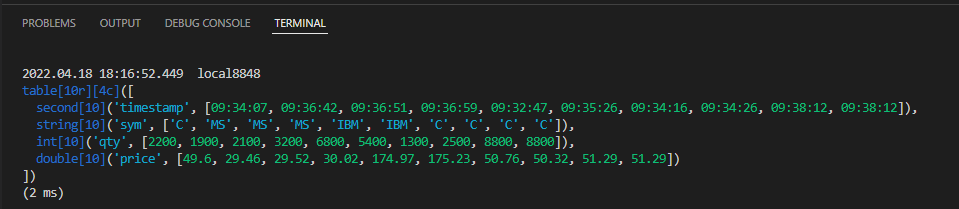

# Visual Studio Code DolphinDB extension

Table of Contents

- [DolphinDB Extension for Visual Studio Code](#dolphindb-extension-for-visual-studio-code)
  - [Getting Started](#getting-started)
    - [Install Extension](#install-extension)
    - [Configure Server Connections](#configure-server-connections)
    - [Create a DolphinDB Script File](#create-a-dolphindb-script-file)
      - [Code Completion and Function Documentation](#code-completion-and-function-documentation)
    - [Execute Code](#execute-code)
      - [Browse Generated Data and Objects](#browse-generated-data-and-objects)
    - [Working with views in VS Code](#working-with-views-in-vs-code)

Microsoft Visual Studio Code is a powerful and lightweight code editor with a rich extensibility model. VS Code extensions let you add languages, debuggers, and tools to your installation to support your development workflow.

Install the DolphinDB Extension for VS Code to add the DolphinDB scripting language in VS Code, which enables you to write and execute scripts in VS Code and send to the DolphinDB server for execution. 

Main features of the DolphinDB extension for VS Code:

- Set up connections to DolphinDB servers via configuration file
- Switch connections freely without losing any connection
- Edit and manage scripts and organize them into projects
- Code highlighting; Code completion for keywords, constants and built-in functions
- View parameter info and function documentation for built-in functions as you type
- Execute scripts and print execution information and result to the terminal
- Manage databases and inspect session variables online
- View tables, vectors, matrices and other data structures in your browser and check data updates dynamically

Note: Make sure to start the DolphinDB server before using the DolphinDB extension in VS Code.

## Getting Started

Before installing the DolphinDB extension for VS Code, install or upgrade to VS Code v1.66.0 or higher (https://code.visualstudio.com/).

### Install Extension

Launch the **Extensions** view in VS Code by clicking the "Extensions" icon (`Ctrl+Shift+X`) on the left sidebar. Search for "dolphindb" and click **Install**. For more information about the extension, check its **Details** page.


If the installation fails due to network reasons, open [Visual Studio Markstplace](  
https://marketplace.visualstudio.com/items?itemName=dolphindb.dolphindb-vscode) in your browser, click the **Version History** tab, download the latest version of the extension (with the suffix `.vsix`) to your local computer and drag and drop it to the **Extensions** view in VS Code.

Note: Restart VS Code for the installation to take effect.

### Configure Server Connections 

Click `File > Preferences > Settings` in the menu bar or use the shortcut command `Ctrl + ,` to open the VS Code settings.
Enter "dolphindb" in the search box, click **edit in settings.json**, and edit the `dolphindb.connections` configuration parameter in the opened file.
`dolphindb.connections` is an array of objects where each object (wrapped in curly brackets "{ }"") represents a connection. You can manually add or modify the connection objects to create or edit session connections as appropriate. Each object contains 6 attributes, where `name` and `url` are required (each connection object must have a unique name). Hover over an attribute to view its description.


```
"dolphindb.connections": [
  //a connection object has the following attributes:
    {
        "name": "local8848", // connection alias. Multiple connections can be created from one server.
        "url": "ws://127.0.0.1:8848", // IP and port number of the DolphinDB server in the format of "ws://ip:port"
        "autologin": true, // whether to enable auto login, which only takes effect when username and password are specified.
        "username": "admin",
        "password": "123456",
        "python": false // whether to use Python Parser to parse the script. Defaulted to "false".
    }
]
```

When the configuration is complete, click the "Explorer" icon in the left sidebar and expand the **DOLPHINDB** tab on the side pane. You can view and switch connections here. A connection is enabled when you use it for the first time to execute code (see section "Execute Code" below). When you change to another connection, the original one will stay connected.

Note: Please reconnect if the associated connection object is modified in the Settings.


### Create a DolphinDB Script File

- If the script file name has the suffixed of `.dos`, VS Code will automatically associate it with the DolphinDB language and enable syntax highlighting, code completion and prompts. 
- If the script file has a different suffix other than `.dos`  , such as `.txt` , please manually associate the DolphinDB language by following the steps below:

-Click the "Select Language Mode" area at the bottom of the editor.


-Enter "dolphindb" in the language selection pop-up box, select "DolphinDB" in the dropdown and press `Enter`.


#### Code Completion and Function Documentation

When entering a DolphinDB built-in function in the VSCode editor, code completion suggestions will pop up as you type. Press `Tab` or `Enter` to insert the selected function.

Hover the mouse over the function name to view the function documentation. The accompanying documentation for the function will expand to the side.


### Execute Code

In the opened DolphinDB script file, select the code you want to execute and use the shortcut command `Ctrl+E` to send it to the DolphinDB Server for execution. If no code is selected, the line where the current cursor is located is executed. 

Note: To customize the shortcut keys for code execution, navigate to **File** > **Preferences** > **Keyboard Shortcuts**, enter "dolphindb", double-click **Execute Code**, and enter the shortcut keys you want.

#### Browse Generated Data and Objects

The **EXPLORER** view **DOLPHINDB** tab in the left pane displays the sessions created by the configured connections and all the variables generated in these sessions. You can check the name, type, dimension of the variables and how much memory they take up. 

Use the icons to the right of each variable to view it in your browser (see the "Data Browser" section below).

If you get a connection error (e.g., `ws://xxx errored`), make sure that:

- Your DolphinDB Server version is at least `1.30.16` or `2.00.4`
- If there is a configured system proxy, the proxy software and proxy server must support WebSocket connections. Otherwise, please turn off the proxy or add the DolphinDB Server IP to the exclusion list, and then restart VS Code.

### Working with Views in VS Code

- Connections and variables


In the **EXPLORER** view **DOLPHINDB** tab, all configured connections and their variables are displayed in tree structure. 

**List of connections**: To switch to a different session, select the radio button before the connection. To disconnect from a session, click the "disconnect" icon.

**Lists of variables**：Each connection nests a list of its variables. Hover over a variable to view its data structure. To the right side of each variable (excluding scalars and pairs), there are 2 icons. Use the icons to view the variables in your browser or in a pop-up window (see the "Data browsers" section below). 

- Data Browsers

You can browse variables in the terminal and the **EXPLORER** view **DOLPHINDB** tab in the VS Code editor in text-based format, or open it in your web browser in tabular format.

**Terminal**



The first line of the execution result shows the elapsed time of execution and the server alias corresponding to the session.

The subsequent lines show the details of the data. In this example, we print a table object to the terminal (see screenshot above):

- First is the data form of the object, which is a table in this example. "[10r][4c]" means this table has 10 rows and 4 columns.

- Then follows the type, number of rows, name and values of each column.

- The last line displays elapsed time of the execution.
  
**Explorer view > DOLPHINDB tab**


In the **DOLPHINDB** tab, hover over a variable to check its value and information. The content is displayed in text-based format, which is the same as the output in the **TERMINAL**.

**Web browser**

The extension will start a local HTTP server for each VS Code window for displaying the DolphinDB vectors, matrices and tables in your browser in tabular format. By default, the available port range for the HTTP server is [8321,8420]. When you open a VS Code window,  the HTTP server looks for the first available port (starting with 8321 by default) as the actual port to listen on.

DolphinDB provides a configuration parameter `dolphindb.ports` in `settings.json`, which allows you to configure your own port numbers/range. Hover your mouse over `dolphindb.ports` for a detailed description and configuration hints.

How to view variables:

In the **Explorer** view **DOLPHINDB** tab, click the "Inspect Variable" icon next to a variable to open it in a browser window (the address is in the format of localhost:{port}) where you can check the value and structure of the variable.

After a variable is updated, click the icon again to refresh the web page to view the change. Or you can print the updated variable in VS code, and the web page will automatically reflect the change.


Click the "Inspect Variables in New Window" icon to open the variable in a pop-up window (Note: Please make sure your browser allows pop-ups). The pop-up cannot be refreshed to reflect the changes of a variable. You can open multiple pop-ups to compare different variables, or compare the same variable before and after an update (see screenshot below).


